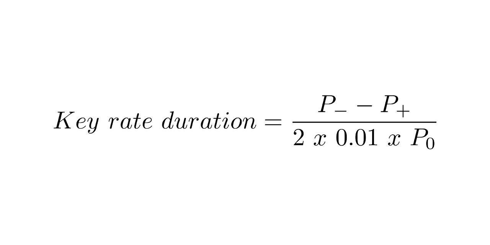

Understanding key rate duration is crucial in financial markets, particularly for investors and portfolio managers dealing with debt securities. Key rate duration is a more sophisticated measurement tool compared to traditional duration measures, catering to complex market environments. Traditional duration measures, such as Macaulay duration or modified duration, provide a single value indicating the sensitivity of a bond's price to interest rate changes. However, they assume parallel shifts in the yield curve, which are rare in reality. Key rate duration offers a more nuanced approach by quantifying the sensitivity of a bond's price to changes in interest rates at specific maturity points along the yield curve. This allows investors to pinpoint how particular segments of the yield curve affect a bond's value.

The importance of key rate duration is particularly pronounced in environments characterized by volatile interest rates. In such scenarios, yield curves often experience non-parallel shifts, where interest rates at different maturities move to varying degrees. Key rate duration helps investors and portfolio managers identify the portions of the yield curve that may introduce higher levels of risk to a portfolio, enabling more informed decision-making and better risk management.



The article will proceed to define what key rate duration is and its mathematical foundation. A thorough understanding of the key rate duration formula will be presented, followed by a step-by-step guide to calculating it accurately. The article will explore how key rate duration can be applied in portfolio management strategies, especially in constructing immunized portfolios to manage interest rate risk. Additionally, the impact of key rate duration on bond pricing, particularly in volatile markets, will be analyzed. The concluding section will summarize the key insights and emphasize the importance of incorporating key rate duration in modern financial analysis and portfolio management.

## Table of Contents

## What is Key Rate Duration?

Key rate duration is a financial metric used to evaluate the sensitivity of a bond's price to changes in interest rates at specific points along the yield curve. Unlike traditional duration measures that assume parallel shifts in the yield curve, key rate duration allows for a more granular analysis by focusing on changes at particular maturities. This approach is critical for understanding the impact of interest rate movements that do not occur uniformly across different maturities.

Key rate duration is defined as the expected change in the value of a bond or a portfolio of bonds in response to a 1% change in the yield at a specific maturity point, while holding yields at all other maturities constant. By isolating the effect of yield changes at individual maturities, key rate duration provides a more accurate assessment of interest rate risk, particularly in complex market environments.

The concept of key rate duration is often compared with effective duration, another widely used measure of interest rate sensitivity. Effective duration calculates the average change in a bond's price for a given change in interest rates, assuming a parallel shift in the yield curve. This approach is useful for bonds where interest rate movements are expected to affect all maturities equally. However, in situations where non-parallel shifts occur, such as when short-term rates rise while long-term rates fall, effective duration may not provide an accurate representation of price sensitivity.

Key rate duration is preferred in scenarios involving non-parallel yield curve shifts because it enables more precise identification of the particular maturities that contribute most significantly to [interest rate](/wiki/interest-rate-trading-strategies) risk. This localized perspective is essential for portfolio managers who aim to hedge or adjust their portfolios to minimize exposure to specific segments of the yield curve.

The importance of key rate duration lies in its ability to account for the complexities of real-world interest rate environments. Instead of assuming a uniform change across all maturities, which is often an oversimplification, it provides a detailed view of how interest rate changes at specific points can influence bond pricing. This detailed analysis is particularly valuable for constructing bond portfolios that are more resilient to interest rate fluctuations, thereby enhancing risk management and optimizing returns.

## Formula for Key Rate Duration

Key Rate Duration is a granular measure used to evaluate how sensitive the price of a debt security or portfolio of securities is to interest rate changes at specific points along the yield curve. It is particularly useful for assessing the impact of non-parallel shifts in the interest rate environment. The formula for calculating Key Rate Duration is expressed as follows:

$$
\text{Key Rate Duration} = \frac{P^- - P^+}{2 \times 0.01 \times P_0}
$$

In this formula, each component plays a crucial role:

- $P^-$ represents the price of the bond or portfolio after a 1% decrease in a specific key interest rate. This hypothetical situation considers the price adjustment caused by lowering the interest rate.

- $P^+$ denotes the price of the bond or portfolio after a 1% increase in that same key interest rate. This scenario captures the effect of a rise in the rate on the bond’s price.

- $P_0$ stands for the initial price of the bond or portfolio before any interest rate shock is applied.

The mathematical interpretation of Key Rate Duration provides a nuanced understanding of how price sensitivity varies at different maturities. By focusing on specific key rates, investors and portfolio managers can pinpoint which segments of the yield curve pose the greatest interest rate risk. This identification is crucial for constructively managing risks in an interest rate environment characterized by [volatility](/wiki/volatility-trading-strategies) and non-uniform movements along the yield curve. Consequently, Key Rate Duration serves as a vital tool in refined financial strategies, allowing for the tactical adjustment of portfolio components to mitigate identified risks.

These valuable insights enable a more informed decision-making process when it comes to crafting and adjusting investment portfolios, ultimately aiming for optimal performance under various interest rate scenarios.

## Calculating Key Rate Duration

Calculating key rate duration requires a systematic approach to assess the sensitivity of a debt instrument's price to changes in interest rates at specific maturity points along the yield curve. This process allows investors and portfolio managers to pinpoint which maturities contribute the most to interest rate risk. Here is a detailed step-by-step process for calculating key rate duration:

1. **Identify the Bond and Yield Curve**: Start by identifying the specific bond or portfolio of bonds for which you want to calculate key rate duration. Obtain the current yield curve data, which is essential as it represents the term structure of interest rates at different maturities.

2. **Calculate Current Price (P0)**: Determine the current price of the bond or portfolio. This involves using the present value of future cash flows method, incorporating current market interest rates.

3. **Shock Interest Rates**: For each key rate (specific maturity point), apply a small parallel shift in the yield curve. Typically, a one basis point (0.01%) change is used, but a one percent (1%) change can help illustrate the sensitivity more robustly. Two scenarios are analyzed: an increase and a decrease in rates for each key rate.

4. **Calculate Adjusted Prices (P- and P+)**: Calculate the bond's price under the two scenarios: 
   - $P+$: Price of the bond when the interest rate for a specific maturity is increased by the shock amount.
   - $P-$: Price of the bond when the interest rate for a specific maturity is decreased by the shock amount.

5. **Apply the Key Rate Duration Formula**: For each key rate, compute the key rate duration using the formula: 
$$
   \text{Key Rate Duration} = \frac{P- - P+}{2 \times \text{shock amount} \times P0}

$$

   Here, the shock amount is expressed in decimal form (for example, 0.01 for a 1% change).

6. **Use Financial Software Tools**: Implementing the above steps manually can be daunting, especially for a portfolio comprising numerous bonds. Financial software tools like the Bloomberg Terminal facilitate this process by providing functionalities to automatically calculate key rate durations. Bloomberg Terminal, for example, allows users to input bond details and obtain key rate duration measures quickly, ensuring high accuracy and efficiency.

7. **Importance of Quality Input Data and Modeling Techniques**: To achieve reliable key rate duration calculations, high-quality input data is crucial. Accurate market data and bond specifications are needed to avoid calculation errors. Additionally, leveraging advanced modeling techniques and computational tools ensures that complex interest rate structures and scenarios are appropriately handled.

By following this structured approach, financial practitioners can harness key rate duration to gain deeper insights into interest rate risk and make informed decisions in managing bond portfolios.

## Portfolio Applications of Key Rate Duration

Key rate duration is a crucial tool in enhancing portfolio management strategies, particularly in managing interest rate risk. By focusing on changes in specific maturity points of the yield curve, key rate duration offers a targeted approach to risk management, which is essential when interest rates are unpredictable.

To start, incorporating key rate duration into portfolio management involves a strategic assessment of how different maturities impact the interest rate sensitivity of a portfolio. By identifying these sensitivities, portfolio managers can adjust their holdings to minimize exposure to those maturities that are deemed most vulnerable to interest rate changes. For instance, if a portfolio has a significant exposure to a particular key rate, a manager may choose to reduce this exposure by either selling bonds maturing at that point or using derivatives to hedge the risk.

Moreover, key rate duration is instrumental in constructing immunized portfolios. Immunization is a strategy where a portfolio is structured to have a duration that matches its investment horizon, thus protecting the portfolio's return against interest rate fluctuations. By using key rate duration, portfolio managers can more precisely match the duration of portfolio cash flows with liabilities due at specific maturity points, thereby reducing the impact of interest rate changes on the portfolio's overall value.

The process of constructing an immunized portfolio using key rate duration can be illustrated with a simple Python example. Consider a portfolio consisting of bonds with varying maturities. The goal is to adjust the face values so that the portfolio's key rate durations match the target sensitivity across different maturity points:

```python
import numpy as np

# Example data: Key rate durations for portfolio and target
portfolio_krd = np.array([0.5, 0.8, 1.2, 1.0, 0.7])
target_krd = np.array([0.6, 0.7, 1.0, 0.9, 0.8])

# Example face values (in millions)
face_values = np.array([10, 15, 20, 25, 30])

# Adjustments needed to match target key rate durations
adjustments = target_krd - portfolio_krd

# New face values after adjustments
new_face_values = face_values + adjustments * face_values / portfolio_krd

print("New Face Values for Immunized Portfolio:", new_face_values)
```

This code represents a basic framework for adjusting bond allocations based on key rate duration, although actual portfolio adjustments would require a more comprehensive analysis, often facilitated by financial software tools like Bloomberg Terminal.

In managing interest rate risk, key rate duration provides enhanced precision compared to traditional duration measures. By focusing on the distinct elements of the yield curve, portfolio managers can develop nuanced strategies that protect or capitalize on interest rate movements, ultimately leading to more robust portfolio performance.

## Impact on Bond Pricing

Key rate duration plays a significant role in determining bond pricing, especially under volatile market conditions. Unlike traditional duration measures, which assume parallel shifts in the yield curve, key rate duration allows investors to assess the impact of changes at specific maturities. This nuanced approach provides a more accurate reflection of how bond prices can fluctuate when interest rates shift unevenly across different maturities.

In volatile interest rate environments, the yield curve may experience non-uniform changes, where interest rates at different maturities move by varying amounts. Key rate duration helps in analyzing how these specific shifts affect a bond's price. Since bonds are sensitive to interest rate changes, understanding the impact at distinct maturity points allows for better risk management and hedging strategies.

For instance, when key rates at certain maturities change, the bond's price will adjust in accordance with its sensitivity as indicated by the key rate duration at those points. By breaking down the pricing impact into segments, investors can gain insights that are not possible with a single, average duration measure, which assumes equal sensitivity across the yield curve.

In terms of strategies for managing interest rate risk using key rate duration, investors can adjust their portfolios to target specific key rates. For example, if the yield curve is expected to steepen, investors might hold bonds that have lower key rate durations at the long end of the curve to minimize losses. Conversely, if the yield curve is expected to flatten, an increase in holdings with sensitivity to longer-term interest rate changes might yield higher returns.

Implementing key rate duration into financial analysis allows portfolio managers to construct more robust immunization strategies. By aligning the key rate durations of assets and liabilities, they can effectively hedge against interest rate movements, ensuring that the value of liabilities is covered by corresponding assets. This targeted approach provides clearer insights into potential price movements and enables more efficient management of interest rate risk.

In conclusion, the key rate duration metric enhances bond pricing analysis in dynamic markets by offering a detailed view of how price sensitivity varies with changes at specific points on the yield curve. This understanding empowers investors and portfolio managers to make informed decisions and develop strategies that effectively mitigate interest rate risks.

## Conclusion

Key rate duration serves as an essential tool in the financial analyst's toolkit, providing nuanced insights into interest rate risk management. By focusing on the sensitivity of a bond's price to shifts at specific maturity points along the yield curve, key rate duration allows for a more granular analysis than traditional duration measures. This specificity is particularly valuable in environments characterized by volatile interest rates, where non-parallel shifts in the yield curve can significantly impact bond pricing.

The applications of key rate duration extend far beyond theoretical analysis; it plays a crucial role in portfolio management and strategic financial planning. By identifying which maturities are most sensitive to interest rate changes, financial professionals can devise strategies that better manage interest rate risk. This might involve adjusting portfolio holdings to minimize exposure or constructing immunized portfolios that are less susceptible to rate fluctuations.

Given its practical implications, incorporating key rate duration into modern financial analysis offers significant advantages. It equips traders and portfolio managers with the insights needed to adapt to changing market conditions effectively. The detailed understanding provided by key rate duration enhances decision-making processes, fostering more resilient investment strategies.

Looking ahead, there is substantial value in further exploring key rate duration's applications in trading strategies. As financial markets continue to evolve, the ability to accurately gauge interest rate risk will remain a fundamental component of successful portfolio management. Encouraging further research and application of key rate duration in various financial instruments and environments will undoubtedly enhance its utility and effectiveness as a strategic tool.

## References & Further Reading

[1]: Fabozzi, F. J., & Mann, S. V. (2005). ["The Handbook of Fixed Income Securities."](https://www.mhebooklibrary.com/doi/book/10.1036/9781260473902?contentTab=true) McGraw-Hill Education.

[2]: Tuckman, B., & Serrat, A. (2011). ["Fixed Income Securities: Tools for Today's Markets."](https://www.amazon.com/Fixed-Income-Securities-Todays-Markets/dp/0470891696) Wiley.

[3]: Hördahl, P., & Tristani, O. (2014). ["Inflation Risk Premia in the Term Structure of Interest Rates."](https://www.jstor.org/stable/23250968) Journal of the European Economic Association.

[4]: ["Understanding Duration and Interest Rate Risk: A Bond Basics Primer"](https://www.fidelity.com/learning-center/investment-products/fixed-income-bonds/duration) by Investopedia.

[5]: ["The Active Treasury"](https://www.bogleheads.org/forum/viewtopic.php?t=369002) by Stephen Castle.