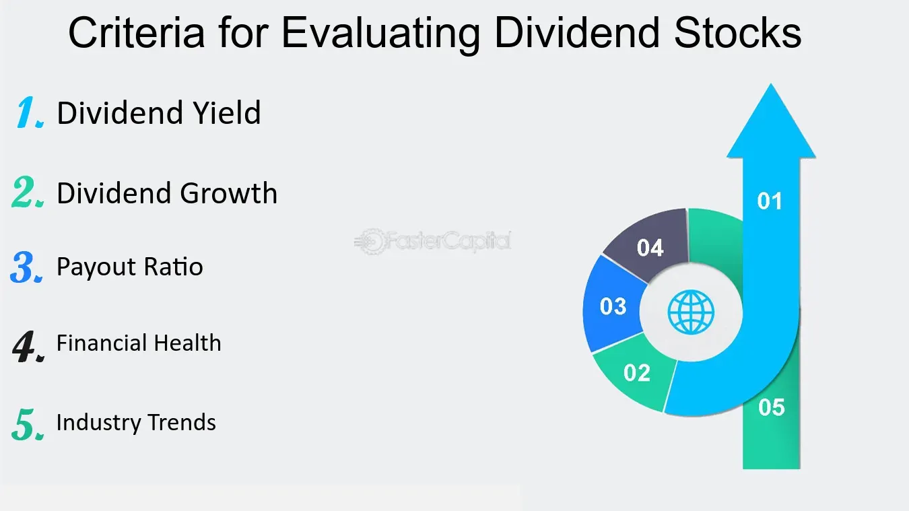

## Table of Contents

## What are dividend stocks and why are they important for investors?

Dividend stocks are shares of companies that regularly pay out a portion of their profits to shareholders. These payments, called dividends, are usually given out every three months. Companies that pay dividends are often well-established and financially stable, because they have enough extra money to share with their investors. Some popular examples of dividend-paying companies include big names like Coca-Cola and Johnson & Johnson.

Dividend stocks are important for investors for a few reasons. First, they provide a steady income stream, which can be especially helpful for people who are retired or looking for regular income from their investments. Instead of waiting for the stock price to go up and then selling, investors can receive payments without selling their shares. Second, dividend stocks can help reduce the risk in an investment portfolio. Since these companies are usually more stable, they can balance out riskier investments. Over time, reinvesting dividends can also lead to more shares and bigger future payouts, helping investors' money grow.

## What is the dividend yield and how is it calculated?

The dividend yield is a way to measure how much a company pays out in dividends each year compared to its stock price. It tells you the percentage of return you get from dividends alone, without considering any changes in the stock's price. It's like figuring out how much "rent" you're getting from your investment in the company.

To calculate the dividend yield, you take the yearly dividend per share and divide it by the current stock price. Then, you multiply that number by 100 to get a percentage. For example, if a company pays $2 in dividends per year and its stock price is $50, the dividend yield would be (2 / 50) * 100, which equals 4%. This means for every $50 you invest in the stock, you get $2 back each year, or a 4% return from dividends.

## How does the payout ratio help in evaluating dividend stocks?

The payout ratio is a useful tool for investors looking at dividend stocks. It tells you what part of a company's earnings is being paid out as dividends. You find the payout ratio by dividing the dividend per share by the earnings per share, then multiplying by 100 to get a percentage. A high payout ratio might mean the company is giving most of its profits to shareholders, which could be good for getting more dividends. But, it could also mean the company is not keeping enough money to grow or handle tough times.

On the other hand, a low payout ratio can be a sign that the company is keeping more of its earnings. This can be good because it means the company has money to invest in growing the business or to save for the future. But, it might also mean lower dividends for investors right now. By looking at the payout ratio, investors can get a better idea of how safe the dividend is and whether the company is balancing paying shareholders with keeping the business strong.

## What is the significance of the dividend growth rate for long-term investors?

The dividend growth rate is really important for long-term investors because it shows how much a company's dividend payments have been increasing over time. When a company raises its dividends regularly, it's usually a good sign that the business is doing well and making more money. For investors, this means their income from the stock can grow over time, which can help them fight against inflation and keep their buying power strong. For example, if you get a 3% raise in dividends each year, over many years, this can add up to a lot more money coming in.

Also, a high and steady dividend growth rate can make a stock more valuable. When companies keep increasing their dividends, it can make their stock price go up because investors see it as a good investment. This can lead to bigger returns for investors, not just from the dividends but also from the stock price going up. Long-term investors often look for companies with a strong history of dividend growth because it shows the company is committed to sharing its success with shareholders and can be a good way to build wealth over time.

## How can the price-to-earnings (P/E) ratio influence the decision to invest in dividend stocks?

The price-to-earnings (P/E) ratio is a key number that investors look at when thinking about buying dividend stocks. It tells you how much you're paying for each dollar of the company's earnings. If the P/E ratio is low, it might mean the stock is a good deal because you're not paying a lot for the company's profits. This can be attractive for dividend investors because they might get a higher dividend yield for their money. But, a low P/E ratio could also mean something is wrong with the company, so it's important to look at other things too.

On the other hand, a high P/E ratio might mean the stock is pricey. This could happen if people think the company will grow a lot in the future. For dividend investors, a high P/E ratio might mean a lower dividend yield because the stock price is high compared to the earnings. But, if the company keeps growing and raising its dividends, it might still be a good long-term investment. So, the P/E ratio helps investors see if a dividend stock is priced right for what they're getting in return.

## What role does the debt-to-equity ratio play in assessing the sustainability of dividends?

The debt-to-equity ratio is a number that shows how much a company is borrowing compared to what the owners have put in. It's important for figuring out if a company can keep paying dividends. If a company has a high debt-to-equity ratio, it means they owe a lot of money. This can be risky because they have to pay back the loans and interest, which might make it hard to keep paying dividends. If the company's earnings go down, they might have to use the money they would have paid as dividends to pay off their debts instead.

On the other hand, a low debt-to-equity ratio means the company isn't borrowing much and is using more of its own money to run the business. This can be a good sign for dividend investors because it shows the company is in a stronger financial position. They're less likely to have trouble paying dividends because they don't have big loan payments to worry about. So, looking at the debt-to-equity ratio helps investors see if a company's dividends are likely to keep coming in the future.

## How does the free cash flow yield help in understanding a company's ability to pay dividends?

Free cash flow yield is a way to see how much cash a company has left after paying for everything it needs to keep running and growing. This leftover money, called free cash flow, is what a company can use to pay dividends to its shareholders. The free cash flow yield is calculated by taking the free cash flow per share and dividing it by the stock price. A high free cash flow yield means the company has a lot of extra cash compared to its stock price, which is good news for dividend investors because it shows the company can easily afford to pay dividends.

If a company's free cash flow yield is low, it might mean they don't have much extra money after covering their costs. This could be a warning sign that the company might struggle to keep paying dividends, especially if something unexpected happens. By looking at the free cash flow yield, investors can get a better idea of whether a company's dividends are safe and likely to continue in the future.

## What is the importance of the return on equity (ROE) when analyzing dividend stocks?

Return on equity (ROE) is a useful measure when looking at dividend stocks. It shows how well a company is using the money that shareholders have invested to make a profit. You find the ROE by dividing the company's net income by the shareholders' equity. A high ROE means the company is good at turning the money it gets from shareholders into more money. This is important for dividend investors because a company that's good at making profits is more likely to keep paying and even raising its dividends.

If a company has a low ROE, it might mean they're not using shareholders' money as well as they could. This could be a warning sign for dividend investors because it might mean the company won't have enough profits to keep paying dividends, especially if things get tough. So, looking at the ROE helps investors see if a company is strong enough to keep paying dividends over time.

## How can the interest coverage ratio indicate the safety of dividend payments?

The interest coverage ratio is a number that shows how easily a company can pay the interest on its debts. It's important for figuring out if a company can keep paying dividends. You find the interest coverage ratio by dividing the company's earnings before interest and taxes (EBIT) by the interest expenses. A high interest coverage ratio means the company has a lot more money coming in than it needs to pay interest on its debts. This is good news for dividend investors because it means the company has extra money to pay dividends.

If a company's interest coverage ratio is low, it might mean they don't have enough money to pay their interest bills easily. This could be a warning sign for dividend investors because it means the company might have to use the money they would have paid as dividends to pay their debts instead. By looking at the interest coverage ratio, investors can get a better idea of whether a company's dividends are safe and likely to keep coming in the future.

## What advanced metrics like the dividend discount model (DDM) can be used to value dividend stocks?

The dividend discount model (DDM) is a way to figure out what a dividend stock is really worth. It does this by adding up all the future dividends the stock is expected to pay and then figuring out what those future dividends are worth right now. The idea is that the value of a stock is the total of all the dividends it will pay over time. To use the DDM, you need to guess what the dividends will be in the future and decide on a discount rate, which is like the interest rate you use to figure out what future money is worth today. If the stock's price is less than the value you calculate with the DDM, it might be a good buy.

There are different versions of the DDM that can be used depending on what you think about the company's future. The Gordon Growth Model is a simple one where you assume the dividends will grow at a steady rate forever. This is good for stable companies. For companies where the dividends might change a lot, you might use a multi-stage DDM, which lets you guess different growth rates for different times in the future. By using these models, investors can make smarter choices about which dividend stocks to buy and how much to pay for them.

## How does the use of the Gordon Growth Model enhance the analysis of dividend stocks for experts?

The Gordon Growth Model helps experts figure out what a dividend stock is really worth by using a simple formula. It assumes that the dividends a company pays will keep growing at a steady rate forever. This makes it easier for experts to guess how much money they'll get from the stock in the future. They just need to know the current dividend, the expected growth rate of the dividend, and the discount rate, which is like the interest rate they use to figure out what future money is worth today. If the stock's price is less than what the Gordon Growth Model says it's worth, experts might think it's a good buy.

This model is especially useful for companies that are stable and don't change a lot. It helps experts see if the stock's price matches up with the future dividends they expect to get. But, it's important to remember that the Gordon Growth Model works best when the company's dividends really do grow at a steady rate. If the company's dividends might change a lot, experts might need to use a different model that can handle those changes better. By using the Gordon Growth Model, experts can make smarter choices about which dividend stocks to invest in and how much to pay for them.

## What are the limitations and potential pitfalls of relying solely on key ratios when evaluating dividend stocks?

Relying only on key ratios when picking dividend stocks can be tricky. Ratios like the dividend yield or payout ratio give you a quick look at a company, but they don't tell the whole story. For example, a high dividend yield might look good, but it could also mean the stock price has dropped a lot because people think the company is in trouble. If you just look at the ratios, you might miss important details about the company's future plans, how it's doing compared to other companies, or changes happening in the world that could affect it.

Also, ratios don't show everything about a company's health. A company might have a good payout ratio now, but if it's taking on too much debt or if its profits are going down, it might not be able to keep paying those dividends in the future. It's important to look at other things too, like the company's overall financial health, what the managers are saying about the future, and what's happening in the industry. Just using ratios can make you miss out on seeing the bigger picture and might lead you to make a bad investment choice.

## What is the understanding of dividend stocks?

Dividend stocks are shares in companies that pay a portion of their profits to shareholders, typically in the form of cash payments known as dividends. This characteristic makes them attractive to investors seeking a reliable income. Such stocks are integral to investment strategies designed for income generation, portfolio diversification, and value preservation.

Dividend stocks are particularly appealing to investors who prioritize stability. Companies that consistently pay dividends often operate in mature industries with stable revenue streams. Common sectors with dividend-paying companies include utilities, consumer staples, telecommunications, and healthcare. These sectors are less sensitive to economic cycles, which contributes to the reliability of dividend disbursements.

Two critical metrics for evaluating dividend stocks are the dividend yield and payout ratio. The dividend yield is expressed as a percentage and indicates how much a company pays out in dividends relative to its stock price. It is calculated using the formula:

$$
\text{Dividend Yield} = \left( \frac{\text{Annual Dividends per Share}}{\text{Price per Share}} \right) \times 100
$$

A higher dividend yield may suggest an attractive income return on investment, but it can also signal higher risk if yields are elevated due to falling share prices.

The payout ratio measures the proportion of earnings paid out as dividends, calculated by:

$$
\text{Payout Ratio} = \left( \frac{\text{Dividends per Share}}{\text{Earnings per Share}} \right) \times 100
$$

This ratio is vital for assessing the sustainability of dividends. A consistently high payout ratio may indicate that a company is returning most of its earnings to shareholders, potentially limiting the funds available for reinvestment or growth.

Historically, dividend stocks have exhibited resilience during market [volatility](/wiki/volatility-trading-strategies). Companies able to maintain or increase dividends frequently demonstrate financial health and strong management, attracting conservative investors seeking lower-risk opportunities. This historical performance is partly due to dividends providing a cushion during periods of stock price declines, as the income component offsets some losses.

Overall, dividend stocks offer a combination of income and potential capital appreciation. Their robustness in unpredictable markets, alongside the evaluation of dividend yield and payout ratios, positions dividend stocks as a suitable option for investors focusing on long-term financial stability.

## What are the key financial ratios for evaluating dividend stocks?

Financial ratios are fundamental tools for investors seeking to evaluate dividend stocks effectively. Each ratio provides specific insights into various aspects of a company's financial health and its ability to generate steady dividend income for investors.

**Price-to-Earnings (P/E) Ratio**: This ratio is a primary indicator of how the stock market values a company. It is calculated as:

$$
\text{P/E Ratio} = \frac{\text{Market Price per Share}}{\text{Earnings per Share (EPS)}}
$$

A high P/E ratio might suggest that investors expect high growth rates in the future, while a low P/E could indicate that a stock is undervalued or that the business has some inherent risks.

**Dividend Yield**: This measure helps investors understand the return they can expect from dividends relative to the stock's price. It is given by:

$$
\text{Dividend Yield} = \frac{\text{Annual Dividends per Share}}{\text{Market Price per Share}}
$$

A higher dividend yield can attract income-focused investors, but sustainability and growth potential must also be considered.

**Payout Ratio**: The payout ratio provides insights into how much of the company's earnings are being returned to shareholders as dividends. It is calculated by:

$$
\text{Payout Ratio} = \frac{\text{Dividends per Share}}{\text{Earnings per Share (EPS)}}
$$

A payout ratio that is too high might indicate potential difficulties in maintaining dividend levels, particularly if the company encounters financial challenges.

**Debt-to-Equity Ratio**: This ratio is crucial to understanding a company's financial leverage and its ability to sustain dividend payments. It is calculated as:

$$
\text{Debt-to-Equity Ratio} = \frac{\text{Total Liabilities}}{\text{Shareholders' Equity}}
$$

A lower ratio generally indicates a more financially stable company with a stronger balance sheet, which can maintain consistent dividend payments even in adverse market conditions.

**Return on Equity (ROE)**: ROE measures a company's efficiency in generating profits from its equity. It is expressed as:

$$
\text{ROE} = \frac{\text{Net Income}}{\text{Shareholders' Equity}}
$$

Higher ROE values suggest a company effectively utilizing its equity base to generate earnings, which can translate into reliable and possibly growing dividend payouts.

By evaluating these financial ratios, investors can gain a comprehensive perspective on a company's ability to sustain and potentially increase its dividend payments, aligning their investment strategies with their financial goals.

## References & Further Reading

[1]: Bergstra, J., Bardenet, R., Bengio, Y., & Kégl, B. (2011). ["Algorithms for Hyper-Parameter Optimization."](https://papers.nips.cc/paper/4443-algorithms-for-hyper-parameter-optimization) Advances in Neural Information Processing Systems 24.

[2]: ["Advances in Financial Machine Learning"](https://www.amazon.com/Advances-Financial-Machine-Learning-Marcos/dp/1119482089) by Marcos Lopez de Prado

[3]: ["Evidence-Based Technical Analysis: Applying the Scientific Method and Statistical Inference to Trading Signals"](https://www.amazon.com/Evidence-Based-Technical-Analysis-Scientific-Statistical/dp/0470008741) by David Aronson

[4]: ["Machine Learning for Algorithmic Trading"](https://github.com/stefan-jansen/machine-learning-for-trading) by Stefan Jansen

[5]: ["Quantitative Trading: How to Build Your Own Algorithmic Trading Business"](https://www.amazon.com/Quantitative-Trading-Build-Algorithmic-Business/dp/1119800064) by Ernest P. Chan