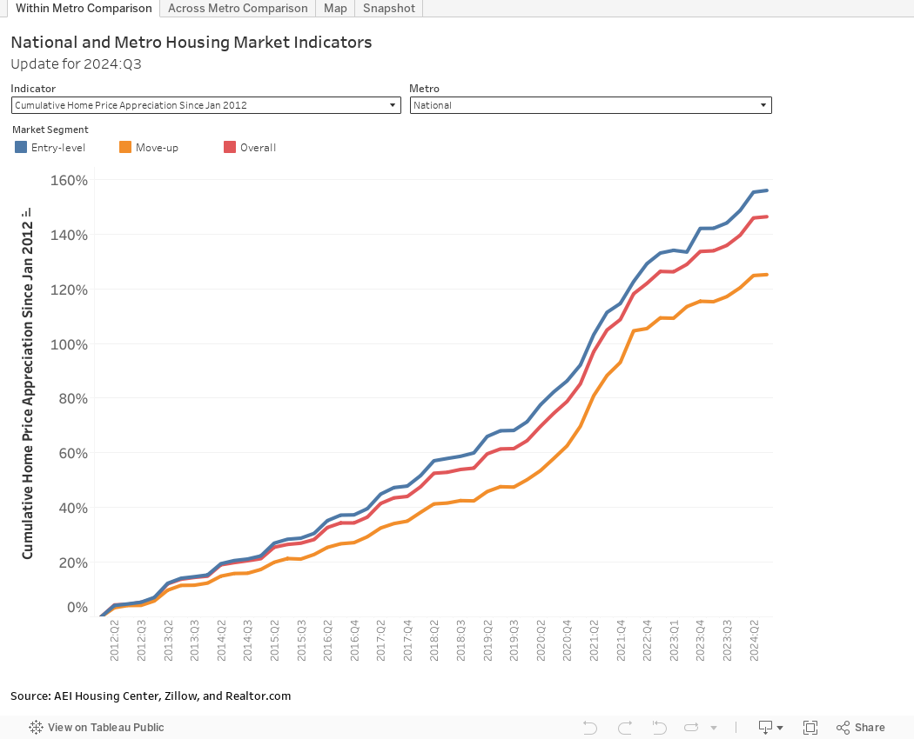

## Table of Contents

## What are the basic indicators used to measure the U.S. housing market?

The U.S. housing market is measured using several key indicators that help people understand how it's doing. One important indicator is home sales, which shows the number of houses sold in a certain time. When more homes are sold, it usually means the market is strong. Another indicator is home prices, which tells us how much homes are costing. If prices are going up, it can mean more people want to buy homes than there are homes available. Lastly, housing starts are also watched closely. This indicator shows how many new homes are beginning to be built. More housing starts can mean builders think more people will want to buy homes soon.

Another set of indicators focuses on the financial side of the housing market. Mortgage rates are a big one because they affect how much it costs to borrow money to buy a home. When rates are low, more people can afford to buy, which can push up home sales and prices. The housing inventory, or the number of homes for sale, also matters a lot. If there are lots of homes for sale and few buyers, prices might go down. But if there are few homes and many buyers, prices can go up. Finally, foreclosure rates are watched to see how many people are losing their homes because they can't pay their mortgages. High foreclosure rates can be a sign that the housing market is in trouble.

These indicators together give a good picture of the U.S. housing market. By looking at them, people can tell if the market is doing well or if it might be facing problems. This helps everyone from home buyers to policymakers make better decisions.

## How does the Housing Price Index (HPI) reflect the health of the housing market?

The Housing Price Index (HPI) is a way to see how home prices are changing over time. It's like a report card for the housing market. When the HPI goes up, it means that, on average, homes are costing more than they did before. This can be a sign that the housing market is doing well because more people want to buy homes than there are homes available. But if the HPI goes down, it might mean that fewer people are buying homes or that they're not willing to pay as much for them, which could be a sign that the market is not doing as well.

The HPI is important because it helps everyone understand the big picture of the housing market. For example, if the HPI is going up a lot very quickly, it might mean that homes are becoming too expensive for many people, which could lead to problems later. On the other hand, if the HPI is not changing much or is going down, it might mean that the market is stable or that it's not as strong as it could be. By looking at the HPI, people like home buyers, sellers, and policymakers can make better decisions about buying, selling, or making rules about housing.

## What role does the Case-Shiller Index play in understanding housing trends?

The Case-Shiller Index is a special tool that helps people see how home prices are changing in different parts of the United States. It looks at home prices in big cities and tells us if they're going up or down over time. By doing this, it gives us a clear picture of whether the housing market is getting stronger or weaker. People use the Case-Shiller Index to understand if it's a good time to buy or sell a home, and it helps them make smart choices.

This index is important because it doesn't just look at one city or one type of home. Instead, it covers many cities and looks at all kinds of homes, from small houses to big ones. This makes the Case-Shiller Index a reliable way to see the big picture of the housing market. By watching the Case-Shiller Index, people can spot trends early and plan for the future, whether they're thinking about buying a home, selling one, or making decisions about housing policies.

## How do new housing starts and building permits influence the market?

New housing starts and building permits are important signs that tell us about the health of the housing market. New housing starts show how many new homes builders have begun to build. When there are more new housing starts, it usually means that builders think more people will want to buy homes soon. This can be a good sign for the market because it means there will be more homes for people to buy. Building permits are the official okay from the government that lets builders start building. If more permits are being given out, it means builders are planning to build more homes, which can also be a good sign for the housing market.

Both new housing starts and building permits can affect home prices and sales. If there are lots of new homes being built, it might mean there will be more homes for sale, which can help keep prices from going up too fast. But if there aren't enough new homes being built, it can make the market tight, with fewer homes for sale than people who want to buy them. This can push prices up. So, watching new housing starts and building permits helps everyone from home buyers to policymakers understand if the housing market is growing or if it might need help.

## What is the significance of the Homeownership Rate as a market indicator?

The Homeownership Rate is a key number that tells us how many people own their homes instead of renting. It's a simple way to see if more or fewer people are buying homes. When the Homeownership Rate goes up, it means more people are becoming homeowners, which can be a good sign for the housing market. It shows that people feel confident enough to buy homes and that they can afford to do so. On the other hand, if the rate goes down, it might mean fewer people are buying homes, which could be a sign that the market is not doing as well.

This rate is important because it helps us understand the overall health of the housing market. If the Homeownership Rate is high, it can mean the economy is doing well because more people have the money and confidence to buy homes. But if the rate is low, it might mean that people are having a harder time buying homes, maybe because of high prices or because they're worried about the economy. By keeping an eye on the Homeownership Rate, people like home buyers, sellers, and policymakers can get a better idea of what's happening in the housing market and make smarter choices.

## How does the inventory of homes for sale impact housing market dynamics?

The inventory of homes for sale is like the number of homes people can choose from when they want to buy. When there are lots of homes for sale, it's called a "buyer's market." This means buyers have more choices, and they might be able to get a better deal because there are so many homes to pick from. On the other hand, when there are not many homes for sale, it's called a "seller's market." In a seller's market, people who want to buy a home might have to pay more because there are more buyers than homes available.

The inventory of homes for sale can also affect how quickly homes sell and how much they cost. If there are lots of homes for sale and not many buyers, homes might stay on the market longer, and sellers might have to lower their prices to get someone to buy. But if there are few homes and lots of buyers, homes can sell really fast, sometimes even with people offering more than the asking price. This shows how the inventory of homes for sale is a big deal in deciding how the housing market works.

## What insights can be gained from the average time a home spends on the market?

The average time a home spends on the market tells us a lot about how the housing market is doing. If homes are selling quickly, it usually means there are a lot of buyers and not enough homes for sale. This can happen in a "seller's market," where people might even offer more than the asking price to get a home. When homes sell fast, it's a sign that the market is strong and that people feel good about buying homes.

On the other hand, if homes are staying on the market for a long time, it could mean there are too many homes for sale and not enough buyers. This is often called a "buyer's market," where buyers can take their time to choose and might even get a lower price. A longer time on the market can be a sign that the housing market is not as strong, maybe because people are worried about the economy or because homes are too expensive for many people to buy.

## How do mortgage interest rates affect housing affordability and market activity?

Mortgage interest rates are really important because they change how much it costs to borrow money to buy a home. When interest rates are low, it's cheaper to borrow money. This means more people can afford to buy homes because their monthly payments will be lower. When more people can buy, it can make the housing market busier, with more homes selling and prices sometimes going up because so many people want to buy.

On the other hand, when interest rates are high, it costs more to borrow money. This can make it harder for people to afford to buy homes because their monthly payments will be higher. When fewer people can afford to buy, the housing market might slow down. Fewer homes might sell, and sometimes prices might even go down because there aren't as many buyers. So, interest rates play a big role in deciding if the housing market is busy or slow.

## What does the delinquency and foreclosure rate tell us about the stability of the housing market?

The delinquency and foreclosure rates give us a good idea about how stable the housing market is. Delinquency means people are late on their mortgage payments, and foreclosure happens when people can't pay their mortgage at all and lose their homes. If these rates are going up, it might mean that more people are having trouble paying their bills. This can be a sign that the housing market is not doing well, and people might be worried about losing their jobs or not having enough money.

On the other hand, if delinquency and foreclosure rates are low or going down, it's usually a good sign for the housing market. It means that most people are able to keep up with their mortgage payments and are not losing their homes. This shows that the market is stable and that people feel confident about their financial situation. Watching these rates helps everyone understand if the housing market is strong or if it might be facing some problems.

## How do regional variations in housing market indicators affect national trends?

Regional variations in housing market indicators can have a big impact on national trends. Different parts of the country can have very different housing markets. For example, if home prices are going up a lot in big cities like New York or San Francisco, it can pull up the national average home price. But if prices are going down in other places, it might not show up as much in the national numbers. So, what happens in one region can change how we see the whole country's housing market.

These regional differences can also affect how people feel about the housing market. If a lot of new homes are being built in the South, but not many in the Northeast, it can make the national numbers look like there are more new homes being built than there really are in some places. Also, if foreclosure rates are high in one area but low in another, it can make the national picture confusing. Understanding these regional differences helps us get a clearer picture of what's really going on in the housing market across the country.

## What advanced statistical models are used to predict future housing market trends?

To predict future housing market trends, experts often use advanced statistical models like time series analysis and regression models. Time series analysis looks at past data to find patterns and predict what might happen next. For example, it can show how home prices have changed over the last few years and use that information to guess where they might go in the future. Regression models, on the other hand, look at how different things, like interest rates or unemployment rates, affect home prices. By understanding these relationships, experts can make better guesses about what will happen in the housing market.

Another model used is the autoregressive integrated moving average (ARIMA) model, which is good at predicting things that change over time, like home prices. ARIMA models can help spot trends and seasonal changes that might not be easy to see just by looking at the numbers. Machine learning models are also becoming more popular. These models can look at a lot of different data at once, like home sales, building permits, and even social media trends, to make very detailed predictions. By using these advanced models, experts can give people a better idea of what to expect in the housing market, helping them make smarter decisions about buying or selling homes.

## How do economic factors like employment rates and GDP growth correlate with housing market indicators?

Employment rates and GDP growth are big pieces of the puzzle when it comes to understanding the housing market. When more people have jobs, it usually means they feel more confident about their money. This can make them more likely to buy homes, which can push up home sales and prices. On the other hand, if a lot of people are out of work, they might not feel ready to buy a home. This can slow down the housing market, with fewer homes selling and prices maybe even going down. So, watching the employment rate helps us see how strong the housing market might be.

GDP growth, which shows how fast the economy is growing, also plays a role in the housing market. When the economy is doing well and GDP is growing, people might feel good about their future and be more willing to buy homes. This can lead to more new homes being built and higher home prices. But if the economy is not doing well and GDP growth is slow or even shrinking, people might hold off on buying homes. This can make the housing market weaker, with fewer new homes being built and home prices staying the same or dropping. So, GDP growth gives us clues about where the housing market might be headed.

## Is Algorithmic Trading Applicable in the Real Estate Market?

Algorithmic trading in the real estate market represents a transformative approach by leveraging the power of real estate indicators to exploit inefficiencies and predict price movements. This trading method revolves around using advanced software and algorithms that can manage and process vast amounts of data to enable rapid and informed decision-making.

The integration of [artificial intelligence](/wiki/ai-artificial-intelligence) (AI) and [machine learning](/wiki/machine-learning) (ML) technologies significantly enhances the predictive capabilities concerning price trends in real estate. AI and ML algorithms are designed to learn from historical data, understand patterns, and apply these learnings to predict future market behavior. For example, a machine learning model might analyze historic price indices and sales forecasts to determine forthcoming price shifts with improved accuracy.

Developers of these algorithms invest considerable effort in curating robust models that incorporate a variety of data sources. Datasets might include historical sales data, regional price indices, and market forecasts. By identifying trends and anomalies in these datasets, the algorithms can suggest optimal buy or sell actions with precise timing considerations.

Consider the formula:

$$

\text{Price Prediction} = \alpha \cdot \text{Past Prices} + \beta \cdot \text{Economic Indicators} + \gamma \cdot \text{Market Sentiment}
$$

Where:
- $\alpha$, $\beta$, and $\gamma$ are weights assigned to respective factors, optimized through machine learning techniques.
- Past Prices correspond to historical data trends.
- Economic Indicators may include interest rates and employment statistics.
- Market Sentiment is gauged from news articles and social media feeds.

In practice, these algorithms utilize cutting-edge technologies to enhance trading processes, converting what used to be a slow market transaction into a swift, data-driven execution. Python libraries such as `pandas`, `scikit-learn`, and `TensorFlow` provide tools for the processing and analysis of data, enabling the construction of sophisticated trading systems.

Here is a simple Python example demonstrating how such algorithms might be structured:

```python
import pandas as pd
from sklearn.ensemble import RandomForestRegressor

# Load historical real estate data
data = pd.read_csv('real_estate_data.csv')

# Features and target variable
X = data[['previous_price', 'economic_index', 'sentiment_score']]
y = data['current_price']

# Train the model
model = RandomForestRegressor()
model.fit(X, y)

# Predict future prices
future_prices = model.predict(X)

print(future_prices)
```

This script demonstrates the fundamental process of using historical data to train a model that can predict future prices. The efficiency and accuracy of such algorithmic systems in processing real-time data feeds help quickly identify market opportunities and act upon them, making them revolutionary in what has traditionally been a slower, more deliberate market environment.

## References & Further Reading

[1]: U.S. Census Bureau. ["Construction Spending."](https://www.census.gov/construction/c30/c30index.html)

[2]: National Association of Realtors (NAR). ["Existing-Home Sales Data."](https://www.nar.realtor/research-and-statistics/housing-statistics/existing-home-sales)

[3]: S&P Dow Jones Indices. ["Case-Shiller Home Price Indices."](https://www.spglobal.com/spdji/en/index-family/indicators/sp-corelogic-case-shiller/sp-corelogic-case-shiller-composite/)

[4]: Federal Housing Finance Agency. ["FHFA House Price Index."](https://www.fhfa.gov/data/hpi)

[5]: National Association of Home Builders (NAHB). ["Housing Market Index (HMI)."](https://www.nahb.org/News-and-Economics/Housing-Economics/Indices/Housing-Market-Index)

[6]: James, G., Witten, D., Hastie, T., & Tibshirani, R. (2013). ["An Introduction to Statistical Learning: with Applications in R."](https://link.springer.com/book/10.1007/978-1-0716-1418-1) Springer.