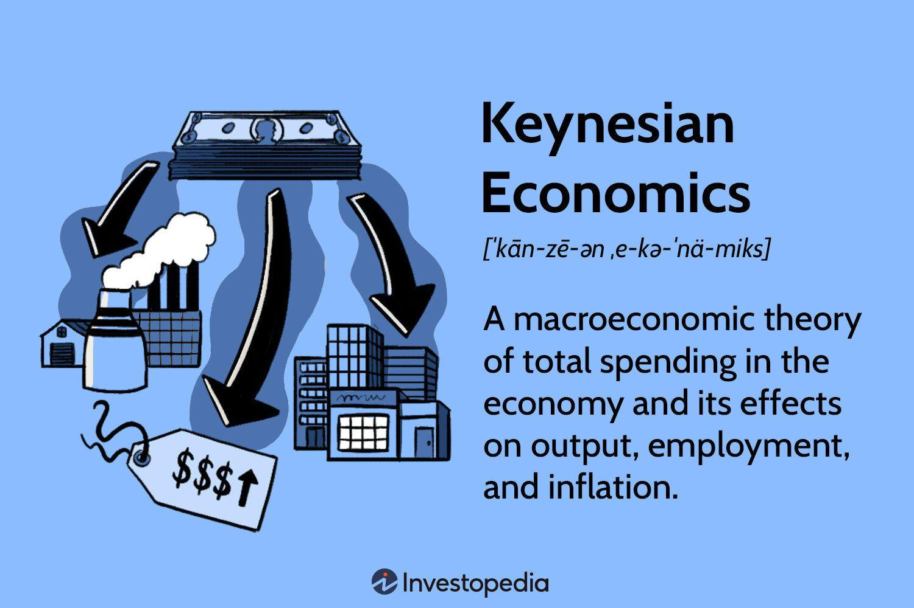

## Table of Contents

## What is Keynesian Economics?

Keynesian Economics is a theory about how economies work, named after the economist John Maynard Keynes. He came up with these ideas during the Great Depression in the 1930s. Keynes believed that the government should play a big role in helping the economy, especially during tough times. He thought that when people aren't spending enough money, it can cause businesses to struggle and unemployment to rise. To fix this, Keynes suggested that the government should spend more money, even if it means running a budget deficit, to boost demand and get the economy moving again.

In simple terms, Keynesian Economics says that the economy can get stuck in a bad spot where people and businesses don't want to spend money. When this happens, Keynes argued that the government needs to step in and spend money to kick-start the economy. This could mean building roads, schools, or other public projects. By doing this, the government creates jobs and puts more money into people's pockets, which they can then spend on goods and services. This increased spending helps businesses grow and hire more workers, leading to a healthier economy overall.

## Who was John Maynard Keynes?

John Maynard Keynes was a famous economist born in 1883 in England. He is best known for his ideas about how to fix economies when they are not doing well. Keynes wrote a very important book called "The General Theory of Employment, Interest and Money" in 1936. This book changed how people thought about economics and led to a new way of thinking called Keynesian Economics. He believed that governments should spend more money during tough times to help the economy recover.

Keynes lived during a time when the world was going through the Great Depression, a period when many people lost their jobs and businesses failed. He thought that if people and businesses were not spending enough money, the government should step in and spend money on things like building roads and schools. This would create jobs and help people have more money to spend, which would make the economy better. Keynes's ideas are still used today by governments around the world to help manage their economies.

## What are the main principles of Keynesian Economics?

Keynesian Economics is all about how governments can help the economy when it's not doing well. The main idea is that if people and businesses stop spending money, it can cause big problems like unemployment and slow business. Keynes thought that when this happens, the government should step in and spend more money, even if it means borrowing or running a deficit. By doing this, the government can create jobs and get more money flowing in the economy. This helps businesses start working again and people to get back to work.

Another important principle is that economies can get stuck in a bad place where they don't fix themselves. Keynes called this a "[liquidity](/wiki/liquidity-risk-premium) trap," where people hold onto their money instead of spending or investing it. In these situations, he believed that only the government can break the cycle by spending more. This extra spending can help increase demand for goods and services, which encourages businesses to produce more and hire more workers. Overall, Keynesian Economics focuses on using government action to manage and improve the economy, especially during tough times.

## How does Keynesian Economics differ from classical economics?

Keynesian Economics and classical economics have different views on how economies work and how they should be managed. Classical economics, which was popular before Keynes came along, believes that economies are self-correcting. This means that if there's a problem like high unemployment, the economy will fix itself over time without the government needing to do anything. Classical economists think that prices, wages, and interest rates will adjust on their own to bring the economy back to balance. They also believe that people always spend and save in a way that keeps the economy running smoothly.

On the other hand, Keynesian Economics argues that economies can get stuck in a bad spot where they don't fix themselves. Keynes thought that if people and businesses stop spending money, it can lead to a lot of unemployment and slow business. He believed that when this happens, the government needs to step in and spend more money, even if it means borrowing or running a deficit. This extra spending can create jobs and get more money flowing in the economy, helping businesses to start working again and people to get back to work. Keynes' ideas focus on using government action to manage and improve the economy, especially during tough times.

## What is the role of government in Keynesian Economics?

In Keynesian Economics, the government has a big job to help the economy when it's not doing well. Keynes thought that if people and businesses stop spending money, it can cause big problems like lots of people losing their jobs and businesses slowing down. When this happens, he believed the government should step in and spend more money, even if it means borrowing or running a deficit. By doing this, the government can create jobs and get more money flowing in the economy. This helps businesses start working again and people to get back to work.

Keynes also thought that economies can get stuck in a bad place where they don't fix themselves. He called this a "liquidity trap," where people hold onto their money instead of spending or investing it. In these situations, Keynes believed that only the government can break the cycle by spending more. This extra spending can help increase demand for goods and services, which encourages businesses to produce more and hire more workers. Overall, in Keynesian Economics, the government's role is to use its spending power to manage and improve the economy, especially during tough times.

## What is the Keynesian multiplier effect?

The Keynesian multiplier effect is a big idea in economics that says when the government spends money, it can have a bigger impact on the economy than you might think. Imagine the government decides to build a new road. They pay workers to build it, and those workers then spend their earnings on things like food, clothes, and other stuff. The people who sell those things make more money and spend it too. This chain of spending keeps going, and the original money the government spent on the road ends up boosting the economy even more.

The multiplier effect works because one person's spending becomes another person's income. If the government spends $1 million on a project, that money doesn't just stay with the people who got paid directly. It gets passed around as people buy things, and each time it's spent, it adds a little more to the economy's total output. The size of the multiplier depends on how much people save versus spend. If people spend most of their money, the multiplier effect will be bigger. This is why Keynes thought government spending could be a powerful tool to help the economy grow, especially during tough times.

## How does Keynesian Economics explain economic recessions?

Keynesian Economics explains economic recessions by saying they happen when people and businesses stop spending money. When this happens, businesses don't sell as much stuff, so they might have to lay off workers or close down. This leads to more people being out of work, and those people don't have money to spend, which makes the problem even worse. Keynes called this a "vicious cycle" where the economy can get stuck in a bad spot and not fix itself.

To break this cycle, Keynes believed the government should step in and spend more money, even if it means borrowing or running a deficit. By spending on things like building roads or schools, the government creates jobs and puts money into people's pockets. These people can then spend that money on goods and services, which helps businesses start working again and hire more workers. This extra spending can help the economy get out of a recession and start growing again.

## What are fiscal policies in Keynesian Economics?

In Keynesian Economics, fiscal policies are the ways the government uses its spending and taxes to help the economy. Keynes thought that when the economy is in a recession, the government should spend more money on things like building roads, schools, and other public projects. This extra spending creates jobs and puts money into people's pockets, which they can then spend on goods and services. This helps businesses grow and hire more workers, making the economy better.

On the other hand, when the economy is growing too fast and might cause inflation, Keynes suggested that the government should spend less money and maybe even raise taxes. By doing this, the government can take some money out of the economy, which can help slow things down and keep prices from going up too quickly. So, in Keynesian Economics, fiscal policies are all about using government spending and taxes to keep the economy balanced and healthy.

## Can you explain the concept of aggregate demand in Keynesian theory?

In Keynesian theory, aggregate demand is the total amount of money that everyone in the economy wants to spend on goods and services. This includes what people, businesses, and the government want to buy. Keynes thought that if aggregate demand is too low, it can cause big problems like lots of people being out of work and businesses slowing down. When people aren't spending enough, businesses don't sell as much stuff, so they might have to lay off workers or even close down. This makes the problem worse because those workers then don't have money to spend, which lowers aggregate demand even more.

To fix this, Keynes believed the government should step in and spend more money, even if it means borrowing or running a deficit. By spending on things like building roads or schools, the government can create jobs and put more money into people's pockets. This extra money can then be spent on goods and services, which increases aggregate demand. When aggregate demand goes up, businesses start working again and hire more workers, helping the economy grow. So, in Keynesian theory, managing aggregate demand is key to keeping the economy healthy and preventing recessions.

## How has Keynesian Economics been applied in real-world scenarios?

Keynesian Economics has been used by many countries to help their economies during tough times. One famous example is the New Deal in the United States during the Great Depression in the 1930s. President Franklin D. Roosevelt used Keynesian ideas to create jobs and boost the economy. The government spent a lot of money on public projects like building roads, bridges, and schools. This helped put people back to work and got more money flowing in the economy, which helped the country start to recover from the depression.

Another example is after the 2008 financial crisis. Many countries, including the United States, used Keynesian policies to help their economies recover. The U.S. government passed the American Recovery and Reinvestment Act, which involved spending a lot of money on things like infrastructure, education, and health care. This extra spending helped create jobs and increased demand for goods and services, which helped the economy start growing again. These real-world applications show how Keynesian Economics can be used to help economies during tough times by increasing government spending to boost demand and create jobs.

## What are the criticisms of Keynesian Economics?

Some people don't agree with Keynesian Economics. They think that if the government spends too much money, it can cause problems like inflation, where prices go up a lot. They also worry that if the government keeps borrowing money to spend, it might end up with too much debt. This could make it hard for the government to pay back what it owes and might even slow down the economy in the long run. Critics also say that government spending might not always be used in the best way, and sometimes it might go to projects that don't really help the economy grow.

Another criticism is that Keynesian Economics focuses too much on short-term fixes and doesn't think enough about the long-term health of the economy. Some people believe that the economy can fix itself without the government stepping in, and that government action might actually make things worse. They argue that if the government spends a lot of money during a recession, it might have to raise taxes or cut spending later, which could hurt the economy when it's trying to recover. So, while Keynesian Economics has helped in some situations, it's not something everyone agrees with.

## What are the modern adaptations of Keynesian theory?

Modern adaptations of Keynesian theory have tried to make it work better with today's economy. One big change is called "New Keynesian Economics." This version tries to mix Keynesian ideas with other economic theories, like how prices and wages can be sticky and don't change quickly. New Keynesians believe that the government should still spend more money during bad times, but they also think about how interest rates and inflation can affect the economy. They use tools like central bank policies to help manage the economy better.

Another modern take on Keynesian theory is called "Post-Keynesian Economics." This approach focuses more on how people and businesses actually behave, rather than just looking at numbers. Post-Keynesians think that the economy can be very unpredictable and that government spending can help a lot during tough times. They also believe in using policies like job guarantees to keep unemployment low. Both New Keynesian and Post-Keynesian theories try to update Keynes's original ideas to fit the way the world works now, and they are still used by policymakers to help manage economies around the world.

## References & Further Reading

[1]: Keynes, J. M. (1936). ["The General Theory of Employment, Interest, and Money."](https://www.files.ethz.ch/isn/125515/1366_KeynesTheoryofEmployment.pdf) Palgrave Macmillan.

[2]: Friedman, M. (1963). ["A Monetary History of the United States, 1867-1960."](https://www.jstor.org/stable/j.ctt7s1vp) Princeton University Press.

[3]: Jarrow, R. A., & Chatterjea, A. (2019). ["An Introduction to Derivative Securities, Financial Markets, and Risk Management."](https://www.scribd.com/document/686888944/Robert-Jarrow-Arkadev-Chatterjea-An-Introduction-to-Derivative-Securities-Financial-Markets-And-Risk-Management-2nd-Edition-World-Scientific-US) W.W. Norton & Company.

[4]: Shiller, R. J. (2015). ["Irrational Exuberance: Revised and Expanded Third Edition."](https://www.jstor.org/stable/j.ctt1287kz5) Princeton University Press.

[5]: Hendershott, T., Jones, C. M., & Menkveld, A. J. (2011). ["Does Algorithmic Trading Improve Liquidity?"](https://onlinelibrary.wiley.com/doi/full/10.1111/j.1540-6261.2010.01624.x) The Journal of Finance, 66(1), 1-33.

[6]: Biais, B., Foucault, T., & Moinas, S. (2015). ["Equilibrium Fast Trading."](https://www.semanticscholar.org/paper/Equilibrium-Fast-Trading-Biais-Foucault/49aa851da956573b88c13c9148ea43567bf8b86f) The Review of Financial Studies, 28(11), 3197-3236.

[7]: "Algorithmic Trading and DMA: An Introduction to Direct Access Trading Strategies" by Barry Johnson (2010).

[8]: Tsay, R. S. (2010). ["Analysis of Financial Time Series."](https://onlinelibrary.wiley.com/doi/book/10.1002/9780470644560) Wiley.

[9]: Choudhry, M., Joannas, D., Pereira, R., & Pienaar, R. (2009). ["Capital Market Instruments: Analysis and Valuation."](https://link.springer.com/book/10.1057/9780230279384) Palgrave Macmillan.