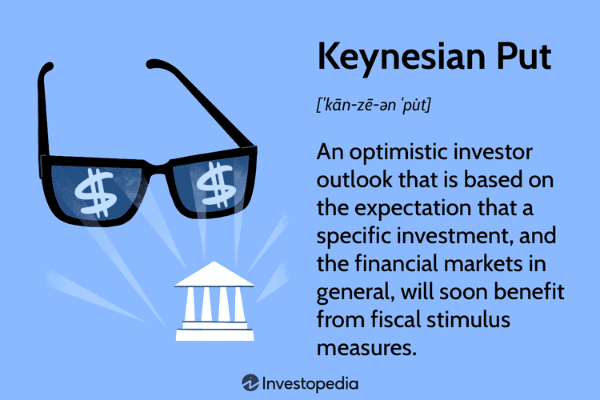

## Table of Contents

## What is the Keynesian Put?

The Keynesian Put is an idea that comes from the economic theories of John Maynard Keynes. It suggests that governments should step in and help the economy when it's not doing well. Imagine the economy as a big machine that sometimes breaks down. When it does, the government can fix it by spending more money or cutting taxes. This helps to keep people working and businesses running, preventing a small problem from turning into a big one.

In simple terms, the Keynesian Put is like a safety net for the economy. If things start to go wrong, the government uses its power to make things better. This idea became very popular during the Great Depression when many people were out of work and businesses were failing. By spending money on things like building roads or helping people find jobs, the government can help the economy recover faster. This approach is different from just waiting for the economy to fix itself, which can take a long time and cause a lot of suffering.

## Who is John Maynard Keynes and how is he related to the Keynesian Put?

John Maynard Keynes was a famous economist from England who lived from 1883 to 1946. He came up with a lot of ideas about how economies work and how governments can help when things go wrong. Keynes believed that during tough times, like when a lot of people are out of work, the government should spend more money to help the economy get better. This way, people can keep their jobs, and businesses can keep running.

The Keynesian Put is a term that comes from Keynes' ideas. It means that the government acts like a safety net for the economy. When the economy is struggling, the government can step in by spending more money or cutting taxes. This helps to fix problems quickly and stop them from getting worse. The idea became really important during the Great Depression, when many people were out of work and businesses were failing. By following Keynes' advice, governments could help their economies recover faster.

## How does the Keynesian Put differ from traditional economic policies?

The Keynesian Put is different from traditional economic policies because it believes in active government involvement. Traditional policies often follow the idea that the economy will fix itself if left alone. This is called "laissez-faire," which means the government should not interfere much. But Keynes thought this was not enough, especially during bad times like a recession. He said the government should spend more money or cut taxes to help the economy recover faster.

In simple terms, the Keynesian Put is like a safety net that catches the economy when it falls. Traditional policies might wait for the economy to bounce back on its own, which can take a long time and cause a lot of suffering. Keynes' approach is more like a quick fix, where the government steps in to help people keep their jobs and businesses stay open. This way, the economy can get back on its feet much faster.

## What are the main components of the Keynesian Put?

The Keynesian Put is all about the government stepping in to help the economy when it's not doing well. The main idea is that the government should spend more money when times are tough. This could mean building new roads, schools, or hospitals. By doing this, the government creates jobs and helps people earn money, which they can then spend on other things. This spending helps to keep the economy moving and stops a small problem from getting bigger.

Another key part of the Keynesian Put is cutting taxes. When people and businesses pay less in taxes, they have more money to spend or invest. This can help boost the economy because more spending means more demand for goods and services. Together, government spending and tax cuts work to lift the economy out of a slump and get it back on track. These actions are different from just waiting for the economy to fix itself, which can take a long time and cause a lot of hardship.

## Can you explain the economic conditions that led to the development of the Keynesian Put?

The Keynesian Put was developed during a time when the world was facing a big economic problem called the Great Depression. This started in the late 1920s and lasted through the 1930s. During this time, many people lost their jobs, businesses closed down, and the economy was in a very bad shape. People were suffering, and it seemed like the economy was stuck and couldn't get better on its own. Traditional economic ideas, which said the government should not interfere much, were not helping to fix the problem.

John Maynard Keynes saw that the economy needed a push to get going again. He believed that if the government spent more money on things like building roads or helping people find jobs, it could help the economy recover faster. This idea was different from the usual way of thinking, which was to wait for the economy to fix itself. Keynes' ideas became very important because they offered a way to help people and businesses during tough times. This is how the Keynesian Put came about, as a way for the government to act like a safety net and help the economy when it was struggling.

## How does the Keynesian Put aim to stabilize the economy?

The Keynesian Put aims to stabilize the economy by having the government step in when things are going badly. When a lot of people are out of work and businesses are struggling, the government can help by spending more money on things like building roads or schools. This creates jobs and puts money into people's pockets, which they can then spend on other things. This spending helps to keep the economy moving and stops a small problem from turning into a big one. By doing this, the government acts like a safety net that catches the economy when it falls.

Another way the Keynesian Put helps is by cutting taxes. When people and businesses pay less in taxes, they have more money to spend or invest. This can help boost the economy because more spending means more demand for goods and services. Together, government spending and tax cuts work to lift the economy out of a slump and get it back on track. This approach is different from just waiting for the economy to fix itself, which can take a long time and cause a lot of suffering. The Keynesian Put offers a quicker way to help the economy recover and become stable again.

## What are the potential benefits of implementing the Keynesian Put?

Implementing the Keynesian Put can bring several benefits to the economy. One big advantage is that it helps to create jobs quickly. When the government spends more money on things like building roads or schools, it needs workers to do the job. This means more people can find work, which helps them earn money and support their families. When people have jobs, they can spend money on other things, which helps businesses and keeps the economy moving. This can stop a small problem from turning into a big one and help the economy recover faster.

Another benefit is that the Keynesian Put can boost the economy by cutting taxes. When people and businesses pay less in taxes, they have more money to spend or invest. This extra money can help increase demand for goods and services, which is good for the economy. By doing this, the government can help lift the economy out of a slump and make it more stable. Overall, the Keynesian Put offers a way to help the economy when it's struggling, making life better for people and businesses.

## What criticisms or limitations are associated with the Keynesian Put?

Some people think the Keynesian Put has problems. One big worry is that if the government spends a lot of money to help the economy, it might lead to inflation. Inflation means prices go up, and that can make life harder for people because their money doesn't go as far. Another concern is that the government might keep spending money even when the economy is doing well, which could lead to a big debt. If the government has too much debt, it might have to raise taxes or cut spending later, which can hurt the economy.

Another criticism is that the Keynesian Put might not work as well as people hope. Sometimes, the government's spending might not go to the right places or create the jobs that are needed. Also, if people think the government will always step in to help, they might not be as careful with their money or businesses might take more risks. This could make the economy less stable in the long run. So, while the Keynesian Put can help in tough times, it's not a perfect solution and has its own set of challenges.

## How has the Keynesian Put been applied in real-world economic policies?

The Keynesian Put has been used in many countries to help their economies during tough times. One famous example is during the Great Depression in the 1930s. The U.S. government, led by President Franklin D. Roosevelt, started a program called the New Deal. This program was all about spending money to create jobs and help people. The government built roads, bridges, and schools, and it also helped people find work through programs like the Works Progress Administration. This helped to lift the economy out of the depression and showed how the Keynesian Put could work in real life.

Another example is during the 2008 financial crisis. Many countries, including the United States, used the Keynesian Put to help their economies recover. The U.S. government passed the American Recovery and Reinvestment Act, which was a big plan to spend money on things like infrastructure and tax cuts. This helped to create jobs and boost spending, which was important for getting the economy back on track. These examples show that the Keynesian Put can be a useful tool for governments to help their economies when they are struggling.

## What are the differences between the Keynesian Put and other economic stabilization theories?

The Keynesian Put is different from other economic stabilization theories because it believes the government should step in and help the economy when it's not doing well. Keynes thought that during tough times, like a recession, the government should spend more money or cut taxes to create jobs and boost spending. This is different from traditional economic theories, like laissez-faire, which say the economy should be left alone to fix itself. Laissez-faire believes that if the government doesn't interfere, the economy will naturally find its way back to health. But Keynes argued that waiting could take too long and cause a lot of suffering, so the government should act quickly to help.

Another theory that's different from the Keynesian Put is the Monetarist theory, which focuses on controlling the money supply to stabilize the economy. Monetarists, like Milton Friedman, believe that if the government controls how much money is in the economy, it can help prevent inflation and keep things stable. This is different from the Keynesian approach, which is more about direct spending and tax cuts. Monetarists think the government should be more hands-off and let the money supply do the work, while Keynesians want the government to take a more active role in helping the economy. Both theories aim to stabilize the economy, but they do it in different ways.

## How can the effectiveness of the Keynesian Put be measured?

The effectiveness of the Keynesian Put can be measured by looking at how well it helps the economy recover from tough times. One way to do this is by checking if the unemployment rate goes down after the government spends more money or cuts taxes. If more people are working, it means the economy is getting better. Another way is to see if people are spending more money. When the government helps the economy, people should feel more confident and start buying things again, which helps businesses and keeps the economy moving.

Another important measure is the growth of the economy, often shown by the Gross Domestic Product (GDP). If the GDP goes up after the government uses the Keynesian Put, it means the economy is growing and the policy is working. But it's also important to look at inflation. If prices start going up too fast because of the government's spending, it might mean the Keynesian Put is causing problems. So, to really know if the Keynesian Put is effective, you need to look at a mix of things like unemployment, spending, GDP, and inflation.

## What are the future prospects and potential evolutions of the Keynesian Put in modern economics?

The future of the Keynesian Put in modern economics looks promising, but it might change a bit to fit today's world. As economies get more connected and technology changes how we work and spend money, the government might need to find new ways to use the Keynesian Put. For example, instead of just building roads, the government could spend money on things like green energy or helping people learn new skills for jobs that didn't exist before. This way, the Keynesian Put can still help the economy when it's struggling, but it can also help with other big problems like climate change or making sure everyone has a good job.

Another thing that might change is how the government decides to spend money or cut taxes. With more data and better ways to understand the economy, the government could be smarter about where to put its money. This could mean spending more on things that really help people and businesses, and less on things that don't work as well. As the world keeps changing, the Keynesian Put might need to change too, but the main idea of the government helping the economy when it's in trouble will probably stay the same.

## References & Further Reading

1. **Keynesian Economics Seminal Works:**
   - Keynes, John Maynard. *The General Theory of Employment, Interest, and Money*. This foundational text outlines the key principles of Keynesian economics and is essential reading for understanding its historical and theoretical framework.
   - Skidelsky, Robert. *John Maynard Keynes: 1883-1946: Economist, Philosopher, Statesman*. A comprehensive biography that contextualizes Keynes's economic theories within his life and work.

2. **Algorithmic Trading Resources:**
   - Chan, Ernest P. *Algorithmic Trading: Winning Strategies and Their Rationale*. This book provides an in-depth look into developing efficient trading algorithms with practical examples and case studies.
   - Kissell, Robert. *The Science of Algorithmic Trading and Portfolio Management*. This text explores advanced techniques and strategies in algorithmic trading, emphasizing quantitative and risk management aspects.

3. **Financial Markets and Economic Theory:**
   - Fama, Eugene F. *Foundations of Finance: Portfolio Decisions and Securities Prices*. A crucial work for understanding the Efficient Market Hypothesis and its implications for trading strategies.
   - Shiller, Robert J. *Irrational Exuberance*. Offers insights into market volatility and investor behavior, challenging traditional economic theories with psychological dimensions.

4. **Integration of Technology in Financial Markets:**
   - Lopez de Prado, Marcos. *Advances in Financial Machine Learning*. A guide to integrating machine learning techniques within financial markets to enhance predictability and strategy efficiency.
   - Narang, Rishi K. *Inside The Black Box: A Simple Guide to Quantitative and High-Frequency Trading*. This book demystifies quantitative trading and offers insights into the use of technology in finance.

5. **Further Readings and Articles:**
   - *The Journal of Finance* and *Journal of Economic Perspectives* frequently publish articles on the latest developments in economic theory and technology's role in modern financial markets.
   - Industry reports from Bloomberg and McKinsey & Company provide ongoing analysis and forecasts on market trends and the impact of economic policies.

6. **Online Resources and Expert Analyses:**
   - Utilize platforms such as Coursera and edX for courses on algorithmic trading and economic theory, taught by leading experts in the field.
   - Follow economic research organizations such as the National Bureau of Economic Research (NBER) for access to working papers and publications that offer in-depth economic analyses.

Encourage readers to explore these materials to gain a nuanced understanding of how Keynesian economics and [algorithmic trading](/wiki/algorithmic-trading) continue to shape financial markets in a technologically advanced era.

