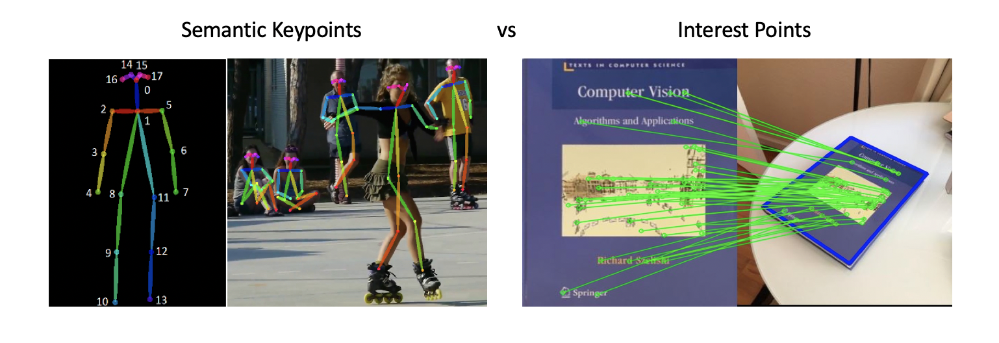

## Table of Contents

## What are keypoints in the context of machine learning?

Keypoints in machine learning are specific points of interest within an image or a data set that are used to understand and analyze the content. These points are usually critical features, like the corners of a face or the joints of a body, which help in tasks like object recognition, tracking, and pose estimation. By identifying these keypoints, machine learning models can better interpret and process visual information, making it easier to perform tasks like identifying people in a photo or tracking the movement of objects in a video.

In practice, keypoint detection involves using algorithms to find these significant points. For example, in image processing, algorithms might look for areas with high contrast or specific patterns to locate keypoints. Once these points are detected, they can be used as reference points for further analysis or to train models to recognize similar patterns in new data. This process is crucial in applications like facial recognition, where keypoints on the face help in accurately identifying individuals, or in sports analytics, where tracking the keypoints of athletes can provide insights into their performance.

## How are keypoints used in computer vision tasks?

Keypoints are special spots in pictures or videos that help computers understand what they see. In computer vision, these spots are like important markers that show where key parts of an object are, like the eyes and nose on a face or the joints on a body. By finding these keypoints, computers can figure out what the object is, where it is, and how it's moving. For example, if a computer can spot the keypoints on a person's face, it can tell if that person is smiling or frowning.

These keypoints are really helpful for tasks like recognizing faces, tracking how people move, and even understanding how animals or objects move. When a computer looks at a video of someone dancing, it can use keypoints to follow the dancer's movements and see how they change over time. This is important for things like making video games more realistic or helping doctors study how people walk. By using keypoints, computers can do a better job at understanding and working with visual information.

## What is the difference between keypoints and feature points?

Keypoints and feature points are both important in computer vision, but they are used for slightly different purposes. Keypoints are specific locations in an image that are important for understanding the content, like the corners of a face or the joints of a body. They are often used to track objects or understand their pose. For example, in a photo of a person, the keypoints might be the eyes, nose, and elbows, which help the computer know where the person is and how they are positioned.

Feature points, on the other hand, are more general and are used to describe the overall structure of an image. They can be any distinctive point that stands out, like a corner or an edge, and are used for tasks like image matching or object recognition. While keypoints are often a subset of feature points, they are more focused on specific, meaningful parts of an object, whereas feature points can be any point that helps in analyzing the image. For instance, when matching two images, feature points might include any unique spots that help align the images, not just the key parts of an object.

## Can you explain the process of keypoint detection?

Keypoint detection is a way for computers to find important spots in pictures or videos. These spots, called keypoints, are like markers that show where key parts of an object are, such as the eyes on a face or the joints on a body. To find these keypoints, computers use special algorithms that look for things like high contrast or unique patterns in the image. For example, if the algorithm sees a sharp change in color or brightness, it might mark that spot as a keypoint. This process helps the computer understand the shape and position of objects in the image.

Once the keypoints are found, they can be used for many tasks. For instance, in a photo of a person, the computer can use the keypoints to figure out if the person is standing, sitting, or even dancing. This is done by connecting the keypoints in a way that makes sense for the object being studied. In the case of a person, the keypoints might be connected to form a skeleton that shows the pose of the body. By doing this, the computer can track how the person moves over time, which is useful for things like video games or sports analysis. Overall, keypoint detection helps computers make sense of visual information by focusing on the most important parts of an image.

## What are some common algorithms used for keypoint detection?

Keypoint detection uses special math recipes, called algorithms, to find important spots in pictures. One common algorithm is the Scale-Invariant Feature Transform (SIFT). SIFT looks for spots in the picture that stay the same even if the picture is made bigger or smaller, turned around, or seen from a different angle. Another popular algorithm is the Speeded Up Robust Features (SURF). SURF is faster than SIFT and also finds spots that are good for matching pictures, even if the lighting changes.

Another algorithm used for keypoint detection is the Oriented FAST and Rotated BRIEF (ORB). ORB is quick and works well on computers that aren't very powerful. It combines two other methods, FAST for finding corners and BRIEF for describing those corners, to find and match keypoints. For detecting keypoints on human bodies or faces, algorithms like OpenPose are used. OpenPose can find the joints on a person's body in a picture or video, helping computers understand how people are moving or standing.

These algorithms help computers understand pictures better by finding important spots. They use different math tricks to find these spots and make sure they can still find them even if the picture changes a bit. This is really helpful for things like recognizing faces, tracking how people move, and matching pictures to find similar ones.

## How do you evaluate the performance of keypoint detection algorithms?

To evaluate how well keypoint detection algorithms work, we look at how accurately they find the important spots in pictures. One way to do this is by using something called the Percentage of Correct Keypoints (PCK). PCK measures how many keypoints the algorithm finds correctly within a certain distance from the true keypoints. If the algorithm finds most keypoints close to where they should be, it gets a high PCK score, which means it's doing a good job. Another way to check performance is by using the Average Precision (AP) metric, which looks at how well the algorithm finds keypoints and how sure it is about its findings. A high AP score means the algorithm is both accurate and confident.

Another important thing to consider when evaluating keypoint detection algorithms is how fast they work. Speed is crucial, especially for real-time applications like video games or tracking movements in sports. We measure this by looking at how many frames per second (FPS) the algorithm can process. A higher FPS means the algorithm can keep up with fast-moving objects or people. Besides accuracy and speed, we also care about how well the algorithm works in different conditions, like changes in lighting or if the object is partly hidden. By testing the algorithm in many different situations, we can see how reliable it is and if it can handle real-world challenges.

## What role do keypoints play in object recognition and tracking?

Keypoints are like special markers that help computers recognize and keep track of objects in pictures or videos. When a computer wants to know what an object is, it looks for these keypoints, which are important spots like the corners of a face or the joints of a body. By finding these keypoints, the computer can figure out what the object is and where it is in the image. For example, if the computer sees keypoints that look like eyes, a nose, and a mouth, it might recognize that it's looking at a face. This makes it easier for the computer to tell different objects apart, even if they are seen from different angles or in different lighting.

Keypoints also help computers follow how objects move. When a computer watches a video, it can use keypoints to track where an object goes from one frame to the next. For instance, if the keypoints on a person's body move from left to right, the computer knows that the person is moving that way. This is really helpful for things like tracking players in a sports game or following cars in traffic. By keeping an eye on these keypoints, the computer can understand the movement and actions of objects over time, making it easier to keep track of them even if they move around a lot.

## How can keypoints be used for image alignment and registration?

Keypoints help computers line up pictures by finding important spots that match between two images. When a computer looks at two pictures, it uses special math recipes to find keypoints that are the same in both pictures. For example, if one picture has a corner of a building and the other picture also has that corner, the computer can use those keypoints to make sure the pictures line up correctly. This is called image alignment. By matching these keypoints, the computer can move, rotate, or resize one picture so that it matches the other one perfectly.

This process is also important for image registration, which is when computers combine information from different pictures to make a complete image. For instance, if a doctor wants to see inside a patient's body using different scans, the computer can use keypoints to line up these scans so they fit together correctly. By finding keypoints like the edges of organs or bones, the computer can make sure all the scans are in the right place, creating a detailed picture of the inside of the body. This helps doctors understand what's going on and make better decisions about treatment.

## What are the challenges associated with keypoint detection in varying conditions?

Keypoints are important spots in pictures that help computers understand what they see. But finding these keypoints can be hard when the conditions change, like when the lighting is different or the object is partly hidden. For example, if a picture is taken in bright sunlight, the keypoints might look different than if the same picture was taken at night. This makes it tough for the computer to find the right spots because the contrast and brightness change a lot. Also, if something is blocking part of the object, like a tree branch in front of a person's face, the computer might not see all the keypoints it needs to understand what it's looking at.

Another challenge is when the object moves or changes position. If a person is dancing or running, their keypoints move around a lot, making it hard for the computer to keep track of them. The computer has to be really fast and smart to follow these keypoints as they change. Plus, if the picture is taken from a different angle, like looking down at a person instead of straight at them, the keypoints might look different. This means the computer needs to be able to recognize the same keypoints no matter how the picture is taken. All these challenges make keypoint detection a tricky but important part of helping computers understand pictures and videos.

## How does deep learning impact keypoint detection techniques?

Deep learning has made keypoint detection much better and easier. Before [deep learning](/wiki/deep-learning), computers used special math recipes to find keypoints, but these recipes could struggle with things like different lighting or if part of the object was hidden. Deep learning uses something called neural networks, which are like the computer's brain, to learn from lots of pictures. This means the computer can find keypoints even when the pictures change a lot. For example, if a computer sees many pictures of people in different poses and lighting, it can learn to find the keypoints on their faces or bodies no matter what the picture looks like.

Thanks to deep learning, keypoint detection is now faster and more accurate. Algorithms like OpenPose use deep learning to find keypoints on people, even if they are moving around or partly hidden. This is really helpful for things like tracking how athletes move in sports or making video games more realistic. Deep learning helps computers understand pictures better by focusing on the most important parts, making it easier to recognize and track objects in all sorts of conditions.

## What are some advanced applications of keypoints in machine learning?

Keypoints help computers do cool things in [machine learning](/wiki/machine-learning). One advanced use is in making virtual reality (VR) and augmented reality (AR) more realistic. By finding keypoints on a person's body, computers can track how they move and put them into a virtual world. This makes VR games feel more real because the computer can make the virtual character move just like the player. AR apps can also use keypoints to add fun things to the real world, like putting funny hats on people's heads in real-time.

Another advanced use of keypoints is in healthcare. Doctors can use keypoint detection to study how people walk or move. By tracking keypoints on a patient's body, doctors can see if someone has a problem with their movement, like if they limp or have trouble balancing. This helps doctors make better plans for helping their patients get better. Keypoints also help in surgery planning, where doctors can use them to line up different medical images, making sure they have a clear picture of what's going on inside the body.

## How can one improve the accuracy of keypoint detection in complex scenes?

To make keypoint detection better in busy scenes, you can use deep learning. Deep learning helps computers learn from lots of pictures, so they can find keypoints even when things are hard to see. For example, if a picture has many people moving around, deep learning can help the computer focus on the right keypoints for each person. Another way to improve accuracy is by using more data to train the computer. The more pictures the computer sees, the better it gets at finding keypoints in different situations. Also, using special tricks like [data augmentation](/wiki/data-augmentation), where you change the pictures a bit to make more examples, can help the computer learn to handle different lighting or angles.

Another important thing to do is to use better algorithms that can handle complex scenes. Algorithms like OpenPose are good at finding keypoints on people, even if they are partly hidden or moving fast. These algorithms use something called convolutional neural networks (CNNs) to look at the whole picture and find keypoints accurately. By combining these advanced algorithms with lots of training data and smart tricks, computers can get much better at finding keypoints in busy scenes. This makes it easier for them to understand what's going on in pictures or videos, even when things are complicated.