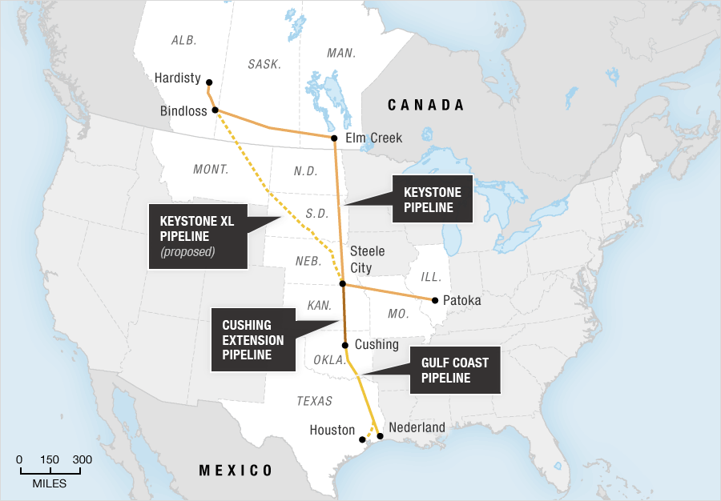

## Table of Contents

## What is the Keystone XL Pipeline?

The Keystone XL Pipeline is a big project to build a new pipeline. A pipeline is like a long tube that carries oil from one place to another. This pipeline would go from Canada to the United States. The oil would come from the tar sands in Alberta, Canada, and it would go to refineries in the Gulf Coast of the United States.

The project has been talked about a lot because it could help the economy by creating jobs and moving oil more easily. But it also has problems. Some people worry that it could harm the environment, like hurting animals and plants, and causing pollution. Because of these worries, the project has been delayed many times and is still being discussed.

## Who proposed the Keystone XL Pipeline?

The Keystone XL Pipeline was proposed by a company called TransCanada. They wanted to build a new pipeline to carry oil from Canada to the United States. The idea was to move oil from the tar sands in Alberta, Canada, to refineries on the Gulf Coast of the United States.

The proposal came about because TransCanada thought it would be a good way to get oil to where it was needed. They believed it would help the economy by creating jobs and making it easier to move oil. But the project has faced a lot of challenges and debates because of concerns about its impact on the environment.

## What is the purpose of the Keystone XL Pipeline?

The Keystone XL Pipeline is meant to move oil from Canada to the United States. The oil comes from the tar sands in Alberta, Canada, and it would go to refineries on the Gulf Coast of the United States. The main goal is to make it easier to get oil to where it is needed.

The project was proposed by a company called TransCanada. They thought it would help the economy by creating jobs and moving oil more efficiently. But some people are worried that the pipeline could harm the environment. They think it might hurt animals and plants and cause pollution. Because of these concerns, the project has been delayed many times and is still being discussed.

## What are the main routes of the Keystone XL Pipeline?

The Keystone XL Pipeline would start in Alberta, Canada. It would go through the tar sands area where the oil comes from. From there, it would head southeast, crossing into the United States at the border between Montana and Saskatchewan. The pipeline would then travel through Montana, South Dakota, and Nebraska.

In Nebraska, the pipeline would connect with the existing Keystone Pipeline system. This connection would help move the oil further south to refineries on the Gulf Coast of the United States. The route was planned to avoid sensitive areas like the Sandhills region in Nebraska, but there have been many discussions and changes to the route because of environmental concerns.

## What types of oil will the Keystone XL Pipeline transport?

The Keystone XL Pipeline will transport a type of oil called diluted bitumen, or dilbit. This oil comes from the tar sands in Alberta, Canada. Dilbit is a heavy type of oil that needs to be mixed with lighter liquids to flow through a pipeline.

The pipeline is designed to move this oil from Canada to the United States. It will go to refineries on the Gulf Coast where the oil can be turned into things like gasoline and diesel. The type of oil being transported has been a topic of concern because it is thicker and harder to clean up if there is a spill.

## What are the environmental concerns associated with the Keystone XL Pipeline?

One big worry about the Keystone XL Pipeline is that it might leak oil. If there is a spill, the oil could harm the land, water, and animals. The oil the pipeline will [carry](/wiki/carry-trading), called dilbit, is thicker and harder to clean up than other types of oil. This means a spill could cause a lot of damage and take a long time to fix. People are also worried about the pipeline going through sensitive areas like the Sandhills in Nebraska, which could be harmed by a spill.

Another concern is that the pipeline will increase the use of oil from the tar sands. This oil is very dirty to produce and can create a lot of pollution. More pollution can make climate change worse, which is a big problem for the whole world. Some people think that instead of building new pipelines, we should be using cleaner energy like wind and solar power to help the environment. These concerns have made many people and groups speak out against the pipeline.

## What is the economic impact expected from the Keystone XL Pipeline?

The Keystone XL Pipeline is expected to help the economy by creating jobs. Building the pipeline would need workers to do things like welding, digging, and putting the pipeline together. This could give people jobs and help them earn money. Once the pipeline is finished, it would also create jobs to keep it running and safe. The pipeline could also help the economy by making it easier to move oil from Canada to the United States. This could make the price of oil more stable and help businesses that use oil.

But there are also worries about the economic impact. Some people think that the jobs created by the pipeline might not last long because building it would only take a few years. After that, fewer jobs would be needed to keep it running. There are also concerns about the cost of cleaning up if there is an oil spill. A big spill could be very expensive and might hurt the economy in the areas where it happens. So, while the pipeline could bring some economic benefits, there are also risks that need to be thought about.

## What are the key arguments in favor of the Keystone XL Pipeline?

People who support the Keystone XL Pipeline say it will help the economy. They think it will create jobs for people who build it and keep it running. This could help workers earn money and support their families. The pipeline would also make it easier to move oil from Canada to the United States. This could help keep the price of oil steady, which is good for businesses that use oil. Supporters believe that the pipeline will bring more money and jobs to the areas it goes through.

Another argument in favor of the pipeline is that it would help the United States get more oil from a friendly country like Canada. This could make the country less dependent on oil from other places that might not be as reliable. Supporters also say that the pipeline would be safe because it would be built with modern technology and safety rules. They think that the benefits of the pipeline, like more jobs and a stable oil supply, are worth the risks.

## What are the key arguments against the Keystone XL Pipeline?

People who are against the Keystone XL Pipeline worry about the harm it could do to the environment. They think that if the pipeline leaks, it could spill oil and damage the land, water, and wildlife. The oil the pipeline would carry, called dilbit, is thick and hard to clean up, making spills even worse. There's also concern about the pipeline going through sensitive areas like the Sandhills in Nebraska, which could be hurt by a spill. Critics say that using more oil from the tar sands would make pollution worse and add to climate change, which is a big problem for the whole world.

Another big worry is about the economic impact. Some people think that the jobs created by building the pipeline won't last long because the construction will only take a few years. After that, fewer jobs would be needed to keep the pipeline running. There's also the cost of cleaning up if there's an oil spill, which could be very expensive and hurt the economy in the areas where it happens. Critics believe that instead of building new pipelines, we should be focusing on cleaner energy like wind and solar power, which would be better for the environment and create more sustainable jobs.

## What has been the history of regulatory and political challenges faced by the Keystone XL Pipeline?

The Keystone XL Pipeline has faced many regulatory and political challenges since it was first proposed. The project needed approval from both the Canadian and U.S. governments. In the United States, the pipeline needed a permit from the State Department because it crosses an international border. The process took a long time because many people and groups spoke out against the pipeline, worried about its impact on the environment. Presidents Barack Obama and Donald Trump both had to deal with the project. Obama rejected the pipeline in 2015, saying it did not serve the U.S. national interest. But Trump reversed that decision in 2017, approving the pipeline and saying it would help the economy.

Even after Trump's approval, the Keystone XL Pipeline faced more challenges. In 2018, a federal judge in Montana blocked the project, saying the environmental review was not done properly. The project was delayed again in 2020 when another judge ruled that the U.S. Army Corps of Engineers had not followed the law in giving permits for the pipeline to cross waterways. When Joe Biden became president in 2021, he canceled the permit for the pipeline on his first day in office, saying it did not fit with his plan to fight climate change. Since then, the company behind the pipeline, TC Energy, has kept trying to move forward with the project, but it still faces a lot of legal and political hurdles.

## How does the Keystone XL Pipeline fit into the broader context of North American energy policy?

The Keystone XL Pipeline is a big part of North American energy policy because it would help move oil from Canada to the United States. The pipeline would take oil from the tar sands in Alberta, Canada, and bring it to refineries on the Gulf Coast of the United States. This could make it easier for the U.S. to get oil from a friendly country like Canada, instead of relying on oil from other places. Supporters of the pipeline think it would help the economy by creating jobs and making the price of oil more stable. They believe it fits into the goal of having a reliable and secure energy supply in North America.

But the Keystone XL Pipeline also shows the big debates about energy policy in North America. Many people are worried about the harm the pipeline could do to the environment. They think that using more oil from the tar sands would make pollution worse and add to climate change. Critics say that instead of building new pipelines, North America should focus on using cleaner energy like wind and solar power. The pipeline's long history of regulatory and political challenges shows how hard it is to balance the need for energy with the need to protect the environment. These debates are a big part of the broader discussion about what kind of energy future North America should have.

## What is the current status of the Keystone XL Pipeline project?

The Keystone XL Pipeline project is currently not moving forward. President Joe Biden canceled the permit for the pipeline on his first day in office in 2021. He said that the pipeline did not fit with his plan to fight climate change. Since then, the company behind the pipeline, TC Energy, has been trying to find a way to keep the project going. But they have faced many legal and political challenges.

The project has been delayed many times over the years. It needed approval from both the Canadian and U.S. governments. In the United States, the pipeline needed a special permit because it crosses an international border. Many people and groups spoke out against the pipeline, worried about its impact on the environment. Even when President Donald Trump approved the pipeline in 2017, it still faced problems. Courts blocked the project a few times, saying the environmental reviews were not done properly. So, the Keystone XL Pipeline remains a big topic of debate and is not being built right now.

## References & Further Reading

[1]: ["The Pipeline and the Paradigm: Keystone XL, Tar Sands, and the Battle to Defuse the Carbon Bomb"](https://www.amazon.com/Pipeline-Paradigm-Keystone-Battle-Defuse/dp/0985574828) by Samuel Avery

[2]: ["Keystone XL Pipeline Project: Key Facts"](https://www.keystonexl.com/siteassets/pdfs/fact-sheets/keystone-xl-project-overview.pdf) by TC Energy

[3]: ["Algorithmic Trading and DMA: An Introduction to Direct Access Trading Strategies"](https://www.amazon.com/Algorithmic-Trading-DMA-introduction-strategies/dp/0956399207) by Barry Johnson 

[4]: ["Keystone XL: U.S. State Department's Final Environmental Impact Statement Released"](https://2012-keystonepipeline-xl.state.gov/documents/organization/221135.pdf) by Natural Resources Defense Council

[5]: ["Trade-Offs Between Greenhouse Gas Reductions and Economic Impacts: The Case of a Carbon Tax"](https://iac.gatech.edu/news/item/602187/new-research-highlights-trade-emissions-reductions-economic-growth) by Lawrence Goulder and Marc A.C. Hafstead

[6]: ["Environmental and Economic Effects of Pipeline and Rail Transportation of Crude Oil"](https://scholars.org/contribution/comparing-accident-and-environmental-costs-shipping-crude-oil-railroad-versus) by James L. Medlock III et al. 