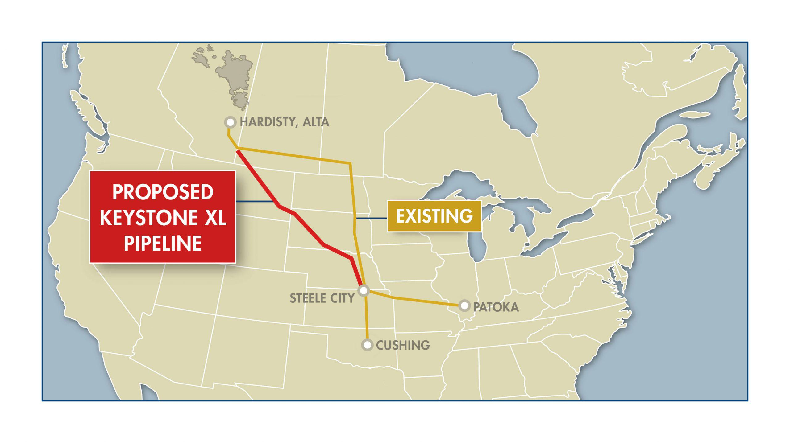

The Keystone XL Pipeline has been a critical focal point in discussions surrounding energy infrastructure and environmental policy. It stands at the intersection of economic interests and ecological preservation, highlighting the challenges of balancing these often opposing priorities. Initially proposed by TransCanada Corp, now known as TC Energy, the project was designed to enhance crude oil transport from Alberta, Canada, to refineries in the United States. This initiative aimed to address energy security by potentially decreasing reliance on oil imports from more geopolitically unstable regions.

However, the pipeline has been fraught with environmental and political challenges, raising concerns about the ecological toll of fossil fuel reliance. Debates have delved into its implications for greenhouse gas emissions, the risk of oil spills, and broader climate change impacts, prompting a reevaluation of energy strategies. These controversies have influenced significant political decisions, including varying permit approvals and revocations under different U.S. administrations.



As the energy sector evolves, technological advancements such as algorithmic trading become increasingly relevant. These innovations provide sophisticated tools for navigating the intricacies of energy markets, offering efficiencies and predictive insights that shape trading strategies. Algorithmic trading can swiftly analyze massive datasets, highlighting trends and opportunities, thus playing a crucial role in an industry sensitive to infrastructural developments like the Keystone XL Pipeline.

Understanding the historical context, security implications, and technological integration is essential in deciphering the pipeline's role in shaping the future of energy infrastructure. The confluence of these elements underscores the complex dynamics at play in the ongoing energy transition, balancing immediate economic benefits with long-term sustainability goals.

## Table of Contents

## Keystone XL Pipeline: Background and Controversies

The Keystone XL Pipeline, a project initiated by TransCanada Corp (now TC Energy), was designed to transport crude oil from the rich reserves of Alberta, Canada, to various refineries located in the United States. This infrastructure proposal was part of a larger vision to connect the two countries' energy markets more tightly and secure energy supply chains. Envisioned as an extension of the existing Keystone Pipeline system, Keystone XL was set to address increasing demands for reliable energy and reduce dependency on oil imports from more volatile regions.

Despite its purported economic benefits, the project became a focal point of environmental and political contention. Proponents highlighted job creation, energy security, and economic growth as key advantages. The pipeline was projected to create approximately 42,000 jobs and generate significant tax revenue during its construction phase alone. However, opponents voiced concerns over the environmental impacts, which included the risk of oil spills and the pipeline's contribution to carbon emissions. This resistance was fueled by fears that the pipeline might traverse sensitive ecosystems and endanger water sources.

Political decisions have played an integral role in the project's trajectory, with permit approvals and revocations acting as pivotal turning points. Under President George W. Bush's administration, the application process for the Keystone Pipeline began, but it was during President Barack Obama's tenure that the project first faced significant hurdles. In 2015, the Obama administration rejected the pipeline's permit, citing concerns over its environmental impact and contribution to climate change.

This decision was reversed when President Donald Trump took office in 2017, as his administration issued a presidential permit to proceed with the construction, emphasizing energy independence and economic growth. Nevertheless, the project's legal and regulatory battles continued, with numerous court challenges and opposition from environmental groups and Native American tribes.

The saga reached another significant moment when President Joe Biden, fulfilling a campaign promise, revoked the pipeline's permit on his first day in office, January 20, 2021. This action halted the construction, effectively marking a shift toward prioritizing climate policies and renewable energy investment in the U.S.

The Keystone XL Pipeline's history illustrates a complex interplay between economic objectives and environmental responsibility, reflecting broader societal debates about sustainable development and climate action. These controversies spotlight the challenges of balancing infrastructure development with ecological preservation and the priorities of different governmental administrations.

## The Role of Keystone XL in Energy Infrastructure

The Keystone XL Pipeline was envisioned as a strategic component of energy infrastructure aimed at ensuring a reliable supply of [crude oil](/wiki/crude-oil) from Canada to the United States. It proposed to transport around 830,000 barrels of crude oil per day from Alberta's oil sands to refineries in Nebraska, with connections to the existing Keystone Pipeline System extending to the Gulf Coast of Texas. This connection was expected to enhance North American energy security by reducing the United States' reliance on imports from politically volatile regions.

From an energy infrastructure perspective, the pipeline was strategically significant. It was intended to strengthen the energy relationship between Canada and the U.S., two countries that already shared a robust trade partnership. By facilitating direct access to Canadian crude oil, the Keystone XL Pipeline could have mitigated dependency on oil from the Middle East or other unstable regions, where geopolitical tensions often lead to supply disruptions. The optimization of this supply chain was seen as a means to stabilize prices and ensure a more controllable supply of oil.

However, the cancellation of the Keystone XL Pipeline marked a significant shift in energy policies, influenced largely by growing environmental concerns and the global push towards renewable energy sources. The exploration and transportation of oil sands crude, which the pipeline intended to increase, have been criticized for their environmental impact, particularly their contribution to greenhouse gas emissions. These concerns were compounded by the political and social pressures to comply with international climate agreements and move towards a more sustainable energy grid.

The decision to halt the project aligns with a transition towards investing in renewable energy endeavors, as many governments, including the U.S., set ambitious targets for carbon neutrality. Infrastructure investments are increasingly directed toward cleaner energy alternatives like wind, solar, and electric transportation networks. This transition reflects a broader recognition that long-term energy security involves diversifying sources and reducing reliance on fossil fuels.

In conclusion, while the Keystone XL Pipeline was initially seen as a crucial infrastructure project to ensure U.S. energy security, its cancellation indicates a pivot towards embracing environmental sustainability and renewable energy sources. The evolution of energy infrastructure will depend on balancing the need for reliable and secure energy supply with ecological considerations and technological innovations in renewable resources.

## Technological Innovations: Algorithmic Trading in the Energy Market

The energy sector is witnessing a transformation driven by the application of [algorithmic trading](/wiki/algorithmic-trading), a technological innovation that leverages computational systems to manage trading operations. In markets where commodities such as oil are traded, algorithmic trading systems are becoming essential due to their ability to process large volumes of data rapidly and execute transactions with high precision. These systems utilize advanced algorithms to analyze historical market data, assess current trends, and forecast future price movements, thus enabling traders to optimize strategies that can outperform traditional methods. 

Algorithmic trading in the energy market is facilitated by the use of quantitative models and techniques such as [machine learning](/wiki/machine-learning), [artificial intelligence](/wiki/ai-artificial-intelligence), and big data analytics. These tools allow traders to identify patterns and correlations that are not perceptible to the human eye, improving decision-making and reducing the time taken to capture market opportunities. For example, algorithms can be designed to recognize price fluctuations influenced by geopolitical events, changes in oil supply or demand, and developments such as those associated with significant infrastructure projects like the Keystone XL Pipeline.

The benefits of algorithmic trading in energy markets are substantial. These systems enhance [liquidity](/wiki/liquidity-risk-premium), improve the efficiency of markets by reducing transaction costs, and minimize the risks associated with human errors. Moreover, algorithmic trading facilitates risk management by allowing traders to simulate different trading scenarios and evaluate potential outcomes before executing trades. This aspect is crucial in the increasingly volatile energy sector where market conditions can change rapidly.

Furthermore, the implementation of algorithmic trading has fostered the growth of high-frequency trading ([HFT](/wiki/high-frequency-trading-strategies)), where traders execute a large number of orders at ultra-fast speeds. HFT strategies take advantage of minute discrepancies in market prices and rely on the latency [arbitrage](/wiki/arbitrage) between different trading platforms. The capability to process and react to data within microseconds provides a competitive edge in the market, allowing firms to capitalize on short-lived opportunities that arise from events impacting the energy sector, such as policy changes, natural disasters, or infrastructure developments.

Despite these advantages, algorithmic trading also poses challenges and potential risks. The complexity of algorithms can lead to unforeseen errors or market distortions if not properly managed. There is a growing need for robust regulatory frameworks to ensure market stability and prevent manipulative practices. Moreover, the reliance on algorithmic systems raises concerns about the cyber security of trading platforms and the transparency of trading activities.

In summary, algorithmic trading stands as a pivotal advancement in the energy market, offering significant efficiency and strategic benefits. As the energy landscape continues to evolve, influenced by factors like the transition to renewable resources and infrastructure developments, the integration of advanced trading technologies will remain a crucial element in shaping trading strategies and market dynamics.

## Environmental and Economic Impacts

The Keystone XL Pipeline's construction and operation became a focal point for environmental and economic debates, with both sides presenting compelling arguments. Environmental concerns primarily centered on the pipeline's potential to exacerbate greenhouse gas emissions and the risk of oil spills. The extraction and transport of crude oil involve processes that significantly contribute to carbon emissions, impacting climate change efforts. According to estimates, the pipeline could increase carbon emissions by over 22 million metric tons annually, equivalent to adding approximately 4.6 million cars to the roads each year (NRDC, 2015).

Additionally, the risk of oil spills posed significant environmental threats. The pipeline was expected to traverse ecologically sensitive areas, including the Ogallala Aquifer, which supplies water to approximately 2 million people in the United States. A spill could have devastating effects on both local ecosystems and water quality, raising alarm among environmentalists and local communities (EPA, 2011).

On the economic front, the Keystone XL Pipeline was projected to generate considerable tax revenues and create jobs, contributing to regional and national economic growth. TransCanada projected the pipeline would generate $55.6 million in property taxes in its inaugural year and necessitate tens of thousands of construction jobs, providing an economic boon to affected areas (TransCanada, 2013).

The economic arguments were compelling, particularly for communities in need of economic revitalization. However, these benefits had to be weighed against potential environmental damage. The debate highlighted the broader economic principle of "externalities," where the economic activities impact third parties without these effects being reflected in market transactions. The dispute essentially revolved around balancing the benefits of increased economic activity against the negative environmental externalities.

To assess these impacts, stakeholders applied cost-benefit analyses, considering both quantifiable and non-quantifiable metrics. Economic models often incorporate direct costs, such as construction and operation, and benefits such as taxes and employment. In contrast, environmental impacts often require qualitative assessments and long-term forecasting, presenting challenges in achieving universally accepted outcomes.

The contentious discussions around the Keystone XL Pipeline illuminate the complex interplay between economic objectives and environmental stewardship. The ultimate resolution involved a significant evaluation of priorities, aligning future energy and infrastructure projects towards a sustainable balance of economic development and environmental responsibility.

## Future Prospects and Alternatives

With the revocation of the Keystone XL Pipeline's permit, focus has increasingly turned to renewable energy investments and alternative transportation methods such as railways. This shift not only acknowledges environmental concerns but also aligns with global trends towards sustainable energy solutions.

TC Energy, the company behind the Keystone XL project, and other stakeholders are actively pursuing diversification strategies to adapt to the new energy landscape. This includes investing in and developing renewable energy projects like wind, solar, and hydroelectric power. Such transitions are not merely reactive adjustments but strategic moves to ensure long-term competitiveness and compliance with evolving environmental standards.

Railways present a viable alternative for crude oil transportation as they offer flexibility and reduced initial infrastructure costs compared to pipelines. While rail transport can result in higher ongoing operational expenses and presents certain safety risks, advancements in rail technology and logistics optimization are being explored to mitigate these drawbacks. The emphasis on this mode of transportation also opens up avenues for research into more efficient and environmentally friendly rail systems.

Parallel to the exploration of alternatives, the importance of developing sustainable and technologically advanced energy solutions cannot be understated. Integrating artificial intelligence and machine learning in energy management systems is currently at the forefront of such technological advancements. For instance, algorithms can optimize energy consumption patterns, predict renewable energy generation based on weather patterns, and manage smart grid resources effectively. 

A potential Python implementation for predicting solar energy generation using machine learning could involve training a regression model on historical weather and solar output data. Here's a simplified example using Python's `scikit-learn` library:

```python
import numpy as np
from sklearn.model_selection import train_test_split
from sklearn.ensemble import RandomForestRegressor
from sklearn.metrics import mean_squared_error

# Example data (assume these are pre-processed and cleaned)
# Features: [temperature, humidity, wind_speed, cloud_cover]
# Target: solar_energy_output (in kWh)
X = np.array([[21, 65, 5, 20], [25, 60, 3, 15], [30, 55, 7, 10], ...])
y = np.array([500, 550, 600, ...])

# Split data into training and test sets
X_train, X_test, y_train, y_test = train_test_split(X, y, test_size=0.2, random_state=42)

# Initialize and train the model
model = RandomForestRegressor(n_estimators=100, random_state=42)
model.fit(X_train, y_train)

# Predict and evaluate the model
predictions = model.predict(X_test)
mse = mean_squared_error(y_test, predictions)

print(f"Mean Squared Error: {mse}")
```

In conclusion, as the energy sector pivots from projects like Keystone XL, the realignment towards renewable resources and advanced technological solutions will be critical. These initiatives offer a pathway to meeting future energy demands sustainably while simultaneously responding to socio-political and environmental challenges.

## Conclusion

The Keystone XL Pipeline exemplifies the complex interplay between economic growth and environmental conservation, reflecting a critical point of contention in today's energy discourse. Its development and subsequent cancellation highlight the ongoing challenge of maintaining energy security while prioritizing environmental sustainability. The pipeline's proposed capacity to deliver substantial quantities of crude oil to U.S. refineries was seen as a step toward reinforcing North American energy independence. However, the environmental risks associated with its operation prompted a reassessment of national investment priorities, nudging policy focus towards renewable energy sources.

As algorithmic trading increasingly shapes energy markets, stakeholders face new challenges and opportunities. These automated trading systems, capable of processing large volumes of data to predict market movements, introduce greater efficiency and responsiveness to market [volatility](/wiki/volatility-trading-strategies). The evolution of such technologies demands that stakeholders continuously adapt to changes in market dynamics and regulatory landscapes to remain competitive and informed.

Overall, the Keystone XL Pipeline underscores a critical need for balance in energy initiatives. Achieving sustainable practices while ensuring energy security requires an integrated approach that accommodates technological advancements and anticipates regulatory shifts. In this evolving scenario, agility and foresight will be essential for stakeholders navigating the future of energy infrastructure and trading strategies.

## References & Further Reading

[1]: ["The Pipeline and the Paradigm: Keystone XL, Tar Sands, and the Battle to Defuse the Carbon Bomb"](https://www.amazon.com/Pipeline-Paradigm-Keystone-Battle-Defuse/dp/0985574828) by Samuel Avery

[2]: ["Keystone XL Pipeline Project: Key Facts"](https://www.keystonexl.com/siteassets/pdfs/fact-sheets/keystone-xl-project-overview.pdf) by TC Energy

[3]: ["Algorithmic Trading and DMA: An Introduction to Direct Access Trading Strategies"](https://www.amazon.com/Algorithmic-Trading-DMA-introduction-strategies/dp/0956399207) by Barry Johnson 

[4]: ["Keystone XL: U.S. State Department's Final Environmental Impact Statement Released"](https://2012-keystonepipeline-xl.state.gov/documents/organization/221135.pdf) by Natural Resources Defense Council

[5]: ["Trade-Offs Between Greenhouse Gas Reductions and Economic Impacts: The Case of a Carbon Tax"](https://iac.gatech.edu/news/item/602187/new-research-highlights-trade-emissions-reductions-economic-growth) by Lawrence Goulder and Marc A.C. Hafstead

[6]: ["Environmental and Economic Effects of Pipeline and Rail Transportation of Crude Oil"](https://scholars.org/contribution/comparing-accident-and-environmental-costs-shipping-crude-oil-railroad-versus) by James L. Medlock III et al. 