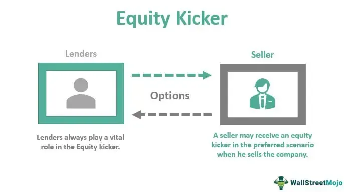

In the ever-evolving financial markets, understanding technical patterns can significantly enhance investment strategies. Technical analysis, which involves evaluating securities through historical market data such as price and volume, serves as a crucial tool for traders and investors aiming to forecast future market movements. Among various technical patterns, the Kicker Pattern has gained attention for its ability to predict potential market reversals. This pattern is particularly valued for its simplicity and effectiveness in indicating sudden shifts in market sentiment, often resulting from unexpected news or events.

The Kicker Pattern's emergence as a reliable predictor of reversals is attributed to its structure—a formation that reflects a dramatic change in the psychology of market participants. Typically appearing in candlestick charts, the pattern is defined by two bars that highlight this sentiment change, indicating who currently holds sway over the market: the buyers or the sellers.



This article explores the concept of the Kicker Pattern and its application in algo trading and investment strategies. Algorithmic trading, which utilizes sophisticated computer algorithms to execute trades at far greater speeds and frequencies than possible through manual methods, is increasingly incorporating these patterns. By leveraging such technical indicators, these algorithms are optimized for improved precision and responsiveness, effectively adapting to the dynamic nature of financial markets.

We will also discuss how technological advancements, particularly algorithmic trading, leverage these patterns for optimizing financial gains. With growing computational power and the advent of machine learning techniques, the incorporation of patterns like the Kicker Pattern is set to redefine trading strategies, offering unprecedented levels of insight and execution capability to investors and traders worldwide.

## Table of Contents

## What is a Kicker Pattern?

A Kicker Pattern is a prominent two-bar candlestick formation employed in technical analysis to signal a sharp reversal in an asset's price trend. This pattern emerges when there is a sudden and substantial shift in investor sentiment, often triggered by significant news or unexpected events affecting the market landscape. 

The defining characteristic of a Kicker Pattern is its distinct change in the direction of an asset's price, which offers traders insights into whether buyers or sellers are dominating the market. Typically, it involves an initial candlestick that closes in the direction of the prevailing trend, followed by another candlestick that opens above (in a bullish kicker) or below (in a bearish kicker) the previous close, while moving in the opposite direction. This shift can appear suddenly, with no overlap or gap closure between the two bars, underscoring the forcefulness of the sentiment change.

The Kicker Pattern's reliability stems from its ability to capture moments where market participants react strongly and decisively, often without the hesitation or gradual reversal seen in other formations. As such, traders utilize this pattern to anticipate potential shifts in market control, enabling them to make informed decisions about their positioning and risk management strategies. By understanding and identifying Kicker Patterns, traders can enhance their ability to predict market reversals and optimize their trading outcomes.

## Understanding Various Kicker Patterns

Kicker Patterns are a significant component in technical analysis, primarily utilized to identify potential reversals in asset price trends. These patterns are divided into two main types: bullish and bearish. Each of these patterns provides insights into market sentiment changes, aiding traders in making informed decisions.

A bullish Kicker Pattern commences with a bearish candlestick, illustrating a downturn in the asset price. This initial candle is followed by a noticeable upward gap where the next candlestick opens significantly higher than the previous close. This gap often signifies that the market sentiment has rapidly shifted from bearish to bullish, possibly driven by positive news or an unexpected event. The sudden increase in buying interest suggests that traders anticipate further price increases, prompting a potential reversal from the prior downtrend.

Conversely, a bearish Kicker Pattern starts with a bullish candlestick, indicating an upward movement in asset price. It is succeeded by a downward gap where the subsequent candlestick opens considerably lower than the earlier close. This transition often marks a swift shift in sentiment from bullish to bearish, which might be due to negative news or developments that reverse traders' expectations. The pattern reflects increasing selling pressure and a possible downward movement, implying a reversal from the previous uptrend.

These patterns hold substantial value for traders as indicators of potential market reversals. Identifying such patterns can enhance strategic planning by signaling when to enter or [exit](/wiki/exit-strategy) positions. However, traders often use additional analytical tools and indicators to confirm the validity of Kicker Patterns, aiming to mitigate the risk of false signals and augment trading accuracy.

## Algorithmic Trading and Kicker Patterns

Algorithmic trading harnesses the capabilities of mathematical models and sophisticated computing systems to execute trades at speeds and frequencies beyond human capabilities. These algorithms are designed to process vast amounts of market data, identify trading opportunities, and execute buy or sell orders in fractions of a second, thereby enhancing efficiency and potentially increasing profitability.

One significant advantage of [algorithmic trading](/wiki/algorithmic-trading) is its ability to incorporate complex technical patterns, such as the Kicker Pattern, into trading strategies. The Kicker Pattern, known for signaling abrupt reversals in the price trend of an asset, can be effectively utilized by algorithms to predict and respond to these market shifts swiftly.

By employing advanced pattern recognition techniques, algorithms can continuously scan multiple financial markets to detect specific patterns, including the bullish or bearish Kicker Patterns. Upon identification of such patterns, algorithms can make instantaneous decisions to execute trades based on predefined criteria set by traders. This includes analyzing additional parameters such as [volume](/wiki/volume-trading-strategy), price thresholds, and time frames to confirm the validity of the pattern and minimize the risk of false signals.

A typical implementation of algorithmic trading using technical patterns might involve the following Python code snippet for pattern recognition:

```python
import pandas as pd

def detect_kicker_pattern(data, bullish=True):
    """
    Function to detect Kicker Patterns in stock data.
    :param data: DataFrame with stock data including 'Open', 'Close', 'High', 'Low'
    :param bullish: Boolean indicating whether to search for bullish (True) or bearish (False) patterns
    :return: Indices of detected patterns
    """

    if bullish:
        # Criteria for Bullish Kicker Pattern
        pattern = (data['Close'].shift(1) < data['Open'].shift(1)) &                 # Bearish candle first
                  (data['Open'] > data['Close'].shift(1)) &                          # Gap up
                  (data['Close'] > data['Open'])                                     # Bullish candle after gap
    else:
        # Criteria for Bearish Kicker Pattern
        pattern = (data['Close'].shift(1) > data['Open'].shift(1)) &                 # Bullish candle first
                  (data['Open'] < data['Close'].shift(1)) &                          # Gap down
                  (data['Close'] < data['Open'])                                     # Bearish candle after gap

    return data.index[pattern]

# Sample usage with hypothetical stock data
stock_data = pd.DataFrame({
    'Open': [100, 102, 104, 98, 96],
    'Close': [98, 101, 107, 100, 95],
    'High': [103, 105, 108, 102, 97],
    'Low': [97, 100, 103, 95, 94]
})

bullish_kicker_indices = detect_kicker_pattern(stock_data, bullish=True)
bearish_kicker_indices = detect_kicker_pattern(stock_data, bullish=False)

print("Bullish Kicker Patterns at indices:", bullish_kicker_indices.tolist())
print("Bearish Kicker Patterns at indices:", bearish_kicker_indices.tolist())
```

This automated approach to trading allows for rapid response to market dynamics, optimizing the timing of trades to exploit momentary price discrepancies. The integration of [machine learning](/wiki/machine-learning) and [artificial intelligence](/wiki/ai-artificial-intelligence) further augments the capabilities of these algorithms, providing more precise pattern recognition and error minimization. The future of algorithmic trading lies in the continued enhancement of these technologies, which promise to yield even more sophisticated and accurate trading strategies.

## Strategizing Using Kicker Patterns

Incorporating Kicker Patterns into trading strategies requires careful analysis and the use of supplementary indicators to ascertain the validity and potential impact of the pattern. One effective method is the integration of the Relative Strength Index (RSI) or moving averages. These indicators can help confirm whether the asset is in an overbought or oversold condition, providing additional insight into the Kicker Pattern's potential implications. For instance, if a bullish Kicker Pattern is identified and the RSI is below 30, this strengthens the probability of a reversal since it signals that the asset might be oversold.

Volume analysis is another vital component when analyzing Kicker Patterns. By examining the trading volume accompanying the Kicker Pattern, traders can gauge the strength of the market sentiment shift. A higher trading volume often reinforces the pattern's significance, diminishing the likelihood of false signals. This can be particularly useful in volatile markets where price movements may be exaggerated without corresponding shifts in underlying sentiment.

Moreover, the use of multiple time frames is instrumental in validating pattern signals. Analyzing a Kicker Pattern across various time frames ensures that the observed reversal is not merely a short-term anomaly but instead a potentially sustainable trend. For example, a bullish Kicker Pattern confirmed on both daily and weekly charts may suggest a more robust and enduring upward trend compared to one identified solely on an intraday chart.

Implementing these strategies requires a systematic approach. In practice, traders might employ algorithms to automate the pattern recognition and validation process. Here is a simple Python code snippet demonstrating how a Kicker Pattern might be confirmed using moving averages and RSI:

```python
import pandas as pd
import talib

# Load historical market data
data = pd.read_csv('market_data.csv')

# Calculate RSI
data['RSI'] = talib.RSI(data['Close'], timeperiod=14)

# Calculate Moving Averages
data['MA_50'] = talib.SMA(data['Close'], timeperiod=50)
data['MA_200'] = talib.SMA(data['Close'], timeperiod=200)

# Kicker Pattern detection logic placeholder
def is_kicker_pattern(row):
    # Sample logic to detect a generic Kicker Pattern
    return (row['Open_prev'] > row['Close_prev'] and row['Open'] < row['Close'])

# Apply the detection function
data['Kicker'] = data.apply(is_kicker_pattern, axis=1)

# Filter valid signals
valid_kickers = data[
    (data['Kicker']) &
    (data['RSI'] < 30) &
    (data['Close'] > data['MA_50']) &
    (data['Volume'] > data['Volume'].rolling(window=5).mean())
]
```

This code provides a framework for detecting Kicker Patterns and verifies their validity using RSI, moving averages, and volume analysis. By leveraging such techniques, traders can enhance their accuracy in predicting market reversals, thereby optimizing their trading outcomes.

## Case Study: Applying Kicker Patterns in Real Market Scenarios

Examining historical data reveals the effectiveness of Kicker Patterns in anticipating significant stock movements. A notable example can be observed in a major technology company's stock, where a bearish Kicker pattern preceded a notable downturn before its earnings report. 

To elaborate, a bearish Kicker pattern typically appears when a bullish candlestick is succeeded by a large gap down, followed by a bearish candlestick. This pattern indicates a sudden shift in market sentiment from bullish to bearish, suggesting that sellers have taken control. In the case of the tech stock in question, the formation of the bearish Kicker pattern highlighted a shift in investor sentiment due to anticipated negative earnings results. 

The occurrence of the bearish Kicker was a precursor to a decline in the stock's price when the earnings report failed to meet market expectations. This case underscores the predictive reliability of Kicker Patterns, especially when combined with market consensus on earnings projections. 

For traders, identifying such patterns can enable pre-emptive positioning ahead of significant market moves. The bearish Kicker in this instance served as an effective tool for anticipating a favorable trading opportunity, validating the strategic advantage of incorporating Kicker Patterns into technical analysis. 

This case study highlights how understanding and applying Kicker Patterns can enhance decision-making, particularly when aligned with market fundamentals and sentiment analysis.

## Challenges and Limitations

Kicker Patterns, though useful, present certain challenges and limitations, particularly in volatile markets where they may produce false signals. These patterns, which indicate a sharp reversal in asset price trends, can mislead traders when market fluctuations are rapid and unpredictable. In such environments, sudden and acute price movements may not reliably indicate a change in underlying market sentiment but rather a temporary response to market noise. 

To mitigate the risk of false signals, traders should seek confirmation through additional technical indicators or strategies before acting on a perceived Kicker Pattern. Patience is crucial, as premature trades based solely on initial pattern appearances without further substantiation—such as using oscillators like the Relative Strength Index (RSI) or identifying supportive moving averages—can lead to losses. A comprehensive approach involves corroborating signals with volume analysis to ascertain the strength of the observed price movement. For instance, a Kicker Pattern accompanied by substantial trading volumes provides more confidence in the pattern's validity compared to one with minimal volume activity.

Furthermore, a narrow reliance on candlestick patterns like Kickers without integrating a broader market analysis may lead to suboptimal trading outcomes. An understanding of macroeconomic factors, corporate announcements, and geopolitical events can greatly enhance the interpretation of candlestick patterns, situating them within a more reliable trading framework. This encompasses regularly updating the analytical models used for detecting patterns, ensuring they accommodate recent market behaviors and emerging patterns.

As the trading landscape continues to evolve with advancements in technology, traders have access to increasingly sophisticated tools for pattern recognition. However, the inherent nature of markets to sometimes behave irrationally necessitates a cautious approach. By combining technical insights with a thorough understanding of the broader financial ecosystem, traders can effectively manage the inherent limitations of Kicker Patterns.

## Conclusion: Optimizing Investment Strategies

Mastering the interpretation of Kicker Patterns in conjunction with other technical indicators can greatly enhance trading strategies. These patterns offer insights into market behavior and, when used effectively, can improve both entry and exit timing in trades. This optimization is crucial for traders aiming to maximize returns and minimize risks.

The integration of these patterns into algorithmic trading systems is particularly powerful. Algorithmic trading allows for the rapid execution of trades based on predefined criteria. By incorporating Kicker Patterns, algorithms can process vast amounts of data across multiple markets at speeds unattainable by manual trading. This speed and precision reduce the latency between pattern identification and trade execution, thus capturing favorable market movements more effectively.

The future looks even more promising with advancements in artificial intelligence (AI) and machine learning. These technologies can extract more nuanced insights from data, identifying complex patterns and correlations that are not immediately obvious. With machine learning, algorithms can evolve by learning from new data, potentially increasing the accuracy of pattern predictions over time. For example, machine learning models could be trained to recognize Kicker Patterns within dynamic market conditions, adapting their strategies as market behaviors shift.

Python, as a language, provides robust libraries such as Pandas for data manipulation and Scikit-learn for implementing machine learning models. These tools can be employed to analyze historical market data, identify Kicker Patterns, and assess their effectiveness. Here is a simple Python code snippet that outlines how one might start analyzing candlestick patterns using data:

```python
import pandas as pd
from ta.momentum import RSIIndicator
from ta.trend import EMAIndicator

# Sample data loading
data = pd.read_csv('stock_data.csv')

# Calculating indicators
data['rsi'] = RSIIndicator(data['close'], window=14).rsi()
data['ema'] = EMAIndicator(data['close'], window=20).ema_indicator()

# Basic Kicker Pattern identification logic
def identify_kicker(data):
    kickers = []
    for i in range(1, len(data)):
        if data['open'][i] > data['close'][i-1] and data['close'][i] > data['open'][i]:
            kickers.append(i)
    return kickers

kicker_signals = identify_kicker(data)

# Print identified kicker pattern days
print("Kicker pattern identified on days:", kicker_signals)
```

In conclusion, the use of Kicker Patterns in trading, enhanced by algo trading and bolstered by AI methodologies, holds substantial promise for the future of investment strategies. Traders and investors who adeptly apply these technologies may find themselves at a significant advantage, capable of making informed decisions with confidence and agility.

## References & Further Reading

[1]: Bergstra, J., Bardenet, R., Bengio, Y., & Kégl, B. (2011). ["Algorithms for Hyper-Parameter Optimization."](https://dl.acm.org/doi/10.5555/2986459.2986743) Advances in Neural Information Processing Systems 24.

[2]: ["Advances in Financial Machine Learning"](https://www.amazon.com/Advances-Financial-Machine-Learning-Marcos/dp/1119482089) by Marcos Lopez de Prado

[3]: ["Evidence-Based Technical Analysis: Applying the Scientific Method and Statistical Inference to Trading Signals"](https://www.amazon.com/Evidence-Based-Technical-Analysis-Scientific-Statistical/dp/0470008741) by David Aronson

[4]: ["Machine Learning for Algorithmic Trading"](https://github.com/stefan-jansen/machine-learning-for-trading) by Stefan Jansen

[5]: ["Quantitative Trading: How to Build Your Own Algorithmic Trading Business"](https://www.amazon.com/Quantitative-Trading-Build-Algorithmic-Business/dp/1119800064) by Ernest P. Chan