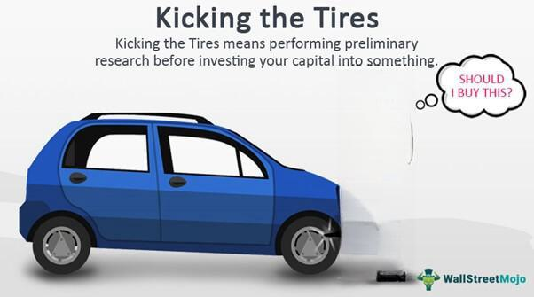

The landscape of financial markets has been continuously evolving with the advent of technology, and algorithmic trading, or algo trading, stands at the forefront of this transformation. By leveraging advanced mathematical models and computer programs, algo trading allows for the execution of trades with minimal human intervention, ultimately redefining the speed and efficiency with which trading occurs.

This article examines the pros and cons of algo trading through detailed evaluation methods, emphasizing how these systems can process vast amounts of market data in microseconds to identify and capitalize on trading opportunities. While the advantages of speed and efficiency are undeniable, they come with their own set of challenges that warrant careful consideration.

Investors and traders often 'kick the tires', performing preliminary research to verify trading algorithms. This term refers to the practice of conducting minimal due diligence before committing to an investment decision. While this approach provides a quick overview of potential benefits, it also has its demerits, especially in the context of automated trading where the complexity and nuances of algorithms require more than a superficial assessment.

In the evolving domain of financial markets, understanding both the merits and limitations of algo trading is crucial for investors looking to integrate these systems into their strategies. The balance between technological advantages and potential pitfalls will shape the future interactions between human traders and algorithmic systems.

## Table of Contents

## Understanding Algo Trading

Algo trading, short for algorithmic trading, is a method of executing orders using automated and pre-programmed trading instructions. These algorithms are based on variables such as time, price, and [volume](/wiki/volume-trading-strategy), among others. The primary objective of algo trading is to execute trades in the most efficient manner possible, minimizing the need for human intervention.

At its core, algo trading relies on the integration of sophisticated mathematical models and algorithms that allow for the analysis of market data at unprecedented speeds. This rapid data processing capability enables traders to exploit trading opportunities that may only exist for fractions of a second, a feat that far exceeds human capabilities.

The efficiency of algo trading is derived from its ability to assess and respond to market conditions within microseconds—a crucial advantage in the highly competitive financial markets. By automating the trading process, traders can execute large volumes of trades with pinpoint accuracy, thereby reducing both transaction costs and the likelihood of manual errors.

Algorithmic trading is characterized by its reliance on vast data inputs and the computational power required to process this data. Algorithms scan financial markets, considering metrics from multiple data sources to inform decision-marking. For example, they may incorporate statistical models to predict price movements based on historical data, or they might use [machine learning](/wiki/machine-learning) algorithms to adapt to changing market conditions.

Furthermore, algorithms are designed to adhere to a defined set of trading parameters, ensuring that trades are executed in a disciplined manner. This systematic approach reduces the influence of human emotion on trading decisions, which can often lead to irrational decision-making during volatile market periods.

In essence, the key advantage of algo trading lies in its ability to make data-driven decisions instantly, allowing traders to capitalize on fleeting market opportunities with speed and precision that manual trading simply cannot match. However, the complexity and sophistication required in developing these algorithms demands substantial technical expertise, and thus, while algo trading holds significant promise, it also requires careful consideration and detailed understanding of the underlying technologies and strategies used.

## Kicking the Tires: The Initial Evaluation

The term "kicking the tires" refers to an initial, surface-level evaluation conducted before a formal investment decision is made, a strategy sometimes employed by investors when examining [algorithmic trading](/wiki/algorithmic-trading) opportunities. This initial evaluation approach has both benefits and drawbacks, impacting how investors manage their potential investments in algo trading strategies.

One of the main advantages of this preliminary evaluation is time efficiency. By conducting a quick assessment, investors can swiftly filter out non-viable strategies without delving deeply into every option. This initial scan allows investors to focus their attention on strategies that exhibit promising signs based on preliminary data, such as recent performance metrics or basic [backtesting](/wiki/backtesting) results.

Furthermore, using this method allows investors to remain flexible and responsive to new opportunities. With rapid changes in financial markets and technological advancements, new trading strategies and algorithms emerge frequently. An investor who is adept at quickly evaluating and adapting to new strategies can gain a competitive edge by capitalizing on lucrative strategies earlier than others.

However, a significant downside of the "kicking the tires" approach is the risk of making decisions based on incomplete or superficial information. Relying on a minimal level of research may lead to overlooking inherent risks or potential flaws in a strategy that only become apparent through comprehensive analysis and extensive historical testing. This can expose investors to unanticipated downsides, such as algorithmic overfitting or inadequate handling of market disruptions.

Another potential disadvantage is the misalignment with long-term investment goals. Preliminary evaluations might favor strategies that show short-term profitability but lack sustainability or congruence with an investor’s long-term financial objectives. These quick assessments might miss underlying value or ethical considerations critical to developing a cohesive trading strategy.

Moreover, this method of evaluation may inadvertently contribute to decision fatigue. The constant evaluation of numerous strategies with minimal depth might overwhelm investors, particularly if they lack a structured framework for initial assessments. The risk of superficial assessments increases the likelihood of cycling through numerous strategies without achieving meaningful gains.

In conclusion, while the "kicking the tires" method can be a valuable tool for quickly identifying promising algo trading strategies, it should complement, not replace, comprehensive due diligence. Incorporating both initial evaluations and thorough analyses will enable investors to harness the speed of preliminary assessments while mitigating the risks associated with superficial decision-making. This balanced approach ensures that investors can capitalize on new opportunities while safeguarding against unforeseen challenges, ultimately leading to more informed and strategic investment decisions.

## Pros of Algo Trading

Algo trading offers a spectrum of advantages that have significantly altered traditional trading paradigms, prominently through speed and efficiency. With the advent of algorithmic trading, trades are executed in microseconds, far faster than any human trader could manage. This rapid execution is crucial in markets where conditions can change dramatically in fractions of a second and can be the difference between capitalizing on profitable opportunities or missing them entirely.

Another critical advantage of algo trading is its ability to eliminate emotion-driven decisions. Human traders are often influenced by fear, greed, and other emotions that can lead to irrational trading behaviors. Algorithms, on the other hand, execute trades based solely on pre-determined criteria, thereby enforcing discipline and consistency in trading strategies.

Alongside speed and discipline, algo trading also excels in backtesting and optimization. Traders have the capability to rigorously test their strategies against historical data before deploying them live. This process allows for fine-tuning of trading parameters and helps in identifying potential flaws or inefficiencies. Through backtesting, strategies can be iteratively improved, ensuring they perform well under a variety of market conditions.

Moreover, algo trading facilitates diversification and risk management by allowing simultaneous trading across multiple asset classes and markets. By distributing risk over different instruments and geographies, algorithms can help minimize exposure to localized market shocks. Diversification reduces the impact of adverse movements in any single market, thus enhancing the overall stability of the trading portfolio.

A significant edge of algo trading is its ability to operate continuously, monitoring global markets 24/7. Unlike human traders who require rest, algorithmic systems can endlessly scan for trading opportunities, irrespective of time zones. This ensures that lucrative possibilities are not missed, and trading strategies can be executed effectively even when the trader is not actively monitoring the market.

These factors combine to make algo trading a powerful tool for modern traders and investors, providing a distinct edge in the highly competitive financial markets.

## Cons of Algo Trading

Algorithmic trading, despite its numerous advantages, presents several challenges that need to be addressed by traders and investors. Here are some notable cons:

### Technical Complexity
Developing and maintaining effective trading algorithms demands a high level of technical expertise. These systems often rely on complex programmatic code and advanced mathematical models, which require knowledge in fields such as computer science, finance, and [statistics](/wiki/bayesian-statistics). Navigating various programming languages, such as Python or C++, along with tools and platforms designed for financial data analysis, proves to be a significant barrier for many. The need for constant updates and optimization also means that traders need to stay abreast of technological advancements and market conditions, posing ongoing challenges in algorithm management.

### Over-Optimization and Data Mining Bias
One of the critical pitfalls in algorithmic trading is the risk of over-optimization. This involves tailoring algorithms too closely to past market data, inadvertently creating systems that perform well historically but fail to adapt to future markets. This phenomenon, commonly referred to as "curve-fitting," leads to data mining bias. This bias arises when models are overly refined to capture historical noise rather than predictive features, rendering them less effective in live scenarios. Hence, balancing optimization with robustness testing is crucial to avoiding systematic performance issues.

### Market Risk and Glitches
Algorithmic systems, despite their sophistication, are not immune to market risks and technical glitches. Sudden market shifts or anomalies can have significant impacts, especially if algorithms trigger trades based on unforeseen conditions. Additionally, technical failures such as connectivity issues, server downtimes, or bugs in the code can lead to erroneous trading or financial losses. For example, the Flash Crash of May 6, 2010, highlighted how unchecked automated trading could exacerbate market [volatility](/wiki/volatility-trading-strategies). Thus, rigorous testing and contingency planning are essential components in minimizing these risks.

### Lack of Human Judgment
One inherent limitation of algorithmic trading is the absence of human intuition and qualitative judgment. While algorithms excel in processing quantitative data, they struggle with qualitative factors that might influence market conditions, such as geopolitical events, regulatory changes, or shifts in public sentiment. Human traders, possessing the ability to interpret complex scenarios and adapt strategies accordingly, can provide insights that purely algorithmic systems might miss. Consequently, incorporating human oversight in the trading process remains vital to account for nuanced market elements.

### High Initial Costs
The implementation of algorithmic trading systems involves substantial upfront investment. Costs include infrastructure setup, such as acquiring high-speed data feeds, computational resources, and trading platforms. Additionally, hiring skilled personnel to develop, test, and maintain these systems incurs further expenses. For many traders, especially small-scale or independent investors, these entry barriers can be prohibitive. Nevertheless, the potential long-term benefits, in terms of efficiency and profitability, often justify these initial expenditures, provided that systems are correctly managed and optimized.

Overall, while algorithmic trading offers substantial advantages, these cons should be thoroughly considered by those looking to integrate such systems into their trading strategies. Addressing these challenges strategically can significantly enhance the efficacy and reliability of algorithmic trading practices.

## Conclusion

Algorithmic trading, often referred to as algo trading, fundamentally reshapes the dynamics of financial markets by integrating technology and automation. Its primary allure lies in the unparalleled speed and efficiency it offers, enabling traders to execute large volumes of trades swiftly and systematically. However, while algo trading delivers on these fronts, it presents a spectrum of challenges that must be acknowledged and navigated prudently.

One of the foremost advantages of algo trading is the elimination of emotion-driven decisions. By adhering to pre-set algorithms, traders can avoid the pitfalls of human psychology that often lead to irrational market behavior. The capacity for backtesting prior to live deployment is another significant benefit, allowing strategies to be refined using historical data to enhance predictiveness and performance. Furthermore, the ability to manage risk through simultaneous transactions across various markets and the relentless vigilance of round-the-clock market monitoring are attributes that can greatly enhance a trader's portfolio. 

Conversely, the technical complexity associated with algo trading cannot be understated. Developing robust algorithms necessitates a high degree of expertise and familiarity with both financial markets and programming techniques. This often results in high initial costs, which can be prohibitive for smaller traders. Moreover, the reliance on historical data poses the risk of over-optimization, where strategies are overly engineered to fit past occurrences without room for unforeseen market changes, potentially undermining performance in live conditions. The absence of human judgment can further be a detriment when nuanced interpretation of qualitative data is required, an aspect where algorithms may fall short.

Given these considerations, it is essential for traders engaging with algorithmic strategies to maintain a comprehensive understanding of both the opportunities and risks involved. Embracing algo trading without full comprehension can lead to detrimental outcomes, especially in volatile market environments. Hence, ensuring a balance between automation and human oversight is paramount to maximizing the benefits while mitigating the inherent risks. By doing so, traders can craft a more resilient and adaptable approach to leveraging algo trading, embracing technology while acknowledging the indispensable value of human intuition and flexibility.

## References & Further Reading

[1]: Bergstra, J., Bardenet, R., Bengio, Y., & Kégl, B. (2011). ["Algorithms for Hyper-Parameter Optimization."](https://dl.acm.org/doi/10.5555/2986459.2986743) Advances in Neural Information Processing Systems 24.

[2]: ["Advances in Financial Machine Learning"](https://www.amazon.com/Advances-Financial-Machine-Learning-Marcos/dp/1119482089) by Marcos Lopez de Prado

[3]: ["Evidence-Based Technical Analysis: Applying the Scientific Method and Statistical Inference to Trading Signals"](https://www.amazon.com/Evidence-Based-Technical-Analysis-Scientific-Statistical/dp/0470008741) by David Aronson

[4]: ["Machine Learning for Algorithmic Trading"](https://github.com/stefan-jansen/machine-learning-for-trading) by Stefan Jansen

[5]: ["Quantitative Trading: How to Build Your Own Algorithmic Trading Business"](https://www.amazon.com/Quantitative-Trading-Build-Algorithmic-Business/dp/1119800064) by Ernest P. Chan