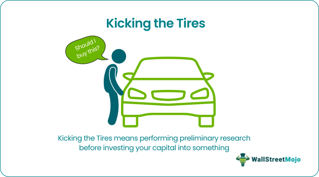

## Table of Contents

## What does 'kicking the tires' mean in a general context?

When people talk about 'kicking the tires,' they are usually talking about checking something out to see if it's good or not. This phrase comes from the idea of someone looking at a car and kicking its tires to see if they are solid. It's a way to test something before deciding to buy it or use it.

In a broader sense, 'kicking the tires' can be used in many situations. For example, a person might 'kick the tires' on a new software program by trying it out to see if it works well. Or, a company might 'kick the tires' on a new project by doing some research to see if it's a good idea. It's all about making sure something is worth the time and money before fully committing to it.

## How is 'kicking the tires' used in business and investment?

In business and investment, 'kicking the tires' means taking a close look at something before deciding to invest in it. It's like when someone wants to buy a car and they check it out carefully to make sure it's a good choice. In business, this could mean doing research on a company, looking at its financial reports, and maybe even visiting the company to see how it works. Investors want to make sure their money is going into something that will be successful.

For example, if an investor is thinking about buying shares in a new tech company, they might 'kick the tires' by talking to the company's leaders, looking at their business plan, and seeing what other experts think about the company's future. This helps them decide if the investment is worth the risk. By taking the time to 'kick the tires,' investors can feel more confident that they are making a smart choice with their money.

## Can you provide a simple example of 'kicking the tires' in a consumer setting?

When someone wants to buy a new bike, they might go to the store and 'kick the tires' before deciding. This means they will look at the bike closely, maybe even take it for a short ride around the store. They want to make sure the bike is in good shape and will work well for them.

By 'kicking the tires,' the person can feel more sure about their choice. They can check if the brakes work, if the seat is comfortable, and if the bike feels right when they ride it. This helps them decide if the bike is worth the money and if it's the right one for them.

## What are the basic steps involved in 'kicking the tires' during a product evaluation?

When you are 'kicking the tires' during a product evaluation, the first thing you do is gather information about the product. This means you look at what the product is supposed to do, read reviews from other people, and check the price. You might also look at the company that makes the product to see if they have a good reputation. This helps you understand if the product might be good for you.

Next, you want to try the product out if you can. This could mean using a free trial, going to a store to see it in person, or even borrowing it from a friend. When you try it, you pay attention to how well it works, if it's easy to use, and if it does what it says it will do. This hands-on experience is really important because it gives you a better idea of whether the product is worth buying.

After trying the product, you think about everything you've learned. You compare the good things and the bad things about the product. You also think about the price and if it's a good value for what you get. By doing all these steps, you can make a smart decision about whether to buy the product or not.

## What are the advantages of 'kicking the tires' before making a purchase or investment?

'Kicking the tires' before making a purchase or investment helps you make a better choice. When you take time to check out a product or a company, you learn more about it. This means you can see if it's really good or if it has problems. By doing this, you can avoid spending money on something that might not work well or might not be worth the cost. It's like doing your homework before a big test, so you feel ready and confident.

Another advantage is that 'kicking the tires' can save you from making a big mistake. If you rush into buying something without looking at it closely, you might end up with something that doesn't meet your needs. But if you take the time to try it out and do some research, you can find out if it's the right fit for you. This way, you can feel more sure about your decision and be happier with what you buy or invest in.

## What are the potential disadvantages of relying solely on 'kicking the tires' for decision-making?

Relying only on 'kicking the tires' can take a lot of time. If you always need to check everything yourself before deciding, it can slow you down. Sometimes, you might miss out on good opportunities because you're spending too much time looking at every little detail. It's important to find a balance between doing your homework and making a decision quickly enough to not miss out.

Another problem is that 'kicking the tires' might not give you all the information you need. Sometimes, the things you can check by yourself aren't enough to see the whole picture. For example, a product might look good when you try it, but there could be hidden problems that you can't see. Or, a company might seem strong, but there could be risks that you don't know about. It's good to use 'kicking the tires' as one part of your decision-making, but you should also look at other information and maybe ask for advice from experts.

## How can 'kicking the tires' be applied effectively in a professional due diligence process?

In a professional due diligence process, 'kicking the tires' means carefully checking out a business or investment before making a decision. This can involve looking at the company's financial records, talking to the people who run it, and visiting their offices or factories. By doing this, you can see if the business is doing well and if there are any big problems you should know about. It's like making sure a car is in good shape before you buy it, but for a business.

But 'kicking the tires' should be just one part of due diligence. You also need to look at other information like market research, legal documents, and what experts say about the industry. This helps you get a full picture of the business and its future. By combining 'kicking the tires' with other kinds of research, you can make a smarter choice about whether to invest or not.

## What advanced techniques can be used to enhance the 'kicking the tires' approach in business analysis?

To make 'kicking the tires' better in business analysis, you can use advanced techniques like data analytics. This means looking at big sets of numbers to find patterns and trends that you can't see just by looking at the business. For example, you might use software to look at the company's sales data over time to see if they are growing or shrinking. This can help you understand the business better and see things that might be hidden. It's like using a magnifying glass to see more details that you might miss with just your eyes.

Another way to improve 'kicking the tires' is by using scenario analysis. This means thinking about different things that could happen in the future and how they might affect the business. You can make different plans based on these scenarios to see how the business might do in good times or bad times. This helps you be ready for different situations and make a smarter decision about whether to invest. It's like playing chess and thinking about your next moves before you make them.

## How does 'kicking the tires' fit into a comprehensive risk assessment strategy?

'Kicking the tires' is a big part of a complete risk assessment strategy. It means taking a close look at something before deciding if it's a good choice. In business, this could mean checking a company's financial reports, talking to its leaders, and maybe even visiting their offices. By doing this, you can see if the business is doing well and if there are any big problems you should know about. This helps you understand the risks better and decide if the investment is worth it.

But 'kicking the tires' is just one piece of the puzzle. A full risk assessment strategy also includes other things like looking at market research, legal documents, and what experts say about the industry. This helps you get a complete picture of the business and its future. By combining 'kicking the tires' with other kinds of research, you can see the risks more clearly and make a smarter choice about whether to invest or not.

## Can 'kicking the tires' be misleading, and if so, how can one mitigate these risks?

Yes, 'kicking the tires' can be misleading because it might not show you everything you need to know. If you only look at what you can see or try, you might miss big problems that are hidden. For example, a company might seem strong on the outside, but it could have debts or legal issues that you can't see just by visiting or talking to people. Also, sometimes people can be tricked by good first impressions or sales talk, which can make them think a product or business is better than it really is.

To avoid these risks, you should use 'kicking the tires' as just one part of your decision-making. Make sure to also look at other information like financial reports, market research, and expert opinions. This helps you get a fuller picture of what you're looking at. It's also a good idea to take your time and not rush into a decision. Sometimes, talking to other people who know about the product or business can give you more information and help you see things you might have missed. By combining different ways of checking things out, you can make a smarter and safer choice.

## What case studies illustrate successful and unsuccessful applications of 'kicking the tires' in major business decisions?

A successful example of 'kicking the tires' in business is when Amazon decided to buy Whole Foods in 2017. Before making the big purchase, Amazon did a lot of research. They looked at Whole Foods' financial reports, visited their stores, and talked to their leaders. This helped Amazon see that Whole Foods was a good fit for their plans to grow in the grocery business. By taking the time to check everything out, Amazon made a smart choice and the acquisition has been successful.

On the other hand, an unsuccessful example is when Hewlett-Packard (HP) bought Autonomy in 2011. HP did not do enough 'kicking the tires' before buying the company. They did not look closely enough at Autonomy's financials and missed some big problems. After the purchase, HP found out that Autonomy's numbers were not right and they had to write off a huge amount of money. This shows that not doing enough checking can lead to big mistakes and losses in business.

## How can data analytics and technology be integrated into the 'kicking the tires' process to improve outcomes?

Data analytics and technology can really help make 'kicking the tires' better. You can use special software to look at big sets of numbers and find patterns that you might miss just by looking at things yourself. For example, if you're thinking about buying a business, you can use data analytics to see how their sales are doing over time. This can show you if the business is growing or if it's having problems. Technology like this helps you see the whole picture and make smarter choices.

Another way technology helps is by using tools like virtual reality or online tours. If you can't visit a place in person, you can use these tools to see it from far away. This is really useful when you're looking at a business that's in another country. You can see their offices or factories without leaving your home. By using data analytics and technology, 'kicking the tires' becomes more thorough and helps you avoid making big mistakes.

## References & Further Reading

[1]: Bergstra, J., Bardenet, R., Bengio, Y., & Kégl, B. (2011). ["Algorithms for Hyper-Parameter Optimization."](https://dl.acm.org/doi/10.5555/2986459.2986743) Advances in Neural Information Processing Systems 24.

[2]: ["Advances in Financial Machine Learning"](https://www.amazon.com/Advances-Financial-Machine-Learning-Marcos/dp/1119482089) by Marcos Lopez de Prado

[3]: ["Evidence-Based Technical Analysis: Applying the Scientific Method and Statistical Inference to Trading Signals"](https://www.amazon.com/Evidence-Based-Technical-Analysis-Scientific-Statistical/dp/0470008741) by David Aronson

[4]: ["Machine Learning for Algorithmic Trading"](https://github.com/stefan-jansen/machine-learning-for-trading) by Stefan Jansen

[5]: ["Quantitative Trading: How to Build Your Own Algorithmic Trading Business"](https://www.amazon.com/Quantitative-Trading-Build-Algorithmic-Business/dp/1119800064) by Ernest P. Chan