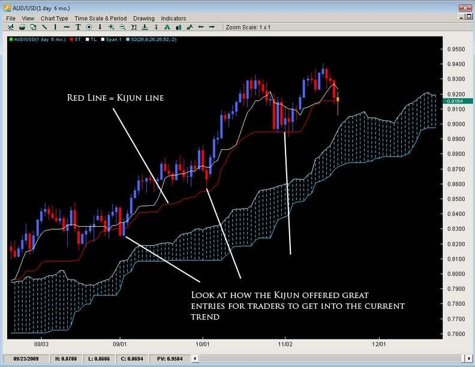

The world of trading is vast, encompassing a wide array of tools and strategies aimed at deciphering market behaviors and movements. Among these, technical analysis plays a pivotal role in assessing past market data to predict future price directions. A vital component of this analysis is the Kijun Line, which constitutes a significant part of the Ichimoku Cloud indicator. The Ichimoku Cloud, developed by journalist Goichi Hosoda, is a comprehensive system that provides traders with a rich visualization of market trends, momentum, and potential support and resistance levels. 

The Kijun Line, or Base Line, is integral to this system. This line offers a midpoint calculation based on the highest high and the lowest low over the last 26 periods, providing a dynamic view of price equilibrium. As prices interact with the Kijun Line, traders gain insights into potential momentum shifts, facilitating more informed trading decisions. This capability is particularly beneficial in algorithmic trading, where strategies can be automated and refined through computational models to enhance precision and responsiveness.



This article endeavors to explain the applications of the Kijun Line in various trading strategies, with an emphasis on its role in algorithmic trading. By comprehending the nuanced signals provided by the Kijun Line, traders can better forecast market trends, optimize entry and exit points, and ultimately enhance their trading outcomes.

## Table of Contents

## Understanding the Kijun Line

The Kijun Line, commonly referred to as the Base Line or Kijun-sen, is an integral part of the Ichimoku Cloud indicator, a comprehensive tool used in technical analysis. The Ichimoku Cloud, devised by Japanese journalist Goichi Hosoda, aims to provide a holistic view of market trends, offering insights into support, resistance, and momentum. The Kijun Line specifically focuses on the midpoint of market prices, calculated as the average of the highest high and the lowest low over the past 26 periods. This calculation can be represented by the formula:

$$
\text{Kijun Line} = \frac{\text{Highest High} + \text{Lowest Low}}{2}
$$

This line acts as a significant barometer for market momentum, particularly when price levels intersect with it. A crossing of the current price above the Kijun Line suggests a potential shift toward bullish momentum, while a crossing below may indicate bearish momentum. This functionality makes the Kijun Line a valuable indicator for identifying potential trend reversals or affirming existing trends.

Traders often use the Kijun Line alongside the Tenkan Line, also known as the Conversion Line, to enhance decision-making in trades. The Tenkan Line, calculated over a shorter period (typically 9), moves more swiftly and reacts more promptly to price movements compared to the Kijun Line. When the Tenkan Line crosses above the Kijun Line, it generates a bullish signal, suggesting it may be an opportune moment to consider buying. Conversely, a Tenkan Line crossing below the Kijun Line signals bearish sentiments, indicating a possible selling opportunity.

The combination of these lines offers traders a dynamic perspective on market conditions, bolstering their ability to interpret [momentum](/wiki/momentum) and price trends. By understanding how the Kijun Line interacts with other components of the Ichimoku Cloud, traders can better anticipate shifts in market dynamics and refine their trading strategies accordingly.

## Kijun Line Formula and Calculation

The Kijun Line, commonly referred to as the Base Line or Kijun-sen within the Ichimoku Cloud indicator, utilizes a straightforward yet effective formula to analyze market trends. The formula for calculating the Kijun Line over a specified period, typically 26 periods, is given by:

$$
\text{Kijun Line} = \frac{\text{Highest High} + \text{Lowest Low}}{2}
$$

This formula calculates the midpoint between the highest high and the lowest low over the selected timeframe, facilitating the identification of potential market movements. The moving midpoint derived from this calculation serves as a filter, reducing market noise and presenting a clearer view of market trends.

Updating the Kijun Line as new trading periods conclude is critical. This ensures that the resultant trend signals remain relevant and accurate, reflecting the latest market dynamics. By recalculating at the end of each period, traders maintain their ability to discern trends effectively. 

For those interested in [algorithmic trading](/wiki/algorithmic-trading), here is a sample Python code snippet to calculate the Kijun Line using historical price data:

```python
def calculate_kijun_line(highs, lows, period=26):
    """
    Calculate the Kijun Line for the given high and low prices over a specified period.

    :param highs: List of high prices for each period
    :param lows: List of low prices for each period
    :param period: Number of periods to consider (default is 26)
    :return: List containing the Kijun Line values
    """
    kijun_line = []
    for i in range(period-1, len(highs)):
        high_period = max(highs[i-period+1:i+1])
        low_period = min(lows[i-period+1:i+1])
        kijun_line.append((high_period + low_period) / 2)
    return kijun_line

# Example usage with hypothetical data
highs = [130, 132, 135, 133, 136, 134, ...]
lows = [125, 126, 123, 121, 124, 122, ...]
kijun_values = calculate_kijun_line(highs, lows)
```

This code exemplifies how traders can leverage Python to automate the calculation of the Kijun Line, enabling more efficient and prompt decision-making in dynamic trading environments.

## Kijun Line in Trading Strategies

The Kijun Line plays a significant role in various trading strategies, providing crucial insights into market trends and potential reversals. Its application is commonly found within the Ichimoku Cloud indicator, where it operates in synergy with the Tenkan Line (Conversion Line) to identify potential trading opportunities.

One core strategy involves observing crossovers between the Kijun Line and Tenkan Line. A typical bullish signal is generated when the Tenkan Line crosses above the Kijun Line. This suggests an upward momentum, prompting traders to consider buying opportunities. Conversely, when the Tenkan Line crosses below the Kijun Line, it implies a bearish momentum, signaling potential selling opportunities.

Another critical application of the Kijun Line is its use as a dynamic support or resistance level. In trending markets, prices often bounce off the Kijun Line, acting as a support level during bullish trends and a resistance level during bearish trends. If prices break through the Kijun Line, it may indicate a shift in market dynamics, prompting traders to re-evaluate their positions. The Kijun Line's ability to adjust its level based on the recent highest and lowest prices offers traders a flexible tool to gauge market sentiment and potential price movements.

## Algorithmic Trading with Kijun Line

In algorithmic trading, the Kijun Line is integrated into trading systems to automate decision-making processes, particularly buy and sell signals. The Kijun Line, as part of the Ichimoku Cloud, serves as an indicator of potential market momentum shifts. By employing algorithmic strategies, traders can leverage the Kijun Line to initiate trades based on pre-established criteria, thereby reducing the influence of human emotions, which can often lead to suboptimal trading decisions.

A typical implementation in algorithmic trading might involve using the crossing of the Kijun Line with the Tenkan Line to trigger trading signals. When the Tenkan Line crosses above the Kijun Line, it could be programmed to generate a buy signal, whereas a crossing below might indicate a sell signal. Below is a basic Python code snippet exemplifying how this logic could be structured:

```python
def check_kijun_tenkan_cross(prices, tenkan_period=9, kijun_period=26):
    highest_high_tenkan = max(prices[-tenkan_period:])
    lowest_low_tenkan = min(prices[-tenkan_period:])
    tenkan_sen = (highest_high_tenkan + lowest_low_tenkan) / 2

    highest_high_kijun = max(prices[-kijun_period:])
    lowest_low_kijun = min(prices[-kijun_period:])
    kijun_sen = (highest_high_kijun + lowest_low_kijun) / 2

    if tenkan_sen > kijun_sen:
        return "Buy"
    elif tenkan_sen < kijun_sen:
        return "Sell"
    else:
        return "Hold"

# Example usage with a list of closing prices
closing_prices = [100, 102, 101, 104, 107, 105, 106, 107, 108, 110, 109, 112, 115, 114, 113, 116, 119, 117, 116, 120, 121, 118, 122, 123, 125, 127, 126]
signal = check_kijun_tenkan_cross(closing_prices)
print(signal)
```

Furthermore, the integration of advanced analytics and [artificial intelligence](/wiki/ai-artificial-intelligence) with the Kijun Line can substantially enhance the accuracy of signals and the overall efficiency of trading models. For instance, [machine learning](/wiki/machine-learning) algorithms can be used to analyze historical data and identify complex patterns that might not be evident through traditional methods. These advanced techniques provide traders with an adaptive approach, allowing them to refine their models continuously as market conditions evolve.

Incorporating the Kijun Line into algorithmic systems not only streamlines trading operations but also enhances risk management capabilities by providing more reliable signals. The use of programming and data-driven analytics ensures that strategies are executed with precision, minimizing the risk of costly errors and enhancing overall trading performance.

## Comparisons with Other Indicators

Compared to moving averages, the Kijun Line offers a distinct method for analyzing market trends by utilizing both the highest high and the lowest low over a specified period, typically 26 periods. This contrasts with traditional moving averages, which primarily focus on average price points over determined periods, potentially missing significant price shifts. The Kijun Line, by reflecting midpoint values, often provides clearer insights into potential momentum changes, serving as an indicator of support and resistance more dynamically than simple moving averages. As outlined in the formula $(\text{Highest High} + \text{Lowest Low})/2$, this calculation anchors the indicator to notable price points, thus capturing a comprehensive picture of market dynamics.

Unlike Bollinger Bands, which are designed to account for market [volatility](/wiki/volatility-trading-strategies) by expanding and contracting based on standard deviations from a moving average, the Kijun Line maintains a consistent trajectory based on its fixed calculation method. Bollinger Bands provide a visual representation of volatility and are primarily used to identify overbought or oversold conditions. In contrast, the Kijun Line remains steady as an indicator of the midpoint trend, thus offering traders more stable levels of support and resistance. This consistency can be beneficial in assessing the underlying direction of an asset's movement without the distortions introduced by fluctuating volatility.

When compared to the Relative Strength Index (RSI), which quantifies the speed and change of price movements to determine overbought or oversold conditions, the Kijun Line underscores price momentum by focusing on its position relative to the price action. While the RSI is a leading indicator giving insights into potential reversals before they occur, the Kijun Line acts as a lagging indicator, allowing traders to perceive ongoing trends by observing how the price interacts with this baseline. This makes the Kijun Line particularly valuable in visualizing price momentum shifts based on its interactions with price levels, acting not just as a boundary, but also as a pivotal line that anticipates directional changes.

## Limitations and Challenges

The Kijun Line, while a valuable tool within the technical analysis arsenal, has certain limitations that can affect its efficacy in trading. One primary challenge is its susceptibility to market volatility, which can often lead to false signals, particularly in sideways or range-bound markets. During such periods, the price may oscillate around the Kijun Line, making it difficult to discern clear trends or momentum shifts, thus potentially misleading traders.

Moreover, the Kijun Line should ideally be used in conjunction with other components of the Ichimoku Cloud, such as the Tenkan Line, Senkou Span A, and Senkou Span B, to enhance the reliability of signals. By doing so, traders can obtain a more comprehensive picture of market conditions and improve decision-making accuracy. Incorporating additional indicators, like the Moving Average Convergence Divergence (MACD) or the Relative Strength Index (RSI), can further support and confirm the insights derived from the Kijun Line, especially in volatile conditions.

Another limitation of the Kijun Line is its reliance on historical data for its calculations. The formula, which averages the highest high and the lowest low over a specified period (commonly 26 periods), reflects past price movements. While this historical perspective can be useful in identifying established trends, it lacks the dynamic adaptability required to predict market behavior during unprecedented or rapidly changing conditions. This dependency on past data constrains the Kijun Line's forecasting ability, particularly in volatile or unforeseen market events that deviate from historical patterns.

In conclusion, while the Kijun Line is a powerful analytical tool, its effectiveness is contingent upon thoughtful integration with other analytical techniques and an awareness of its limitations. Traders must approach its use with a strategy that compensates for its susceptibility to market volatility and reliance on historical data, ensuring a balanced and informed approach to technical analysis.

## Conclusion

The Kijun Line is a crucial element of the Ichimoku Cloud system, providing valuable insights into market dynamics by identifying potential support, resistance levels, and momentum shifts. Its calculations, based on the midpoint between the highest and lowest prices over a set period, offer a unique perspective on market trends. Despite its strengths, the Kijun Line's effectiveness increases significantly when used alongside other analytical tools. Incorporating supplementary techniques such as additional Ichimoku components or other technical indicators can help mitigate its susceptibility to false signals, particularly in volatile or sideways markets.

As trading strategies advance, harnessing technological innovations can further enhance the utility of the Kijun Line. Algorithmic trading, for example, allows for the automation of trading decisions based on Kijun Line signals, thus reducing emotional biases and increasing the efficiency of trades. By integrating artificial intelligence and advanced analytics, traders can refine the accuracy of signals provided by the Kijun Line, adapting to complex market conditions. This approach not only improves trade executions but also fosters the development of sophisticated strategies that are responsive to the ever-evolving financial landscape.

## References & Further Reading

[1]: ["Ichimoku Charts: An Introduction to Ichimoku Kinko Clouds"](https://www.amazon.com/Ichimoku-Charts-Introduction-Kinko-Clouds/dp/0857196081) by Nicole Elliott

[2]: ["Technical Analysis of the Financial Markets: A Comprehensive Guide to Trading Methods and Applications"](https://www.amazon.com/Technical-Analysis-Financial-Markets-Comprehensive/dp/0735200661) by John J. Murphy

[3]: Nison, S. (1991). ["Japanese Candlestick Charting Techniques: A Contemporary Guide to the Ancient Investment Techniques of the Far East."](https://drive.google.com/file/d/0B_CADMk621uLNDEyZTEzZjYtMmZjOS00ZmUyLTlhYmYtN2E1YTViOWRiOTdi/view) New York Institute of Finance.

[4]: Pring, M. J. (1991). ["Technical Analysis Explained: The Successful Investor's Guide to Spotting Investment Trends and Turning Points."](https://archive.org/details/technicalanalysi00prin) McGraw-Hill Education.

[5]: ["Charting and Technical Analysis"](https://www.finowings.com/technical-analysis/basic-technical-analysis/what-are-technical-charts/) by Fred McAllen