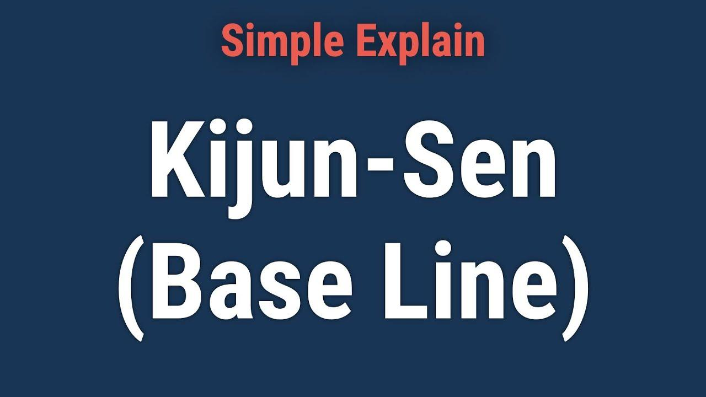

## Table of Contents

## What is Kijun-Sen and its significance in technical analysis?

Kijun-Sen, also known as the Base Line, is a component of the Ichimoku Kinko Hyo indicator used in technical analysis. It is calculated by taking the average of the highest high and the lowest low over the past 26 periods. This line helps traders identify potential support and resistance levels, as well as the overall trend of the market. When the price is above the Kijun-Sen, it suggests a bullish trend, and when the price is below it, it indicates a bearish trend.

The significance of Kijun-Sen lies in its ability to provide a clear picture of the market's direction and potential turning points. Traders often use it in conjunction with other components of the Ichimoku system, such as the Tenkan-Sen and the Senkou Span, to make more informed trading decisions. For instance, a crossover of the Tenkan-Sen above the Kijun-Sen can signal a potential buying opportunity, while a crossover below might suggest selling. By understanding and utilizing the Kijun-Sen, traders can better navigate the complexities of market movements and improve their trading strategies.

## How is Kijun-Sen calculated?

Kijun-Sen, or the Base Line, is a part of the Ichimoku Kinko Hyo indicator. It is calculated by finding the average of the highest high and the lowest low over the past 26 periods. This means you look back 26 days, weeks, or any other time frame you are using, and find the highest price and the lowest price during that time. Then, you add those two numbers together and divide by two to get the Kijun-Sen value.

The Kijun-Sen helps traders see the overall trend of the market. If the price of a stock or other asset is above the Kijun-Sen, it suggests that the market is in a bullish trend, meaning prices are likely to go up. If the price is below the Kijun-Sen, it indicates a bearish trend, meaning prices are likely to go down. This line is useful because it gives traders a simple way to understand whether the market is moving up or down over a longer period.

## What is the formula for Kijun-Sen?

Kijun-Sen, also known as the Base Line, is part of the Ichimoku Kinko Hyo indicator. To calculate it, you need to look back 26 periods, like 26 days if you're looking at daily charts. Find the highest price and the lowest price during those 26 periods. Then, add the highest price and the lowest price together, and divide that total by 2. This gives you the Kijun-Sen value.

The Kijun-Sen helps traders see if the market is going up or down. If the price of what you're trading is above the Kijun-Sen, it means the market might be in a bullish trend, where prices are likely to keep going up. If the price is below the Kijun-Sen, it means the market might be in a bearish trend, where prices are likely to keep going down. This line is useful because it gives traders a simple way to understand the market's direction over a longer time.

## Can you explain the difference between Kijun-Sen and Tenkan-Sen?

Kijun-Sen and Tenkan-Sen are both parts of the Ichimoku Kinko Hyo indicator, but they look at different time periods. Kijun-Sen, also called the Base Line, is calculated by taking the average of the highest high and the lowest low over the last 26 periods. This helps traders see the longer-term trend of the market. If the price is above the Kijun-Sen, it suggests the market is in a bullish trend, meaning prices might go up. If the price is below the Kijun-Sen, it indicates a bearish trend, meaning prices might go down.

Tenkan-Sen, or the Conversion Line, is calculated by averaging the highest high and the lowest low over the last 9 periods. This line is more sensitive to short-term price movements compared to the Kijun-Sen. Traders use the Tenkan-Sen to get quick signals about potential changes in the market's direction. When the Tenkan-Sen crosses above the Kijun-Sen, it can be a sign to buy, and when it crosses below, it can be a sign to sell. Together, these lines help traders understand both short-term and longer-term trends in the market.

## How does Kijun-Sen help in identifying market trends?

Kijun-Sen, or the Base Line, is part of the Ichimoku Kinko Hyo indicator that helps traders see the bigger picture of the market's direction. It is calculated by finding the average of the highest high and the lowest low over the past 26 periods. This gives traders a clear line that shows where the market might be heading over a longer time. If the price of what you're trading is above the Kijun-Sen, it means the market might be in a bullish trend, where prices are likely to keep going up. If the price is below the Kijun-Sen, it suggests a bearish trend, where prices are likely to keep going down.

By looking at where the price is in relation to the Kijun-Sen, traders can make better decisions about when to buy or sell. The Kijun-Sen acts like a guide, showing if the market is strong or weak over time. It's not just about short-term ups and downs but about understanding the overall direction of the market. This helps traders stay on the right side of the trend, making it easier to plan their trades and manage risks.

## What are the typical time periods used for calculating Kijun-Sen?

Kijun-Sen, which is part of the Ichimoku Kinko Hyo indicator, is usually calculated using a time period of 26 periods. This means that if you're looking at a daily chart, you would look back 26 days to find the highest price and the lowest price during that time. Then, you take the average of those two numbers to get the Kijun-Sen value. This 26-period setting is standard and helps traders see the longer-term trend of the market.

The reason for using 26 periods is to capture a longer time frame that gives a good sense of the market's overall direction. If the price is above the Kijun-Sen, it suggests a bullish trend where prices are likely to go up. If the price is below the Kijun-Sen, it indicates a bearish trend where prices are likely to go down. This helps traders make better decisions about when to buy or sell based on the bigger picture of the market's movement.

## How can Kijun-Sen be used as a support and resistance level?

Kijun-Sen, or the Base Line, can act as a support or resistance level in trading. Support is a price level where the price tends to stop falling and might start to go up. Resistance is a price level where the price tends to stop rising and might start to go down. When the price of what you're trading gets close to the Kijun-Sen, it often bounces off this line. If the price is above the Kijun-Sen and it touches it, the Kijun-Sen can act as a support level, helping the price not to fall further. If the price is below the Kijun-Sen and it touches it, the Kijun-Sen can act as a resistance level, keeping the price from going higher.

Traders use the Kijun-Sen to make decisions about buying and selling. For example, if the price is going down and it hits the Kijun-Sen, a trader might see this as a good time to buy because the price might bounce back up from this support level. On the other hand, if the price is going up and it hits the Kijun-Sen, a trader might see this as a good time to sell because the price might drop back down from this resistance level. By watching how the price reacts to the Kijun-Sen, traders can better understand where the market might be heading next.

## What are some common trading strategies involving Kijun-Sen?

One common trading strategy involving Kijun-Sen is the Kijun-Sen crossover strategy. In this strategy, traders watch for the price to cross above or below the Kijun-Sen. When the price moves above the Kijun-Sen, it might be a good time to buy because it suggests the market is turning bullish. On the other hand, when the price drops below the Kijun-Sen, it might be a good time to sell because it indicates the market is turning bearish. Traders use this crossover as a signal to enter or [exit](/wiki/exit-strategy) trades, helping them catch the start of new trends.

Another strategy is using Kijun-Sen as a support and resistance level. If the price is above the Kijun-Sen and it touches it, traders might see it as a support level and look to buy, expecting the price to bounce back up. If the price is below the Kijun-Sen and it touches it, traders might see it as a resistance level and look to sell, expecting the price to drop back down. This strategy helps traders find good entry and exit points by watching how the price reacts to the Kijun-Sen.

A third strategy involves combining Kijun-Sen with other parts of the Ichimoku system, like the Tenkan-Sen. Traders look for the Tenkan-Sen to cross above or below the Kijun-Sen. When the Tenkan-Sen crosses above the Kijun-Sen, it's called a bullish signal, and traders might buy. When the Tenkan-Sen crosses below the Kijun-Sen, it's called a bearish signal, and traders might sell. By using both lines together, traders can get a clearer picture of the market's direction and make more informed trading decisions.

## How does Kijun-Sen interact with other Ichimoku elements?

Kijun-Sen, or the Base Line, works together with other parts of the Ichimoku Kinko Hyo system to help traders understand the market. One important interaction is with the Tenkan-Sen, or the Conversion Line. The Tenkan-Sen is calculated over a shorter time period of 9 periods, making it more sensitive to quick changes in the market. When the Tenkan-Sen crosses above the Kijun-Sen, it's a sign that the market might be turning bullish, and traders might want to buy. When the Tenkan-Sen crosses below the Kijun-Sen, it's a sign that the market might be turning bearish, and traders might want to sell. By watching these crossovers, traders can get early signals about where the market might be heading next.

Another key interaction is with the Senkou Span A and Senkou Span B, which together form the Kumo, or cloud. The Senkou Span A is calculated by averaging the Tenkan-Sen and Kijun-Sen and then plotting it 26 periods ahead. The Senkou Span B is calculated by averaging the highest high and lowest low over the past 52 periods and plotting it 26 periods ahead. When the price is above the Kumo, it suggests a bullish trend, and when the price is below the Kumo, it suggests a bearish trend. The Kijun-Sen helps traders see the overall trend, and when combined with the Kumo, it gives a clearer picture of the market's direction and potential support and resistance levels. By looking at how the Kijun-Sen interacts with the Kumo, traders can make better decisions about when to enter or exit trades.

## What are the limitations and potential pitfalls of using Kijun-Sen?

Using Kijun-Sen can have some limitations and potential pitfalls. One limitation is that Kijun-Sen is based on historical data, which means it might not always predict future market movements accurately. If the market changes direction suddenly, the Kijun-Sen might not catch up quickly enough, leading to late signals. Another pitfall is that relying too much on just the Kijun-Sen can be risky because it's only one part of the bigger Ichimoku system. Traders might miss important signals from other parts like the Tenkan-Sen or the Kumo if they focus only on the Kijun-Sen.

Another potential pitfall is that the Kijun-Sen can sometimes give false signals, especially in choppy or sideways markets. If the price keeps crossing above and below the Kijun-Sen without a clear trend, traders might get confused about when to buy or sell. This can lead to entering trades at the wrong times and losing money. To avoid these pitfalls, it's important for traders to use the Kijun-Sen along with other indicators and analysis methods to get a more complete picture of the market.

## How can Kijun-Sen be optimized for different trading instruments?

Kijun-Sen can be adjusted for different trading instruments by changing the time period used to calculate it. For example, if you are trading stocks, you might stick with the standard 26-day period. But if you are trading something like cryptocurrencies, which can be more volatile, you might use a shorter time period, like 14 days, to make the Kijun-Sen more responsive to quick market changes. By testing different time periods, traders can find the one that works best for the specific instrument they are trading.

Another way to optimize Kijun-Sen for different instruments is to use it along with other parts of the Ichimoku system, like the Tenkan-Sen and the Kumo. For fast-moving markets, you might want to pay more attention to the Tenkan-Sen because it reacts quicker to price changes. For slower-moving markets, focusing more on the Kijun-Sen can help you see the bigger trend. By combining these elements and adjusting them to fit the instrument, traders can get a better sense of when to buy or sell.

## Can you provide a case study where Kijun-Sen was effectively used in a trading strategy?

Imagine a trader named Sarah who trades stocks. She uses the Kijun-Sen as part of her trading strategy. One day, she notices that the price of a stock she's watching is going down and it touches the Kijun-Sen line. Sarah sees this as a support level, so she decides to buy the stock, expecting the price to bounce back up. A few days later, the price does go up, and Sarah sells the stock for a profit. By using the Kijun-Sen as a guide, Sarah was able to make a good trading decision.

In another case, a trader named John uses Kijun-Sen along with the Tenkan-Sen to trade [forex](/wiki/forex-system). He sees that the Tenkan-Sen line crosses above the Kijun-Sen line, which is a bullish signal. John decides to buy the currency pair he's watching. Over the next few weeks, the price keeps going up, and John sells at a higher price, making a profit. By watching the interaction between the Kijun-Sen and the Tenkan-Sen, John was able to catch the start of a new trend and make a successful trade.

## What is the Ichimoku Kinko Hyo?

The Ichimoku Kinko Hyo, often referred to as Ichimoku Cloud, is a complex technical analysis system developed by Japanese journalist Goichi Hosoda in the late 1930s, gaining popularity in the subsequent decades. Designed to provide a comprehensive snapshot of market conditions at a glance, Ichimoku Kinko Hyo translates to "one glance equilibrium chart," reflecting its role in swiftly portraying market trends, [momentum](/wiki/momentum), and potential trading opportunities.

The system comprises five distinct components, each contributing a unique perspective on the market:

1. **Tenkan-sen (Conversion Line):** Calculated as the average of the highest high and the lowest low over the last nine periods:
$$
   \text{Tenkan-sen} = \frac{\text{(highest high + lowest low)}}{2} \quad \text{over the past 9 periods}

$$
   This line is considered a short-term indicator reflecting minor price momentum changes and assists in identifying initial trend direction.

2. **Kijun-sen (Base Line):** Obtained by averaging the highest high and lowest low over the last 26 periods:
$$
   \text{Kijun-sen} = \frac{\text{(highest high + lowest low)}}{2} \quad \text{over the past 26 periods}

$$
   The Kijun-sen is instrumental in assessing medium-term trends and is often used as a benchmark for price movements.

3. **Chikou Span (Lagging Span):** This is the current period’s closing price plotted 26 days behind. It provides a perspective on how today's price compares to historical prices, aiding in confirming trend direction.

4. **Senkou Span A (Leading Span A):** It is calculated by averaging the Tenkan-sen and Kijun-sen, plotted 26 periods ahead:
$$
   \text{Senkou Span A} = \frac{\text{(Tenkan-sen + Kijun-sen)}}{2} \quad \text{plotted 26 periods ahead}

$$
   This line is one of the two boundaries forming the Ichimoku Cloud, serving as potential future support or resistance.

5. **Senkou Span B (Leading Span B):** Derived from the average of the highest high and lowest low over the past 52 periods, plotted 26 periods ahead:
$$
   \text{Senkou Span B} = \frac{\text{(highest high + lowest low)}}{2} \quad \text{over the past 52 periods, plotted 26 periods ahead}

$$
   Along with Senkou Span A, Senkou Span B forms the Ichimoku Cloud. The area between these spans, known as the 'Kumo' or cloud, is a key feature, indicating support and resistance areas, and potential [breakout](/wiki/breakout-trading) and reversal signals.

The interplay of these components offers traders insights into support and resistance levels, trend strength and direction, and potential buy or sell signals. The 'cloud' created by the Senkou spans acts as both a buffer zone for price action and a visual guide for identifying prevailing market trends and future price dynamics. Through its multifaceted structure, the Ichimoku Kinko Hyo provides traders with a well-rounded tool for technical analysis.

## What is the Kijun-Sen (Base Line) and how can it be understood?

The Kijun-Sen, commonly referred to as the Base Line, is a fundamental component of the Ichimoku Kinko Hyo system, representing the midpoint of the price range over a specified period. Specifically, it is computed by taking the average of the highest high and the lowest low over the past 26 periods. Mathematically, it can be expressed as:

$$
\text{Kijun-Sen} = \frac{(\text{Highest High}_{26} + \text{Lowest Low}_{26})}{2}
$$

This calculation results in a line that offers insights into the medium-term price momentum, serving as an essential indicator for understanding trend directions in the market.

The position of the asset's price in relation to the Kijun-Sen provides critical information about market momentum. When the price is positioned above the Kijun-Sen, it usually signals an upward momentum, suggesting that the market is in a bullish phase. Conversely, when the price drops below this line, it indicates downward momentum, pointing towards a bearish market trend. Consequently, the Kijun-Sen acts not only as a measure of the current trend strength but also as a potential support or resistance level.

For algorithmic traders, the Kijun-Sen offers a reliable basis for developing strategies that capitalize on trend continuation or reversals. Its utilization can be part of a broader analysis when combined with other indicators, such as the Tenkan-sen or the surrounding price cloud, to enhance the accuracy of trading signals and decisions.

## How can one go about backtesting and evaluating algorithm performance?

After developing the trading algorithm utilizing the Ichimoku indicators, particularly the Kijun-Sen, the next critical step is to backtest it against historical data to assess its effectiveness. Backtesting involves running the algorithm on past market data to simulate how it would have performed over a specified period. This process provides valuable insights and aids in refining trading strategies before deploying them in live markets.

Key performance metrics used in evaluating trading algorithms include net profit, drawdown, and win rate. Net profit measures the total monetary gain or loss generated by the algorithm during the [backtesting](/wiki/backtesting) period. This metric helps determine the algorithm's profitability potential.

$$
\text{Net Profit} = \sum (\text{Profits from all trades}) - \sum (\text{Losses from all trades})
$$

Drawdown, another crucial metric, represents the peak-to-trough decline in the algorithm's equity balance. It measures the risk associated with the trading strategy, indicating the potential loss an algorithm could incur before recovering.

$$
\text{Drawdown} = \frac{\text{Peak Portfolio Value} - \text{Trough Portfolio Value}}{\text{Peak Portfolio Value}} \times 100\%
$$

The win rate, expressed as a percentage, is the ratio of successful trades to the total number of trades. A higher win rate suggests a more successful strategy, although other factors like reward-to-risk ratio also play a significant role.

$$
\text{Win Rate} = \left( \frac{\text{Number of Winning Trades}}{\text{Total Number of Trades}} \right) \times 100\%
$$

Following the evaluation of these metrics, adjustments may be necessary to optimize the algorithm for varying market conditions or trading intervals. This might involve fine-tuning the parameters used in the calculation of the Ichimoku indicators or modifying conditions such as the thresholds for trade signals.

For instance, one might consider:

- Changing the period lengths in the Ichimoku components.
- Implementing additional filters, such as volume or volatility thresholds, to strengthen signal quality.
- Adjusting position sizes based on risk management principles.

Implementing these alterations requires an iterative process of testing and re-evaluation to enhance the algorithm's robustness. Advanced strategies may also incorporate [machine learning](/wiki/machine-learning) techniques to dynamically adapt to changing market conditions.

Python, being a preferred language in [algorithmic trading](/wiki/algorithmic-trading), offers robust libraries such as pandas and NumPy for data manipulation and backtesting frameworks like Backtrader and pyalgotrade. Below is a simple illustration of a backtesting setup using Python:

```python
import backtrader as bt

class IchimokuStrategy(bt.Strategy):
    def __init__(self):
        ichimoku = bt.indicators.Ichimoku()
        self.kijun_sen = ichimoku.kijun_sen

    def next(self):
        if self.data.close > self.kijun_sen:
            self.buy()
        elif self.data.close < self.kijun_sen:
            self.sell()

cerebro = bt.Cerebro()
cerebro.addstrategy(IchimokuStrategy)
cerebro.run()
```

In conclusion, rigorous backtesting and careful evaluation are vital steps in developing effective algorithmic trading strategies. By diligently analyzing performance metrics and fine-tuning strategy parameters, traders can improve algorithmic performance and adapt strategies to enhance their effectiveness in dynamic market environments.

## References & Further Reading

[1]: Nison, S. (1991). ["Japanese Candlestick Charting Techniques: A Contemporary Guide to the Ancient Investment Techniques of the Far East."](https://archive.org/details/japanesecandlest0000niso) Prentice Hall Press.

[2]: Kirkpatrick, C. D., & Dahlquist, J. R. (2010). ["Technical Analysis: The Complete Resource for Financial Market Technicians."](https://ptgmedia.pearsoncmg.com/images/9780134137049/samplepages/9780134137049.pdf) FT Press.

[3]: Lopez de Prado, M. (2018). ["Advances in Financial Machine Learning."](https://www.amazon.com/Advances-Financial-Machine-Learning-Marcos/dp/1119482089) Wiley.

[4]: Aronson, D. R. (2007). ["Evidence-Based Technical Analysis: Applying the Scientific Method and Statistical Inference to Trading Signals."](https://onlinelibrary.wiley.com/doi/book/10.1002/9781118268315) Wiley.

[5]: Jansen, S. (2020). ["Machine Learning for Algorithmic Trading."](https://github.com/stefan-jansen/machine-learning-for-trading) Packt Publishing.

[6]: Chan, E. P. (2008). ["Quantitative Trading: How to Build Your Own Algorithmic Trading Business."](https://github.com/ftvision/quant_trading_echan_book) Wiley.