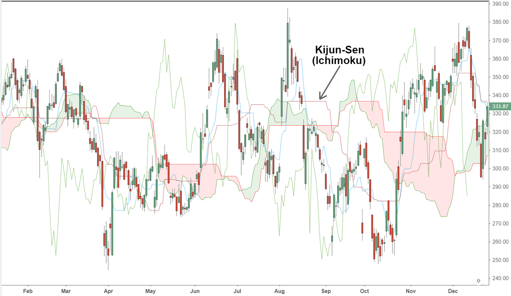

Algorithmic trading has significantly altered the landscape of financial markets by enabling traders to execute strategies that leverage precise, data-driven insights at remarkable speeds. Such technological advancements allow for more informed decision-making, aligning closely with the ever-changing dynamics of market behavior. One of the standout tools used in this sophisticated trading environment is the Ichimoku Kinko Hyo indicator, which has gained popularity due to its holistic approach to market analysis.

Developed in Japan during the 1930s, the Ichimoku Kinko Hyo provides a comprehensive framework that incorporates various elements to assess market conditions efficiently. At the core of its system is the Kijun-Sen, also known as the Base Line, which plays a pivotal role in its analytical structure. This component is renowned for its ability to offer valuable insights into market trends and momentum, aiding traders in making more accurate predictions.



The Kijun-Sen is calculated as the average of the highest high and the lowest low over a specified period, typically 26 periods. In mathematical terms, this is expressed as:

$$
\text{Kijun-Sen} = \frac{(\text{Highest High} + \text{Lowest Low})}{2}
$$

This calculation offers a reflection of short- to medium-term market momentum, becoming a crucial element in forecasting potential price movements.

The intent of this article is to examine the integral role of the Kijun-Sen within the landscape of algorithmic trading. It will cover the methodology behind its calculation and its practical application in developing trading strategies. As traders seek to refine their strategies with precision, the Kijun-Sen stands as a useful ally in navigating the complexities of market trends and momentum shifts.

## Table of Contents

## What is the Ichimoku Kinko Hyo?

The Ichimoku Kinko Hyo, often referred to as Ichimoku Cloud, is a complex technical analysis system developed by Japanese journalist Goichi Hosoda in the late 1930s, gaining popularity in the subsequent decades. Designed to provide a comprehensive snapshot of market conditions at a glance, Ichimoku Kinko Hyo translates to "one glance equilibrium chart," reflecting its role in swiftly portraying market trends, [momentum](/wiki/momentum), and potential trading opportunities.

The system comprises five distinct components, each contributing a unique perspective on the market:

1. **Tenkan-sen (Conversion Line):** Calculated as the average of the highest high and the lowest low over the last nine periods:
$$
   \text{Tenkan-sen} = \frac{\text{(highest high + lowest low)}}{2} \quad \text{over the past 9 periods}

$$
   This line is considered a short-term indicator reflecting minor price momentum changes and assists in identifying initial trend direction.

2. **Kijun-sen (Base Line):** Obtained by averaging the highest high and lowest low over the last 26 periods:
$$
   \text{Kijun-sen} = \frac{\text{(highest high + lowest low)}}{2} \quad \text{over the past 26 periods}

$$
   The Kijun-sen is instrumental in assessing medium-term trends and is often used as a benchmark for price movements.

3. **Chikou Span (Lagging Span):** This is the current period’s closing price plotted 26 days behind. It provides a perspective on how today's price compares to historical prices, aiding in confirming trend direction.

4. **Senkou Span A (Leading Span A):** It is calculated by averaging the Tenkan-sen and Kijun-sen, plotted 26 periods ahead:
$$
   \text{Senkou Span A} = \frac{\text{(Tenkan-sen + Kijun-sen)}}{2} \quad \text{plotted 26 periods ahead}

$$
   This line is one of the two boundaries forming the Ichimoku Cloud, serving as potential future support or resistance.

5. **Senkou Span B (Leading Span B):** Derived from the average of the highest high and lowest low over the past 52 periods, plotted 26 periods ahead:
$$
   \text{Senkou Span B} = \frac{\text{(highest high + lowest low)}}{2} \quad \text{over the past 52 periods, plotted 26 periods ahead}

$$
   Along with Senkou Span A, Senkou Span B forms the Ichimoku Cloud. The area between these spans, known as the 'Kumo' or cloud, is a key feature, indicating support and resistance areas, and potential [breakout](/wiki/breakout-trading) and reversal signals.

The interplay of these components offers traders insights into support and resistance levels, trend strength and direction, and potential buy or sell signals. The 'cloud' created by the Senkou spans acts as both a buffer zone for price action and a visual guide for identifying prevailing market trends and future price dynamics. Through its multifaceted structure, the Ichimoku Kinko Hyo provides traders with a well-rounded tool for technical analysis.

## Understanding the Kijun-Sen (Base Line)

The Kijun-Sen, commonly referred to as the Base Line, is a fundamental component of the Ichimoku Kinko Hyo system, representing the midpoint of the price range over a specified period. Specifically, it is computed by taking the average of the highest high and the lowest low over the past 26 periods. Mathematically, it can be expressed as:

$$
\text{Kijun-Sen} = \frac{(\text{Highest High}_{26} + \text{Lowest Low}_{26})}{2}
$$

This calculation results in a line that offers insights into the medium-term price momentum, serving as an essential indicator for understanding trend directions in the market.

The position of the asset's price in relation to the Kijun-Sen provides critical information about market momentum. When the price is positioned above the Kijun-Sen, it usually signals an upward momentum, suggesting that the market is in a bullish phase. Conversely, when the price drops below this line, it indicates downward momentum, pointing towards a bearish market trend. Consequently, the Kijun-Sen acts not only as a measure of the current trend strength but also as a potential support or resistance level.

For algorithmic traders, the Kijun-Sen offers a reliable basis for developing strategies that capitalize on trend continuation or reversals. Its utilization can be part of a broader analysis when combined with other indicators, such as the Tenkan-sen or the surrounding price cloud, to enhance the accuracy of trading signals and decisions.

## The Role of Kijun-Sen in Algo Trading

The Kijun-Sen, or Base Line, serves as a critical component in [algorithmic trading](/wiki/algorithmic-trading) strategies, particularly those that employ the Ichimoku Kinko Hyo system. Its utility in algorithmic trading arises primarily from its ability to provide signals through crossovers with the Tenkan-sen (Conversion Line) and to enhance the interpretation of market trends in conjunction with the Ichimoku cloud.

In the context of algorithmic trading, the Kijun-Sen acts as a trend-following indicator. It is calculated as the midpoint of the highest high and lowest low over the past 26 periods, representing an equilibrium point in the medium term. This characteristic makes it particularly useful for confirming trends and potential reversals.

A common strategy involves the use of crossover signals between the Kijun-Sen and the Tenkan-sen. The Tenkan-sen, calculated using a similar method but over the past 9 periods, is more sensitive to recent price changes. When the Tenkan-sen crosses above the Kijun-Sen, it generates a bullish signal indicating potential upward momentum. Conversely, a cross below suggests bearish signals. Here is a simple Python snippet illustrating how one might identify such crossovers in a dataset:

```python
import pandas as pd

# Assuming 'df' is a DataFrame containing high, low, and close prices
df['Tenkan-sen'] = (df['high'].rolling(window=9).max() + df['low'].rolling(window=9).min()) / 2
df['Kijun-Sen'] = (df['high'].rolling(window=26).max() + df['low'].rolling(window=26).min()) / 2

# Generate signals
df['Signal'] = 0
df.loc[df['Tenkan-sen'] > df['Kijun-Sen'], 'Signal'] = 1  # Buy signal
df.loc[df['Tenkan-sen'] < df['Kijun-Sen'], 'Signal'] = -1  # Sell signal
```

Traders may enhance the accuracy of these signals by employing the Ichimoku cloud, formed by the lines Senkou Span A and Senkou Span B. The cloud provides additional context by identifying broader trend directions and potential support and resistance levels. A trend is typically considered bullish if the price and the Tenkan-sen and Kijun-Sen lines all lie above the cloud. Conversely, a bearish trend is indicated when these elements are below the cloud.

By combining crossover signals with the cloud's positional context, traders can reinforce the strength of buy and sell signals. This dual-layer approach helps to filter out false positives and negatives, especially in volatile market conditions, thereby enhancing the reliability of trading strategies that incorporate the Kijun-Sen within any Ichimoku-based algorithmic framework.

## Developing a Trading Algorithm with Ichimoku Indicators

A basic Ichimoku trading algorithm hinges on the interplay between two critical Ichimoku components: the Tenkan-sen (Conversion Line) and the Kijun-sen (Base Line). These lines generate trading signals through a precise mechanism known as crossovers. A buy signal is produced when the Tenkan-sen crosses above the Kijun-sen, indicating a potential upward momentum. Conversely, a sell signal is triggered when the Tenkan-sen crosses below the Kijun-sen, suggesting potential downward momentum. 

To enhance the robustness and reliability of these signals, additional conditions can be applied, such as the relative position of the price to the Ichimoku cloud, a formation made by the Senkou Span A and Senkou Span B. For instance, ensuring the price is above the cloud during a buy signal or below the cloud during a sell signal can confirm the strength of the trend. This integration adds a layer of confirmation to the basic crossover signals, potentially filtering out false signals in ambiguous market conditions.

Calculating the relevant Ichimoku components is straightforward. The Tenkan-sen is derived as the average of the highest high and lowest low over the previous nine periods:
$$
\text{Tenkan-sen} = \frac{(\text{Highest High}_{9} + \text{Lowest Low}_{9})}{2}
$$

Meanwhile, the Kijun-sen is calculated similarly but over a longer period of 26:
$$
\text{Kijun-sen} = \frac{(\text{Highest High}_{26} + \text{Lowest Low}_{26})}{2}
$$

A simple algorithmic implementation of these crossover signals in Python might look like the following:

```python
import pandas as pd

def ichimoku_signals(data):
    data['TenkanSen'] = (data['High'].rolling(window=9).max() + data['Low'].rolling(window=9).min()) / 2
    data['KijunSen'] = (data['High'].rolling(window=26).max() + data['Low'].rolling(window=26).min()) / 2

    data['BuySignal'] = (data['TenkanSen'].shift(1) < data['KijunSen'].shift(1)) & (data['TenkanSen'] > data['KijunSen'])
    data['SellSignal'] = (data['TenkanSen'].shift(1) > data['KijunSen'].shift(1)) & (data['TenkanSen'] < data['KijunSen'])

    return data

# Usage example with pandas DataFrame `market_data` containing 'High' and 'Low' columns
signals = ichimoku_signals(market_data)
```

In this code, `market_data` should be a DataFrame with 'High' and 'Low' columns corresponding to historical price data. The algorithm calculates the Tenkan-sen and Kijun-sen, then identifies buy and sell signals based on crossovers. This example illustrates how trading strategies using Ichimoku indicators can be automated, providing a systematic approach to exploiting trends in financial markets.

## Backtesting and Evaluating Algorithm Performance

After developing the trading algorithm utilizing the Ichimoku indicators, particularly the Kijun-Sen, the next critical step is to backtest it against historical data to assess its effectiveness. Backtesting involves running the algorithm on past market data to simulate how it would have performed over a specified period. This process provides valuable insights and aids in refining trading strategies before deploying them in live markets.

Key performance metrics used in evaluating trading algorithms include net profit, drawdown, and win rate. Net profit measures the total monetary gain or loss generated by the algorithm during the [backtesting](/wiki/backtesting) period. This metric helps determine the algorithm's profitability potential.

$$
\text{Net Profit} = \sum (\text{Profits from all trades}) - \sum (\text{Losses from all trades})
$$

Drawdown, another crucial metric, represents the peak-to-trough decline in the algorithm's equity balance. It measures the risk associated with the trading strategy, indicating the potential loss an algorithm could incur before recovering.

$$
\text{Drawdown} = \frac{\text{Peak Portfolio Value} - \text{Trough Portfolio Value}}{\text{Peak Portfolio Value}} \times 100\%
$$

The win rate, expressed as a percentage, is the ratio of successful trades to the total number of trades. A higher win rate suggests a more successful strategy, although other factors like reward-to-risk ratio also play a significant role.

$$
\text{Win Rate} = \left( \frac{\text{Number of Winning Trades}}{\text{Total Number of Trades}} \right) \times 100\%
$$

Following the evaluation of these metrics, adjustments may be necessary to optimize the algorithm for varying market conditions or trading intervals. This might involve fine-tuning the parameters used in the calculation of the Ichimoku indicators or modifying conditions such as the thresholds for trade signals.

For instance, one might consider:

- Changing the period lengths in the Ichimoku components.
- Implementing additional filters, such as volume or volatility thresholds, to strengthen signal quality.
- Adjusting position sizes based on risk management principles.

Implementing these alterations requires an iterative process of testing and re-evaluation to enhance the algorithm's robustness. Advanced strategies may also incorporate [machine learning](/wiki/machine-learning) techniques to dynamically adapt to changing market conditions.

Python, being a preferred language in algorithmic trading, offers robust libraries such as pandas and NumPy for data manipulation and backtesting frameworks like Backtrader and pyalgotrade. Below is a simple illustration of a backtesting setup using Python:

```python
import backtrader as bt

class IchimokuStrategy(bt.Strategy):
    def __init__(self):
        ichimoku = bt.indicators.Ichimoku()
        self.kijun_sen = ichimoku.kijun_sen

    def next(self):
        if self.data.close > self.kijun_sen:
            self.buy()
        elif self.data.close < self.kijun_sen:
            self.sell()

cerebro = bt.Cerebro()
cerebro.addstrategy(IchimokuStrategy)
cerebro.run()
```

In conclusion, rigorous backtesting and careful evaluation are vital steps in developing effective algorithmic trading strategies. By diligently analyzing performance metrics and fine-tuning strategy parameters, traders can improve algorithmic performance and adapt strategies to enhance their effectiveness in dynamic market environments.

## Challenges and Limitations

The Kijun-Sen, a central component of the Ichimoku Kinko Hyo system, is a powerful tool for analyzing market trends, yet it also presents certain challenges and limitations. One notable issue is its propensity to frequently align with the current price during ranging markets. This alignment can diminish the Kijun-Sen's predictive power, as it may fail to provide distinct directional signals when prices are moving sideways. Such market conditions tend to generate noise rather than actionable insights, potentially leading to false signals and less effective trading decisions.

In addition, trading signals derived from the Kijun-Sen can be less reliable during periods of low [volatility](/wiki/volatility-trading-strategies) or when markets experience strong trends going against the prevailing indicator signals. During low volatility, price movements are minimal, which can cause the Kijun-Sen to produce signals that lack the conviction necessary for sound trading decisions. Similarly, in the context of strong market trends opposing Kijun-Sen signals, traders might find that sticking to these signals could result in missed opportunities or losses.

To compensate for these limitations, it is advisable to use the Kijun-Sen in conjunction with other technical indicators and analytical methods. This diversification can create a more robust trading strategy, providing additional confirmation for trade signals and filtering out potential false positives. For instance, combining the Kijun-Sen with the Tenkan-sen (Conversion Line) can allow traders to identify crossovers that signal potential entry or [exit](/wiki/exit-strategy) points. Moreover, applying the Ichimoku cloud itself or incorporating indicators such as Relative Strength Index (RSI) for momentum validation can enhance the decision-making process.

Additionally, utilizing programming methods for developing a comprehensive trading algorithm can aid in mitigating these challenges. Here is a simple Python code snippet demonstrating how the Kijun-Sen might be implemented within a broader analysis framework:

```python
import pandas as pd

def calculate_kijun_sen(data):
    """
    Calculate the Kijun-Sen (Base Line) for the given price data.
    :param data: DataFrame with columns ['High', 'Low'] for the high and low prices
    :return: Series representing the Kijun-Sen
    """
    high_roll = data['High'].rolling(window=26).max()
    low_roll = data['Low'].rolling(window=26).min()
    kijun_sen = (high_roll + low_roll) / 2
    return kijun_sen

# Example data setup
data = pd.DataFrame({
    'High': [...],  # high price data
    'Low': [...]    # low price data
})

data['Kijun-Sen'] = calculate_kijun_sen(data)
```

By combining the Kijun-Sen with sophisticated coding practices, traders can better handle the challenges presented by various market conditions, thereby improving the reliability of their trading strategies.

## Conclusion

The Ichimoku Kinko Hyo, particularly the Kijun-Sen, equips traders with an advanced technical analysis framework that is both versatile and insightful. The Ichimoku system's multifaceted approach, with its unique combination of components, provides a comprehensive view of market trends, enabling traders to make informed decisions. This breadth helps mitigate the inherent limitations of relying on a single indicator. For instance, the Kijun-Sen alone may falter in range-bound markets or under conditions of low volatility, but when integrated within the full Ichimoku setup, its utility is significantly enhanced.

While no technical indicator guarantees success, the Ichimoku system's robustness lies in its ability to adapt to changing market conditions. A trader can improve decision-making by continuously analyzing price movements relative to the Ichimoku cloud and the interplay between its components. This adaptability is crucial for effective algorithmic trading, as static strategies may suffer during periods of market shift.

Key to operationalizing the Ichimoku Kinko Hyo in algorithmic systems is the dynamic evaluation and recalibration of trading algorithms. Frequent backtesting against diverse historical datasets allows traders to assess the performance of their strategies critically. Such analysis not only highlights potential deficiencies but also facilitates optimization tailored to specific market conditions.

Successful trading with the Ichimoku system necessitates an ongoing commitment to assess and refine one's strategies. Through diligent evaluation and openness to adaptation, traders can harness the full potential of the Ichimoku Kinko Hyo and its components, like the Kijun-Sen, to navigate the complexities of financial markets efficiently.

## References & Further Reading

[1]: Nison, S. (1991). ["Japanese Candlestick Charting Techniques: A Contemporary Guide to the Ancient Investment Techniques of the Far East."](https://archive.org/details/japanesecandlest0000niso) Prentice Hall Press.

[2]: Kirkpatrick, C. D., & Dahlquist, J. R. (2010). ["Technical Analysis: The Complete Resource for Financial Market Technicians."](https://ptgmedia.pearsoncmg.com/images/9780134137049/samplepages/9780134137049.pdf) FT Press.

[3]: Lopez de Prado, M. (2018). ["Advances in Financial Machine Learning."](https://www.amazon.com/Advances-Financial-Machine-Learning-Marcos/dp/1119482089) Wiley.

[4]: Aronson, D. R. (2007). ["Evidence-Based Technical Analysis: Applying the Scientific Method and Statistical Inference to Trading Signals."](https://onlinelibrary.wiley.com/doi/book/10.1002/9781118268315) Wiley.

[5]: Jansen, S. (2020). ["Machine Learning for Algorithmic Trading."](https://github.com/stefan-jansen/machine-learning-for-trading) Packt Publishing.

[6]: Chan, E. P. (2008). ["Quantitative Trading: How to Build Your Own Algorithmic Trading Business."](https://github.com/ftvision/quant_trading_echan_book) Wiley.