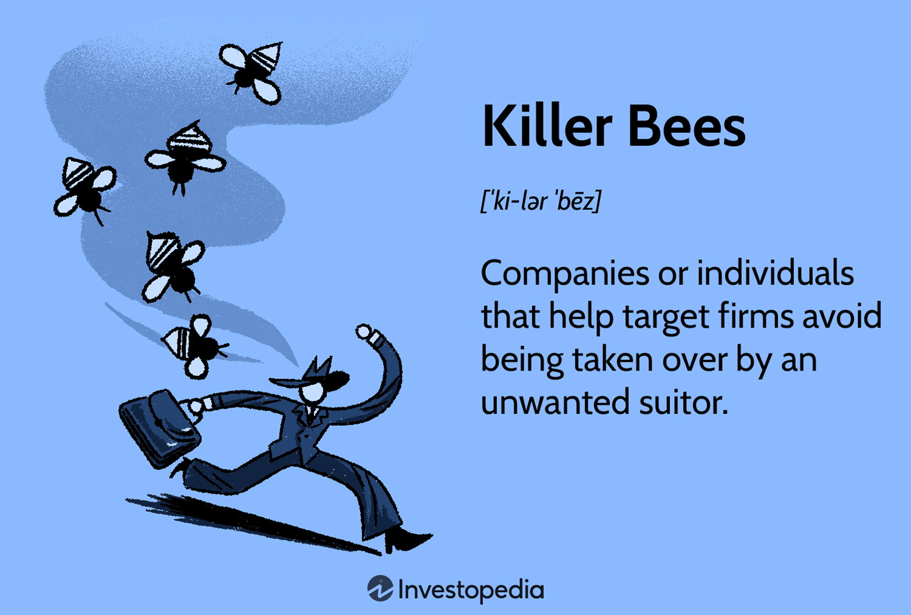

The rapid evolution of technology has profoundly impacted various industries, with trading being among the most affected sectors. Historically, trading commenced on bustling open outcry floors, where communication relied on visual and verbal signals. These floors were synonymous with human-driven decision-making and direct market interactions. However, technological advancements have instigated numerous transformations, culminating in the advent of algorithm-driven trading decisions. The trading industry has been reshaped through these innovations, significantly altering how financial transactions are conducted.

This article explores the concept of killer applications in software and their role in fueling the evolution of trading technologies, with a particular emphasis on algorithmic trading. Killer applications, often defined as software so essential that they drive the adoption of new technologies, have been pivotal in the transition from manual to automated trading systems. As algorithmic trading platforms developed, they harnessed the power of these applications to optimize trading operations, enhance market efficiency, and create new opportunities for traders.



Additionally, we investigate the historical context that set the stage for these transformations, highlighting how the introduction of electronic trading platforms marked a departure from traditional trading methods. The rise of algorithmic trading represents a new era, as complex algorithms now analyze vast datasets at speeds unachievable by human traders. The synergy between technology and trading has not only led to operational optimization but has also reshaped market dynamics. This ongoing evolution illustrates the transformative power of technology in finance as trading practices continue to adapt and innovate in response to technological progress.

## Table of Contents

## The Historical Perspective: From Open Outcry to Electronic Trading

In the early days of the financial markets, the open outcry trading system was the predominant method of executing trades. This method involved traders communicating buy and sell orders on the floors of exchanges using hand signals and verbal communication. Despite its chaotic appearance, the open outcry system was considered efficient for the time, allowing participants to negotiate prices quickly.

However, as trading volumes increased and markets grew more complex, the limitations of open outcry became apparent. The need for a more efficient and scalable system became paramount, especially as globalisation expanded the reach of financial markets beyond local exchanges. This context set the stage for the technological evolution of trading systems.

With the advent of computers and advancements in telecommunication networks during the late 20th century, trading began shifting from manual, face-to-face interactions to electronic platforms. The introduction of Electronic Communication Networks (ECNs) marked a significant milestone in this transformation. ECNs allowed traders to connect directly through digital networks, bypassing traditional brokerage systems. This connectivity reduced transaction costs, improved speed, and enhanced access to financial markets for a wider range of participants.

ECNs facilitated a more fluid and transparent trading environment. They enabled quicker execution of orders and provided anonymity, which was not possible in open outcry systems. This connectivity allowed for continuous trading beyond the official hours of traditional exchanges, increasing the overall [liquidity](/wiki/liquidity-risk-premium) in the markets.

The transition from manual to electronic trading set the groundwork for further technological advancements, such as [algorithmic trading](/wiki/algorithmic-trading). By automating the execution of trades using pre-defined criteria and complex algorithms, trading efficiency improved remarkably. This shift represented not just a technological evolution but also a paradigm shift in how financial markets operated.

In summary, the historical progression from open outcry to electronic trading reflects a profound transformation in the financial markets, driven by the need for efficiency, scalability, and accessibility. This evolution enabled the integration of sophisticated software solutions, ultimately leading to innovative approaches such as algorithmic trading. These developments continue to shape modern trading practices, driving growth and efficiency in global financial markets.

## Defining Killer Applications in Trading

A killer application is a crucial software program whose innovative nature is powerful enough to persuade users to adopt new platform technologies. In the context of trading, such applications enhance trading efficiency and propel the adoption of algorithmic trading platforms. These applications have substantially increased market participation and streamlined trading operations by automating complex processes and providing traders with advanced analytical tools.

In the broader technology industry, killer applications have played pivotal roles in driving platform adoption. Notable examples include Microsoft's Office Suite, which became essential for business productivity, and Apple's iTunes, which revolutionized the music industry. These applications changed user behaviors and set new industry standards, underscoring their significance as transformative tools.

In trading, killer applications often manifest as advanced software solutions capable of processing large volumes of data quickly and accurately. They identify patterns and execute trades with precision, allowing traders to gain significant competitive advantages. This innovation is critical; as market conditions change rapidly, traders must have tools that can adapt and respond instantaneously. The ability of these applications to quickly integrate vast datasets into actionable trading insights makes them indispensable.

Understanding how killer applications drive the evolution of trading technologies is crucial. They simplify complex operations, increase efficiency, and reduce costs, offering traders powerful resources to enhance their market strategies. These applications foster wider market engagement by lowering barriers to entry and making sophisticated trading tools accessible to a broader audience. Consequently, their impact extends beyond individual success, contributing to the overall evolution and democratization of trading technologies.

## The Rise of Algorithmic Trading: A New Era

Algorithmic trading has fundamentally transformed the landscape of financial markets through the employment of complex algorithms that automate trading decisions. These algorithms are crafted to analyze extensive datasets at extraordinary speeds, thereby enhancing both the swiftness and efficiency of trading operations. A typical algorithm might incorporate quantitative models that evaluate potential market movements and execute trades that align with predefined criteria. This capability allows traders to react almost instantaneously to market conditions, thus optimizing trading strategies in a manner that was previously unattainable.

The implementation of algorithmic trading has notably improved liquidity and price discovery within markets. By enabling the execution of large volumes of orders without significant market impact, these algorithms allow the market to more accurately reflect asset values based on real-time supply and demand conditions. This improvement has been instrumental in the emergence and proliferation of high-frequency trading ([HFT](/wiki/high-frequency-trading-strategies)), a subset of algorithmic trading characterized by the rapid execution of numerous trades within fractions of a second.

One remarkable advantage of algorithmic trading is its role in democratizing market participation. Traditional trading often relied heavily on a trader's instinct and intuition, which could be subject to cognitive biases and emotional influences. Algorithmic trading, however, permits decisions to be data-driven, enabling a broader spectrum of market participants to engage effectively in trading activities. Advanced algorithms utilize statistical techniques, such as regression analysis and [machine learning](/wiki/machine-learning) models, to forecast market trends and derive actionable insights from historical and real-time data.

As algorithmic trading platforms have matured, so too has the importance of software killer applications in refining modern trading strategies. These applications are pivotal in providing traders with sophisticated tools that can be tailored to diverse trading methodologies, from [market making](/wiki/market-making) and statistical [arbitrage](/wiki/arbitrage) to [trend following](/wiki/trend-following) and risk management. The integration of cutting-edge technology within trading platforms has not only pushed the boundaries of what's possible in trading but has also set a new benchmark for innovation within the financial industry.

## Impact of Killer Applications on Algorithmic Trading

Killer applications in algorithmic trading have provided traders and financial institutions with significant competitive advantages by optimizing trade execution and market analysis. These advanced software solutions are engineered to process immense volumes of data and identify complex trading patterns, enabling precise and timely execution of trades. This capability is particularly critical in financial markets where even milliseconds can be the difference between profit and loss.

One of the core innovations of these applications is their adaptability to rapidly changing market conditions. By using sophisticated algorithms and machine learning models, these applications can dynamically adjust their trading strategies, ensuring optimal performance even in volatile markets. This adaptability makes them indispensable for traders seeking to maintain an edge in competitive financial landscapes.

The efficacy of a well-designed trading algorithm can be quantitatively evaluated through metrics such as Sharpe Ratio, which measures risk-adjusted return. A higher Sharpe Ratio indicates a better risk-reward profile, thus reflecting the algorithm's effectiveness in generating profits while managing risk.

```python
import numpy as np

def sharpe_ratio(returns, risk_free_rate=0.01):
    excess_returns = returns - risk_free_rate
    return np.mean(excess_returns) / np.std(excess_returns)

# Example usage with historical return data
historical_returns = np.array([0.01, 0.02, 0.015, -0.005, 0.03])
print("Sharpe Ratio:", sharpe_ratio(historical_returns))
```

The above example uses Python to calculate the Sharpe Ratio from a series of historical return data, offering a glimpse into how traders might assess a trading strategy's performance.

Furthermore, by leveraging proprietary algorithms capable of executing thousands of trades per second, traders can capture small price discrepancies across markets, a practice widely known as high-frequency trading (HFT). This not only enhances profitability but also contributes to market liquidity and efficiency.

Despite the advantages, the development of killer applications in algorithmic trading continually pushes the boundaries of what is possible, highlighting both opportunities and challenges. Innovations in [artificial intelligence](/wiki/ai-artificial-intelligence) and big data analytics are expected to further enhance these applications, broadening their capabilities and increasing their influence on market structures.

In conclusion, killer applications have become crucial tools for any serious participant in the trading industry, fostering innovation and enabling sustained competitive advantages. As these technologies evolve, their continued development will likely shape the future of trading, underscoring the importance of remaining adaptive to leverage new technological possibilities.

## Future Trends: The Evolution Continues

The integration of artificial intelligence (AI), machine learning (ML), and blockchain technology is poised to herald a new era in trading practices. These technologies promise not only to deliver more sophisticated solutions but also to potentially cultivate new killer applications that could redefine market operations.

Artificial intelligence and machine learning have already begun transforming trading by enabling more accurate predictive analysis and enhancing decision-making processes through data-driven insights. Algorithms powered by AI are capable of processing vast amounts of data with unprecedented speed and efficiency, thus allowing traders to identify patterns and trends that were previously undetectable. This leads to improved forecasting and more informed trading strategies. Additionally, these technologies can facilitate automation in trade execution, reducing the latency and operational costs associated with traditional trading methods.

Blockchain technology offers substantial potential in enhancing transparency and security within trading markets. By providing a decentralized ledger system, blockchain ensures the integrity of transaction records, reducing the potential for fraud and errors. This inherent accountability can bolster market confidence and attract more participants. Furthermore, smart contracts—self-executing contracts with the terms directly written into code—are anticipated to streamline and automate trading agreements, further enhancing efficiency and reducing costs.

The nexus of these technological advances requires a balanced approach, emphasizing innovation while maintaining market integrity and adhering to regulations. As these technologies evolve, they must be integrated responsibly to avoid potential pitfalls, such as increased systemic risk or ethical concerns. Regulatory bodies will play a critical role in establishing frameworks to guide the adoption and use of AI, ML, and blockchain in trading, ensuring that advancements are harnessed sustainably without compromising the stability of financial markets.

Trading technology is expected to continue its transformative effect on global financial markets by making them more accessible and efficient. The democratization of trading, facilitated by these new technologies, could lead to more inclusive market participation, where traders of all types can leverage sophisticated tools previously accessible only to institutional investors.

As the industry progresses, the search for next-generation killer applications remains a fundamental driving force behind technological advancement in trading. Market participants and developers alike are constantly pursuing new innovations that capitalize on the convergence of AI, ML, and blockchain, which will likely result in continued evolution and expansion of trading capabilities.

By fully embracing these emerging technologies, the financial industry can look forward to a future of enhanced trading systems that not only perform better but also adhere to high standards of security and ethical responsibility.

## Conclusion

The progression from open outcry to algorithmic trading illustrates the transformative impact of technology in finance. This transition highlights how financial markets have evolved from chaotic yet functional physical trading floors to sophisticated digital platforms that execute trades in milliseconds. The role of technology in this journey is undeniable, profoundly reshaping market operations and accessibility.

Killer applications have played and will continue to play a pivotal role in advancing trading technologies. These applications, known for driving the adoption and evolution of technological platforms, have boosted the efficiency and effectiveness of trading systems. In particular, algorithmic trading has greatly benefited from these innovations, allowing for precise execution of trades and broader market participation. Such advancements testify to the critical role of software in enhancing trading capabilities and market reach.

Balancing innovation with ethical considerations and regulation is vital to maintaining market integrity. As trading technologies advance, so does the complexity of market operations, necessitating robust regulatory frameworks to ensure transparency and fairness. It's crucial that technological progress does not outpace regulations, which aim to protect market participants and foster trust.

Understanding the historical and future role of technology in trading underscores its ongoing evolution. From electronic trading systems to the potential applications of artificial intelligence and blockchain in finance, recognizing both past achievements and future possibilities enables stakeholders to navigate upcoming changes effectively.

As innovation in trading technology continues, market participants must remain adaptive to leverage new opportunities effectively. This adaptability entails a readiness to integrate emerging technologies and a commitment to continuous learning and strategic engagement. By doing so, traders, firms, and regulators can harness the benefits of technological advancements to drive growth, efficiency, and stability in global financial markets.

## References & Further Reading

[1]: Bergstra, J., Bardenet, R., Bengio, Y., & Kégl, B. (2011). ["Algorithms for Hyper-Parameter Optimization."](https://dl.acm.org/doi/10.5555/2986459.2986743) Advances in Neural Information Processing Systems 24.

[2]: ["Advances in Financial Machine Learning"](https://www.amazon.com/Advances-Financial-Machine-Learning-Marcos/dp/1119482089) by Marcos Lopez de Prado

[3]: ["Evidence-Based Technical Analysis: Applying the Scientific Method and Statistical Inference to Trading Signals"](https://www.amazon.com/Evidence-Based-Technical-Analysis-Scientific-Statistical/dp/0470008741) by David Aronson

[4]: ["Machine Learning for Algorithmic Trading"](https://github.com/stefan-jansen/machine-learning-for-trading) by Stefan Jansen

[5]: ["Quantitative Trading: How to Build Your Own Algorithmic Trading Business"](https://www.amazon.com/Quantitative-Trading-Build-Algorithmic-Business/dp/1119800064) by Ernest P. Chan