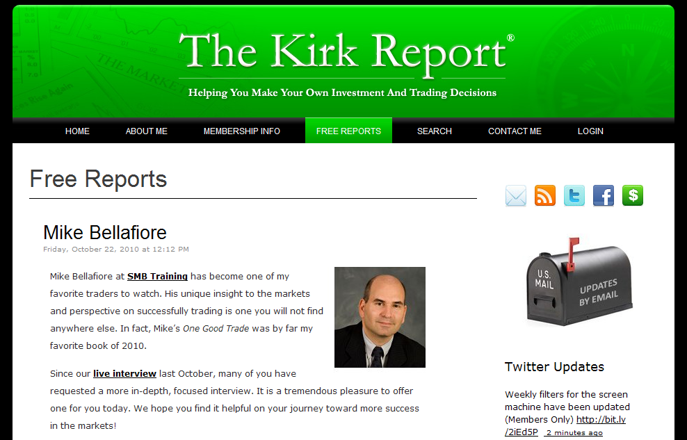

## Table of Contents

## What is the Kirk Report?

The Kirk Report is a popular financial newsletter created by Charles E. Kirk. It offers insights and analysis on the stock market, helping investors make better decisions. Charles Kirk started the report in 1997 and it quickly gained a following among investors looking for reliable information.

The newsletter covers a wide range of topics, including market trends, investment strategies, and stock picks. It is known for its honest and straightforward approach, making it useful for both new and experienced investors. Many people trust the Kirk Report because of its detailed analysis and Charles Kirk's expertise in the financial world.

## Who is the founder of the Kirk Report?

The founder of the Kirk Report is Charles E. Kirk. He started the newsletter in 1997. Charles wanted to help people understand the stock market better. He used his knowledge to give good advice to investors.

The Kirk Report became popular because it was honest and easy to understand. People liked how Charles explained things clearly. Many investors, both new and experienced, found the newsletter very helpful. Charles's expertise made the Kirk Report a trusted source of information.

## When was the Kirk Report first published?

The Kirk Report was first published in 1997. Charles E. Kirk started it because he wanted to help people understand the stock market better. He used his knowledge to give good advice to investors.

The newsletter became popular quickly. People liked how Charles explained things in a clear and honest way. Both new and experienced investors found the Kirk Report very helpful. It became a trusted source of information because of Charles's expertise.

## What is the main focus of the Kirk Report?

The Kirk Report mainly focuses on helping people understand the stock market. It gives advice on how to invest money wisely. The newsletter talks about market trends, which means it explains what is happening in the stock market and why. It also shares different ways to invest, called investment strategies. Plus, it suggests specific stocks that might be good to buy.

Charles E. Kirk, who started the Kirk Report, uses simple and honest language to explain these things. This makes it easier for both new and experienced investors to understand. People trust the Kirk Report because Charles knows a lot about the stock market. His newsletter has become a helpful tool for anyone wanting to make smart investment choices.

## How often is the Kirk Report updated?

The Kirk Report is updated regularly. Charles E. Kirk makes sure to keep the newsletter fresh with new information. He usually updates it every week. This means people can get the latest news and advice about the stock market often.

Keeping the Kirk Report updated weekly helps investors stay informed. They can see new market trends and get new investment ideas. Charles works hard to make sure the information is useful and easy to understand. This way, people can make better choices about their money.

## What types of content are included in the Kirk Report?

The Kirk Report includes many different types of content to help people learn about the stock market. It talks about what is happening in the market right now, which is called market trends. This helps people understand why the market is going up or down. The newsletter also gives advice on how to invest money, which are called investment strategies. These strategies can help people decide the best way to use their money.

Another important part of the Kirk Report is the stock picks. These are suggestions of specific stocks that might be good to buy. Charles E. Kirk uses his knowledge to choose these stocks carefully. The newsletter also explains things in a simple and honest way, so it is easy for everyone to understand. This makes it helpful for both new and experienced investors who want to make smart choices about their money.

## How can someone subscribe to the Kirk Report?

To subscribe to the Kirk Report, you need to visit their website. On the website, you will find a section where you can sign up for the newsletter. You will need to enter your email address and some other information. After you sign up, you will start getting the Kirk Report in your email every week.

Subscribing to the Kirk Report is easy and it helps you stay updated on the stock market. Charles E. Kirk makes sure the newsletter is full of useful information. By subscribing, you can learn about market trends, get investment strategies, and see stock picks that might help you make smart choices with your money.

## What are the benefits of subscribing to the Kirk Report?

Subscribing to the Kirk Report gives you a lot of helpful information about the stock market. Charles E. Kirk shares his knowledge every week, so you can learn about what is happening in the market. He explains things in a simple way, which makes it easy for everyone to understand. This can help you see market trends and understand why the market is moving the way it is.

Another big benefit is that you get investment strategies and stock picks. Charles gives advice on how to invest your money wisely. He suggests specific stocks that might be good to buy. This can help you make better choices about your investments. By reading the Kirk Report, you can feel more confident about your decisions in the stock market.

## How does the Kirk Report help investors make better decisions?

The Kirk Report helps investors make better decisions by giving them clear and honest information about the stock market. Charles E. Kirk explains what is happening in the market in a simple way, so everyone can understand. He talks about market trends, which means he helps people see why the market is going up or down. This makes it easier for investors to know when to buy or sell stocks.

Another way the Kirk Report helps is by sharing investment strategies and stock picks. Charles gives advice on how to invest money wisely. He suggests specific stocks that might be good to buy. This can help people decide which investments might be the best for them. By reading the Kirk Report, investors can feel more confident about their choices and make smarter decisions with their money.

## What are some notable successes or case studies mentioned in the Kirk Report?

The Kirk Report often highlights successful investment strategies and specific stock picks that have done well. For example, Charles E. Kirk once recommended a stock that went up a lot in value. He explained why he thought the stock would do well, and it turned out he was right. People who followed his advice made money. This shows how his careful analysis can help investors pick good stocks.

Another success story from the Kirk Report is when Charles shared a strategy for investing during a market downturn. He gave clear steps on what to do when the market was going down. Many investors followed this advice and were able to protect their money and even make some gains. This case study shows how the Kirk Report's practical tips can help people navigate tough times in the stock market.

## How does the Kirk Report compare to other investment newsletters?

The Kirk Report stands out from other investment newsletters because it is written in a simple and honest way. Charles E. Kirk explains things clearly, so both new and experienced investors can understand. Many other newsletters use complicated language that can be hard to follow. The Kirk Report also gives weekly updates, which means people get fresh information often. This helps investors stay on top of what is happening in the market.

Another way the Kirk Report is different is that it focuses on practical advice. Charles shares real strategies and stock picks that have worked well in the past. He also explains why he thinks certain stocks will do well. Some other newsletters might just give general advice without specific examples. The Kirk Report's detailed analysis and case studies help people see how to apply the advice to their own investments. This makes it a valuable tool for anyone looking to make smart choices in the stock market.

## What advanced strategies or insights does the Kirk Report offer to expert investors?

The Kirk Report offers expert investors advanced strategies that help them navigate the stock market better. Charles E. Kirk shares detailed analysis of market trends, which means he looks closely at what is happening and why. This helps expert investors see patterns and make smarter choices about when to buy or sell stocks. He also gives insights into how different events, like economic reports or company news, can affect the market. This kind of deep understanding can help expert investors plan their moves more carefully.

Another way the Kirk Report helps expert investors is by providing specific stock picks and investment strategies that are more advanced. Charles explains why he thinks certain stocks will do well, using data and his own experience. This can help expert investors find opportunities that others might miss. He also shares case studies of past successes, showing how his strategies have worked before. This gives expert investors real examples to learn from and apply to their own investments.

## References & Further Reading

[1]: ["Advances in Financial Machine Learning"](https://www.amazon.com/Advances-Financial-Machine-Learning-Marcos/dp/1119482089) by Marcos Lopez de Prado

[2]: ["Evidence-Based Technical Analysis: Applying the Scientific Method and Statistical Inference to Trading Signals"](https://www.amazon.com/Evidence-Based-Technical-Analysis-Scientific-Statistical/dp/0470008741) by David Aronson

[3]: ["Machine Learning for Algorithmic Trading"](https://github.com/PacktPublishing/Machine-Learning-for-Algorithmic-Trading-Second-Edition) by Stefan Jansen

[4]: ["Quantitative Trading: How to Build Your Own Algorithmic Trading Business"](https://books.google.com/books/about/Quantitative_Trading.html?id=j70yEAAAQBAJ) by Ernest P. Chan

[5]: Aldridge, I. (2013). ["High-Frequency Trading: A Practical Guide to Algorithmic Strategies and Trading Systems"](https://www.amazon.com/High-Frequency-Trading-Practical-Algorithmic-Strategies/dp/1118343506). Wiley.