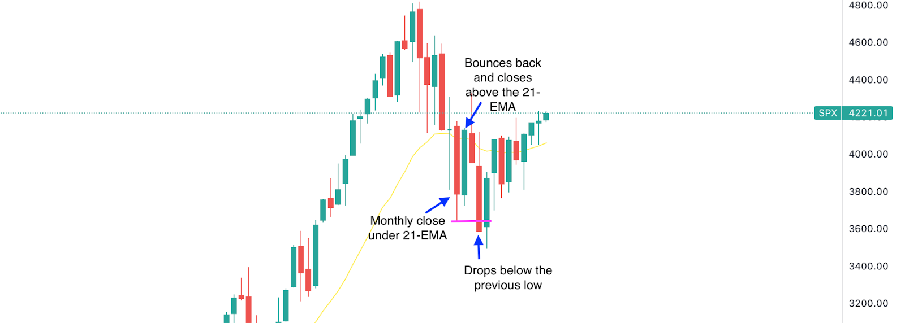

## Table of Contents

## What is the Kiss of Death trading strategy?

The Kiss of Death trading strategy is a method used by traders to spot when a stock might be about to drop in value. It involves looking at a stock's price chart for a specific pattern. The pattern happens when the stock's price reaches a new high, but certain indicators like the Relative Strength Index (RSI) or the Moving Average Convergence Divergence (MACD) do not follow and instead show a bearish signal. This mismatch suggests that the stock's upward trend might be losing steam, and a price drop could be coming soon.

Traders using the Kiss of Death strategy will watch for this pattern and then make their trading decisions based on it. If they see the pattern, they might decide to sell their shares of the stock or even short sell it, betting that the price will go down. This strategy can be risky because it relies on the trader's ability to correctly read the signals and act quickly. However, when used correctly, it can help traders avoid losses or make profits from falling stock prices.

## How did the Kiss of Death strategy originate?

The Kiss of Death strategy started as traders looked for ways to predict when a stock's price might fall. They noticed that sometimes, even when a stock's price hit a new high, other signs on the chart didn't match up. These signs, like the RSI or MACD, would show that the stock wasn't as strong as it seemed. Traders began calling this mismatch the "Kiss of Death" because it often meant the stock's price would soon drop.

Over time, more traders started using this pattern to make decisions about buying and selling stocks. They would watch for the Kiss of Death and then act quickly to avoid losses or make profits. The strategy became popular because it helped traders spot when a stock's upward trend might be ending, giving them a chance to react before the price fell.

## What are the key components of the Kiss of Death strategy?

The Kiss of Death strategy has a few main parts that traders look at. First, they watch the stock's price to see if it reaches a new high. This means the stock is doing better than it ever has before. But, the key part of the strategy is to also check other signs on the chart, like the Relative Strength Index (RSI) or the Moving Average Convergence Divergence (MACD). These signs should be going up too if the stock is really strong. If they are not, and instead, they show a bearish signal, that's when traders get worried.

When the stock's price hits a new high but the RSI or MACD does not follow and shows a bearish signal, traders call this the "Kiss of Death." It means the stock might not be as strong as it looks, and its price could soon start to fall. Traders who see this pattern might decide to sell their shares quickly to avoid losing money, or they might even short sell the stock, betting that the price will go down. This strategy can be risky, but it helps traders make quick decisions based on what they see on the chart.

## Can you explain the basic steps to implement the Kiss of Death strategy?

To use the Kiss of Death strategy, you first need to keep an eye on a stock's price. You are looking for the moment when the stock reaches a new high. This means the price of the stock is higher than it has ever been before. But, just watching the price isn't enough. You also need to look at other signs on the chart, like the Relative Strength Index (RSI) or the Moving Average Convergence Divergence (MACD). These signs help you understand if the stock is really as strong as it looks.

The important part comes when the stock hits that new high, but the RSI or MACD doesn't follow. Instead, these signs might show a bearish signal, meaning they suggest the stock might start to go down soon. When you see this mismatch, that's what traders call the "Kiss of Death." If you see this pattern, you might decide to sell your shares of the stock quickly to avoid losing money. Or, if you're brave, you might even short sell the stock, betting that the price will drop. This strategy can be risky, but it helps you make quick decisions based on what you see on the chart.

## What types of securities are best suited for the Kiss of Death strategy?

The Kiss of Death strategy works best with stocks that have a lot of trading activity. These are usually stocks from big companies that many people buy and sell every day. When lots of people are trading a stock, it's easier to spot patterns like the Kiss of Death on the price chart. Stocks from smaller companies might not have enough trading to show clear patterns, so the strategy might not work as well with them.

This strategy can also be used with exchange-traded funds (ETFs) that follow a group of stocks. ETFs that track popular indexes, like the S&P 500, can be good choices because they have a lot of trading activity. Just like with individual stocks, you need to watch for the same signs on the chart to use the Kiss of Death strategy with ETFs.

## What are the common indicators used in the Kiss of Death strategy?

The Kiss of Death strategy uses two main indicators to spot when a stock might start to fall: the Relative Strength Index (RSI) and the Moving Average Convergence Divergence (MACD). The RSI measures how fast and how much a stock's price is changing. It helps traders see if a stock is overbought or oversold. If the RSI starts to go down when the stock hits a new high, it's a warning sign. The MACD is another tool that shows the relationship between two moving averages of a stock's price. When the MACD line crosses below the signal line while the stock is at a new high, it's another bearish signal.

Traders look at these indicators to see if they match what the stock's price is doing. If the stock reaches a new high but the RSI or MACD shows a bearish signal, that's the Kiss of Death. This means the stock might not be as strong as it looks, and its price could soon start to drop. Traders who see this pattern might decide to sell their shares quickly to avoid losing money, or they might even short sell the stock, betting that the price will go down.

## How does the Kiss of Death strategy help in identifying potential trend reversals?

The Kiss of Death strategy helps traders spot when a stock's price might start to go down after being on the rise. It does this by looking at a special pattern on the stock's price chart. When a stock reaches a new high, it might seem like it will keep going up. But if other signs on the chart, like the RSI or MACD, don't agree and show a bearish signal instead, that's the Kiss of Death. It means the stock's upward trend might be losing strength, and a price drop could be coming soon.

Traders use this pattern to make quick decisions. If they see the Kiss of Death, they might sell their shares of the stock to avoid losing money. Some traders might even short sell the stock, betting that the price will go down. This strategy can be risky because it relies on reading the signs correctly and acting fast. But when used right, it helps traders catch the moment when a stock's trend might be about to reverse, giving them a chance to react before the price falls.

## What are the risks associated with using the Kiss of Death strategy?

Using the Kiss of Death strategy can be risky because it relies on spotting a specific pattern on a stock's price chart. If you see the pattern wrong or too late, you might make the wrong decision. For example, you might sell your shares too soon or short sell a stock that keeps going up instead of dropping. This can lead to losses if the stock's price doesn't fall like you expected.

Another risk is that the stock market can be unpredictable. Even if you see the Kiss of Death pattern clearly, other things like news or changes in the economy can affect the stock's price. If something unexpected happens, the stock might not follow the pattern you saw, and you could lose money. It's important to be careful and maybe not bet all your money on this one strategy.

## How can traders manage risk when applying the Kiss of Death strategy?

Traders can manage risk when using the Kiss of Death strategy by not putting all their money into one stock. Instead, they can spread their money across different stocks or even different types of investments. This way, if one stock doesn't follow the Kiss of Death pattern and goes up instead of down, the trader won't lose all their money. It's also a good idea to set stop-loss orders. These are like safety nets that automatically sell the stock if it drops to a certain price, helping to limit how much money the trader can lose.

Another way to manage risk is by doing a lot of research before making any trades. Traders should look at the stock's history and understand what might affect its price, like news or changes in the economy. They should also keep an eye on other signs on the chart, not just the RSI or MACD, to get a fuller picture of what might happen. By being careful and using these strategies, traders can lower the risks of using the Kiss of Death strategy and make smarter decisions.

## What are some real-world examples of the Kiss of Death strategy in action?

A real-world example of the Kiss of Death strategy happened with Tesla stock in early 2021. The stock hit a new high, but the RSI didn't follow and started to go down. This mismatch was a clear Kiss of Death signal. Traders who saw this pattern sold their shares or short sold the stock, betting that the price would drop. Sure enough, Tesla's stock price did fall soon after, and those traders who acted on the Kiss of Death signal avoided losses or even made profits.

Another example was with GameStop stock in early 2021 during the meme stock frenzy. The stock reached a new high, but the MACD showed a bearish signal. This was the Kiss of Death pattern. Some traders recognized this and sold their shares or short sold the stock. While the stock's price did drop eventually, the situation was very volatile due to the high interest from retail investors. This shows that even with the Kiss of Death strategy, unexpected events can still affect the outcome.

## How does the Kiss of Death strategy compare to other popular trading strategies?

The Kiss of Death strategy is different from other popular trading strategies like the Moving Average Crossover and the Bollinger Bands strategy. The Moving Average Crossover strategy uses two moving averages to spot when a stock's trend might change. When the shorter-term moving average crosses above the longer-term one, it's a sign to buy, and when it crosses below, it's a sign to sell. The Kiss of Death strategy, on the other hand, looks at a specific pattern where a stock hits a new high but other signs like the RSI or MACD show a bearish signal. This makes it more focused on catching the moment right before a stock's price might start to fall.

Another strategy, the Bollinger Bands strategy, uses bands around the stock's price to spot when it might be overbought or oversold. When the price touches the upper band, it might be a good time to sell, and when it touches the lower band, it might be a good time to buy. The Kiss of Death strategy is different because it's not just about the price touching a certain point. It's about the price hitting a new high while other indicators are saying the stock might not be as strong as it looks. Both strategies try to help traders make money, but they look at different things on the chart to make their decisions.

## What advanced techniques can be used to enhance the effectiveness of the Kiss of Death strategy?

To make the Kiss of Death strategy work better, traders can use other tools and signs along with the RSI and MACD. One way is to look at the stock's trading [volume](/wiki/volume-trading-strategy). If the stock hits a new high but the trading volume is low, it might mean the new high isn't as strong as it looks. Another tool traders can use is the Stochastic Oscillator, which helps them see if a stock is overbought or oversold. If the Stochastic Oscillator shows a bearish signal when the stock hits a new high, it can make the Kiss of Death pattern even clearer.

Traders can also use something called a Fibonacci retracement to spot where a stock's price might go next. If the stock hits a new high but then pulls back to a key Fibonacci level while the RSI or MACD shows a bearish signal, it can be a strong sign that the stock's price will keep falling. By using these extra tools and signs, traders can get a better idea of when to act on the Kiss of Death pattern, helping them make smarter decisions and possibly avoid losses or make more profits.

## What is the Kiss of Death Signal and how can it be understood?

The Kiss of Death is a stock market pattern known for its potential to signal upcoming bear markets. It is identified by a specific sequence of movements in the S&P 500 index. The sequence begins with the index reaching an all-time high, followed by a decline that takes it below its monthly 21-day exponential moving average (EMA). After falling below the 21-EMA, the index recovers slightly, rising back above the 21-EMA before subsequently dropping below the prior low. This pattern suggests a lack of sustained [momentum](/wiki/momentum) in the market, which may signal the onset of significant economic downturns.

Historically, the Kiss of Death has been associated with some of the most crucial market crashes, serving as a precursor to the downturns experienced in years such as 1969, 1973, 1978, 2001, and 2008. By analyzing historical data, traders have found that this pattern, although rare, has proven to be an ominous signal that warrants consideration.

The setup of the Kiss of Death is rooted in technical analysis, where the movements around the 21-day EMA play a central role. The 21-day EMA is utilized due to its ability to smooth out price data and provide a more responsive measure to recent price movements compared to simple moving averages. The formula for computing the EMA is:

$$

\text{EMA}_t = \alpha \cdot P_t + (1 - \alpha) \cdot \text{EMA}_{t-1} 
$$

where $P_t$ is the price at time $t$ and $\alpha$ is the smoothing factor, typically calculated as:

$$

\alpha = \frac{2}{n+1} 
$$

with $n$ being the number of periods, which in this case is 21 days. This responsiveness to recent price changes makes the EMA particularly useful in identifying short-term market trends and potential reversals.

The significance of the Kiss of Death lies not only in its historical success at predicting downturns but also in its rarity, making it a key signal for traders to monitor. However, like all technical indicators, it is not infallible and must be used in conjunction with other data and analysis to form a comprehensive trading strategy.

## Question: How effective is backtesting?

Backtesting is a crucial process in [algorithmic trading](/wiki/algorithmic-trading) that involves applying historical data to evaluate the performance of a specific trading strategy before its application in real-time trading scenarios. In the case of the Kiss of Death signal, [backtesting](/wiki/backtesting) can provide insights into its potential benefits and drawbacks for traders.

A study that backtested the Kiss of Death strategy starting from 1967 found compelling results. This analysis demonstrated that using the Kiss of Death signal as a basis for trading decisions led to a higher Compound Annual Growth Rate (CAGR) compared to a passive investing approach, such as simply holding the S&P 500 index. The CAGR is calculated using the formula:

$$
\text{CAGR} = \left( \frac{\text{Ending Value}}{\text{Beginning Value}} \right)^{\frac{1}{n}} - 1
$$

where $n$ is the number of years. An increased CAGR indicates the growth potential of the strategy over time.

Moreover, beyond achieving a superior growth rate, one of the significant advantages noted was in mitigating maximum drawdowns. A drawdown is the peak-to-trough decline during a specific period for an investment, indicating susceptibility to substantial losses. By reducing the severity of these drawdowns, the Kiss of Death strategy provides a layer of risk management, which is particularly important for risk-averse traders. Lower drawdowns mean that traders would need to recover less to return to their preceding peak value, a cornerstone of capital preservation in trading.

For those conducting backtesting using Python, a sample code snippet using pandas and numpy libraries might look like this:

```python
import pandas as pd
import numpy as np

# Load historical data
data = pd.read_csv('sp500_data.csv', parse_dates=['Date'], index_col='Date')

# Calculate 21-day EMA
data['EMA_21'] = data['Close'].ewm(span=21, adjust=False).mean()

# Identify Kiss of Death signal occurrences
data['Signal'] = np.where((data['Close'] < data['EMA_21']) &
                          (data['Close'].shift(1) > data['EMA_21'].shift(1)), 1, 0)

# Backtest strategy returns
data['Strategy_Returns'] = data['Close'].pct_change() * data['Signal'].shift(1)

# Calculate cumulative returns for the strategy and benchmark (S&P 500)
data['Strategy_Cumulative'] = (1 + data['Strategy_Returns']).cumprod()
data['Benchmark_Cumulative'] = (1 + data['Close'].pct_change()).cumprod()

# Calculate maximum drawdown
rolling_max = data['Benchmark_Cumulative'].cummax()
drawdown = data['Benchmark_Cumulative'] / rolling_max - 1
max_drawdown = drawdown.cummin()

print(f'Maximum Drawdown: {max_drawdown.min()}')
print(f'CAGR: {data["Strategy_Cumulative"].iloc[-1]**(1/n_years) - 1}')
```

This illustrates how traders might implement a basic backtesting routine to assess the signal's profitability and risk management potential. However, it's crucial to remember that while backtesting provides historical insights, it does not guarantee future performance, especially considering the ever-changing dynamics of financial markets.

## How can the Kiss of Death be implemented in trading strategies?

The Kiss of Death, while historically significant as an indicator of market downturns, demonstrated its limitations in 2022 when it failed to precede a significant market decline. Traders aiming to incorporate this signal into their strategies must recognize the potential for false signals. To counteract these inaccuracies, robust risk management and adaptive strategies are essential components in optimizing the use of the Kiss of Death within algorithmic trading frameworks.

Risk management begins with setting predefined stop-loss and take-profit levels tailored to an individual's risk tolerance. For example, traders might establish a stop-loss at a specific percentage below the entry price to limit potential losses. Adaptive position sizing, adjusting the number of shares or contracts held based on the level of risk associated with each trade, further strengthens risk management.

To enhance signal accuracy, traders can integrate additional confirmations alongside the Kiss of Death. Macroeconomic indicators, such as GDP growth rates, unemployment figures, or central bank policies, can provide a broader economic context, thus validating or contradicting signals from the stock market pattern. Technical indicators like the Relative Strength Index (RSI) or Moving Average Convergence Divergence (MACD) can offer further insight. For instance, a declining RSI alongside the Kiss of Death could reinforce the bearish signal.

A weighted confirmation approach can be implemented, where each indicator is assigned a weight based on its historical reliability:

$$

\text{Composite Signal} = w_1 \times \text{Kiss of Death} + w_2 \times \text{RSI} + w_3 \times \text{MACD} + w_4 \times \text{Macroeconomic indicator}
$$

The weights ($w_1, w_2, w_3, w_4$) are optimized based on backtesting results to minimize false positives.

Python can be utilized to automate the calculation and implementation of these strategies. Traders can use libraries such as pandas for data manipulation and matplotlib for visualization. Below is a sample code snippet to calculate a composite signal:

```python
import pandas as pd
import numpy as np

# Example data
data = pd.DataFrame({
    'KissOfDeath': np.random.rand(100),
    'RSI': np.random.rand(100),
    'MACD': np.random.rand(100),
    'Macro': np.random.rand(100)
})

# Weights
w1, w2, w3, w4 = 0.4, 0.2, 0.2, 0.2

# Composite Signal Calculation
data['CompositeSignal'] = (
    w1 * data['KissOfDeath'] +
    w2 * data['RSI'] +
    w3 * data['MACD'] +
    w4 * data['Macro']
)

# Display the first few rows
print(data.head())
```

By employing these strategies, traders can mitigate the risks associated with the Kiss of Death, enhancing their algorithmic trading performance through a systematic and diversified approach.

## References & Further Reading

[1]: Adeleke, T. (2023). ["Exploring the 'Kiss of Death' Signal and its Market Impact."](https://pubmed.ncbi.nlm.nih.gov/37757675/) Financial Times.

[2]: ["Advances in Financial Machine Learning"](https://www.amazon.com/Advances-Financial-Machine-Learning-Marcos/dp/1119482089) by Marcos Lopez de Prado.

[3]: Edwards, R., Magee, J., & Bassetti, W. (2007). ["Technical Analysis of Stock Trends"](https://books.google.com/books/about/Technical_Analysis_of_Stock_Trends.html?id=cVJmDwAAQBAJ) (10th ed.). CRC Press. 

[4]: Wenzel, R. (2019). ["Algorithmic Risk Management: A Study of Risk Mitigation in Algorithmic Trading."](https://www.tandfonline.com/doi/full/10.1080/0960085X.2021.1927212) Springer.

[5]: ["Quantitative Trading: How to Build Your Own Algorithmic Trading Business"](https://books.google.com/books/about/Quantitative_Trading.html?id=j70yEAAAQBAJ) by Ernest P. Chan. 

[6]: Wilmott, P. (2006). ["Paul Wilmott Introduces Quantitative Finance"](https://www.amazon.com/Paul-Wilmott-Introduces-Quantitative-Finance/dp/0470319585). John Wiley & Sons. 