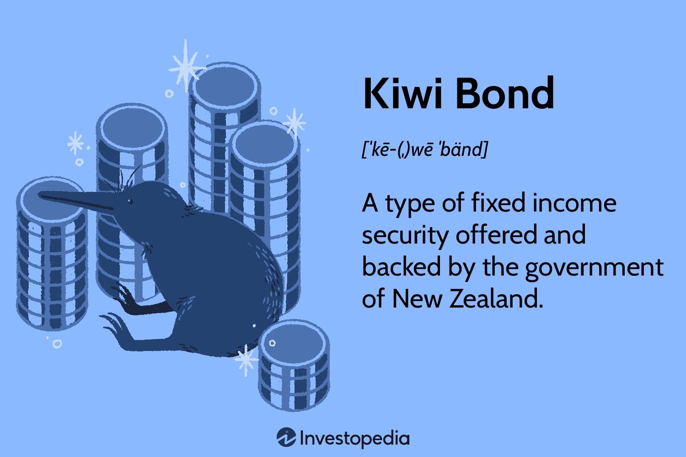

Kiwi Bonds represent a distinct investment opportunity tailored for New Zealand residents, offering a secure, government-backed fixed income alternative. These bonds serve as a critical component of the country's financial framework, ensuring that investors have access to stable, risk-averse vehicles for their capital. By providing fixed interest rates over various maturity periods, Kiwi Bonds enable residents to manage their investment timelines and financial goals with a high level of certainty.

In the ever-evolving landscape of financial markets, understanding the mechanics and benefits of Kiwi Bonds becomes crucial. This article aims to provide a comprehensive overview of Kiwi Bonds, examining their role in New Zealand's investment ecosystem and the innovative strategies employed to optimize returns through algorithmic trading. With the advent of cutting-edge technologies, algorithmic trading has emerged as a significant aspect, offering investors the capability to enhance their decisions by analyzing real-time data and executing trades with precision.



Kiwi Bonds are unique not only for their government backing but also for their alignment with the needs of conservative investors. Their structured characteristics, combined with the minimal risk associated with government-issued securities, make them an appealing option for those seeking stability over potentially higher but volatile returns. However, the lower interest rates often associated with Kiwi Bonds necessitate a thoughtful consideration of their place within a broader investment portfolio.

Moreover, the analysis presented in this article will explore how these bonds fit into the larger context of government securities and how algorithmic trading strategies can potentially optimize investment outcomes. This innovative approach allows investors to balance the modest returns of Kiwi Bonds with higher-yield options, thereby maximizing overall portfolio performance. For New Zealand residents, understanding these dynamics is instrumental in navigating the diverse financial landscape and making informed investment choices.

## Table of Contents

## What Are Kiwi Bonds?

Kiwi Bonds represent a specific category of fixed income securities issued and managed by the New Zealand government, targeted exclusively at New Zealand residents. These bonds serve as a secure investment vehicle, offering a fixed rate of interest over designated maturity periods, and are available for investment with a minimum amount of NZ$1,000.

The structure of Kiwi Bonds is straightforward. They are available with maturity periods that typically range from six months to four years. The primary appeal of these bonds lies in their government backing, which inherently provides a high level of security to investors. This government backing assures investors of the repayment of the principal amount along with the interest, thereby mitigating credit risk—a significant consideration in investment decisions.

Interest rate mechanics of Kiwi Bonds are crucial for understanding their benefits. The interest rates on these bonds are fixed at the outset and remain constant throughout the investment period, irrespective of fluctuations in the broader [interest rate](/wiki/interest-rate-trading-strategies) environment. This fixed interest structure provides predictability in income streams, a desirable trait for investors seeking stable returns. However, it is important to note that the interest rates offered on Kiwi Bonds are often lower than those available from other investment avenues, primarily due to their reduced risk level compared to market-linked securities or corporate bonds.

To contextualize the interest earnings: If an investor purchases Kiwi Bonds worth NZ$5,000 at an interest rate of 2.5% per annum, the annual interest income can be calculated as follows:

$$
\text{Annual Interest} = \text{Principal} \times \text{Interest Rate} = \text{NZ\$5,000} \times 0.025 = \text{NZ\$125}
$$

This calculation illustrates the interest income one can expect from holding the bonds over a year, provided they opt for a maturity period that spans at least twelve months.

Kiwi Bonds, by virtue of their security, are particularly appealing to conservative investors who prioritize the preservation of capital over higher-risk, higher-return alternatives. While they do not offer the potential for high returns seen in more volatile investment options, their stability makes them an attractive option within a diversified investment portfolio, particularly for individuals seeking to shield a portion of their holdings from market [volatility](/wiki/volatility-trading-strategies). 

Ultimately, Kiwi Bonds offer a blend of security and modest income, serving as a reliable fixed-income component within the investment spectrum available to New Zealand residents.

## The Operation and Benefits of Kiwi Bonds

Kiwi Bonds are managed by the New Zealand Debt Management Office (NZDMO), ensuring their credibility and security. These bonds are government securities designed to provide a stable investment option for New Zealand residents. The NZDMO acts as a crucial overseer, facilitating the issuance and management of these bonds, which ultimately serve as a source of funding for the New Zealand government.

Investors in Kiwi Bonds receive fixed interest rates on their investments. These rates are typically paid on a quarterly basis, calculated in arrears. The interest rate is set at the time of investment and remains constant throughout the duration of the bond's term, offering predictability for investors. Although these rates might be lower compared to other investment instruments available in the market, the rates are specifically designed to be competitive with domestic wholesale interest rates. This means that while Kiwi Bonds may not deliver the highest possible returns, they provide a reliable benchmark consistent with national interest rate trends.

In terms of security, Kiwi Bonds stand out due to their backing by the New Zealand government. This government guarantee significantly reduces the risk associated with these bonds. As a result, investors can expect a high degree of reliability in securing their principal and receiving interest payments as scheduled. Such stability makes Kiwi Bonds particularly appealing to conservative investors who prioritize the preservation of capital and a steady return on investment over higher-risk, volatile options.

The primary advantage of Kiwi Bonds lies in their ability to offer a secure yet modest return. For individuals prioritizing safety and predictability in their investment portfolio, Kiwi Bonds represent an ideal choice. The combination of government backing, fixed returns, and simple investment mechanisms make them suitable for investors seeking a low-risk, stable investment. By providing these features, Kiwi Bonds occupy a unique position within New Zealand's array of investment opportunities, catering specifically to those with a conservative investment profile.

## Algorithmic Trading and Kiwi Bonds

Algorithmic trading, an advanced method utilizing automated algorithms to execute trading strategies, plays a significant role in the trading of government securities, including Kiwi Bonds. The emergence of [algorithmic trading](/wiki/algorithmic-trading) has transformed the financial landscape by leveraging computing power to analyze real-time data, optimize decision-making, and enhance trading efficiency. This process involves creating algorithms that analyze market conditions and execute trades faster than any human could, allowing investors to capitalize on small price movements and execute strategies with high precision.

In the context of Kiwi Bonds, algorithmic trading holds particular relevance. These bonds, being government-backed securities, traditionally offer lower yields compared to more volatile market instruments. However, algorithms can optimize the investment mix by balancing Kiwi Bonds with higher-yield securities, thus improving overall portfolio returns. For instance, algorithms can simulate various market scenarios and reallocate investments dynamically, providing a strategy that aligns with specific risk profiles while ensuring stable returns from secure Kiwi Bonds.

Algorithmic trading strategies applied to Kiwi Bonds focus on efficiency and timely responses to market changes. Algorithms can continuously assess interest rate trends, economic indicators, and market sentiment, swiftly adapting the investment portfolio. For example, Python libraries such as `pandas` and `numpy` allow for efficient data manipulation and numerical analysis, thereby supporting the development of models that predict optimal times for buying or selling bonds based on comprehensive historical data.

```python
import pandas as pd
import numpy as np

# Sample dataframe simulating market data
market_data = pd.DataFrame({
    'date': pd.date_range(start='2023-01-01', periods=100, freq='D'),
    'kiwi_bond_rate': np.random.normal(loc=0.02, scale=0.005, size=100),
    'market_index': np.random.normal(loc=0.05, scale=0.01, size=100)
})

# Calculate moving average to identify trend
market_data['moving_avg'] = market_data['kiwi_bond_rate'].rolling(window=7).mean()

# Simple trading signal based on moving average
market_data['signal'] = np.where(market_data['kiwi_bond_rate'] > market_data['moving_avg'], 'BUY', 'SELL')

print(market_data.tail())
```

This Python code exemplifies a simple methodology for generating trading signals based on moving averages of Kiwi Bond interest rates. Such signals help in determining when the bond rates are favorable for buying or selling, enhancing investment strategy efficiency.

Furthermore, algorithmic trading facilitates risk management, a crucial aspect when dealing with lower-return investments like Kiwi Bonds. By integrating risk assessment models, algorithms can adjust the asset allocation mix, mediate potential downturns, and supplement Kiwi Bonds with strategically chosen, risk-adjusted high-yield assets. This balanced approach maximizes returns without compromising the safety and stability offered by the Kiwi Bonds.

In summary, algorithmic trading significantly augments the performance of Kiwi Bond investments by utilizing real-time data analysis, market predictions, and efficient asset allocation strategies. By reducing manual intervention and employing sophisticated algorithms, investors achieve optimized portfolios that maintain the security of Kiwi Bonds while enhancing potential returns through dynamic investment strategies.

## Comparison with Other Government Securities

New Zealand provides a variety of government securities that cater to different investment preferences and risk tolerances among residents. These include Kiwi Bonds, Nominal Bonds, Inflation-Indexed Bonds, and Treasury Bills. Each of these instruments offers distinct characteristics in terms of risk, return potential, and eligibility requirements for investors.

### Nominal Bonds
Nominal Bonds are long-term debt securities issued by the New Zealand government with a fixed coupon rate. Typically, these bonds have maturities ranging from several years to decades. Investors receive regular interest payments, known as coupons, during the life of the bond. The principal amount is returned at maturity. These bonds are often favored by those seeking regular income and willing to accept moderate risk, as their prices are susceptible to fluctuations in interest rates. Compared to Kiwi Bonds, Nominal Bonds may offer higher returns but entail greater exposure to interest rate volatility.

### Inflation-Indexed Bonds
Inflation-Indexed Bonds are designed to protect investors from inflation risk, as their principal and interest payments are adjusted according to changes in the Consumer Price Index (CPI). In New Zealand, these are known as Inflation-Indexed New Zealand Government Bonds (IIBs). IIBs appeal to investors looking to maintain purchasing power and receive a real return over time. This comes in contrast to Kiwi Bonds, which do not provide inflation protection. Although IIBs seem attractive for inflation risk mitigation, they usually offer lower nominal yields compared to non-inflation-protected bonds.

### Treasury Bills
Treasury Bills (T-Bills) are short-term government securities with maturities of one year or less. They are issued at a discount to their face value, and the return to the investor is the difference between the purchase price and the value at maturity. T-Bills are considered very low-risk due to their short duration and government backing. They provide [liquidity](/wiki/liquidity-risk-premium) and capital preservation, although returns are generally lower than longer-term securities like Nominal Bonds or IIBs. Compared to Kiwi Bonds, T-Bills have different risk-return profiles due to their shorter maturities, making them suitable for investors seeking minimal risk with quick liquidity.

### Comparison with Kiwi Bonds
Kiwi Bonds are short to medium-term investments specifically offered by the New Zealand government, primarily aimed at New Zealand residents. They provide fixed interest rates over maturities ranging from six months to four years. Unlike Nominal Bonds or IIBs, Kiwi Bonds focus on capital security and stable returns with less exposure to interest rate fluctuations or inflation risk. However, interest rates on Kiwi Bonds are generally lower than those offered by other government securities, reflecting their reduced risk profile.

In terms of eligibility, Kiwi Bonds are available exclusively to New Zealand residents, whereas Nominal Bonds, IIBs, and T-Bills can be purchased by both residents and international investors. This specific eligibility criterion makes Kiwi Bonds a unique offering within New Zealand's financial landscape, appealing particularly to risk-averse local investors.

### Conclusion
In summary, while Kiwi Bonds provide a safe, government-backed option with fixed returns suited for conservative investors, other New Zealand government securities such as Nominal Bonds, Inflation-Indexed Bonds, and Treasury Bills offer varying risk-return profiles and investment horizons. Understanding these differences can aid investors in aligning their investment strategies with their financial goals and risk appetite.

## Special Considerations and Eligibility

Kiwi Bonds represent a specific financial instrument tailored for New Zealand residents, with distinct eligibility and regulatory considerations. These bonds can only be purchased by individuals holding New Zealand residency, ensuring that the financial benefits remain within the country. Importantly, New Zealanders living overseas are generally excluded from purchasing Kiwi Bonds, a policy that underscores the government's intent to restrict bond ownership to those residing domestically.

From a policy perspective, Kiwi Bonds are regulated by frameworks designed to maintain the integrity and stability of the national investment market. These regulations ensure that the bonds are issued fairly and transparently, aligning with broader government objectives to promote secure investment opportunities while mitigating systemic risk.

The eligibility criteria and regulatory constraints play a crucial role in shaping the accessibility of Kiwi Bonds for potential investors. Residency requirements are strictly enforced, meaning that only those who can prove their residency status in New Zealand can participate in this investment opportunity. This exclusivity is both a strength and a limitation: while it guarantees the security and ease of investment for eligible residents, it restricts access for non-resident New Zealanders and international investors.

Kiwi Bonds stand out as a unique investment option due to their secure, government-backed nature and fixed interest returns. However, their limitations also manifest in their relatively lower yield compared to other investment vehicles, a characteristic that may not appeal to all investors. Consequently, they are particularly suited for conservative investors who prioritize stability over high returns.

In summary, Kiwi Bonds offer a specialized yet limited investment pathway, appealing mainly to New Zealand residents seeking safe, predictable returns. The combination of strict eligibility requirements and policy frameworks ensures that these bonds remain a distinct component of the nation's financial landscape, tailored to meet the needs of domestic investors within the country's regulatory environment.

## Conclusion

Kiwi Bonds provide New Zealand residents with a secure investment choice, backed by the government, that offers fixed returns. These bonds appeal especially to conservative investors due to their stability and security, despite offering relatively lower interest rates compared to other investment vehicles. By leveraging government backing, Kiwi Bonds eliminate credit risk, ensuring that investors receive their promised returns without concerns about issuer defaults.

The integration of algorithmic trading strategies with Kiwi Bonds presents a contemporary approach to managing investments in government securities. Algorithmic trading can optimize investment strategies by analyzing real-time data, potentially balancing the lower yields of Kiwi Bonds with higher-yielding assets. This approach allows investors to maintain a stable and secure portion of their portfolio while exploring opportunities for enhanced returns through automated investment techniques.

Gaining an understanding of the unique advantages and limitations of Kiwi Bonds enables investors to make informed choices in New Zealand's diverse financial landscape. While Kiwi Bonds may not offer the high returns associated with more volatile investments, their security and predictable income can serve as a foundational element in a well-diversified investment portfolio. This strategic integration underscores the importance of assessing individual investment goals and combining traditional government securities with innovative trading methodologies for optimized financial outcomes.

## References & Further Reading

[1]: Reserve Bank of New Zealand. ["New Zealand Government Bonds."](https://www.rbnz.govt.nz/statistics/series/exchange-and-interest-rates/wholesale-interest-rates)

[2]: New Zealand Debt Management. ["Kiwi Bonds."](https://debtmanagement.treasury.govt.nz/kiwi-bonds)

[3]: Lopez de Prado, M. (2018). ["Advances in Financial Machine Learning."](https://www.amazon.com/Advances-Financial-Machine-Learning-Marcos/dp/1119482089) Wiley.

[4]: Chan, E. P. (2009). ["Quantitative Trading: How to Build Your Own Algorithmic Trading Business."](https://github.com/ftvision/quant_trading_echan_book) Wiley.

[5]: Aronson, D. R. (2007). ["Evidence-Based Technical Analysis: Applying the Scientific Method and Statistical Inference to Trading Signals."](https://onlinelibrary.wiley.com/doi/book/10.1002/9781118268315) Wiley.