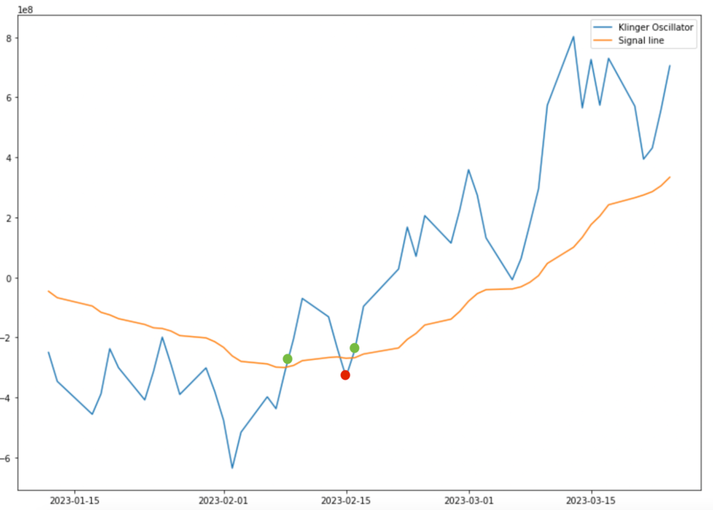

Understanding market dynamics is crucial for successful trading, and technical indicators play a vital role in this process. Technical indicators are mathematical calculations based on historical price, volume, or open interest information, helping traders predict future price movements. One such indicator is the Klinger Oscillator, developed by Stephen Klinger in 1977. This article explores the Klinger Oscillator, a technical indicator utilized in financial and algorithmic trading to provide insights into market trends and price movements.

The Klinger Oscillator focuses on analyzing money flow over the long term while identifying short-term fluctuations, which is essential for making informed trading decisions. By evaluating the relationship between volume and price changes, the oscillator converts this data into a valuable oscillatory signal. The tool measures the variance between two exponential moving averages (EMAs), typically set at 34 and 55 periods, and adapts to market conditions. Its formula, while straightforward, provides an in-depth look into the core mechanics of market dynamics.



In the era of algorithmic trading, integrating technical indicators such as the Klinger Oscillator into trading strategies can significantly enhance decision-making and trading efficiency. Algorithmic trading involves using complex algorithms to make trading decisions at speeds and frequencies surpassing human capability. By incorporating indicators like the Klinger Oscillator, traders can develop automated strategies that respond swiftly to market changes.

This introduction provides a foundation for understanding the Klinger Oscillator's mechanics, applications, and advantages in technical analysis. The following sections will delve deeper into its calculation, interpretation, comparative analysis with other indicators, limitations, and its use within algorithmic trading strategies. As such, the Klinger Oscillator offers a powerful tool for traders seeking to optimize their strategies and improve market performance.

## Table of Contents

## What is the Klinger Oscillator?

The Klinger Oscillator, introduced by Stephen Klinger in 1977, is a technical analysis tool that serves to discern the flow of money in and out of a market over extended periods, while simultaneously gauging short-term trends. This indicator is pivotal in differentiating between short-term price fluctuations and longer-term money flow trends, offering traders an enhanced perspective on potential market movements.

The core concept of the Klinger Oscillator revolves around the interplay between volume and price action. By examining these dynamics, the oscillator translates them into an oscillatory signal, which traders can use to infer the strength and direction of market trends. The indicator accomplishes this by quantifying the variance between two exponential moving averages (EMAs) of differing periods—typically set at 34 and 55. The mathematical expression for the Klinger Oscillator (KO) is:

$$
KO = \text{EMA}_{34}(\text{VF}) - \text{EMA}_{55}(\text{VF})
$$

In this formula, the Volume Force (VF) is a crucial component, derived by analyzing the [volume](/wiki/volume-trading-strategy) against the direction of the trend (whether it's positive or negative) in tandem with price oscillations. This synthesis of volume and price information into a singular metric provides traders with an integrated view, helping to fine-tune their trading strategies based on both historical and current market data.

One of the distinct advantages of the Klinger Oscillator is its capacity to simultaneously capture longer-term money flow trends and short-term price movements. This dual focus empowers traders to better anticipate shifts in market sentiment and adjust their trading actions accordingly. Through its systematic analysis of volume and pricing structures, the Klinger Oscillator efficiently aids in the forecasting of potential reversals and continuations in price trends, making it a valuable tool in the arsenal of technical analysts and traders alike.

## Formula and Calculation of the Klinger Oscillator

The Klinger Oscillator (KO) is a technical indicator designed to predict price reversals by analyzing the flow of money in and out of a security. It achieves this through a systematic calculation involving several components, primarily focusing on the Volume Force (VF). Here’s a detailed breakdown of the calculation process:

**Formula:**
The primary formula for the Klinger Oscillator is:

$$
KO = EMA_{34}(VF) - EMA_{55}(VF)
$$

where $EMA_{34}$ and $EMA_{55}$ represent the 34-period and 55-period exponential moving averages of Volume Force (VF), respectively.

**Volume Force (VF):**
Volume Force is central to the Klinger Oscillator. It evaluates the relationship between volume and the price trend with significant fluctuations, quantified as follows:

1. **Trend (T):** Determine if the trend is positive or negative:
   - A positive trend is identified when the current Close ($C_0$) is greater than the previous Close ($C_{-1}$).
   - A negative trend is identified when $C_0 < C_{-1}$.

2. **Volume (V):** Use the daily trading volume of the security.

3. **High (H), Low (L), and Close (C):** These are the standard price metrics used to calculate the VF over a particular duration.

The calculation of VF involves combining these elements to assess whether money is flowing into or out of the security, with price fluctuations leading to variations in the VF value.

**Calculation Steps for Klinger Oscillator:**

1. **Determine Volume Force (VF):** 
$$
   VF = Vol \times 100 \times \frac{(C - L) - (H - C)}{C + H - L}

$$
   - $Vol$ is the volume for the period.
   - $C$, $H$, and $L$ are the Close, High, and Low prices for the period.

2. **Calculate EMAs of VF:**
   - Compute the 34-period EMA of the Volume Force.
   - Compute the 55-period EMA of the Volume Force.

3. **Compute the Klinger Oscillator (KO):** 
$$
   KO = EMA_{34}(VF) - EMA_{55}(VF)

$$

Implementing these computations requires precise data and an accurate assessment of volume and price movements. For practical applications, traders may use programming to automate these calculations for efficiency and accuracy. Here is a basic implementation in Python:

```python
import pandas as pd

def calculate_KO(df):
    df['Trend'] = df['Close'].diff().apply(lambda x: 1 if x > 0 else -1)
    df['VF'] = df['Volume'] * 100 * ((df['Close'] - df['Low'] - (df['High'] - df['Close'])) / (df['Close'] + df['High'] - df['Low']))
    df['EMA34'] = df['VF'].ewm(span=34, adjust=False).mean()
    df['EMA55'] = df['VF'].ewm(span=55, adjust=False).mean()
    df['KO'] = df['EMA34'] - df['EMA55']
    return df['KO']

# Assume df is a DataFrame containing 'Volume', 'Close', 'High', and 'Low' columns
# ko_values = calculate_KO(df)
```

**Conclusion:**
The calculation of the Klinger Oscillator involves meticulous evaluation of price and volume, providing a nuanced understanding of money flow. Accurate application of this indicator can significantly impact trading strategies by identifying potential price reversions, but it requires careful integration with other market analysis tools for optimal results.

## Interpreting the Klinger Oscillator in Trading

The Klinger Oscillator is a valuable tool for traders aiming to interpret potential price directions through its unique analysis of volume and price data. Its application in trading is predicated on several key analytical aspects, including the use of the Signal Line and the interpretation of divergence.

### Using the Signal Line for Buy and Sell Signals

The Signal Line is integral to determining buy and sell decisions within the Klinger Oscillator framework. This line is often derived as a simple moving average of the Klinger Oscillator values. The primary interpretation strategy involves monitoring crossovers, which occur when the Klinger Oscillator line crosses above or below its Signal Line. 

- **Buy Signals**: A buy signal is typically generated when the Klinger Oscillator crosses above the Signal Line. This movement suggests that the prevailing trend may shift upwards, indicating a potential opportunity to enter a long position.

- **Sell Signals**: Conversely, a sell signal is indicated when the Klinger Oscillator crosses below the Signal Line, implying a downward trend and a potential opportunity to exit long positions or enter short positions.

The zero-line also serves as a significant benchmark. Movement above the zero-line suggests positive volume pressure, inferring bullish conditions, while movement below suggests negative volume pressure, indicating bearish conditions.

### Analyzing Divergence to Anticipate Price Reversals

Divergence analysis is crucial for identifying possible price reversals and discerning market behaviors that may underlie these shifts. Divergence occurs when the price trend moves in the opposite direction to the Klinger Oscillator’s trend.

- **Bullish Divergence**: This occurs when the price forms lower lows while the Klinger Oscillator forms higher lows. Such a pattern typically indicates weakening selling pressure, providing early indications of a potential upward price reversal.

- **Bearish Divergence**: This is identified when the price makes higher highs but the Klinger Oscillator forms lower highs. This pattern suggests diminishing buying strength, heralding potential downward price reversals.

Recognizing these divergences enables traders to anticipate changes in market [momentum](/wiki/momentum) and adjust their strategies accordingly. Leveraging these interpretations effectively requires combining the insights gained from the Klinger Oscillator with other technical analyses to confirm signals and enhance decision accuracy.

## Comparing Klinger Oscillator with On Balance Volume

The Klinger Oscillator and On Balance Volume (OBV) are both technical indicators employed in the analysis of market trends through volume data. However, they exhibit fundamental differences in their methodologies and application. OBV, developed by Joe Granville, primarily focuses on cumulative volume. It quantifies the buying and selling pressure by adding volume on an up day and subtracting volume on a down day. This approach provides a straightforward cumulative tally that indicates whether volume trends align with price trends.

Conversely, the Klinger Oscillator offers a more intricate approach. It combines price movements with a nuanced analysis of volume force, measuring the variance between two exponential moving averages (EMAs), typically set at 34 and 55 periods. The core innovation lies in its use of the Volume Force (VF), a concept designed to capture the momentum within the volume flow and price shifts. This allows the Klinger Oscillator to detect long-term money flow trends while remaining sensitive to shorter-term fluctuations, an attribute that OBV lacks.

OBV is particularly effective in revealing divergences between volume and price, serving as an early indicator of potential price reversals. However, it may overlook subtle changes in volume dynamics since it merely accumulates volume without accounting for the magnitude of price changes. The Klinger Oscillator's integration of price movements and EMAs into its calculation enables it to address this limitation by attributing weight to both volume and price momentum. As a result, while both indicators are valuable, the Klinger Oscillator provides a more complex analysis that can offer additional insights into market dynamics when used in conjunction with other analytical tools.

## Limitations of the Klinger Oscillator

The Klinger Oscillator, while a valuable tool in technical analysis, is not without its limitations. One of the primary issues encountered with this indicator is the generation of false signals, a concern that arises from its frequent crossovers and divergences. Like other oscillatory indicators, the Klinger Oscillator often attempts to predict potential reversals in market trends. However, in highly volatile or trending markets, these signals can be misleading.

The formula for the Klinger Oscillator involves calculating the difference between a 34-period and a 55-period exponential moving average (EMA) of the Volume Force (VF). It can be affected by the sensitivity of these EMAs to short-term price and volume fluctuations, leading to numerous crossover events that might not always signify a genuine trend change.

Market conditions play a pivotal role in determining the efficacy of the Klinger Oscillator. For instance, in a clearly defined trend, whether bullish or bearish, the indicator might produce several crossovers that incorrectly suggest a reversal, leading to premature buy or sell decisions. Therefore, it is crucial for traders to complement the Klinger Oscillator with other indicators to confirm trends. Combining it with other signals, such as trend lines or support and resistance levels, can reduce the impact of false signals.

In addition, divergence analysis is often employed with the Klinger Oscillator to further refine trading signals. Divergence occurs when the price trend and the Klinger Oscillator move in opposite directions, potentially indicating a reversal. However, relying solely on divergence might lead to inaccurate predictions, especially in markets exhibiting strong directional movements.

To mitigate these limitations, traders might opt to integrate the Klinger Oscillator within a broader, multi-indicator strategy. This holistic approach enhances the reliability of the trading signals generated and helps to avoid the pitfalls associated with using the Klinger Oscillator in isolation.

## Using the Klinger Oscillator in Algorithmic Trading

The Klinger Oscillator can be a valuable component in developing [algorithmic trading](/wiki/algorithmic-trading) strategies. Its ability to capture money flow dynamics by combining price movements with volume force analysis makes it suitable for integration into automated trading systems. When used effectively, it can enhance decision-making processes and improve the precision of trade execution.

One key advantage of incorporating the Klinger Oscillator into algorithmic trading is the potential for enhanced accuracy through multi-indicator strategies. Combining the Klinger Oscillator with other technical indicators, such as moving averages or momentum-based indicators, can help filter out noise and reduce the likelihood of false signals. For instance, utilizing a moving average crossover system alongside the Klinger Oscillator's signal line crossover can validate trade entries and exits. This approach provides a system of checks and balances that can increase the reliability of produced trading signals.

For practical implementation, the Klinger Oscillator can be programmed into algorithmic trading platforms using Python. Below is an example code snippet to calculate the Klinger Oscillator:

```python
import pandas as pd

def klinger_oscillator(data, n1=34, n2=55):
    high = data['High']
    low = data['Low']
    close = data['Close']
    volume = data['Volume']

    # Calculating Trend direction
    trend = []
    for i in range(1, len(close)):
        if (high[i] + low[i] + close[i]) > (high[i-1] + low[i-1] + close[i-1]):
            trend.append(1)
        elif (high[i] + low[i] + close[i]) < (high[i-1] + low[i-1] + close[i-1]):
            trend.append(-1)
        else:
            trend.append(0)
    trend = pd.Series(trend, index=close.index[1:])

    # Calculate Volume Force
    vf = trend * volume[1:] * abs(2*(high[1:] - low[1:])/(high[1:] + low[1:])) * 100000

    # Compute EMAs for Klinger Oscillator
    ema1 = vf.ewm(span=n1, adjust=False).mean()
    ema2 = vf.ewm(span=n2, adjust=False).mean()

    # Klinger Oscillator
    ko = ema1 - ema2
    return ko

# Assuming 'data' is a pandas DataFrame with columns 'High', 'Low', 'Close', and 'Volume'
# ko_values = klinger_oscillator(data)
```

Integrating the Klinger Oscillator, as demonstrated, allows traders to systematically assess market conditions with quantifiable metrics, facilitating a disciplined trading approach. Employing [machine learning](/wiki/machine-learning) techniques within algorithmic environments can further refine these estimations, enabling adaptive strategies that respond to changing market dynamics. As such, mastering the use of the Klinger Oscillator within algorithmic frameworks remains a valuable endeavor for traders seeking gains in unpredictable markets.

## Conclusion

The Klinger Oscillator is a valuable tool for traders and analysts aiming to detect money flow and anticipate shifts in price action. By evaluating the relationship between price movements and volume, it provides insights into market dynamics over both short and long term periods. Despite its strengths, the Klinger Oscillator is not immune to limitations such as generating false signals, especially in volatile market conditions. This underlines the necessity of integrating it with other technical indicators to mitigate potential inaccuracies and enhance overall trading efficacy.

In the evolving landscape of algorithmic trading, where speed and precision are paramount, mastering the use of tools like the Klinger Oscillator can provide traders with a significant advantage. Its ability to combine nuanced volume and price analysis makes it particularly beneficial for developing robust trading strategies. As algorithmic trading continues to advance, incorporating a variety of indicators, including the Klinger Oscillator, will remain crucial for achieving superior performance in financial markets.

## References & Further Reading

[1]: Klinger, S. (1988). [Stalking the Natural Market](https://link.springer.com/chapter/10.1007/978-981-16-8566-8_15). Stocks & Commodities, Version 6:13.

[2]: ["Technical Analysis from A to Z"](https://www.amazon.com/Technical-Analysis-2nd-Steven-Achelis/dp/0071363483) by Steven B. Achelis

[3]: Murphy, J. J. (1999). ["Technical Analysis of the Financial Markets: A Comprehensive Guide to Trading Methods and Applications"](https://archive.org/details/technicalanalysi0000murp) 

[4]: Granville, J. E. (1963). ["Granville's New Key to Stock Market Profits"](https://archive.org/details/newkeytostockmar0000gran) 

[5]: Elder, A. (2002). ["Come into My Trading Room: A Complete Guide to Trading"](https://www.amazon.com/Come-Into-My-Trading-Room/dp/0471225347)