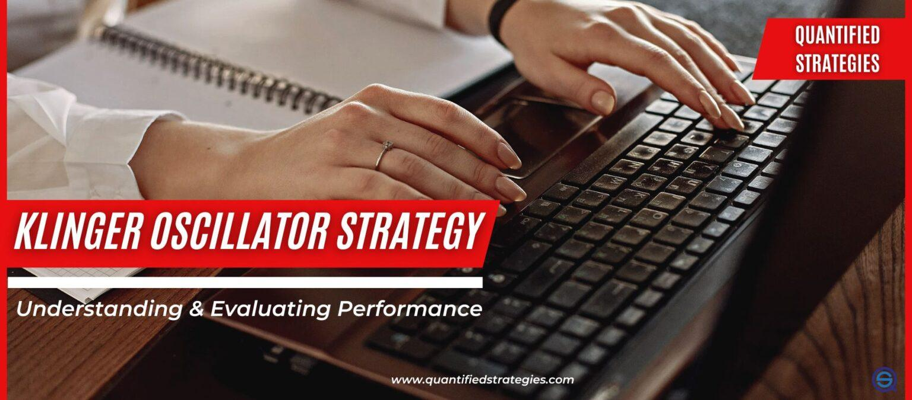

In the field of algorithmic trading, a myriad of technical indicators help in forecasting market trends and refining trading strategies. Among these, the Klinger Oscillator stands out as a particularly insightful tool, though it is not as widely recognized as some other popular indicators. The Klinger Oscillator is valuable because it integrates volume, price, and trend within its calculations, providing traders with unique insights into market dynamics.

This article seeks to equip readers with a comprehensive understanding of the Klinger Oscillator and its application in algorithmic trading. We will explore how to calculate it, employ it in various trading strategies, and the advantages it provides to those navigating the intricate landscape of automated trading. A thorough understanding of its basic principles is crucial before leveraging its strategic potential.



In algorithmic trading systems, the precision of technical indicators can significantly impact the outcomes of trading strategies. The Klinger Oscillator computes the long-term money flow trend of a security, while remaining sensitive to short-term price shifts. This capacity to combine volume metrics with price and trend information makes it a powerful tool for identifying possible reversals and divergences. As we continue, we will cover the computational methodology underlying the Klinger Oscillator, enabling traders to incorporate it effectively into their trading algorithms and strategies.

## Table of Contents

## Understanding the Klinger Oscillator

The Klinger Oscillator, devised by Stephen Klinger, serves as a financial tool for assessing long-term money flow trends while remaining attuned to short-term price variances. This technical indicator evaluates the volume flowing through securities in relation to price movements, transforming this relationship into an oscillator format. By doing so, it aids traders in pinpointing potential reversals and divergences in prices.

### Calculation of the Klinger Oscillator

The Klinger Oscillator is computed from two primary components: the Volume Force and its integration through Exponential Moving Averages (EMAs). 

1. **Volume Force (VF):** The Volume Force reflects the interplay between volume and the direction of price movement. It gauges the power behind price changes, combining elements of price range and trading volume. The basic idea is to assign a positive or negative value based on whether the current price is higher or lower than the previous price.

2. **EMA of Volume Force:** The next step involves applying Exponential Moving Averages to the Volume Force. Generally, this requires calculating two EMAs, typically the 34-period EMA and the 55-period EMA of the Volume Force:
$$
   \text{KVO} = \text{EMA}_{34}(\text{VF}) - \text{EMA}_{55}(\text{VF})

$$
   where $\text{VF}$ represents the Volume Force. This difference between the two EMAs forms the Klinger Volume Oscillator (KVO).

3. **Signal Line:** To generate actionable buy and sell signals, a signal line is created by computing an additional 13-period EMA of the Klinger Volume Oscillator itself:
$$
   \text{Signal Line} = \text{EMA}_{13}(\text{KVO})

$$
   This helps traders by highlighting when the oscillator crosses above or below the signal line, which often indicates [momentum](/wiki/momentum) shifts.

Understanding these calculations is crucial for leveraging the full potential of the Klinger Oscillator within trading strategies. The combination of price, [volume](/wiki/volume-trading-strategy), and trend indicators provides a nuanced view of underlying market activity, which can be particularly beneficial for traders employing [algorithmic trading](/wiki/algorithmic-trading) systems. Through these calculations, the Klinger Oscillator offers a distinctive perspective, differing from other common indicators that might rely solely on price data.

## Klinger Oscillator in Algo Trading

In algorithmic trading, the Klinger Oscillator offers considerable advantages for creating automated strategies that focus on detecting momentum shifts. This technical indicator, which integrates volume into its calculation, allows traders to assess the underlying strength behind price movements— a component that is often underemphasized by indicators that rely primarily on price alone. The Klinger Oscillator, therefore, provides a more nuanced perspective on market dynamics.

For algorithms, the incorporation of the Klinger Oscillator can significantly enhance the identification of bullish and bearish signals, particularly when the oscillator crosses its signal line. This crossover technique is commonly employed to generate trading signals: a bullish signal when the Klinger Oscillator crosses above its signal line and a bearish signal when it crosses below. Implementing such conditions into an algorithm can facilitate more structured and potentially more profitable trading decisions. Here's a simple example of how one might code these conditions using Python and the pandas library:

```python
import pandas as pd

def klinger_oscillator(data, short_period=34, long_period=55, signal_period=13):
    high, low, close, volume = data['High'], data['Low'], data['Close'], data['Volume']

    dm = ((high + low + close) / 3).diff()
    cm = (volume * dm).cumsum()

    short_ema = cm.ewm(span=short_period, adjust=False).mean()
    long_ema = cm.ewm(span=long_period, adjust=False).mean()

    ko = short_ema - long_ema
    signal_line = ko.ewm(span=signal_period, adjust=False).mean()

    data['KO'] = ko
    data['Signal'] = signal_line

    data['Buy_Signal'] = (data['KO'] > data['Signal']) & (data['KO'].shift(1) <= data['Signal'].shift(1))
    data['Sell_Signal'] = (data['KO'] < data['Signal']) & (data['KO'].shift(1) >= data['Signal'].shift(1))

    return data

# Example usage
# df = pd.DataFrame({"High": ..., "Low": ..., "Close": ..., "Volume": ...})
# df = klinger_oscillator(df)
```

Furthermore, integrating the Klinger Oscillator with additional technical indicators can enhance signal validation and reduce the likelihood of false entry points, thus increasing the overall robustness of the algorithm. Pairing it with indicators such as Moving Averages or the Relative Strength Index (RSI) can offer confirmatory insights that align with broader market trends, improving the reliability and effectiveness of trading strategies.

By leveraging the capabilities of the Klinger Oscillator within an algorithmic framework, traders can develop a more disciplined approach, benefiting from clearer signals and improved market comprehension. This potentially leads to more profitable trading outcomes and enhances the overall performance of automated systems.

## Klinger Oscillator Trading Strategies

Trading strategies that employ the Klinger Oscillator often focus on the interplay between the oscillator and its signal line. A primary strategy involves monitoring crossover points; when the Klinger Oscillator crosses above its signal line, it suggests a buy opportunity, while crossing below indicates a sell or short position. This mechanism is akin to conventional moving average crossover techniques found in various trading systems.

Beyond these crossovers, practitioners can look for divergences between the Klinger Oscillator and the actual price movement of the asset. A divergence occurs when the price reaches a new high or low that is not confirmed by the Oscillator. For instance, a bullish divergence happens when the price makes a new low, but the Oscillator does not, potentially signaling an upcoming reversal. Conversely, a bearish divergence arises when the price hits a new high, unaccompanied by a similar peak in the Oscillator value. These divergence patterns are highly valued for their ability to identify early entry and [exit](/wiki/exit-strategy) points in a trading strategy.

To improve the accuracy of signals generated by the Klinger Oscillator, traders often combine it with other technical indicators such as moving averages or Bollinger Bands. By incorporating moving averages, traders can confirm that the momentum signaled by the Klinger Oscillator aligns with longer-term trends, thereby filtering out false signals. Similarly, Bollinger Bands can illustrate market [volatility](/wiki/volatility-trading-strategies) and trend continuation or reversal, providing additional context to the Oscillator’s signals.

In volatile markets, where price swings are common, these strategies are particularly valuable. The ability of the Klinger Oscillator to incorporate volume into its calculations permits a deeper insight into the strength of market movements. By leveraging the additional confirmation provided by volume analysis, traders can make more informed decisions, crucial in capturing profits from rapid market shifts. Here is a basic Python code snippet demonstrating a crossover strategy using the Klinger Oscillator:

```python
import pandas as pd

def calculate_klinger_oscillator(data, short_period=34, long_period=55, signal_period=13):
    high, low, close, volume = data['High'], data['Low'], data['Close'], data['Volume']
    trend = (high + low + close) / 3
    dm = (trend.diff(1) > 0).astype(int) - (trend.diff(1) < 0).astype(int)
    vf = (2 * volume / (high - low)) * ((close - low) - (high - close))
    kvo = (vf * dm).ewm(span=short_period).mean() - (vf * dm).ewm(span=long_period).mean()
    signal = kvo.ewm(span=signal_period).mean()

    return kvo, signal

def klinger_trading_strategy(data):
    data['Klinger'], data['Signal'] = calculate_klinger_oscillator(data)
    data['Buy'] = (data['Klinger'] > data['Signal']) & (data['Klinger'].shift(1) <= data['Signal'].shift(1))
    data['Sell'] = (data['Klinger'] < data['Signal']) & (data['Klinger'].shift(1) >= data['Signal'].shift(1))
    return data

# Usage - Assuming you have a DataFrame 'df' containing 'High', 'Low', 'Close', and 'Volume' columns
df = pd.DataFrame({'High': [/* high prices */], 'Low': [/* low prices */], 'Close': [/* close prices */], 'Volume': [/* volumes */]})
df = klinger_trading_strategy(df)
```

In summary, using the Klinger Oscillator in trading strategies involves identifying crucial crossover and divergence signals, complemented by other technical tools, to navigate complex and volatile market conditions effectively.

## Backtesting the Klinger Oscillator Strategy

Backtesting is a crucial step in validating the effectiveness of the Klinger Oscillator within an algorithmic trading strategy. It involves using historical market data to simulate how the strategy would have performed in past market conditions. This process can provide significant insights into the strategy’s potential profitability and risk factors, essential for optimization and improvements.

A fundamental aspect of [backtesting](/wiki/backtesting) is the calculation of key performance metrics, which help in evaluating the strategy’s viability. Metrics such as the Compound Annual Growth Rate (CAGR), Average Profit per Trade, and Maximum Drawdown are commonly assessed. These metrics offer a quantitative overview of the strategy's performance over time.

- **CAGR** measures the mean annual growth rate of an investment over a specified time period longer than one year, assuming the profits are reinvested at the end of each year. It is calculated as:
$$
  \text{CAGR} = \left( \frac{\text{Ending Value}}{\text{Beginning Value}} \right)^{\frac{1}{\text{Number of Years}}} - 1

$$

- **Average Profit per Trade** provides the average amount of profit (or loss) that was made on each trade during the backtesting period. This can be calculated as:
$$
  \text{Average Profit per Trade} = \frac{\text{Total Profit or Loss}}{\text{Number of Trades}}

$$

- **Maximum Drawdown** measures the largest peak-to-trough decline in the value of a portfolio, offering insight into the potential risk of the strategy. It is expressed as a percentage of the peak value. 

Backtesting also highlights periods when the strategy underperformed, indicating that a static approach may not suit all market conditions. This underscores the importance of developing adaptive strategies that integrate the Klinger Oscillator with other trading metrics to improve robustness and minimize false signals. 

To ensure a comprehensive evaluation, it's vital that backtested strategies reflect real-world trading conditions as closely as possible. For instance, accounting for slippage, transaction costs, and realistic execution latencies will help simulate genuine trading experiences and avoid overly optimistic results. 

Here is a basic Python example illustrating a simple backtesting setup for the Klinger Oscillator:

```python
import pandas as pd
import numpy as np

# Sample historical data
data = pd.DataFrame({
    'Close': [100, 102, 101, 105, 107, 106],
    'Volume': [150, 160, 155, 170, 165, 168]
})

# Calculate Klinger Oscillator
data['KVO'] = ... # Add Klinger Oscillator calculation logic
data['Signal'] = data['KVO'].ewm(span=13).mean()

# Implement strategy
data['Position'] = np.where(data['KVO'] > data['Signal'], 1, -1)
data['Returns'] = data['Close'].pct_change()
data['Strategy'] = data['Position'].shift(1) * data['Returns']

# Calculate performance metrics
cagr = (data['Strategy'].add(1).prod())**(1/len(data['Strategy'].dropna())) - 1
average_profit_per_trade = data['Strategy'].mean()
max_drawdown = (data['Strategy'].cumsum().cummax() - data['Strategy'].cumsum()).max()

print(f"CAGR: {cagr:.2%}")
print(f"Average Profit per Trade: {average_profit_per_trade:.2%}")
print(f"Maximum Drawdown: {max_drawdown:.2%}")
```

Traders aiming to optimize the Klinger Oscillator strategy through backtesting should continuously refine their approach based on gathered performance data, keeping pace with the ever-evolving financial markets. This iterative process enhances strategy durability and augments its potential to yield consistent returns.

## Conclusion

The Klinger Oscillator, with its distinctive synthesis of volume and price analysis, is an invaluable tool for algorithmic traders aiming to gain a nuanced understanding of market dynamics. By focusing on both long-term money flow trends and short-term price movements, this indicator excels in identifying shifts in market momentum and potential trend reversals. Its capability to highlight these aspects can offer traders an edge in markets characterized by volatility and rapid shifts.

However, it's important to recognize that the Klinger Oscillator may not always outperform a straightforward buy-and-hold strategy under certain market conditions. Its effectiveness significantly increases when used in conjunction with other indicators and integrated into a comprehensive risk management framework. The synergistic application of multiple tools can enhance the detection of trading signals and help mitigate false positives, thereby refining the overall strategy.

The implementation of rigorous backtesting is crucial in assessing the true potential of the Klinger Oscillator within any trading algorithm. By testing against historical market data, traders can explore various configurations and tactical adjustments to better understand the strategy’s performance metrics, such as the compound annual growth rate (CAGR), average profit per trade, and maximum drawdown. This iterative process assists in identifying weaknesses and potentially optimizing the strategy in light of real-world constraints and evolving market conditions.

Ultimately, the Klinger Oscillator's capacity to offer detailed insights into the interplay between volume and price makes it a powerful component in an algorithmic trading strategy. Its integration can contribute to a more robust and informed trading approach, where dynamic market assessments are critical. With ongoing backtesting and strategy adaption, traders can leverage the oscillator to enhance their algorithmic strategies and improve overall performance.

## References & Further Reading

[1]: Klinger, S. ("The Klinger Volume Oscillator."). *Technical Analysis of Stocks & Commodities* Magazine.

[2]: Pring, M. J. (2002). ["Technical Analysis Explained: The Successful Investor's Guide to Spotting Investment Trends and Turning Points."](https://www.amazon.com/Technical-Analysis-Explained-Fifth-Successful/dp/0071825177) McGraw-Hill.

[3]: Murphy, J. J. (1999). ["Technical Analysis of the Financial Markets: A Comprehensive Guide to Trading Methods and Applications."](https://www.amazon.com/Technical-Analysis-Financial-Markets-Comprehensive/dp/0735200661) New York Institute of Finance.

[4]: Schwager, J. D. (1993). ["Technical Analysis"](https://books.google.com/books/about/Technical_Analysis.html?id=h0AfBRLrkJYC) in *Market Wizards: Interviews with Top Traders* by John Wiley & Sons. 

[5]: Kirkpatrick, C. D., & Dahlquist, R. D. (2010). ["Technical Analysis: The Complete Resource for Financial Market Technicians."](https://ptgmedia.pearsoncmg.com/images/9780134137049/samplepages/9780134137049.pdf) FT Press.