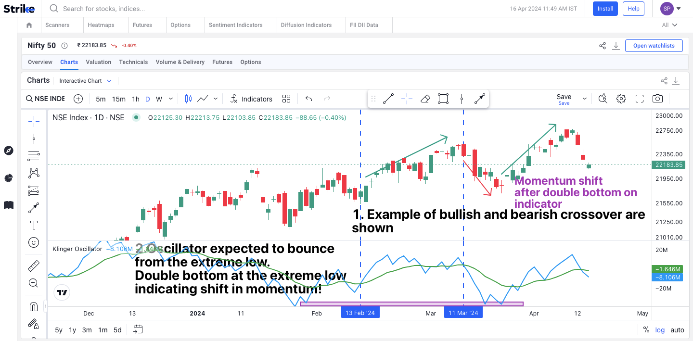

## Table of Contents

## What is the Klinger Oscillator and how does it work?

The Klinger Oscillator is a technical analysis tool that traders use to predict the flow of money in and out of a security. It was created by Stephen Klinger and helps traders understand if more money is coming into a stock (bullish) or leaving it (bearish). The oscillator does this by looking at the volume of trades and the price changes of the security over time. It uses two different moving averages of volume, one short-term and one long-term, to generate a value that can be positive or negative.

The Klinger Oscillator works by comparing these two moving averages. When the short-term average is above the long-term average, the oscillator will show a positive value, suggesting that money is flowing into the security. On the other hand, if the short-term average falls below the long-term average, the oscillator will show a negative value, indicating that money is flowing out. Traders often look for divergences between the oscillator and the price of the security to predict potential price reversals. For example, if the price of a stock is going up but the Klinger Oscillator is going down, it might suggest that the upward trend is losing strength and could reverse soon.

## Who developed the Klinger Oscillator and why was it created?

Stephen Klinger developed the Klinger Oscillator. He wanted to create a tool that could help traders understand the flow of money in and out of a security. Klinger believed that by looking at both the volume of trades and the price changes, traders could get a better idea of whether more money was coming into a stock or leaving it.

The Klinger Oscillator was created to make it easier for traders to spot trends and potential reversals in the market. By using two different moving averages of volume, one short-term and one long-term, the oscillator can show if the money flow is bullish or bearish. This helps traders make more informed decisions about when to buy or sell a security.

## How is the Klinger Oscillator calculated?

The Klinger Oscillator is calculated using two main parts: the volume force and the oscillator itself. First, you need to find the volume force. This is done by comparing the current price with the previous price and multiplying it by the current volume. If the price goes up, you add the volume to the force. If the price goes down, you subtract the volume from the force. This volume force shows if money is coming into or going out of a stock.

Next, you calculate the oscillator using the volume force. You need two moving averages: a short-term one (usually 34 periods) and a long-term one (usually 55 periods). The oscillator is the difference between these two moving averages of the volume force. If the short-term average is higher than the long-term average, the oscillator will be positive, meaning money is flowing in. If the short-term average is lower, the oscillator will be negative, meaning money is flowing out. This helps traders see trends and possible changes in the market.

## What are the key components of the Klinger Oscillator?

The Klinger Oscillator has two main parts: the volume force and the oscillator itself. The volume force is found by looking at the difference between the current price and the last price, then multiplying this by the current volume. If the price goes up, you add the volume to the force. If the price goes down, you subtract the volume. This tells us if money is coming into or leaving the stock.

The oscillator is made using the volume force. It uses two moving averages: one short-term (usually 34 periods) and one long-term (usually 55 periods). The oscillator is just the difference between these two averages. If the short-term average is higher than the long-term average, the oscillator is positive, which means money is flowing in. If it's lower, the oscillator is negative, showing money is flowing out. This helps traders see trends and possible changes in the market.

## How can beginners interpret the signals from the Klinger Oscillator?

Beginners can use the Klinger Oscillator to see if money is coming into or leaving a stock. If the oscillator shows a positive value, it means the short-term moving average is higher than the long-term one. This suggests that money is flowing into the stock, which is a good sign for buying. On the other hand, if the oscillator is negative, it means the short-term average is lower than the long-term one, showing that money is leaving the stock. This could be a warning to sell or avoid buying.

Another way beginners can use the Klinger Oscillator is by watching for divergences. A divergence happens when the price of the stock and the oscillator move in opposite directions. For example, if the stock price is going up but the oscillator is going down, it might mean the upward trend is getting weaker and could change direction soon. By paying attention to these signals, beginners can make better choices about when to buy or sell a stock.

## What are the best settings for the Klinger Oscillator for different trading styles?

For short-term traders, who want to make quick trades, the best settings for the Klinger Oscillator are usually a short-term moving average of 13 periods and a long-term moving average of 34 periods. These settings help them see changes in money flow faster, which is important when you're trying to make quick decisions. Short-term traders look for quick ups and downs in the oscillator to decide when to buy or sell.

For long-term traders, who hold onto stocks for a longer time, a good setting might be a short-term moving average of 34 periods and a long-term moving average of 55 periods. These settings give a smoother picture of the money flow, which helps long-term traders see bigger trends without getting confused by small changes. Long-term traders use the Klinger Oscillator to find out if the overall trend of money flowing into or out of a stock is strong or weak over time.

## How does the Klinger Oscillator compare to other momentum indicators?

The Klinger Oscillator is a special kind of momentum indicator that looks at both the price and the volume of a stock to see if money is coming in or going out. It's different from other momentum indicators like the Relative Strength Index (RSI) or the Moving Average Convergence Divergence (MACD) because it uses two moving averages of volume to make its calculations. The RSI, for example, just looks at the price changes and doesn't think about volume. The MACD uses moving averages of the price but doesn't use volume in the same way the Klinger Oscillator does.

Because the Klinger Oscillator uses volume, it can give traders a better idea of the strength behind price movements. If a lot of money is coming into a stock, it might be a stronger signal than if just the price is going up without much volume. Other momentum indicators like the RSI or the MACD can show if a stock is overbought or oversold, but they might not tell you as much about the money flow. So, the Klinger Oscillator can be a good tool to use along with other indicators to get a fuller picture of what's happening with a stock.

## Can the Klinger Oscillator be used effectively in different market conditions?

The Klinger Oscillator can be used in different market conditions, like when the market is going up, going down, or staying the same. It works well because it looks at both the price and the volume of a stock. When the market is going up, the Klinger Oscillator can help traders see if the upward trend is strong or if it might be getting weaker. If the oscillator is positive and getting stronger, it means more money is coming into the stock, which is a good sign. But if the oscillator starts to go down even though the price is still going up, it might mean the upward trend is losing strength.

In a down market, the Klinger Oscillator can help traders see if the downward trend is strong or if it might be getting ready to change direction. If the oscillator is negative and getting more negative, it means more money is leaving the stock, which supports the downward trend. But if the oscillator starts to go up even though the price is still going down, it might mean the downward trend is losing strength and could reverse soon. Even in a sideways market, where the price isn't going up or down much, the Klinger Oscillator can help traders see small changes in money flow that might signal a coming move in the price.

## What are common trading strategies that incorporate the Klinger Oscillator?

One common trading strategy that uses the Klinger Oscillator is to look for divergences between the oscillator and the stock price. If the stock price is going up but the Klinger Oscillator is going down, it might mean the upward trend is losing strength. This could be a signal to sell the stock or avoid buying it. On the other hand, if the stock price is going down but the Klinger Oscillator is going up, it might mean the downward trend is losing strength. This could be a signal to buy the stock or get ready for a price increase.

Another strategy is to use the Klinger Oscillator to confirm trends. If the oscillator is positive and getting stronger, it means more money is coming into the stock, which can confirm an upward trend. Traders might use this as a signal to buy or hold onto the stock. If the oscillator is negative and getting more negative, it means more money is leaving the stock, which can confirm a downward trend. Traders might use this as a signal to sell or avoid buying the stock. By combining these signals with other indicators, traders can make better decisions about when to buy or sell.

## How can the Klinger Oscillator be used to identify trend reversals?

The Klinger Oscillator can help traders spot when a stock's trend might be about to change direction. One way to do this is by looking for divergences between the oscillator and the stock's price. A divergence happens when the price and the oscillator move in opposite ways. For example, if the stock price is going up but the Klinger Oscillator is going down, it might mean the upward trend is getting weaker. This could be a sign that the price might start to go down soon. On the other hand, if the stock price is going down but the Klinger Oscillator is going up, it might mean the downward trend is losing strength, and the price might start to go up.

Another way to use the Klinger Oscillator to find trend reversals is by watching the zero line. When the oscillator crosses from negative to positive, it means the short-term moving average of volume is now higher than the long-term moving average. This can be a sign that the trend might be starting to go up. When the oscillator crosses from positive to negative, it means the short-term moving average is now lower than the long-term moving average. This can be a sign that the trend might be starting to go down. By paying attention to these signals, traders can get a better idea of when a stock's trend might be about to change direction.

## What are the limitations and potential pitfalls of using the Klinger Oscillator?

The Klinger Oscillator can be a helpful tool, but it has some limitations. One big problem is that it can give false signals. Sometimes, the oscillator might show a big change in money flow, but the stock price doesn't move the way you expect. This can make traders buy or sell at the wrong time. Also, the Klinger Oscillator works best when used with other tools. If you only use the Klinger Oscillator, you might miss important information that other indicators could give you.

Another potential pitfall is that the settings for the Klinger Oscillator might not work well for all stocks or market conditions. What works for one stock might not work for another. Traders need to try different settings and see what works best for their trading style. Also, the Klinger Oscillator can be hard to understand for beginners because it uses both price and volume. If you don't know how to read it right, you might make bad trading decisions. So, it's important to learn how to use it well and maybe get advice from more experienced traders.

## How can advanced traders combine the Klinger Oscillator with other technical analysis tools for better results?

Advanced traders can get better results by using the Klinger Oscillator with other tools like the Relative Strength Index (RSI) and Moving Average Convergence Divergence (MACD). The RSI helps traders see if a stock is overbought or oversold. If the Klinger Oscillator shows a positive money flow but the RSI says the stock is overbought, it might be a good time to sell. On the other hand, if the Klinger Oscillator shows a negative money flow but the RSI says the stock is oversold, it might be a good time to buy. By looking at both tools, traders can make more informed decisions.

Another useful tool to combine with the Klinger Oscillator is the MACD. The MACD helps traders see trends and possible changes in those trends. If the Klinger Oscillator shows a divergence and the MACD also shows a divergence, it can be a stronger signal that a trend reversal is coming. For example, if the stock price is going up but both the Klinger Oscillator and MACD are going down, it might mean the upward trend is losing strength. By using these tools together, advanced traders can get a clearer picture of what might happen next with a stock's price.

## What is the Klinger Oscillator and how does it work?

The Klinger Oscillator, devised by Stephen Klinger, serves as a financial tool for assessing long-term money flow trends while remaining attuned to short-term price variances. This technical indicator evaluates the volume flowing through securities in relation to price movements, transforming this relationship into an oscillator format. By doing so, it aids traders in pinpointing potential reversals and divergences in prices.

### Calculation of the Klinger Oscillator

The Klinger Oscillator is computed from two primary components: the Volume Force and its integration through Exponential Moving Averages (EMAs). 

1. **Volume Force (VF):** The Volume Force reflects the interplay between volume and the direction of price movement. It gauges the power behind price changes, combining elements of price range and trading volume. The basic idea is to assign a positive or negative value based on whether the current price is higher or lower than the previous price.

2. **EMA of Volume Force:** The next step involves applying Exponential Moving Averages to the Volume Force. Generally, this requires calculating two EMAs, typically the 34-period EMA and the 55-period EMA of the Volume Force:
$$
   \text{KVO} = \text{EMA}_{34}(\text{VF}) - \text{EMA}_{55}(\text{VF})

$$
   where $\text{VF}$ represents the Volume Force. This difference between the two EMAs forms the Klinger Volume Oscillator (KVO).

3. **Signal Line:** To generate actionable buy and sell signals, a signal line is created by computing an additional 13-period EMA of the Klinger Volume Oscillator itself:
$$
   \text{Signal Line} = \text{EMA}_{13}(\text{KVO})

$$
   This helps traders by highlighting when the oscillator crosses above or below the signal line, which often indicates [momentum](/wiki/momentum) shifts.

Understanding these calculations is crucial for leveraging the full potential of the Klinger Oscillator within trading strategies. The combination of price, [volume](/wiki/volume-trading-strategy), and trend indicators provides a nuanced view of underlying market activity, which can be particularly beneficial for traders employing [algorithmic trading](/wiki/algorithmic-trading) systems. Through these calculations, the Klinger Oscillator offers a distinctive perspective, differing from other common indicators that might rely solely on price data.

## Question: How effective is backtesting the Klinger Oscillator Strategy?

Backtesting is a crucial step in validating the effectiveness of the Klinger Oscillator within an algorithmic trading strategy. It involves using historical market data to simulate how the strategy would have performed in past market conditions. This process can provide significant insights into the strategy’s potential profitability and risk factors, essential for optimization and improvements.

A fundamental aspect of [backtesting](/wiki/backtesting) is the calculation of key performance metrics, which help in evaluating the strategy’s viability. Metrics such as the Compound Annual Growth Rate (CAGR), Average Profit per Trade, and Maximum Drawdown are commonly assessed. These metrics offer a quantitative overview of the strategy's performance over time.

- **CAGR** measures the mean annual growth rate of an investment over a specified time period longer than one year, assuming the profits are reinvested at the end of each year. It is calculated as:
$$
  \text{CAGR} = \left( \frac{\text{Ending Value}}{\text{Beginning Value}} \right)^{\frac{1}{\text{Number of Years}}} - 1

$$

- **Average Profit per Trade** provides the average amount of profit (or loss) that was made on each trade during the backtesting period. This can be calculated as:
$$
  \text{Average Profit per Trade} = \frac{\text{Total Profit or Loss}}{\text{Number of Trades}}

$$

- **Maximum Drawdown** measures the largest peak-to-trough decline in the value of a portfolio, offering insight into the potential risk of the strategy. It is expressed as a percentage of the peak value. 

Backtesting also highlights periods when the strategy underperformed, indicating that a static approach may not suit all market conditions. This underscores the importance of developing adaptive strategies that integrate the Klinger Oscillator with other trading metrics to improve robustness and minimize false signals. 

To ensure a comprehensive evaluation, it's vital that backtested strategies reflect real-world trading conditions as closely as possible. For instance, accounting for slippage, transaction costs, and realistic execution latencies will help simulate genuine trading experiences and avoid overly optimistic results. 

Here is a basic Python example illustrating a simple backtesting setup for the Klinger Oscillator:

```python
import pandas as pd
import numpy as np

# Sample historical data
data = pd.DataFrame({
    'Close': [100, 102, 101, 105, 107, 106],
    'Volume': [150, 160, 155, 170, 165, 168]
})

# Calculate Klinger Oscillator
data['KVO'] = ... # Add Klinger Oscillator calculation logic
data['Signal'] = data['KVO'].ewm(span=13).mean()

# Implement strategy
data['Position'] = np.where(data['KVO'] > data['Signal'], 1, -1)
data['Returns'] = data['Close'].pct_change()
data['Strategy'] = data['Position'].shift(1) * data['Returns']

# Calculate performance metrics
cagr = (data['Strategy'].add(1).prod())**(1/len(data['Strategy'].dropna())) - 1
average_profit_per_trade = data['Strategy'].mean()
max_drawdown = (data['Strategy'].cumsum().cummax() - data['Strategy'].cumsum()).max()

print(f"CAGR: {cagr:.2%}")
print(f"Average Profit per Trade: {average_profit_per_trade:.2%}")
print(f"Maximum Drawdown: {max_drawdown:.2%}")
```

Traders aiming to optimize the Klinger Oscillator strategy through backtesting should continuously refine their approach based on gathered performance data, keeping pace with the ever-evolving financial markets. This iterative process enhances strategy durability and augments its potential to yield consistent returns.

## References & Further Reading

[1]: Klinger, S. ("The Klinger Volume Oscillator."). *Technical Analysis of Stocks & Commodities* Magazine.

[2]: Pring, M. J. (2002). ["Technical Analysis Explained: The Successful Investor's Guide to Spotting Investment Trends and Turning Points."](https://www.amazon.com/Technical-Analysis-Explained-Fifth-Successful/dp/0071825177) McGraw-Hill.

[3]: Murphy, J. J. (1999). ["Technical Analysis of the Financial Markets: A Comprehensive Guide to Trading Methods and Applications."](https://www.amazon.com/Technical-Analysis-Financial-Markets-Comprehensive/dp/0735200661) New York Institute of Finance.

[4]: Schwager, J. D. (1993). ["Technical Analysis"](https://books.google.com/books/about/Technical_Analysis.html?id=h0AfBRLrkJYC) in *Market Wizards: Interviews with Top Traders* by John Wiley & Sons. 

[5]: Kirkpatrick, C. D., & Dahlquist, R. D. (2010). ["Technical Analysis: The Complete Resource for Financial Market Technicians."](https://ptgmedia.pearsoncmg.com/images/9780134137049/samplepages/9780134137049.pdf) FT Press.