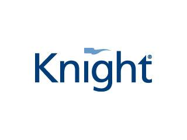

## Table of Contents

## What is Knight Capital Group?

Knight Capital Group was a company that helped people buy and sell stocks. They used computers to do this very quickly. In 2012, something went wrong with their computer system. This mistake made them lose a lot of money, about $440 million, in just one day.

Because of this big loss, Knight Capital Group almost went out of business. Other companies had to help them by giving them money. After this, Knight Capital Group changed its name to KCG Holdings. Later, in 2017, another company called Virtu Financial bought KCG Holdings.

## When was Knight Capital Group founded?

Knight Capital Group was started in 1995. It was created to help people buy and sell stocks using computers. The company grew quickly because it could do these trades very fast.

In 2012, a big problem happened with their computer system. This mistake made them lose a lot of money, about $440 million, in just one day. After this, they had to change their name to KCG Holdings and were eventually bought by Virtu Financial in 2017.

## Who were the founders of Knight Capital Group?

Knight Capital Group was started by Kenneth Pasternak and Walter Raquet in 1995. They wanted to use computers to help people buy and sell stocks faster and easier. Kenneth Pasternak was a former stock trader who saw a chance to make trading better with technology. Walter Raquet was good at understanding how to use computers for business.

The company grew quickly because their computers could do trades very fast. But in 2012, a big problem happened with their computer system. This mistake made them lose a lot of money, about $440 million, in just one day. After this, they had to change their name to KCG Holdings and were eventually bought by Virtu Financial in 2017.

## What services did Knight Capital Group provide?

Knight Capital Group helped people buy and sell stocks. They used computers to do this very quickly. This is called electronic trading. They also helped big companies and other traders by giving them tools to trade stocks easily. Their computers could handle a lot of trades at the same time, which made trading faster and easier for everyone.

In 2012, something went wrong with their computer system. This mistake made them lose a lot of money, about $440 million, in just one day. Because of this big loss, Knight Capital Group almost went out of business. Other companies had to help them by giving them money. After this, Knight Capital Group changed its name to KCG Holdings. Later, in 2017, another company called Virtu Financial bought KCG Holdings.

## What was the significance of Knight Capital Group in the financial industry?

Knight Capital Group was important in the financial world because it helped make trading faster and easier. They used computers to buy and sell stocks quickly, which is called electronic trading. This was a big change because before, trading was slower and done by people. Knight Capital Group's computers could handle many trades at the same time, which helped big companies and other traders do their work better.

In 2012, a big problem happened with their computer system. This mistake made them lose a lot of money, about $440 million, in just one day. This event showed everyone how important and risky it is to use computers for trading. Even though Knight Capital Group had to change its name to KCG Holdings and was later bought by Virtu Financial in 2017, their work helped shape how trading is done today.

## What led to the downfall of Knight Capital Group?

The downfall of Knight Capital Group started on August 1, 2012, when a big mistake happened with their computer system. This mistake made them lose a lot of money, about $440 million, in just one day. The problem was caused by a small error in their software. This error made their computers buy and sell stocks in a way that was not supposed to happen. Because of this, Knight Capital Group almost went out of business.

After losing so much money, Knight Capital Group needed help to stay alive. Other companies gave them money to keep going. Because of this big loss, they had to change their name to KCG Holdings. Later, in 2017, another company called Virtu Financial bought KCG Holdings. This event showed everyone how risky it can be to use computers for trading and changed how people think about electronic trading.

## Can you explain the 2012 Knight Capital trading disaster?

The 2012 Knight Capital trading disaster happened on August 1, 2012. It was a big problem caused by a small mistake in their computer software. This mistake made their computers buy and sell stocks in a way that was not supposed to happen. Because of this, Knight Capital Group lost a lot of money, about $440 million, in just one day. This was a huge amount of money, and it almost made the company go out of business.

After losing so much money, Knight Capital Group needed help to stay alive. Other companies gave them money to keep going. Because of this big loss, they had to change their name to KCG Holdings. This event showed everyone how risky it can be to use computers for trading. It changed how people think about electronic trading and made everyone more careful about using computers to buy and sell stocks.

## How did the 2012 trading disaster impact Knight Capital Group financially?

The 2012 trading disaster had a huge impact on Knight Capital Group. On August 1, 2012, a small mistake in their computer software made their computers buy and sell stocks in a way that was not supposed to happen. This mistake caused Knight Capital Group to lose about $440 million in just one day. This was a very big amount of money, and it almost made the company go out of business.

Because of this big loss, Knight Capital Group needed help to stay alive. Other companies gave them money to keep going. After the disaster, Knight Capital Group had to change its name to KCG Holdings. The event showed everyone how risky it can be to use computers for trading. It made people more careful about using computers to buy and sell stocks.

## What were the regulatory consequences following the Knight Capital Group incident?

After the Knight Capital Group incident in 2012, there were big changes in the rules for trading. The mistake showed how risky it can be to use computers for buying and selling stocks. Because of this, the people who make the rules, like the Securities and Exchange Commission (SEC), started to look more closely at how companies use computers for trading. They made new rules to make sure that computer systems are safer and less likely to make big mistakes.

The incident also made everyone in the trading world more careful about using computers. Companies started to test their systems more often and put in extra checks to make sure that big mistakes like the one at Knight Capital Group would not happen again. The rules that came after the incident helped to make trading safer for everyone, but they also reminded everyone how important it is to keep an eye on computer systems all the time.

## How was Knight Capital Group restructured or acquired after the 2012 incident?

After the 2012 incident, Knight Capital Group was in big trouble because they lost a lot of money. They needed help to stay in business, so other companies gave them money. This help saved Knight Capital Group from going out of business. Because of the big loss, they had to change their name to KCG Holdings. This new name helped them start fresh and try to fix their problems.

Later, in 2017, another company called Virtu Financial bought KCG Holdings. This meant that KCG Holdings was no longer its own company but was now part of Virtu Financial. The buyout helped KCG Holdings to keep going, but it also meant that they were no longer in charge of their own business. The 2012 incident and the changes that followed showed everyone how important it is to be careful with computer systems in trading.

## What lessons can be learned from the Knight Capital Group's experience in terms of risk management?

The Knight Capital Group's experience teaches us that it's very important to always check and test computer systems used for trading. A small mistake in their software caused them to lose a lot of money very quickly. This shows that even tiny errors can lead to big problems. Companies need to have good ways to find and fix these mistakes before they cause harm. They should also have backup plans in case something goes wrong.

Another lesson is that risk management is key in trading. Knight Capital Group did not have enough checks to stop their computers from making bad trades. They should have had more safety steps to make sure their systems were working right. This means having people watch the computers all the time and making sure there are rules to stop big mistakes. By learning from Knight Capital Group, other companies can make their trading safer and avoid big losses.

## How has the financial industry changed its approach to algorithmic trading post-Knight Capital Group?

After the Knight Capital Group incident, the financial industry started to take a closer look at how they use computers for trading. They realized that even small mistakes in software can lead to big problems. So, they began to test their computer systems more often and more carefully. They also put in new safety steps to make sure that if something goes wrong, it won't cause huge losses. Companies now have more people watching the computers all the time to catch any mistakes early.

The incident also made the people who make the rules, like the Securities and Exchange Commission (SEC), change their rules. They made new rules to make sure that trading systems are safer and less likely to make big mistakes. Now, companies have to follow these rules to make sure their trading is safe. This has made the whole industry more careful about using computers for buying and selling stocks. Everyone learned that it's important to keep an eye on computer systems and have good plans to manage risks.

## References & Further Reading

[1]: Patterson, S. (2013). ["Dark Pools: The Rise of the Machine Traders and the Rigging of the U.S. Stock Market."](https://archive.org/details/darkpoolsriseofm0000patt) Crown Business.

[2]: Lewis, M. (2014). ["Flash Boys: A Wall Street Revolt."](https://en.wikipedia.org/wiki/Flash_Boys) W. W. Norton & Company.

[3]: Aldridge, I. (2010). ["High-Frequency Trading: A Practical Guide to Algorithmic Strategies and Trading Systems."](https://www.ahmetbeyefendi.com/wp-content/uploads/2020/07/High-Frequency-Trading-Irene-Aldridge.pdf) Wiley.

[4]: McCarthy, J. (2014). ["Automated Trading with R: Quantitative Research and Platform Development."](https://link.springer.com/book/10.1007/978-1-4842-2178-5) Wiley.

[5]: Keshner, A. (2012). ["Knight Capital's 'Knightmare' shows dark side of algorithmic trading."](https://archive.nytimes.com/dealbook.nytimes.com/2012/08/07/in-440-million-trading-error-upside-of-wall-st-failures/) Reuters.

[6]: Financial Industry Regulatory Authority. (2012). ["Report of Examination: Knight Capital Americas LLC."](https://www.sec.gov/files/litigation/admin/2013/34-70694.pdf) FINRA.

[7]: Vries, M. (2013). ["The Errors that Crushed Knight Capital."](https://psycnet.apa.org/record/2014-01253-005) Harvard Business Review.