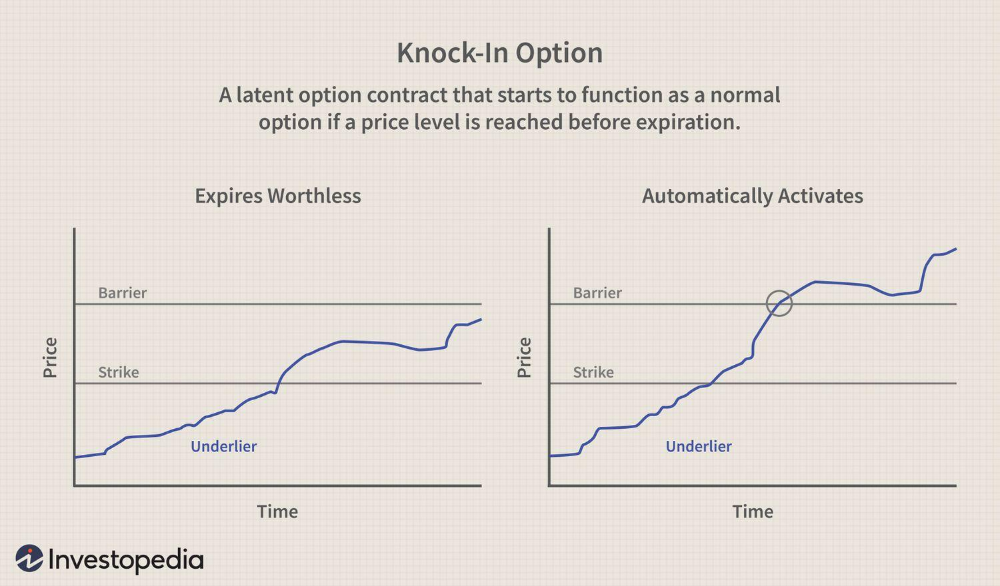

## Table of Contents

## What is a knock-in option?

A knock-in option is a type of financial option that only becomes active or "alive" if the price of the underlying asset reaches a certain level, called the barrier. Until the price hits this barrier, the option does not exist and cannot be exercised. This means that if the price never reaches the barrier, the option will expire worthless, and the buyer will lose the premium they paid for it.

Knock-in options are often used by investors who have a specific prediction about where the price of an asset will go. For example, if an investor believes that a stock will eventually reach a high price but it's currently low, they might buy a knock-in call option with a barrier set at that high price. If the stock price eventually hits the barrier, the option becomes active, and the investor can then buy the stock at the lower strike price, potentially making a profit if the stock continues to rise.

## How does a knock-in option differ from a standard option?

A knock-in option is different from a standard option because it only starts to exist if the price of the thing it's based on, like a stock, reaches a special level called the barrier. A standard option, on the other hand, is active right from the start and can be used at any time up until it expires. This means that with a standard option, you know you have the right to buy or sell the stock from the moment you buy the option, but with a knock-in option, you're taking a chance that the stock will hit that barrier before the option runs out of time.

The main thing to remember is that with a knock-in option, you pay for something that might never become useful if the price never hits the barrier. If it doesn't, you lose the money you paid for the option. With a standard option, you're sure you have an option to use, but you still need to decide if it's worth using it based on how the price of the stock moves. So, knock-in options can be riskier but might also offer bigger rewards if everything goes as planned.

## What are the main types of knock-in options?

There are two main types of knock-in options: up-and-in options and down-and-in options. An up-and-in option starts to exist only if the price of the thing it's based on goes up to a certain level. For example, if you think a stock will go up to $100, you might buy an up-and-in option with a barrier at $100. If the stock price reaches $100, the option becomes active, and you can use it to buy the stock at a lower price you agreed on earlier.

A down-and-in option works the opposite way. It only becomes active if the price of the thing it's based on goes down to a certain level. For instance, if you believe a stock will drop to $50, you could buy a down-and-in option with a barrier at $50. If the stock price hits $50, the option comes to life, and you can then use it to buy the stock at a higher price you set before. Both types of knock-in options add an extra layer of risk and potential reward to your investment strategy.

## Can you explain what a down-and-in option is?

A down-and-in option is a special kind of option that only starts working if the price of something, like a stock, goes down to a certain level. This level is called the barrier. For example, if you think a stock that's currently at $100 will drop to $50, you might buy a down-and-in option with a barrier set at $50. If the stock price actually reaches $50, the option becomes active, and you can use it to buy the stock at a price you agreed on earlier, which might be higher than $50.

If the stock price never drops to the barrier, the down-and-in option never becomes active and you lose the money you paid for it. This makes down-and-in options a bit riskier because they depend on the stock price hitting that specific low point. But if your prediction is right and the stock does hit the barrier, you could make a profit by buying the stock at a lower price than you would have to pay on the open market.

## What is an up-and-in option and how does it work?

An up-and-in option is a type of option that only starts to work if the price of something, like a stock, goes up to a certain level. This level is called the barrier. For example, if you think a stock that's currently at $50 will go up to $100, you might buy an up-and-in option with a barrier set at $100. If the stock price actually reaches $100, the option becomes active, and you can use it to buy the stock at a price you agreed on earlier, which might be lower than $100.

If the stock price never goes up to the barrier, the up-and-in option never becomes active and you lose the money you paid for it. This makes up-and-in options a bit riskier because they depend on the stock price hitting that specific high point. But if your prediction is right and the stock does hit the barrier, you could make a profit by buying the stock at a lower price than you would have to pay on the open market.

## What are the key factors to consider when pricing knock-in options?

When pricing knock-in options, you need to think about a few important things. First, the barrier level is key because it's the price that the stock or asset needs to hit for the option to start working. If the barrier is far from where the stock is now, the option might be cheaper because it's less likely to become active. Also, you need to consider how much time is left until the option expires. More time means a higher chance the stock could reach the barrier, which might make the option more expensive.

Another thing to think about is how much the stock price moves around, which is called volatility. If the stock price jumps around a lot, it's more likely to hit the barrier, so the option could be priced higher. Finally, the overall market conditions and the general direction people think the stock is going can affect the price too. If everyone thinks the stock will go up and it's close to the barrier, the option might cost more because more people want to buy it.

## How do knock-in options affect the risk profile of an investment portfolio?

Adding knock-in options to an investment portfolio can change how risky it is. Knock-in options only start working if the price of the stock or asset hits a certain level, called the barrier. This means they can be riskier than regular options because if the stock never reaches the barrier, you lose the money you paid for the option. But if the stock does hit the barrier, you could make a big profit. So, knock-in options can make your portfolio riskier because they might not work at all, but they also offer the chance for big rewards if things go as planned.

On the other hand, knock-in options can also be used to manage risk in a portfolio. For example, if you're worried that a stock you own might drop a lot, you could buy a down-and-in option as a kind of insurance. If the stock falls to the barrier, the option starts working and can help limit your losses. This way, knock-in options can help you protect your investments from big drops in price, but you need to be careful because they can also add risk if the stock doesn't move the way you expect.

## What are the common strategies for using knock-in options in trading?

Knock-in options are often used by traders who want to bet on big price moves in stocks or other assets. One common strategy is to use an up-and-in call option when you think a stock will go up a lot. You set the barrier at a high price that you think the stock will reach. If it does, the option starts working and you can buy the stock at a lower price than it's currently trading at. This can lead to big profits if the stock keeps going up after hitting the barrier. But, if the stock never gets to the barrier, you lose the money you paid for the option.

Another strategy is using down-and-in put options when you think a stock will drop a lot. You set the barrier at a low price that you think the stock will hit. If it does, the option becomes active and you can sell the stock at a higher price than it's currently trading at. This can protect you from big losses if you already own the stock, or it can be a way to make money if you think the stock will keep falling after hitting the barrier. Again, if the stock never reaches the barrier, you lose the money you spent on the option.

Some traders also use knock-in options as part of more complex strategies, like combining them with other options or stocks to create a hedge. For example, you might buy a down-and-in put option to protect against a big drop in a stock you own, while also buying the stock itself to benefit from any upward moves. This way, you're betting on the stock going up but also protecting yourself if it goes down a lot. Knock-in options can be risky because they might not ever start working, but they can also offer big rewards if your predictions about the stock's price are right.

## How do market conditions influence the effectiveness of knock-in options?

Market conditions play a big role in how well knock-in options work. If the market is moving a lot, with prices going up and down quickly, knock-in options can be more effective. This is because there's a higher chance that the price of the stock or asset will hit the barrier you set. For example, if you think a stock will go up a lot and you buy an up-and-in option, a volatile market might help the stock reach the barrier faster. On the other hand, if the market is calm and prices aren't moving much, it's harder for the stock to hit the barrier, making the knock-in option less likely to start working.

Also, the overall direction of the market matters. If the market is going up and you've bought an up-and-in option, it's more likely to be effective because the stock has a better chance of reaching the barrier. But if the market is going down and you've bought a down-and-in option, it could work well if the stock hits the barrier on the way down. However, if the market moves against your prediction, the knock-in option might never become active, and you could lose the money you paid for it. So, understanding the market conditions and how they might affect the stock's price is key to using knock-in options effectively.

## What are the tax implications of trading knock-in options?

Trading knock-in options can have tax implications that depend on how you use them and where you live. In the United States, for example, if you make money from knock-in options, you usually have to pay capital gains tax. If you hold the option for less than a year before it becomes active and you sell it, the profit is taxed as short-term capital gains, which is the same as your regular income tax rate. If you hold it for more than a year, it might be taxed as long-term capital gains, which can be lower.

If you use knock-in options to hedge other investments, the tax treatment can get more complicated. You might be able to offset gains from other investments with losses from the options, but you need to keep good records and follow the rules set by the tax authorities. It's a good idea to talk to a tax professional to understand how trading knock-in options will affect your taxes, as the rules can change and be different in other countries.

## How can advanced statistical models improve the valuation of knock-in options?

Advanced statistical models can help make better guesses about how much knock-in options are worth. These models look at lots of things, like how much the price of the stock moves around, how long until the option runs out, and where the barrier is set. By using these models, traders can get a more accurate idea of the chance that the stock will hit the barrier before the option expires. This helps them decide if the knock-in option is a good deal or not. For example, a model might show that because the stock moves around a lot, there's a higher chance it will hit the barrier, making the option more valuable.

One popular model for pricing options, including knock-in options, is the Black-Scholes model. But for knock-in options, it's often better to use models that can handle the extra risk of the barrier, like the Monte Carlo simulation. This model runs lots of different possible paths for the stock price and sees how often it hits the barrier. This gives a more detailed picture of what might happen, which can help traders make smarter choices about buying or selling knock-in options. By using these advanced models, traders can feel more confident in their decisions and might make better profits.

## What are the latest trends and innovations in the use of knock-in options in financial markets?

Knock-in options are becoming more popular as traders look for new ways to bet on big moves in stock prices. One trend is using technology to make trading these options easier. Apps and online platforms now let people buy and sell knock-in options with just a few clicks. This means more people can try using them, not just big investors. Also, some traders are mixing knock-in options with other types of options to create new strategies. For example, they might use a knock-in option to bet on a stock going up a lot, while also using another option to protect against the stock dropping.

Another innovation is the use of advanced computer models to help price knock-in options more accurately. These models can look at lots of data and figure out how likely it is that a stock will hit the barrier. This helps traders decide if the option is a good deal or not. Some traders are also using knock-in options to hedge against big drops in the market. For example, if they think the market might crash, they can buy a down-and-in option to protect their investments. This way, if the market does drop a lot, the option can help limit their losses.

## What is a Down-and-In Knock-In Option?

Down-and-in knock-in options are a specific category of barrier options, designed to become active or "knocked in" when the underlying asset's price falls below a certain predetermined barrier level. This activation feature is crucial for traders who anticipate significant downward movements in an asset's price, making these options particularly advantageous in bearish market conditions.

Mathematically, a down-and-in option can be represented as follows:

$$

V(S, t) = 
\begin{cases} 
V_{\text{vanilla}}(S, t) & \text{if } S \leq B \\
0 & \text{otherwise} 
\end{cases}
$$

Here, $V(S, t)$ is the value of the knock-in option at time $t$ with underlying asset price $S$. $V_{\text{vanilla}}(S, t)$ represents the value of the equivalent vanilla option, and $B$ is the barrier level. The option only holds value when the asset price $S$ breaches the barrier $B$.

Consider, for example, an investor who believes that a stock, currently trading at $150, might experience a decline. They may purchase a down-and-in put option with a barrier set at $130 and a strike price at $140. If the stock's price drops to $130 or below, the option is activated, allowing the investor to potentially profit from further price declines below the strike price.

Here is a simple Python snippet illustrating how one might simulate the activation condition of a down-and-in option:

```python
def check_activation(stock_prices, barrier):
    activated = False
    for price in stock_prices:
        if price <= barrier:
            activated = True
            break
    return activated

# Example usage
stock_prices = [150, 145, 138, 132, 129]
barrier = 130
activation_status = check_activation(stock_prices, barrier)
print("Option Activated:" if activation_status else "Option Not Activated")
```

The activation condition minimizes the premium costs, as the option will only activate under specific conditions, reducing the likelihood of loss associated with traditional options when the market does not move as anticipated. Consequently, down-and-in options offer a strategic and cost-effective means for hedging against anticipated market downturns, allowing investors to optimize their risk exposures without a hefty premium.

## References & Further Reading

[1]: ["Risk Management and Financial Derivatives: A Guide to Derivatives for Renewables"](https://books.google.com/books/about/Risk_Management_and_Financial_Derivative.html?id=--LHAAAAIAAJ) by Satyajit Das

[2]: ["The Concepts and Practice of Mathematical Finance"](https://archive.org/download/quant_books/Concepts%20_%20Practice%20of%20Mathematical%20Finance%20-%20M.%20S.%20Joshi.pdf) by Mark S. Joshi

[3]: ["Options, Futures, and Other Derivatives"](https://www.amazon.com/Options-Futures-Other-Derivatives-10th/dp/013447208X) by John C. Hull

[4]: "Algorithmic Trading and DMA: An introduction to Direct Access Trading Strategies" by Barry Johnson

[5]: ["Financial Derivatives in Theory and Practice"](https://onlinelibrary.wiley.com/doi/book/10.1002/0470863617) by Philip Hunt and Joanne Kennedy