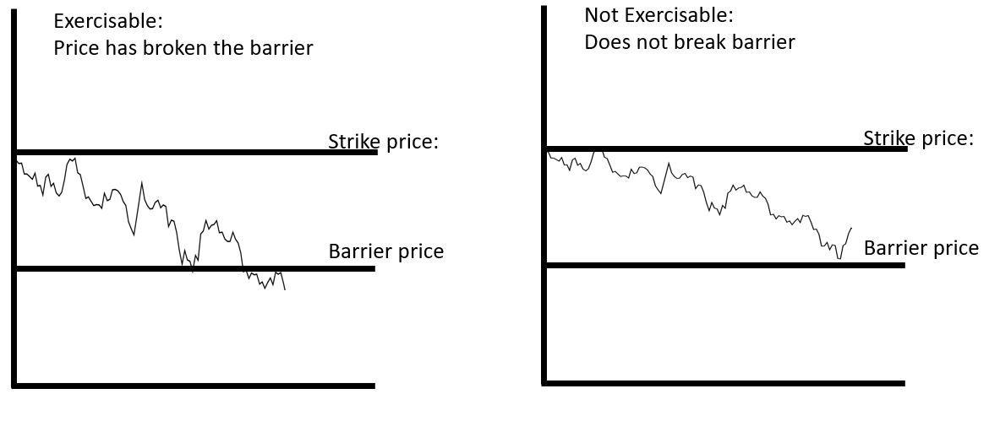

to Financial Derivatives

Financial derivatives are sophisticated financial instruments whose value is derived from an underlying asset or group of assets. These instruments play a pivotal role in modern finance by providing mechanisms for risk management and opportunities for enhancing returns. Derivatives are essential in hedging against potential losses and enabling investors and companies to speculate on the future price movements of assets. By utilizing derivatives, market participants can protect their portfolios, lock in the cost of essential inputs, or potentially achieve profits from favorable moves in an underlying asset's price.



The primary categories of financial derivatives include options, futures, swaps, and forwards. Each type serves different purposes and varies in complexity:

1. **Options** grant the holder the right, but not the obligation, to buy or sell an asset at a predetermined price before or on a specified expiration date. They are categorized as call options, which allow purchases, and put options, which allow sales.

2. **Futures** are standardized contracts obligating the parties to transact an asset at a future date and price. They are traded on exchanges and counterparty risk is minimized through clearinghouses.

3. **Swaps** involve the exchange of cash flows between two parties. Common types include interest rate swaps and currency swaps, which help manage exposure to fluctuations in interest rates and exchange rates, respectively.

4. **Forwards** are customized contracts similar to futures but traded over-the-counter (OTC), allowing terms to be individually negotiated between parties.

The complexity of derivatives markets today stems from various factors, including the wide array of available instruments and the sophisticated models used for pricing and risk management. For instance, the Black-Scholes-Merton model is a well-known mathematical model employed for option pricing, which helped to revolutionize the trading of options by providing a theoretical framework for valuation.

Advanced tools such as knock-out options and algorithmic trading have further added layers to the derivatives landscape. Knock-out options are a form of barrier options that become void if the underlying asset's price reaches a predetermined barrier level. They offer more tailored risk management and speculative opportunities for investors by incorporating specific market conditions into the option contract.

Algorithmic trading refers to the use of complex algorithms to automate trading strategies in the derivatives market. This method leverages technological advances to execute orders at speeds and frequencies beyond human capability. It is particularly useful in the derivatives marketplace, where rapid price fluctuations demand precise and timely decision-making.

In conclusion, financial derivatives are indispensable tools in modern finance due to their versatility in managing risk and the potential for enhancing returns. The development of complex instruments, such as knock-out options, and the integration of technology through [algorithmic trading](/wiki/algorithmic-trading) continue to evolve the dynamics and sophistication of derivatives markets. Understanding these elements is crucial for market participants navigating the intricate and dynamic landscape of financial derivatives.

## Table of Contents

## Understanding Knock-Out Options

Knock-out options are a type of barrier option, which are more complex than standard options due to their unique mechanism involving a predetermined barrier level. These options become void if the price of the underlying asset reaches this barrier level, known as the "knock-out" barrier. The primary difference between knock-out options and standard options lies in this barrier feature, which directly affects the option's life; if the barrier is breached, the option ceases to exist, irrespective of any intrinsic value it might hold at that time.

The knock-out barrier mechanism significantly impacts option contracts by adding a condition that directly influences the payoff structure. For instance, a knock-out option might be profitable when the underlying asset's price moves favorably but could still expire worthless if the barrier is breached. This characteristic provides an embedded risk management feature, as traders can use such options to limit potential losses under certain market conditions while also enjoying lower premiums compared to non-barrier options.

Strategically, knock-out options are deployed in trading strategies for their ability to offer exposure to price movements of the underlying asset while minimizing cost. Traders may choose these options to benefit from anticipated price fluctuations without incurring the higher premiums typical of standard options. Due to their reduced premium cost, these options can enhance potential returns if the barrier remains unbreached throughout the contract's life.

Common structures of knock-out options include up-and-out and down-and-out options. An up-and-out option is designed to become void if the asset price rises beyond the barrier level, while a down-and-out option is nullified if the asset price falls below the barrier. These structures allow traders to align their strategic positions more precisely with market expectations.

Investing in knock-out options offers several benefits, such as reduced hedging costs and the strategic advantage of lower premiums. However, they also bring inherent risks, primarily the total loss of the premium if the barrier is breached. This risk necessitates careful consideration of market [volatility](/wiki/volatility-trading-strategies) and the selection of appropriate barrier levels to align with the trader's market outlook and risk tolerance.

In summary, knock-out options are valuable tools for traders looking to optimize cost-effectiveness and strategic alignment in their trading activities. Their unique barrier feature offers both opportunities and challenges, demanding meticulous planning and analysis for successful implementation in an investment strategy.

## Exploring Different Option Types in Derivatives Trading

Options are a crucial part of derivatives trading, providing investors with the ability to hedge risk or speculate on future price movements of underlying assets. Fundamentally, options are contracts that give the buyer the right, but not the obligation, to buy or sell an underlying asset at a predetermined price on or before a specified date. The two primary types of options are call options and put options. 

A **call option** gives the holder the right to purchase the underlying asset at the strike price, while a **put option** provides the holder with the right to sell the asset at the strike price. These instruments allow traders to capitalize on both upswings and downswings in asset prices.

### European vs. American Options

A key distinction in options trading is between European and American options, which pertain to when the options can be exercised. **European options** can only be exercised at expiry, offering less flexibility but often simpler valuation due to the fixed nature of the exercise date. In contrast, **American options** allow the holder to exercise the option at any time up to the expiration date, providing greater flexibility. This flexibility often makes American options more valuable, necessitating different pricing models.

### Exotic Options

While standard options like calls and puts are widely used, **exotic options** offer more complex structures and payoffs, opening up broader trading strategies. These options can be tailored to specific needs and include variations such as Asian, binary, and barrier options.

- **Digital (or Binary) Options** are a type of exotic option with a payoff that depends on whether the underlying asset hits a certain level. If the asset's price exceeds the level, the option pays a fixed amount; otherwise, it expires worthless.

- **Barrier Options** are dependent on the underlying asset's price reaching a predetermined barrier level during the option's life. The two main types are knock-in options, which become active or 'knock in' once the barrier is passed, and knock-out options, which become void if the barrier level is breached.

### Other Types and Selection Considerations

Investors may also encounter other less common types, such as **lookback options**, where the payoff is determined by the optimal value of the underlying asset over the option's life, and **chooser options**, which allow the holder to choose at some point during the life of the option whether it will become a call or a put.

When selecting the appropriate option type, investors should consider their investment objectives, risk tolerance, and market outlook. For instance, those seeking simplicity may prefer standard European or American options, while those looking for customized payoffs may opt for exotic options. Furthermore, understanding the potential risks and rewards associated with each option type is essential for successful derivatives trading.

In conclusion, the breadth of options available in derivatives trading provides investors with tools to craft strategies that align closely with their specific financial goals and market predictions.

## Role of Algorithmic Trading in Derivatives Markets

Algorithmic trading refers to the use of computer algorithms to automate trading decisions in financial markets. These algorithms execute orders based on pre-defined criteria such as timing, price, or [volume](/wiki/volume-trading-strategy), enhancing efficiency and reducing human error. In derivatives markets, algorithmic trading is a pivotal tool, enabling traders to handle complex instruments like options, futures, and other derivatives with greater precision and speed.

**Definition and Basics**

At its core, algorithmic trading involves the use of sophisticated mathematical models and automated systems to conduct trades. These programs assess vast datasets to identify opportunities across various derivatives, including knock-out options. Algorithms can execute trades in milliseconds, seizing on market opportunities that human traders might miss.

**Technologies and Tools**

The development of trading algorithms relies on advanced technologies and tools, such as high-frequency trading platforms, [machine learning](/wiki/machine-learning) models, and big data analytics. Programming languages like Python, C++, and Java are commonly used to write algorithms that can interpret complex market data and execute predetermined trading strategies. Tools such as MetaTrader, QuantConnect, and Bloomberg Terminal provide real-time data and [backtesting](/wiki/backtesting) capabilities, allowing traders to refine their strategies based on historical data and current trends.

**Automation in Trading Derivatives**

Algorithmic trading simplifies the complexities involved in derivatives trading by automating the entire process. For example, in managing knock-out options—where an option becomes void if a certain price level is breached—algorithms continually monitor market prices to execute trades promptly and efficiently if market conditions are met. Such automation minimizes the risk of human error and enables the management of intricate strategies across multiple derivatives concurrently.

**Benefits of Algorithmic Trading**

The primary benefits of algorithmic trading in derivatives markets include speed, accuracy, and the ability to manage complex trading strategies. Algorithms can process information and react to market conditions far faster than a human, significantly reducing latency times. Accuracy is also improved as algorithms make calculated decisions based on vast datasets, reducing the likelihood of emotional or error-prone trades. Furthermore, algorithms excel at managing multifaceted strategies across various markets simultaneously, allowing for diversification and risk management in ways that would be challenging to achieve manually.

**Challenges and Risks**

Despite its advantages, algorithmic trading is not without challenges and risks. Markets are inherently volatile, and algorithms might react to short-term fluctuations that do not represent long-term trends, potentially leading to substantial losses. Moreover, reliance on technology makes systems susceptible to technical glitches, data lags, or erroneous trades, which can amplify losses in a high-frequency environment. Lastly, algorithmic trading faces scrutiny from regulators due to concerns about market manipulation and the potential for systemic risk.

In conclusion, algorithmic trading represents a significant technological advance in the trading of derivatives, offering unparalleled efficiency and precision. Nevertheless, it requires stringent controls and constant vigilance to mitigate its inherent risks, ensuring its effective application in volatile financial markets.

## Interconnection of Knock-Out Options, Option Types, and Algo Trading

Knock-out options, a subset of barrier options, present unique opportunities when integrated into algorithmic trading strategies. These options automatically expire worthless if the underlying asset's price reaches a specified barrier, providing traders with distinct risk-reward structures. The integration of knock-out options into algorithmic trading systems leverages the precision and speed of algorithms to optimize trading outcomes.

Algorithmic trading strategies can incorporate knock-out options through sophisticated models which automatically trigger buy or sell orders based on predefined conditions. These algorithms are programmed to consider real-time market data, historical trends, and desired risk parameters. A typical algorithm execution might follow conditional logic similar to:

```python
def evaluate_knock_out_option(price, barrier):
    if price >= barrier:
        return "Option knocked out"
    else:
        return "Option active"

# Example usage
current_price = 105
barrier_price = 100
status = evaluate_knock_out_option(current_price, barrier_price)
```

The primary synergy of integrating knock-out options with algorithmic trading lies in the ability to efficiently manage large volumes of trades, minimize human error, and capitalize on small market inefficiencies. Algorithms can swiftly adapt strategies in response to market movements, enhancing the efficacy of knock-out options by allowing for dynamic hedge adjustments and tactical reentries.

Several case studies demonstrate successful strategies involving knock-out options combined with algorithmic trading. For instance, banks and hedge funds deploy algorithms to systematically manage risk exposure and optimize profitability through continuous monitoring and rapid response to barrier breaches. These strategies often involve dynamic delta hedging to safeguard against unfavorable price movements once a knock-out event is triggered.

Looking ahead, the future of derivatives and algorithmic trading is set to evolve with technological advancements. Artificial intelligence (AI) and machine learning (ML) increasingly contribute to the sophistication of trading algorithms. These technologies enable more nuanced decision-making processes, allowing for improved prediction of market trends and strategic allocation of knock-out options in portfolios.

As the use of advanced trading technologies progresses, regulatory and ethical considerations become paramount. Regulators are tasked with ensuring transparency and fairness in markets dominated by rapid algorithmic transactions. Ethical issues, such as market manipulation and the impact of high-frequency trading on market stability, also demand attention. Institutions implementing knock-out options within algorithmic frameworks must maintain compliance with evolving regulations and uphold ethical standards to foster market integrity.

## Conclusion

Understanding the intricacies of financial derivatives, as outlined in the previous sections, is essential for effective participation in modern financial markets. These instruments, spanning options, futures, swaps, and forwards, play a crucial role in risk management and portfolio optimization. Knock-out options, with their unique barrier mechanisms, exemplify how nuanced derivatives can be employed within sophisticated trading strategies. Similarly, algorithmic trading has revolutionized how derivatives are traded, offering unprecedented speed, accuracy, and strategic depth.

Investors and traders should focus on mastering diverse option types and refining their algorithmic trading strategies. Each derivative type offers distinct advantages and risks, necessitating a deep understanding to leverage them effectively. The expansion into exotic options and the integration of advanced trading technologies underscore the dynamic nature of these instruments.

Continual education in this field is paramount. The financial world is ever-evolving, with innovations and regulatory changes frequently reshaping the landscape. Traders and investors should commit to ongoing learning to understand emerging tools and market strategies, ensuring they remain competitive and informed.

Navigating the complex world of financial derivatives demands both knowledge and adaptability. As markets become more interconnected and sophisticated, the ability to synthesize information and apply it strategically will distinguish successful market participants. Embracing a disciplined approach to understanding and utilizing financial derivatives will equip investors with the tools needed to thrive amidst market challenges and opportunities.

## References & Further Reading

[1]: Black, F., & Scholes, M. (1973). ["The Pricing of Options and Corporate Liabilities."](https://www.cs.princeton.edu/courses/archive/fall09/cos323/papers/black_scholes73.pdf) Journal of Political Economy, 81(3), 637–654.

[2]: Hull, J. C. (2017). ["Options, Futures, and Other Derivatives"](https://www.semanticscholar.org/paper/Options%2C-Futures%2C-and-Other-Derivatives-Hull/89bdee500c8623864fc9eb7a471546aa713acc44). Pearson Education Limited.

[3]: Derman, E. (1996). ["Barrier Options and Their Applications."](https://emanuelderman.com/ins-and-outs-of-barrier-options-part-11/) Goldman Sachs Quantitative Strategies Research Notes.

[4]: Lim, A., & Pavlyshenko, B. (2018). ["Market Data Analysis Using Machine Learning for Applications in Stock, Options, and Index Futures Markets."](https://academic.hep.com.cn/fcs/EN/10.1007/s11704-024-40663-9) 17th IEEE International Conference on Machine Learning and Applications (ICMLA).

[5]: Wong, W., & Chan, J. (2019). ["Algorithmic and High-Frequency Trading"](https://assets.cambridge.org/97811070/91146/frontmatter/9781107091146_frontmatter.pdf). Cambridge University Press.