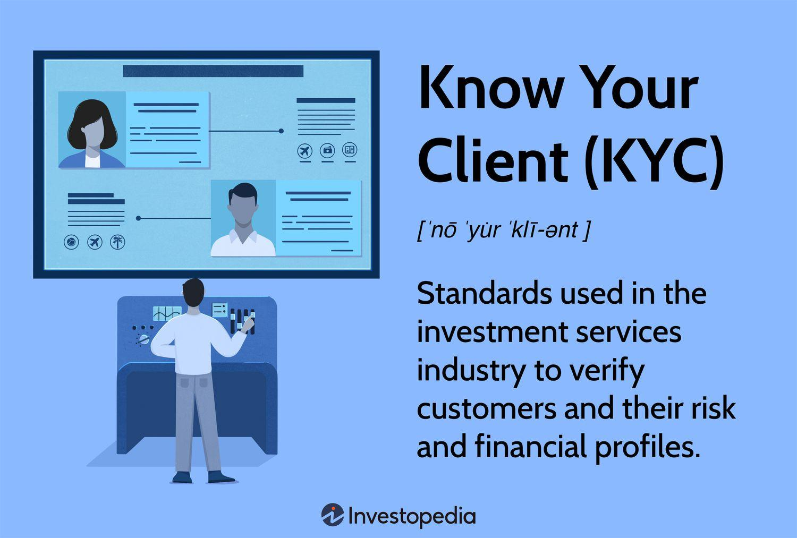

Client verification compliance and Know Your Client (KYC) protocols are integral components of algorithmic trading, ensuring that trading activities are conducted within a framework of security and regulatory adherence. KYC is a regulatory and legal requirement that involves verifying the identity of clients, assessing their suitability for specific financial products, and understanding their financial activities to mitigate the risk of involvement in illegal practices such as money laundering or fraud. Within the context of algorithmic trading, which leverages automated systems to execute trades at high speeds, KYC processes become critical to maintaining the integrity and transparency of financial markets.

Algorithmic trading operates within a dynamic regulatory landscape, where adherence to established standards is essential to prevent financial misconduct and promote market stability. Regulatory agencies such as the Securities and Exchange Commission (SEC), the Financial Industry Regulatory Authority (FINRA), and the Commodity Futures Trading Commission (CFTC) play pivotal roles in formulating guidelines and rules that govern trading operations. These agencies establish and enforce compliance measures, ensuring that trading platforms and financial institutions adopt rigorous KYC practices. The SEC, for example, mandates comprehensive checks to ensure that market access is restricted to verified and compliant entities, thus preventing unauthorized and potentially harmful trading activities.



The symbiotic relationship between KYC and algorithmic trading fosters a secure trading ecosystem. KYC protocols facilitate the accurate identification and risk assessment of clients, providing a foundation for algorithms to operate within legal and ethical bounds. By integrating KYC processes into trading systems, institutions can effectively monitor trading activities, detect suspicious behavior, and create audit trails crucial for regulatory compliance. This intersection of KYC and algorithmic trading not only safeguards the market against financial crimes but also enhances the credibility and resilience of trading environments.

This article will explore the essential components of KYC within algorithmic trading, followed by an examination of the regulatory frameworks governing these practices. Subsequent sections will delve into the roles and responsibilities involved in ensuring compliance, the challenges faced in implementing KYC measures, and the future trends shaping this domain. Together, these discussions will underscore the significance of robust compliance strategies and the imperative for financial institutions to innovate in response to evolving regulatory demands.

## Table of Contents

## Understanding KYC in Algorithmic Trading

KYC, or Know Your Client, is a critical regulatory process in the financial industry, designed to verify and monitor the identities and risk profiles of clients. It comprises three main components: Customer Identification Program (CIP), Customer Due Diligence (CDD), and Enhanced Due Diligence (EDD).

The Customer Identification Program (CIP) is the foundational step in KYC procedures. It mandates financial institutions to collect and verify basic client information such as name, date of birth, address, and identification number. This information is crucial for confirming the identity of clients before they engage in trading activities.

Customer Due Diligence (CDD) extends beyond merely identifying the client; it involves assessing the client's risk profile. This includes understanding the nature of the client's business, their transactional patterns, and monitoring their trading activities. The aim is to ensure consistency with known risk indicators, thereby identifying any anomalies that may suggest fraudulent behavior.

Enhanced Due Diligence (EDD) provides an additional layer of scrutiny, particularly for high-risk clients or those with complex financial transactions. EDD involves deeper investigations into the client's background, the purpose of their transactions, and the sources of their funds. This rigorous process is essential in mitigating risks associated with money laundering and terrorism financing.

In [algorithmic trading](/wiki/algorithmic-trading), KYC processes play a vital role in ensuring that the identities and risk profiles of traders are thoroughly vetted. The automation of trading through algorithms and high-frequency trading necessitates stringent KYC checks to prevent unauthorized access and fraudulent activities. By implementing KYC protocols, financial institutions can ensure that market participants adhere to regulatory requirements, thereby preserving the integrity of the trading environment.

The benefits of robust KYC processes in algorithmic trading are significant. Primarily, KYC acts as a deterrent against financial fraud and money laundering. By accurately identifying and continuously monitoring traders, financial institutions can detect and prevent illicit activities within high-frequency trading environments. This not only protects the institution but also enhances trust and transparency in financial markets.

However, the implementation of KYC in algorithmic trading also poses challenges. Compliance costs and operational overhead are significant considerations for financial institutions. Maintaining comprehensive KYC processes requires investment in technology and human resources to handle the [volume](/wiki/volume-trading-strategy) and complexity of data generated by algorithmic trading. Moreover, the need for continuous monitoring and updating of client information adds to operational burdens.

In summary, KYC is indispensable in algorithmic trading for verifying trader identities and assessing their risk profiles, thereby fortifying the financial ecosystem against fraud and money laundering. Despite the challenges associated with compliance costs and operational overhead, the long-term benefits of KYC in maintaining a secure and compliant trading environment cannot be overstated.

## Regulations Governing Algorithmic Trading and KYC

Algorithmic trading, which involves using automated systems to execute trades on financial markets, is subject to a complex regulatory framework. This framework ensures transparency and prevents illegal activities such as financial fraud and market manipulation. Two key regulations governing this space are the SEC's Market Access Rule and the CFTC's Regulation Automated Trading (Reg AT).

The SEC's Market Access Rule (Rule 15c3-5) focuses on ensuring that traders who have direct access to trading platforms have adequate risk controls in place. It mandates financial brokers and traders to implement measures that restrict improper access to financial markets. One of the critical aspects of this rule is the requirement for firms to conduct Know Your Client (KYC) processes. KYC processes help verify the identities of the traders and assess the potential risks they might pose. This is essential for transparency, preventing trading by unauthorized parties, and mitigating risks such as money laundering or terrorist financing.

The CFTC's Regulation Automated Trading (Reg AT) was proposed to establish a framework for the oversight of automated trading activities. Although Reg AT was withdrawn in 2020, its proposals highlight the regulatory emphasis on stringent risk controls and transparency in algorithmic trading. It sought to require certain traders to register, maintain compliance programs, and submit to government audits, which inherently includes aspects of KYC to validate trader identities and activities.

In this regulatory environment, financial institutions play a pivotal role in maintaining compliance. They are tasked with designing and implementing comprehensive compliance programs that incorporate KYC requirements. These programs ensure that all trading identities are vetted and that appropriate records are kept to support tracking and monitoring of trading activities. Institutions must manage both the technological and human elements of compliance, requiring significant investment in systems that facilitate these procedures.

Failure to comply with these regulations can result in severe penalties, ranging from fines to suspension of trading licenses. Non-compliance can also lead to reputational damage, further underscoring the necessity for robust compliance systems. Financial institutions must stay vigilant and proactive in integrating KYC measures that align with the current regulatory requirements.

In conclusion, governing bodies like the SEC and CFTC have established stringent regulations ensuring that algorithmic trading environments maintain transparency and integrity through mechanisms such as KYC. Financial institutions are not only responsible for implementing these measures but must continuously update their practices to adhere to evolving standards, thereby protecting themselves from potential legal and financial repercussions.

## The Role of Compliance in KYC and Algorithmic Trading

Compliance officers play a crucial role in the integration of Know Your Client (KYC) procedures within algorithmic trading platforms. Their primary responsibility is to ensure that trading operations align with legal and regulatory standards, thus mitigating risks associated with financial crimes such as fraud and money laundering. They must design and implement robust KYC frameworks that comprehensively verify the identities and risk profiles of clients engaging in trading activities. This process often begins with the development of a Customer Identification Program (CIP) to ascertain the identities of clients, followed by Customer Due Diligence (CDD) and Enhanced Due Diligence (EDD) protocols to assess and monitor risks.

Ongoing monitoring and reporting are essential components of effective compliance management in algorithmic trading. Compliance officers must supervise continuous data analysis to detect and report suspicious activities. Regular audits and reviews are vital to ensure the adherence to established procedures and to adapt to evolving regulatory requirements. This vigilance helps maintain transparency in trading operations, reassuring stakeholders of the system's integrity and security.

Technological tools and solutions significantly aid compliance officers in fulfilling their duties related to KYC and regulatory adherence. Advanced data analytics platforms and [machine learning](/wiki/machine-learning) algorithms enable more efficient analysis of trading patterns, facilitating early detection of anomalous behavior that may indicate fraudulent activity. For instance, Python-based machine learning libraries such as scikit-learn can be employed to build predictive models that assess transaction data, flagging high-risk profiles for further investigation.

Moreover, automation technologies play a pivotal role in streamlining compliance tasks. Robotic Process Automation (RPA) can be used to automate repetitive KYC checks, enhancing both speed and accuracy while reducing operational overheads. By implementing RPA, trading firms can ensure consistent application of compliance processes, thereby minimizing human error.

Blockchain technology also offers promising solutions for enhancing compliance with KYC requirements. Its decentralized and immutable nature allows for secure and transparent record-keeping, facilitating the reliable verification of client identities and transactions. This technology can contribute to more efficient compliance processes by ensuring the integrity and traceability of data.

In summary, the integration of KYC in algorithmic trading is heavily reliant on the diligence of compliance officers and the effective use of advanced technological solutions. Their efforts in monitoring, reporting, and leveraging technology not only ensure adherence to regulatory standards but also fortify the financial system against illicit activities.

## Challenges and Solutions in Implementing KYC for Algo Trading

Implementing Know Your Client (KYC) protocols in algorithmic trading environments presents several challenges for financial institutions. These challenges primarily revolve around data management, privacy concerns, and the scalability of compliance processes.

### Common Challenges

**1. Data Management and Privacy:** Algorithmic trading systems generate and process vast amounts of data, which poses significant data management challenges. Ensuring that client data is accurate, up-to-date, and secure from breaches is critical. Privacy regulations, such as the General Data Protection Regulation (GDPR), further complicate this by imposing strict requirements on data handling and sharing.

**2. Compliance Costs and Operational Overhead:** The cost of implementing comprehensive KYC procedures can be substantial. This includes expenses related to technology infrastructure, personnel training, and ongoing monitoring. Operational overhead also increases as systems must be continuously updated to remain compliant with evolving regulations.

**3. Integration with Existing Systems:** Many financial institutions use legacy systems for trading, which may not seamlessly integrate with modern KYC solutions. This can lead to inefficiencies and require significant investment in system upgrades or replacements.

### Innovative Solutions

**1. Artificial Intelligence and Machine Learning:** AI and ML can enhance the efficiency and accuracy of KYC processes by automating data analysis and anomaly detection. These technologies can identify patterns and flag potential risks, reducing the reliance on manual checks. For example, machine learning algorithms can classify and cluster client data to assess risk profiles or detect suspicious transactions.

**2. Blockchain Technology:** Blockchain offers a decentralized and secure way to store and verify client data. By maintaining an immutable record of KYC information, blockchain can reduce the duplication of efforts and streamline data sharing between institutions, enhancing both security and compliance.

**3. Cloud-Based KYC Platforms:** Cloud solutions allow scalable KYC operations by providing on-demand computing resources and innovative compliance tools. These platforms can manage large data volumes efficiently, offering robust analytics and reporting capabilities.

### Case Studies

Several industry leaders have successfully integrated KYC processes with their trading operations by leveraging technology. For instance:

- **JPMorgan Chase** has employed AI-based systems to automate parts of their KYC and anti-money laundering (AML) procedures, significantly reducing manual review times and improving overall compliance efficiency.

- **HSBC** has adopted a blockchain platform for KYC to facilitate secure data sharing across its global operations. This approach not only enhances compliance but also improves customer experience by reducing the time required for identity verification.

- **Goldman Sachs** uses machine learning to streamline their KYC operations, enabling faster identification of high-risk clients and improving regulatory reporting accuracy.

In conclusion, while the implementation of KYC in algorithmic trading environments involves notable challenges, innovative technological solutions offer promising avenues to address them. By adopting AI, blockchain, and cloud technologies, financial institutions can enhance their compliance efforts, reduce costs, and maintain high standards of data security and privacy.

## Future Trends in KYC Compliance and Algo Trading

As algorithmic trading continues to evolve, future trends in Know Your Client (KYC) compliance are increasingly shaped by regulatory developments and technological advancements. These factors are pivotal in defining how KYC processes are integrated into trading operations to ensure security, transparency, and efficiency.

Regulatory standards are expected to become more stringent, particularly as authorities strive to keep pace with the rapidly changing financial landscape. This tightening is likely to affect KYC compliance by imposing more rigorous due diligence requirements on trading platforms and financial institutions. Regulatory bodies such as the Securities and Exchange Commission (SEC) and the Commodity Futures Trading Commission (CFTC) may introduce more comprehensive guidelines that necessitate improved identification protocols and risk assessment methodologies. Consequently, firms will need to enhance their compliance frameworks to avoid legal penalties and maintain market integrity.

Technological advancements, notably in blockchain and [artificial intelligence](/wiki/ai-artificial-intelligence) (AI), present significant opportunities for improving KYC processes in algorithmic trading. Blockchain technology, with its decentralized and immutable ledger, can enhance the security and transparency of client information. By leveraging blockchain, trading platforms can effectively reduce the risk of data manipulation and unauthorized access. This technology also facilitates the creation of shared KYC systems, where verified client identities are securely shared across institutions, thereby streamlining the onboarding process and reducing redundancy.

AI technologies offer the potential to revolutionize KYC procedures by providing advanced data analytics and pattern recognition capabilities. Machine learning algorithms can be employed to continuously monitor and analyze trading activities, swiftly identifying suspicious behavior or anomalies that may indicate fraudulent activities or money laundering. Examples of useful algorithms include clustering techniques for anomaly detection and natural language processing for scanning textual data for compliance risks.

As markets evolve, particularly with the rise of [cryptocurrency](/wiki/cryptocurrency) exchanges, new KYC requirements are being adopted to address unique challenges. Cryptocurrencies' pseudonymous nature and global reach have prompted exchanges to implement stringent KYC measures to prevent illegal activities, such as financing terrorism and tax evasion. These measures often include enhanced identification checks, transaction monitoring, and compliance with international standards like the Financial Action Task Force (FATF) recommendations.

Python, as a versatile programming language, can be used to develop solutions that automate and enhance KYC compliance in trading systems. For instance, a Python script could be designed to interact with blockchain APIs to verify client identities or employ AI models to monitor trading patterns. Below is a simplified example of how Python might be used in these contexts:

```python
from blockchain import BlockchainAPI
from sklearn.ensemble import IsolationForest
import pandas as pd

# Function to verify client identity on a blockchain
def verify_client_identity(client_id):
    api = BlockchainAPI()
    return api.verify_identity(client_id)

# Function to detect anomalies in trading patterns using AI
def detect_anomalies(transaction_data):
    model = IsolationForest(contamination=0.01)
    model.fit(transaction_data)
    anomalies = model.predict(transaction_data)
    return pd.Series(anomalies).apply(lambda x: 'Anomaly' if x == -1 else 'Normal')

```

In essence, the successful integration of future KYC compliance in algorithmic trading hinges on adapting to tighter regulations and harnessing cutting-edge technologies to create secure, efficient, and compliant trading environments.

## Conclusion

The realm of algorithmic trading has witnessed significant advancements, with Know Your Client (KYC) processes playing a critical role in maintaining market integrity and compliance. Throughout this discussion, we have highlighted the importance of KYC as a safeguard against fraud, money laundering, and other illegal activities, ensuring secure trading environments within the fast-paced world of algorithmic trading. KYC's essential components, such as the Customer Identification Program (CIP), Customer Due Diligence (CDD), and Enhanced Due Diligence (EDD), form the bedrock of verifying traders' identities and risk profiles.

A robust compliance strategy is indispensable in this sector, not only to meet the stringent regulatory requirements set by key agencies like the SEC, FINRA, and CFTC but also to foster trust and transparency. These regulations underscore the necessity of integrating KYC measures into trading platforms to prevent financial misconduct and enhance market credibility. Compliance officers play a pivotal role in ensuring these procedures are effectively implemented and continually monitored.

Looking forward, it is imperative for financial institutions and trading platforms to proactively embrace technological advancements that streamline compliance processes. Innovative solutions, such as AI and machine learning, can significantly enhance the efficiency and accuracy of KYC operations. Moreover, blockchain technology offers potential breakthroughs in customer identification and transaction transparency, heralding a new era of secure and efficient trading practices.

As regulatory landscapes evolve and trading environments become more complex, staying abreast of compliance requirements is crucial. Adopting cutting-edge compliance technologies will not only ensure adherence to regulatory standards but also empower financial institutions to mitigate risks and maintain a competitive edge in the dynamic world of algorithmic trading. By doing so, they can continue to safeguard market integrity and foster sustainable growth in this increasingly digital age.

## References & Further Reading

[1]: Securities and Exchange Commission. ["SEC Market Access Rule (Rule 15c3-5)."](https://www.finra.org/rules-guidance/guidance/reports/2022-finras-examination-and-risk-monitoring-program/market-access-rule)

[2]: Financial Industry Regulatory Authority. ["FINRA Rules and Guidance."](https://www.finra.org/rules-guidance)

[3]: Commodity Futures Trading Commission. ["Regulation Automated Trading (Reg AT)."](https://www.cftc.gov/PressRoom/PressReleases/7283-15)

[4]: "Anti-Money Laundering Regulation and Compliance: How to Develop and Implement a Program that Detects and Prevents Money Laundering" by Alexander Dill

[5]: "Principles for Financial Market Infrastructures" by the Bank for International Settlements and the International Organization of Securities Commissions.