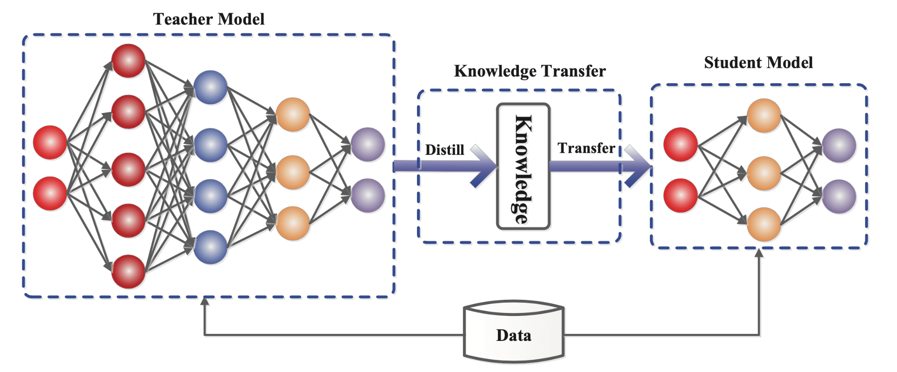

## Table of Contents

## What is Knowledge Distillation in the context of machine learning?

Knowledge Distillation is a technique used in machine learning where a smaller, simpler model (called the student) learns to mimic the behavior of a larger, more complex model (called the teacher). The idea is to transfer the knowledge from the teacher model to the student model, allowing the student to perform nearly as well as the teacher but with less computational power and resources. This is particularly useful in scenarios where deploying a large model is impractical, such as on mobile devices or in environments with limited computational capabilities.

The process of knowledge distillation involves training the student model not just on the original training data, but also on the outputs or "soft targets" produced by the teacher model. These soft targets are the probabilities assigned by the teacher to different classes, which contain more information than the hard labels (the actual class labels). By learning from these soft targets, the student model can capture more nuanced patterns and relationships in the data. The student model is typically trained using a combination of the original loss function (comparing its predictions to the true labels) and a distillation loss function (comparing its predictions to the teacher's soft targets), which helps it to better approximate the teacher's performance.

## How does Knowledge Distillation differ from traditional model training?

Knowledge Distillation is different from traditional model training because it involves using two models: a big, smart teacher model and a smaller, simpler student model. In traditional training, you only train one model directly on the data, trying to make it predict the right answers. But in Knowledge Distillation, the student model learns from both the actual data and the predictions made by the teacher model. The teacher model, which is already trained and good at its job, helps the student by showing it not just the correct answers, but also how confident it is about those answers. This extra information helps the student learn better and faster.

The key part of Knowledge Distillation is using what we call "soft targets." These are the probabilities the teacher model gives to different possible answers, not just the final answer it thinks is right. For example, if the teacher model thinks there's a 70% chance it's a dog and a 30% chance it's a cat, the student can learn from these percentages. In traditional training, the model only sees the final answer, like "it's a dog." By learning from these soft targets, the student model can pick up on more subtle patterns in the data. This makes the student model perform almost as well as the teacher, but with much less computing power needed.

## What are the main components of a Knowledge Distillation system?

The main components of a Knowledge Distillation system are the teacher model, the student model, and the training process that connects them. The teacher model is a large, complex model that has been trained on a dataset and performs well on the task at hand. The student model, on the other hand, is a smaller, simpler model that aims to learn from the teacher. The training process involves using the outputs of the teacher model, known as soft targets, to guide the training of the student model alongside the original training data.

During training, the student model learns from two sources: the actual data labels (hard targets) and the soft targets provided by the teacher. The soft targets are the probabilities that the teacher model assigns to different classes. For example, if the teacher model thinks there's a 70% chance an image is a dog and a 30% chance it's a cat, these percentages are the soft targets. The student model is trained to minimize a combination of two losses: the loss between its predictions and the true labels, and the loss between its predictions and the soft targets from the teacher. This dual learning approach helps the student model capture more nuanced patterns in the data and perform better than if it were trained only on the hard targets.

## Can you explain the role of the teacher model in Knowledge Distillation?

In Knowledge Distillation, the teacher model plays a crucial role as the guide for the student model. The teacher model is a large and complex model that has already been trained on a dataset and is good at making predictions. Its main job is to help the student model learn by providing extra information in the form of "soft targets." These soft targets are the probabilities the teacher model assigns to different possible answers. For example, if the teacher model thinks there's a 70% chance an image is a dog and a 30% chance it's a cat, it shares these percentages with the student model. This helps the student model learn not just the final answer, but also the confidence levels of those answers, which makes its learning more effective.

The teacher model's soft targets are used during the training of the student model. The student model tries to match not only the actual data labels (hard targets) but also the soft targets from the teacher. This dual learning approach helps the student model capture more subtle patterns in the data. The student model's training loss is a combination of the loss between its predictions and the true labels, and the loss between its predictions and the teacher's soft targets. By learning from these soft targets, the student model can perform almost as well as the teacher, but with much less computing power needed. This makes it possible to use the student model in situations where deploying the larger teacher model would be impractical.

## What is the significance of the student model in Knowledge Distillation?

The student model is really important in Knowledge Distillation because it's the one that gets to learn from the bigger and smarter teacher model. The student model is smaller and simpler, which means it can be used in places where the teacher model might be too big or too slow. The goal is for the student to learn to do almost as well as the teacher, but with less computer power needed. The student model learns by looking at the actual data and also by looking at the guesses the teacher makes. These guesses, called soft targets, give the student more information than just the right answers.

The student model gets trained using a special way that mixes the real data answers with the teacher's guesses. This helps the student pick up on the little details and patterns that the teacher knows. The student's job is to get as close as possible to what the teacher thinks, but it does this with a lot less computer work. By doing this, the student can be used on smaller devices like phones or in places where big computers aren't around. This makes the student model a key part of Knowledge Distillation, letting us use smart guesses in more places without needing big computers.

## How does the process of transferring knowledge from a teacher to a student model work?

In Knowledge Distillation, the process of transferring knowledge from a teacher model to a student model is like a smart student learning from a wise teacher. The teacher model, which is big and good at its job, has already learned a lot from the data. It helps the student model by showing it not just the right answers, but also how sure it is about those answers. These levels of sureness are called soft targets. For example, if the teacher thinks there's a 70% chance an image is a dog and a 30% chance it's a cat, it shares these percentages with the student. The student model then tries to copy these guesses as well as the actual answers from the data.

The student model learns by looking at both the actual data and the teacher's soft targets. It tries to get as close as possible to what the teacher thinks, but it does this with less computer power. During training, the student model's performance is measured in two ways: how well it matches the actual answers (hard targets) and how well it matches the teacher's guesses (soft targets). The student's training loss is a mix of these two measures. This special way of training helps the student pick up on the little details and patterns that the teacher knows. By doing this, the student can do almost as well as the teacher, but it can be used on smaller devices like phones or in places where big computers aren't around.

## What are some common techniques used in Knowledge Distillation to improve student model performance?

In Knowledge Distillation, one common technique to improve the student model's performance is to adjust the temperature parameter in the softmax function. The softmax function turns the model's raw scores into probabilities. By increasing the temperature, the teacher model's output becomes softer, meaning the probabilities spread out more evenly. This helps the student learn more about the relationships between different classes. For example, if the teacher model thinks an image is 70% dog and 30% cat at a normal temperature, a higher temperature might make it 60% dog and 40% cat, giving the student more detailed information to learn from.

Another technique is to use different types of losses during training. Besides the usual loss that measures how well the student matches the actual answers (hard targets), we also use a distillation loss that measures how well the student matches the teacher's soft targets. The total loss for the student is a mix of these two. By balancing these losses, we can help the student focus on both getting the right answers and understanding the teacher's way of thinking. This dual focus can make the student model perform better and learn more efficiently.

A third technique involves using multiple teacher models. Instead of learning from just one teacher, the student can learn from several teachers. Each teacher might be good at different parts of the task. By combining the soft targets from multiple teachers, the student gets a richer set of information to learn from. This can help the student model become even better at the task, as it's getting guidance from different expert perspectives.

## Can you describe the concept of Collaborative Distillation and its benefits?

Collaborative Distillation is a way to train a bunch of smaller models together, instead of just having one big teacher and one small student. In this method, all the small models, called peers, learn from each other at the same time. They each try to predict the right answers and also try to match what the other peers are guessing. This teamwork helps them all get better together. By working together, these peer models can sometimes do even better than a single big teacher model because they share different ways of looking at the data.

The main benefit of Collaborative Distillation is that it can lead to better performance without needing a huge teacher model. Since all the peer models are learning from each other, they can pick up on different patterns and details that might be missed by just one model. This can make the whole group smarter and more accurate. Plus, because the models are smaller, they can be used on devices with less power, like phones or small computers, making them really useful in lots of different situations.

## What is Teacher-Tutor-Student Knowledge Distillation and how does it enhance learning?

Teacher-Tutor-Student Knowledge Distillation is a special way to teach a student model by using not just one, but two helpers: a teacher and a tutor. The teacher is a big, smart model that knows a lot about the data. The tutor is another model, smaller than the teacher but bigger than the student, that helps the student learn even better. The student model learns by looking at the actual answers from the data, the guesses from the teacher, and also the guesses from the tutor. This extra help from the tutor makes the learning process more detailed and helps the student pick up on more patterns and details.

Using a tutor along with a teacher in Knowledge Distillation can make the student model learn faster and perform better. The tutor acts like a bridge between the big teacher and the smaller student. It can explain things in a way that's easier for the student to understand. By learning from both the teacher's and the tutor's guesses, the student gets a richer set of information. This can help the student model do almost as well as the teacher, but with much less computer power needed. This makes the student model useful in places where big models can't be used, like on phones or small devices.

## How do advanced methods like LFME and OMGD contribute to Knowledge Distillation?

LFME, which stands for Layer-wise Feature Map Exchange, is a way to make Knowledge Distillation even better. In this method, the student model doesn't just learn from the teacher's guesses about the final answers. It also learns from the teacher's guesses at different steps in the process. Imagine the teacher model is like a chef making a meal. Instead of just learning the final recipe, the student gets to see how the chef mixes the ingredients at each step. By looking at these steps, called feature maps, the student can understand more about how the teacher thinks. This helps the student learn faster and do a better job, even if it's smaller and simpler than the teacher.

OMGD, or Online Mutual Gradient Descent, is another cool trick to improve Knowledge Distillation. In this method, the student and teacher models learn together in real-time. They keep updating each other's guesses as they go along. It's like two friends studying together, where one friend helps the other with math problems, and they both get better at solving them. By working together like this, the student can quickly catch up to the teacher's level of understanding. This makes the whole learning process more efficient and can lead to a student model that performs really well, even with less computing power.

## What is the role of SFT and Hydra in optimizing Knowledge Distillation processes?

SFT, or Soft Feature Transfer, helps make Knowledge Distillation better by letting the student model learn not just from the teacher's final guesses, but also from the steps the teacher takes to make those guesses. Imagine the teacher is like a chef cooking a meal. The student gets to see not only the finished dish but also how the chef mixes the ingredients at each step. These steps are called feature maps. By looking at these feature maps, the student can understand more about how the teacher thinks and learns faster. This helps the student do a better job, even if it's smaller and simpler than the teacher.

Hydra is another way to improve Knowledge Distillation by using multiple teacher models at the same time. Instead of learning from just one big teacher, the student can learn from several teachers, each good at different parts of the task. It's like having a group of experts helping the student. By combining the guesses from all these teachers, the student gets a richer set of information to learn from. This can help the student model become even better at the task, as it's getting guidance from different expert perspectives.

## How can Knowledge Distillation be applied in practical scenarios, such as b2b transfer learning?

Knowledge Distillation can be really helpful in business-to-business (B2B) transfer learning, where one company wants to use a model that another company has already trained. Imagine a big company with a lot of data and computer power has a smart model. A smaller company wants to use this model but doesn't have the same resources. With Knowledge Distillation, the big company's model can act as the teacher, and the smaller company's model can be the student. The student learns from the teacher's guesses and the actual data, which helps it do almost as well as the teacher but with less power needed. This way, the smaller company can use a smart model without needing big computers.

In practice, the smaller company's student model would get trained using the big company's data and the teacher model's guesses. This means the student model can pick up on the patterns and details that the teacher knows, even if it's smaller. This is great for B2B because it lets smaller companies use advanced models without having to build them from scratch. They can save time and money, and still get good results. So, Knowledge Distillation makes it easier for businesses to share and use smart models, making everyone's work more efficient.

## References & Further Reading

[1]: Hinton, G., Vinyals, O., & Dean, J. (2015). ["Distilling the Knowledge in a Neural Network."](https://www.scirp.org/reference/referencespapers?referenceid=3680947) arXiv preprint arXiv:1503.02531.

[2]: Gou, J., Yu, B., Maybank, S. J., & Tao, D. (2021). ["Knowledge Distillation: A Survey."](https://arxiv.org/abs/2006.05525) Neurocomputing, 448, 138-153.

[3]: Buciluǎ, C., Caruana, R., & Niculescu-Mizil, A. (2006). ["Model Compression."](https://dl.acm.org/doi/10.1145/1150402.1150464) In Proceedings of the 12th ACM SIGKDD International Conference on Knowledge Discovery and Data Mining (pp. 535-541).

[4]: Romero, A., Ballas, N., Kahou, S. E., et al. (2014). ["FitNets: Hints for Thin Deep Nets."](https://arxiv.org/abs/1412.6550) arXiv preprint arXiv:1412.6550.

[5]: Ba, J., & Caruana, R. (2014). ["Do Deep Nets Really Need to be Deep?"](https://arxiv.org/abs/1312.6184) Advances in Neural Information Processing Systems 27.

[6]: Zhang, X., Zheng, Y., & Cui, H. (2020). ["Your Classifier is Secretly an Energy-based Model and You Should Treat it Like One."](https://arxiv.org/abs/1912.03263) arXiv preprint arXiv:2005.08386.

[7]: Li, H., Kadav, A., Durdanovic, I., et al. (2016). ["Pruning Filters for Efficient ConvNets."](https://arxiv.org/abs/1608.08710) arXiv preprint arXiv:1608.08710.