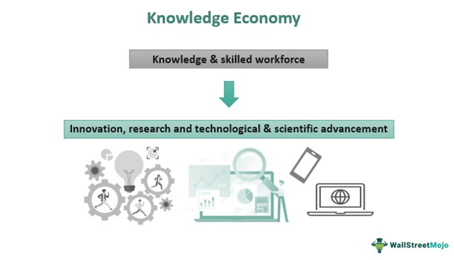

The modern global economy is increasingly dominated by the knowledge economy, which is characterized by its reliance on intellectual capital as a primary driving force. Unlike traditional economies that depend on physical inputs and manual labor, the knowledge economy thrives on the creation, dissemination, and utilization of information and expertise. This paradigm shift highlights the significant value of intangible assets such as human ingenuity, technological advancement, and innovative processes.

In this evolving economic framework, sectors that prioritize and harness intellectual resources are gaining prominence. The knowledge economy is exemplified by industries that heavily invest in research and development (R&D), foster innovation, and utilize intellectual property to secure competitive advantages. These industries include, but are not limited to, software development, biotechnology, and finance.



A critical aspect of the knowledge economy's influence is seen in the financial sector through algorithmic trading. Algorithmic trading represents a technology-driven approach where complex algorithms execute financial transactions at speeds and frequencies beyond the capability of human traders. This method relies heavily on data analysis, mathematical models, and computer programming skills, showcasing the integration of high-level intellectual capital with advanced technology.

By exploring the concept of the knowledge economy and its applications, such as algorithmic trading, we can better understand the pivotal role of intellectual resources in shaping modern economic structures and driving future growth.

## Table of Contents

## Understanding the Knowledge Economy

The knowledge economy represents a paradigm where economic development is intricately linked to the quantity, quality, and accessibility of knowledge rather than traditional means of production like land, labor, and physical resources. This transformation is facilitated by several crucial components: intellectual property, skilled labor, and technological infrastructure.

Intellectual property (IP) is paramount in the knowledge economy, serving as a driver for innovation and a protectorate for creators. Through the safeguarding of inventions, ideas, and artistic works via patents, copyrights, and trademarks, intellectual property rights incentivize innovation. This legal framework not only rewards creativity but promotes an environment where knowledge can be systematically harnessed and commercialized.

Skilled labor, characterized by high levels of education and specialization, is another cornerstone of the knowledge economy. Workers in such an economy are often engaged in professions that demand creativity, problem-solving, and adaptability, attributes derived from a strong educational foundation and continuous skills development. For instance, industries heavily reliant on skilled labor include information technology, biotechnology, and finance, where expertise drives growth and competitiveness.

Furthermore, technological infrastructure supports the distribution and utilization of knowledge within the economy. Robust and widespread digital networks, advanced communication systems, and state-of-the-art research facilities form the backbone for information accessibility and exchange. Technology acts as a catalyst that enables seamless interaction across global markets, facilitating collaborative research and development efforts among diverse stakeholders.

The knowledge economy thrives on perpetual innovation, primarily driven by research and development (R&D). This process often results in the production of intangible assets such as patents, specialized knowledge, and proprietary technologies. For example, R&D investments in cutting-edge areas like [artificial intelligence](/wiki/ai-artificial-intelligence), nanotechnology, and renewable energy spur the creation of novel solutions and intellectual property, reinforcing the economic significance of knowledge.

In summary, the knowledge economy is defined by a synergistic relationship between intellectual property, skilled labor, and technological infrastructure, fostering an environment where continuous innovation is paramount. Its foundations rest on the generation and exploitation of knowledge, creating intangible assets that signify economic value and potential.

## Economic Examples and Criteria of the Knowledge Economy

The knowledge economy, characterized by its emphasis on intellectual assets and innovation, manifests itself prominently in various sectors. A quintessential example is the software industry, which depends extensively on programming expertise and continuous innovation. This sector represents the backbone of the modern knowledge economy, as it not only necessitates a high level of specialized skills but also continuously generates new products and services through relentless innovation. Companies like Microsoft, Google, and Apple have thrived by leveraging their intellectual capital to create cutting-edge software solutions that dominate global markets.

In this industry, success is predicated on the continuous advancement of software technologies and methodologies. Software companies invest heavily in research and development (R&D) to maintain a competitive edge. They focus on enhancing software architecture, developing algorithms, and ensuring data security, thereby creating significant barriers to entry for competitors. The innovation cycle in software is rapid, with updates and new versions being developed continuously to meet evolving consumer and business needs.

Similarly, the pharmaceutical sector epitomizes the knowledge economy through its dependency on R&D and intellectual property (IP). This industry is driven by the discovery and development of new drugs, where substantial investments are made into understanding complex biological processes and synthesizing new chemical entities. Pharmaceutical companies rely on patents to protect their innovations, ensuring a temporary monopoly that allows them to recoup their research investments. The development of a new drug typically involves years of research and millions of dollars, highlighting the centrality of intellectual assets in this sector.

Pharmaceutical firms like Pfizer and Merck dedicate significant resources to their R&D divisions, which are tasked with exploring new therapeutic pathways and conducting clinical trials. The creation of a new drug progresses through various stages, including discovery, preclinical testing, clinical trials, and regulatory approval. Each of these phases requires meticulous documentation and intellectual rigor, reinforcing the industry's alignment with the tenets of the knowledge economy.

Economic criteria essential to the success of the knowledge economy include the availability of skilled labor, robust educational systems, and information technology infrastructure. Skilled labor is imperative as it provides the intellectual resources needed for innovation. This implies a workforce proficient in relevant technical skills, such as software development and scientific research, which are critical to the industries mentioned. Educational systems play a pivotal role by supplying this labor force. They need to focus on science, technology, engineering, and mathematics (STEM) education to ensure that individuals possess the foundational knowledge required to thrive in these sectors.

Moreover, information technology infrastructure is crucial as it facilitates the efficient exchange and management of information. High-speed internet, cloud computing, and advanced data analytics systems are the backbone of modern knowledge-driven businesses. These technologies enable companies to process vast amounts of data, collaborate across geographical boundaries, and bring innovative products to market more rapidly.

In summary, the software and pharmaceutical industries serve as prominent examples of the knowledge economy, driven by intellectual capital and innovation. Their success underscores the importance of skilled labor, robust educational systems, and advanced technology infrastructure, all of which are key economic criteria supporting the growth and sustainability of the knowledge economy.

## The Role of Algorithmic Trading in the Knowledge Economy

Algorithmic trading is a quintessential example of the knowledge economy's principles at work, leveraging complex algorithms designed to execute financial transactions at speeds and frequencies that are beyond the capability of human traders. This sophisticated trading methodology capitalizes on advances in computer science, mathematics, and data analysis, integrating these fields into a potent financial tool.

At the core of [algorithmic trading](/wiki/algorithmic-trading) is the deployment of mathematical models that analyze market data and identify trading opportunities. These models employ statistical and quantitative techniques to predict price movements and optimize trading strategies. The algorithms execute trades based on a set of predefined instructions dictated by these models, which often incorporate factors such as timing, price, and [volume](/wiki/volume-trading-strategy). A simple example of such an algorithm in Python could be:

```python
import pandas as pd

# Load historical market data
data = pd.read_csv("market_data.csv")

# Sample algorithm: Moving Average Crossover Strategy
short_window = 40
long_window = 100

# Compute the short and long moving averages
data['Short_MA'] = data['Close'].rolling(window=short_window).mean()
data['Long_MA'] = data['Close'].rolling(window=long_window).mean()

# Generate signals
data['Signal'] = 0
data.loc[data['Short_MA'] > data['Long_MA'], 'Signal'] = 1
data.loc[data['Short_MA'] <= data['Long_MA'], 'Signal'] = -1

# Displaying the first few rows of the data
print(data.head())
```

The success of algorithmic trading largely depends on human capital investments, particularly in professionals well-versed in data science and quantitative analysis. These experts design and calibrate the algorithms, ensuring they adapt to ever-changing market conditions. A strong educational foundation in mathematics, [statistics](/wiki/bayesian-statistics), engineering, or computer science is often deemed essential for roles within this sphere, as they provide the skills necessary for complex problem solving and model development.

Additionally, algorithmic trading thrives on data - vast amounts of it. The ability to accurately process and analyze market data in real-time is pivotal, positioning data scientists and quantitative analysts as critical resources within financial institutions that engage in algorithmic trading. Large financial entities often make substantial investments in data procurement and processing technologies, further underscoring the knowledge economy's emphasis on information accessibility and technological infrastructure.

The integration of emerging technologies like artificial intelligence (AI) and [machine learning](/wiki/machine-learning) is further revolutionizing algorithmic trading. AI systems can analyze market conditions more rapidly and accurately than traditional models and might adapt more fluidly to market changes. This ongoing technological integration demonstrates the dynamic nature of the knowledge economy and highlights the necessity for ongoing investment in intellectual capital to maintain a competitive edge.

## Challenges and Future Prospects

The transition to a knowledge economy presents significant challenges, primarily due to the necessity for ongoing education and adaptability to technological advancements. As industries increasingly rely on intellectual capital, the demand for continuously updated skills and knowledge becomes paramount. Traditional education systems often struggle to keep pace with the rapid evolution of technology, highlighting the need for innovative educational frameworks and lifelong learning models. 

To foster sustained growth within the knowledge economy, significant investment in education and infrastructure is critical. This involves enhancing educational curriculums to include advanced technological competencies, improving access to digital tools, and developing robust information technology infrastructure. In emerging technologies like AI and machine learning, the gap between current educational offerings and industry requirements can hinder progress. Therefore, fostering partnerships between educational institutions and industries can facilitate the development of programs that meet the ongoing demand for skilled workers.

The future of the knowledge economy is intricately linked with the integration of technologies such as AI and machine learning. These technologies are not only transforming industries by automating processes and enhancing data analysis but are also crucial in sectors like algorithmic trading. Algorithmic trading necessitates the utilization of AI to process large datasets, recognize trading opportunities, and execute orders at speeds beyond human capability. This dependence on advanced machine learning models underscores the need for professionals well-versed in these technologies.

In conclusion, the challenges faced in transitioning to a knowledge economy must be addressed through proactive adaptation strategies, focusing on education, infrastructure, and the integration of advanced technological tools. Emphasizing these areas will ensure that economies and businesses can remain competitive and thrive amidst the ongoing advancements characteristic of a knowledge-driven market.

## Conclusion

The knowledge economy is increasingly pivotal in transforming industries by shifting the focus from traditional resources to intellectual capital. This transition is evident in the development and sustainment of sectors such as software development, pharmaceuticals, and financial services, wherein algorithmic trading exemplifies the intricate integration of intellectual resources with technology.

In the software industry, innovation is driven by programming expertise and the creation of intangible assets, such as patents and specialized knowledge. This industry epitomizes the importance of investing in intellectual resources, given that software solutions are consistently evolving to meet new technological demands and consumer needs. Similarly, the pharmaceutical sector relies heavily on research and development to produce new medicines, where intellectual capital in the form of highly skilled researchers plays a crucial role. The creation of new drugs and the securing of intellectual property rights are both products of a robust knowledge economy.

Algorithmic trading, representing the financial services sector, underscores the crucial application of the knowledge economy. By employing advanced algorithms and data analysis, this trading strategy leverages intellectual resources to facilitate efficient, high-speed trading activities. The reliance on quantitative models and sophisticated computing infrastructure in algorithmic trading highlights the importance of nurturing technological and intellectual assets.

For economies and businesses to succeed in the contemporary landscape, embracing and cultivating intellectual resources is vital. This requires systematic investment in education, innovation, and technology infrastructure to remain competitive. As we move forward, ensuring that both businesses and economies are prepared for technological advancements such as artificial intelligence and machine learning will be imperative. These advancements have the potential to further deepen the intersection of the knowledge economy with key sectors, ensuring sustainable growth and development.

## References & Further Reading

[1]: ["The Knowledge Economy"](https://en.wikipedia.org/wiki/Knowledge_economy) by Dale W. Neef

[2]: ["The Rise of the Network Society: The Information Age: Economy, Society, and Culture Volume I"](https://onlinelibrary.wiley.com/doi/book/10.1002/9781444319514) by Manuel Castells

[3]: Holland, J. H. (1992). ["Adaptation in Natural and Artificial Systems"](https://direct.mit.edu/books/monograph/2574/Adaptation-in-Natural-and-Artificial-SystemsAn) MIT Press.

[4]: ["Algorithmic Trading and DMA: An Introduction to Direct Access Trading Strategies"](https://archive.org/details/algorithmictradi0000john) by Barry Johnson

[5]: Drucker, P. F. (1993). ["Post-Capitalist Society"](https://www.sciencedirect.com/book/9780750609210/post-capitalist-society). Harper Business.