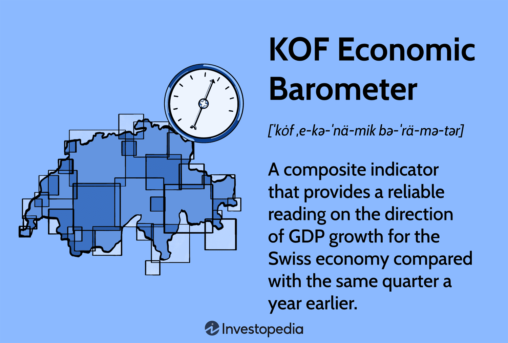

The global economy is perpetually transforming, influenced by a myriad of factors ranging from geopolitical developments to technological advances. Central to navigating this complex landscape are economic indicators, indispensable tools that guide the decisions of governments, financial institutions, and individual investors. These indicators offer crucial insights into past performances, current conditions, and potential future trends of economies worldwide. By analyzing these metrics, stakeholders can make informed decisions that align with their strategic goals and better anticipate economic shifts.

Economic indicators come in various forms and serve diverse functions. They are broadly classified into leading, lagging, and coincident indicators. Each category provides unique insights that are critical for comprehensive economic analysis. Leading indicators, for example, signal future economic events, while lagging indicators confirm trends that leading indicators have already predicted. Coincident indicators provide real-time snapshots of the economy's current state. Commonly used indicators include Gross Domestic Product (GDP), employment and inflation rates, and purchasing managers' indices, all of which play pivotal roles in shaping economic narratives and strategies.



This article examines not only the general concept of economic indicators but also places particular emphasis on the KOF Economic Barometer, a key composite indicator developed by the KOF Swiss Economic Institute. This tool is instrumental in forecasting economic conditions and guiding decision-making processes in Switzerland. Additionally, the article explores the rapid advancement of algorithmic trading, which is increasingly harnessing these economic metrics to execute swift and precise market transactions. By using algorithms that can process and react to real-time economic data, trading strategies can be optimized for better performance in today's fast-paced financial markets.

Understanding these components and their connections is vital. Economic history is rich with examples illustrating how economic indicators have shaped policies and strategies, influencing the course of financial markets. The interactions between historical data, predictive indicators, and innovative trading methodologies highlight the evolving nature of economic decision-making processes. This synergy not only enhances predictive accuracy but also fortifies the foundation on which modern economic systems are built. As such, comprehending these intricate dynamics prepares us to harness their full potential, paving the way for more effective economic and market forecasting.

## Table of Contents

## Understanding Economic Indicators

Economic indicators are quantitative measures utilized to evaluate economic performance across various sectors and regions. These indicators provide insights into the health and direction of an economy, aiding investors, policymakers, and analysts in making evidence-based decisions.

Economic indicators are primarily classified into three categories: leading, lagging, and coincident indicators. Leading indicators are used to predict future economic activity. They change before the economy does, providing foresight into economic trends. Examples include stock market returns, new business orders, and consumer sentiment indices. Lagging indicators, on the other hand, confirm trends that are already in motion. They change after the economy has already begun to follow a particular trend, providing confirmation of economic performance. Examples include the unemployment rate, gross domestic product (GDP) growth, and inflation rates. Coincident indicators occur simultaneously with economic shifts, offering real-time analysis of economic activity. These include metrics such as employment levels and industrial production.

One of the most critical economic indicators is GDP, which quantifies the total value of goods and services produced in a country over a specific period. It is a comprehensive measure of a nation’s economic activity and an essential gauge of economic health. Employment rates, another vital indicator, provide insights into labor market conditions and consumer spending potential. High employment rates typically indicate economic growth and prosperity, while low rates may signal economic distress. Inflation rates measure the rate at which the general level of prices for goods and services is rising, eroding purchasing power.

Purchasing Managers’ Indices (PMIs) are also crucial economic indicators. They reflect the economic health of the manufacturing and service sectors and serve as leading indicators of economic activity. A PMI above 50 suggests expansion, while below 50 indicates contraction.

Investors and policymakers rely heavily on these indicators. For investors, economic indicators guide investment strategies by predicting market trends and potential return opportunities. Policymakers use them to design and adjust economic policies, aiming to stabilize and stimulate economic growth. By analyzing these indicators, stakeholders can anticipate future economic conditions, enhancing decision-making processes across diverse economic landscapes.

## The Role of Economic Indicators in Economic History

Economic indicators have played a pivotal role in shaping economic history by providing valuable insights into the performance and evolution of economies over time. These quantitative measures help identify patterns and trends in economic performance, offering a foundation for informed decision-making by policymakers and investors. Historical analysis of key economic indicators, such as Gross Domestic Product (GDP) and unemployment rates, is essential for understanding both past economic fluctuations and the implications of economic policies.

Gross Domestic Product (GDP) is one of the most significant indicators in economic history, offering a comprehensive measure of a nation's economic output. It reflects the total value of goods and services produced within a country over a specific period. By analyzing GDP data, economists can assess economic growth, compare the economic strength of different countries, and evaluate the impacts of fiscal and monetary policies. For instance, during the Great Depression of the 1930s, a marked decline in GDP underscored the severe economic contraction, prompting governments to implement interventionist policies to stimulate recovery.

Similarly, unemployment rates offer critical insights into the health of labor markets. High unemployment rates signify underutilized resources within an economy, potentially leading to social and economic challenges. Historical trends in unemployment rates provide context for understanding business cycles, enabling governments to tailor employment policies effectively. For example, during the 1970s and 1980s, many industrialized nations experienced stagflation—a combination of high inflation and high unemployment—challenging existing economic theories and leading to shifts in policy approaches.

The analysis of historical economic indicators also aids in understanding the long-term impacts of global events and economic decisions. The oil crises of the 1970s, marked by sharp increases in oil prices and subsequent recessions, highlight how external shocks can influence economic indicators and necessitate policy adjustments. Examining these events through the lens of economic indicators allows for the assessment of vulnerabilities within economies and the development of strategies to mitigate similar risks in the future.

Additionally, economic indicators facilitate the identification of structural changes within economies. The shift from manufacturing-based economies to service-oriented economies in many developed countries is a notable example of structural transformation. This transition, captured by indicators such as sectoral GDP contributions and employment distribution, has significant policy implications, influencing decisions related to education, industrial policy, and workforce development.

In summary, the role of economic indicators in economic history is fundamental to understanding how economies have evolved. Through the analysis of historical data, economists and policymakers can glean insights into the effectiveness of past economic decisions and the long-term consequences of global events, guiding future economic strategies and interventions.

 to the KOF Economic Barometer

The KOF Economic Barometer is a significant tool developed by the KOF Swiss Economic Institute, designed to offer a foresight into the prospective economic growth of Switzerland. As a composite leading indicator, it integrates a diverse range of data inputs to measure economic dynamics that precede shifts in growth trends. By providing a concise overview of macroeconomic performance, the Barometer assists policymakers and financial analysts in crafting informed strategic decisions.

With a robust composition of over 200 variables, the Barometer pulls from diverse sectors including production, consumption, construction, and export orders. This comprehensive data amalgamation ensures a holistic representation of the Swiss economic environment. The variables are carefully selected based on their ability to predict short-term economic developments, allowing the Barometer to serve as a reliable predictor of economic sentiment. The performance from these diverse sectors is distilled into a singular indicator that reflects future economic changes with precision.

The utility of the KOF Economic Barometer extends to investors and market analysts. By translating complex datasets into a singular, interpretable indicator, it equips market participants with insights necessary for anticipating market trends and fluctuations. This utility manifests in its ability to signal economic turning points before they occur, offering a head start in financial planning and risk management. Consequently, the Barometer serves as a critical tool for those seeking to navigate the complexities of the Swiss economy with informed precision.

## How the KOF Economic Barometer Works

The KOF Economic Barometer functions by synthesizing numerous economic indicators into a singular, unified measure reflecting the Swiss economy's overall health. This aggregation process encompasses key metrics from various sectors, including core GDP, construction, and banking. By integrating these diverse components, the Barometer offers a comprehensive overview of economic trends, highlighting the interconnected nature of economic activities within Switzerland.

One of the pivotal methodologies employed by the KOF Economic Barometer is principal component analysis (PCA). This statistical technique involves transforming a set of correlated variables into a smaller number of uncorrelated variables known as principal components. The first principal component typically explains the largest proportion of the total variance observed in the dataset, thereby capturing the essence of the underlying economic movements. By doing so, PCA helps in constructing a leading indicator that efficiently encapsulates the co-movements in the underlying economic data.

Python, known for its powerful data analysis libraries, can be utilized to perform PCA as shown in the following example:

```python
from sklearn.decomposition import PCA
import numpy as np

# Sample dataset of economic indicators
data = np.array([[1.3, 7.4, 2.5],
                 [2.4, 3.5, 3.1],
                 [3.1, 4.6, 3.8]])

# Initialize PCA to reduce dimensions to 1
pca = PCA(n_components=1)
principal_components = pca.fit_transform(data)

print(principal_components)
```

The leading nature of the KOF Economic Barometer allows it to anticipate shifts in economic conditions prior to their manifestation in actual GDP figures. By providing an early signal of potential economic changes, the Barometer serves as a vital tool for investors and policymakers aiming to make informed decisions. Such forecasting capabilities are critical in enabling stakeholders to preemptively address economic challenges and capitalize on prospective opportunities within the Swiss economy.

## The Intersection of Economic Indicators and Algorithmic Trading

Algorithmic trading revolutionizes financial markets by using sophisticated computer algorithms to execute trades based on pre-defined criteria, often incorporating economic indicators as pivotal data inputs. These algorithms can analyze vast amounts of data rapidly and make trading decisions automatically, improving accuracy and speed in market response. Economic indicators, such as GDP growth rates, inflation figures, and unemployment [statistics](/wiki/bayesian-statistics), provide valuable insights that algorithms utilize to predict market movements and optimize trading strategies.

The use of real-time economic data in trading algorithms is critical. As these indicators offer timely insights into economic conditions, algorithms can adjust trading strategies swiftly to reflect the latest available information. For example, a sudden change in inflation rates might prompt an algorithm to shift investments from fixed income securities to equities, anticipating future [volatility](/wiki/volatility-trading-strategies) or shifts in central bank policies.

The KOF Economic Barometer serves as an exemplary indicator in [algorithmic trading](/wiki/algorithmic-trading). Developed by the KOF Swiss Economic Institute, this composite leading indicator aggregates over 200 variables to present a comprehensive view of the Swiss economy's expected growth rate. By employing advanced statistical methods such as principal component analysis, the KOF Economic Barometer predicts potential economic changes before they manifest in actual GDP figures. Such leading indicators are invaluable in algorithmic trading as they enhance the predictive capabilities of algorithms, enabling traders to preemptively position themselves in anticipation of market trends.

Incorporating the KOF Economic Barometer into algorithmic trading strategies can yield significant benefits. For instance, algorithms can be programmed to initiate buy or sell orders based on the changes in the Barometer's signals, thus capitalizing on anticipated shifts in the Swiss economy. This predictive advantage not only improves trading outcomes but also aligns with broader investment goals, such as risk management and maximizing returns.

Moreover, the integration of economic indicators into algorithmic trading facilitates the automation and standardization of trading processes, reducing the likelihood of human error and emotional bias. Python, a preferred language among quantitative traders, offers robust libraries for processing real-time economic data and developing intricate trading algorithms. A simple Python script could leverage an Application Programming Interface (API) to fetch the latest KOF Economic Barometer data and trigger trade execution based on predefined thresholds.

```python
import requests

def fetch_kof_data(api_url):
    response = requests.get(api_url)
    if response.status_code == 200:
        return response.json()  # Assuming the API returns JSON format
    else:
        raise Exception("Failed to fetch data")

def trade_decision(data):
    # Placeholder logic for trading decision based on KOF data
    if data['barometer_value'] > 100:
        return "Buy"  # Indicates positive economic sentiment
    else:
        return "Sell"  # Indicates negative economic sentiment

api_url = "https://api.kof.ethz.ch/barometer"
kof_data = fetch_kof_data(api_url)
trade_action = trade_decision(kof_data)

print(f"Trade Action: {trade_action}")
```

This script exemplifies how algorithmic traders might use real-time data to automate decisions based on economic indicators, ensuring they remain competitive and adaptive in ever-evolving markets. By leveraging indicators like the KOF Economic Barometer, algorithmic trading not only enhances efficiency and precision but also pushes the boundaries of market strategy innovation.

## Conclusion

Economic indicators, the KOF Economic Barometer, and algorithmic trading are integral components in understanding and navigating the complexities of the modern economic framework. Each of these elements provides valuable insights that aid in the prediction and analysis of economic and market trends, thereby informing and optimizing investment and policy decisions. Their interconnectivity allows for a comprehensive approach to interpreting market dynamics and forecasting potential shifts in economic conditions.

Economic indicators, as tools that quantify various aspects of economic performance, form the foundation upon which economic assessments are made. By providing critical data points such as GDP growth rates, employment statistics, and inflation measures, these indicators enable policymakers and investors to gauge the health of economies across different regions and sectors.

The KOF Economic Barometer exemplifies the advancement of economic indicators by serving as a sophisticated, composite leading indicator for the Swiss economy. By encapsulating over 200 variables, it offers a detailed perspective on expected economic growth, allowing stakeholders to anticipate economic developments with greater precision. Its ability to synthesize complex data into a singular measure makes it an invaluable resource for economic analysis and planning.

Algorithmic trading represents the fusion of technology and economic analysis, utilizing pre-set algorithms that incorporate real-time economic indicators to execute trades. This integration allows for rapid, data-driven trading decisions, enhancing the accuracy and responsiveness of market strategies. As algorithms process and react to incoming economic data, they provide a mechanism for capitalizing on market opportunities and mitigating risks with unprecedented speed and efficiency.

As global markets continue to evolve, the development and application of advanced economic indicators will remain essential. The dynamic interaction between historical data, predictive indicators like the KOF Economic Barometer, and innovative trading strategies will play a crucial role in shaping the future of economic decision-making. This synergy not only enhances our understanding of economic systems but also empowers us to navigate the uncertainties of global markets with greater confidence and foresight.

## References & Further Reading

[1]: Abberger, K. (2007). ["The KOF Economic Barometer and Economic Policy."](https://kof.ethz.ch/en/forecasts-and-indicators/indicators/kof-economic-barometer.html) Intereconomics, 42(5), 303-307.

[2]: ["Economic Indicators for Dummies"](https://www.wiley.com/en-us/Economic+Indicators+For+Dummies-p-9781118163894) by Michael Griffis

[3]: Granger, C. W. J., & Newbold, P. (2014). ["Forecasting Economic Time Series."](https://www.sciencedirect.com/book/9780122951831/forecasting-economic-time-series) Academic Press.

[4]: Sarlin, P. (2014). ["Macroprudential Oversight, Risk Communication, and Visualization."](https://www.semanticscholar.org/paper/Macroprudential-Oversight%2C-Risk-Communication-and-Sarlin/9bfc7be2282f7d4ddd1a9db0592f45a8bd3fdc33) Palgrave Macmillan.

[5]: Murphy, J. J. (1999). ["Technical Analysis of the Financial Markets: A Comprehensive Guide to Trading Methods and Applications."](https://archive.org/details/technicalanalysi0000murp) New York Institute of Finance.