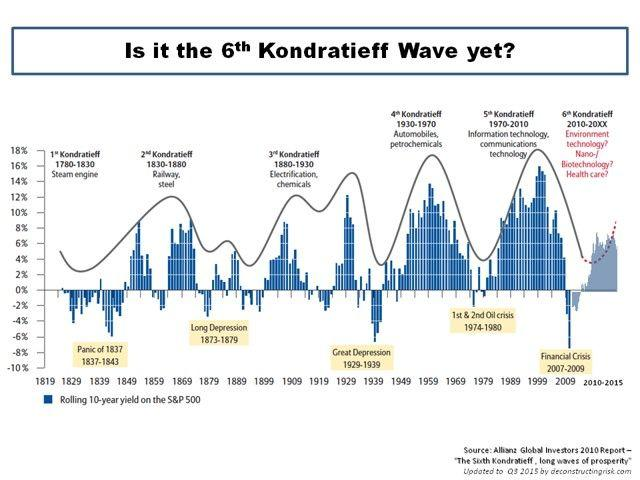

## Table of Contents

## What are Kondratieff Waves?

Kondratieff Waves, also known as K-Waves or long waves, are economic cycles that last around 50 to 60 years. They were first identified by Nikolai Kondratieff, a Russian economist, in the 1920s. These waves show periods of strong economic growth followed by times of slower growth or even decline. The idea is that economies go through long-term patterns that affect industries, technology, and even society as a whole.

These cycles are divided into four main phases: prosperity, recession, depression, and recovery. During the prosperity phase, new technologies and industries emerge, leading to economic growth. Then, as the cycle moves into recession and depression, growth slows down and unemployment may rise. Finally, in the recovery phase, the economy starts to pick up again, often driven by new innovations. While not everyone agrees that these long waves exist, many people find them useful for understanding big changes in the economy over time.

## Who was Nikolai Kondratieff and why did he develop this theory?

Nikolai Kondratieff was a Russian economist born in 1892. He worked during a time when Russia was going through a lot of changes, including the Russian Revolution. Kondratieff was interested in understanding how economies grow and shrink over long periods of time. He wanted to find patterns that could help explain why some times were good for the economy and other times were bad.

Kondratieff developed his theory of long waves because he noticed that economies seemed to go through cycles that lasted about 50 to 60 years. He thought these cycles were driven by big changes in technology and industry. For example, he saw that new inventions like the steam engine or electricity could lead to a boom in the economy. His theory was meant to help people predict and prepare for these long-term economic changes. Unfortunately, his ideas were not popular with the Soviet government, and he was arrested and eventually died in a prison camp in 1938.

## How long is a typical Kondratieff cycle?

A typical Kondratieff cycle lasts about 50 to 60 years. This long period is called a "long wave" because it takes a long time to go through all its stages.

These cycles have four main phases: prosperity, recession, depression, and recovery. In the prosperity phase, new technologies and industries help the economy grow a lot. Then, the economy slows down during the recession and depression phases. Finally, in the recovery phase, new innovations start to help the economy grow again.

## What are the phases of a Kondratieff Wave?

A Kondratieff Wave goes through four main phases: prosperity, recession, depression, and recovery. In the prosperity phase, the economy is doing really well. This is because new technologies and industries are growing. People are making more money, and businesses are doing well. This phase can last for about 20 to 25 years.

After prosperity comes the recession phase, where things start to slow down. Businesses might not be doing as well, and people might start to lose their jobs. This can lead to the depression phase, where the economy is really struggling. It might be hard for people to find work, and businesses might close down. The depression phase can be tough and last for a while.

Finally, the economy starts to get better in the recovery phase. New inventions and ideas start to help the economy grow again. This phase can take the economy back to prosperity, and the whole cycle starts over. Each phase of the Kondratieff Wave can take different amounts of time, but together they make up a cycle that lasts about 50 to 60 years.

## Can you provide examples of Kondratieff Waves in history?

One example of a Kondratieff Wave happened in the late 1700s and early 1800s. This wave started with the prosperity phase when new inventions like the steam engine and the spinning jenny helped start the Industrial Revolution. These inventions made it easier to make things, so factories grew and more people got jobs. This was a time of growth and new ideas. But then, around the 1820s, the economy started to slow down. This was the recession phase. By the 1840s, things got even worse, and this was the depression phase. Many people were out of work, and businesses struggled. Finally, in the 1850s, the economy started to recover. New technologies like the telegraph and the railroad helped the economy grow again, and the cycle started over.

Another example of a Kondratieff Wave happened in the early 1900s. The prosperity phase of this wave started around the 1890s with new inventions like electricity and the automobile. These new technologies led to a lot of growth and new jobs. This good time lasted until the 1920s. Then, the economy started to slow down, which was the recession phase. By the late 1920s and early 1930s, the economy was in a depression. This was the time of the Great Depression, when many people were out of work and businesses closed. The recovery phase started in the late 1930s and early 1940s, helped by new technologies like plastics and synthetic materials. The economy started to grow again, and the cycle began anew.

## What economic indicators are used to identify Kondratieff Waves?

To identify Kondratieff Waves, economists look at several key economic indicators. One important indicator is the overall growth of the economy, measured by things like Gross Domestic Product (GDP). When GDP is growing a lot, it might mean the economy is in the prosperity phase of a Kondratieff Wave. Another indicator is the level of employment. During the prosperity phase, more people have jobs, but during the depression phase, unemployment can be high. Prices of goods and services, or inflation, also help identify these waves. If prices are going up a lot, it could mean the economy is in the prosperity or recession phase.

Other indicators include the amount of money people are spending, called consumer spending, and how much businesses are investing in new projects, called capital investment. During the prosperity phase, both consumer spending and capital investment are usually high. But during the depression phase, people might not spend as much, and businesses might not want to invest in new projects. By looking at all these indicators together, economists can try to see if the economy is going through the different phases of a Kondratieff Wave.

## How do Kondratieff Waves relate to technological innovations?

Kondratieff Waves are closely tied to technological innovations. Each wave starts with a period of prosperity, which is often driven by new inventions and technologies. For example, the steam engine and the spinning jenny helped kick off the Industrial Revolution, leading to a lot of growth and new jobs. These new technologies create new industries and make it easier for businesses to make things, which helps the economy grow a lot during the prosperity phase.

As the Kondratieff Wave moves through its phases, the impact of these technologies changes. During the recession and depression phases, the economy slows down, and the initial excitement about the new technologies fades. But then, in the recovery phase, new innovations start to help the economy grow again. For instance, after the Great Depression, new technologies like plastics and synthetic materials helped the economy recover. So, technological innovations are key to understanding how Kondratieff Waves work and how they affect the economy over time.

## What criticisms are there of the Kondratieff Wave theory?

Some people don't believe in Kondratieff Waves because they think the data isn't clear enough. They say it's hard to see these long cycles in the numbers and that different economists might see different waves. Also, some critics think that the world has changed a lot since Kondratieff's time, so these cycles might not work the same way anymore. They argue that things like globalization and new ways of managing the economy can make it hard for these long waves to happen the way Kondratieff thought.

Another criticism is that Kondratieff Waves might be too simple. Economies are really complicated, and lots of different things can affect them. Some people think that trying to explain everything with just one long cycle is too basic. They believe that other economic theories might be better at explaining what's going on. Even though some people find Kondratieff Waves useful for understanding big changes over time, these criticisms show that not everyone agrees with the idea.

## How can Kondratieff Waves be used for economic forecasting?

Kondratieff Waves can be used for economic forecasting by looking at long-term patterns in the economy. Economists study things like GDP, employment, and prices to see if the economy is in a prosperity, recession, depression, or recovery phase. By understanding which phase the economy is in, they can make guesses about what might happen next. For example, if the economy is in a prosperity phase, they might predict that it will slow down soon and go into a recession. This can help people and businesses plan for the future.

Using Kondratieff Waves for forecasting is not perfect, though. The cycles can be hard to see clearly, and different economists might disagree about when a new wave starts or ends. Also, the world changes over time, so the same patterns might not always happen the same way. But even with these challenges, many people find Kondratieff Waves helpful for thinking about the big picture of the economy and planning for the long term.

## What is the impact of global economic policies on Kondratieff Waves?

Global economic policies can have a big impact on Kondratieff Waves. These policies, like trade agreements and financial regulations, can affect how fast the economy grows or slows down. For example, if countries work together to make it easier to trade, it can help the economy grow a lot during the prosperity phase of a Kondratieff Wave. But if countries put up barriers to trade, it can make the recession or depression phases even worse. Also, when governments spend a lot of money to help their economies, it can change how long each phase lasts.

Sometimes, global economic policies can even change the pattern of Kondratieff Waves. For instance, if a lot of countries start using new technologies together, it can make the prosperity phase last longer. But if there are big problems like financial crises, it can make the depression phase worse and last longer too. So, understanding how global policies work is important for seeing how Kondratieff Waves might change in the future.

## How do Kondratieff Waves interact with other economic cycles?

Kondratieff Waves are long cycles that last about 50 to 60 years, but there are also shorter cycles that affect the economy. One of these shorter cycles is the business cycle, which can last from 2 to 10 years. The business cycle has its own phases of expansion and contraction, and these can happen within the different phases of a Kondratieff Wave. For example, during the prosperity phase of a Kondratieff Wave, there might be several business cycles where the economy grows and then slows down a bit. But overall, the economy is still doing well because of the long-term growth from new technologies and industries.

Another cycle that can interact with Kondratieff Waves is the Juglar cycle, which lasts about 7 to 11 years and is often linked to changes in investment and capital goods. The Juglar cycle can make the economy go up and down more often than the Kondratieff Wave, but it can still be influenced by the long-term trends of the Kondratieff Wave. For instance, during the depression phase of a Kondratieff Wave, the Juglar cycle might make things even worse if there's a big drop in investment. But when the Kondratieff Wave moves into the recovery phase, the Juglar cycle might help the economy grow faster as businesses start investing in new projects again. So, while Kondratieff Waves give us a big picture of long-term economic changes, they work together with these shorter cycles to shape what happens in the economy over time.

## What are the latest research findings on Kondratieff Waves?

Recent research on Kondratieff Waves has been looking at how they fit into today's global economy. Some researchers think that Kondratieff Waves are still happening, but they might be different now because of things like the internet and how countries work together. They say new technologies like [artificial intelligence](/wiki/ai-artificial-intelligence) and renewable energy might be starting a new prosperity phase. But other researchers aren't so sure. They think that the world has changed so much that it's hard to see these long cycles anymore. They say things like financial markets and global trade make the economy more complicated, so it's tough to fit everything into the simple pattern of Kondratieff Waves.

Despite these differences, many researchers agree that looking at long-term patterns is still important. They use data from the past and today to try to see if Kondratieff Waves are still happening. Some studies use new ways of analyzing data, like computer models, to see if they can find these long waves more clearly. These models help them look at lots of different economic indicators at the same time. Even though not everyone agrees about Kondratieff Waves, this research helps us understand big changes in the economy and how new technologies might shape our future.

## References & Further Reading

[1]: Kondratieff, N. D. (1935). ["The Long Waves in Economic Life."](https://www.cannonfinancial.com/uploads/main/Long-Waves-in-Economic-Life.pdf) The Review of Economics and Statistics, 17(6), 105-115.

[2]: Freeman, C., & Louçã, F. (2001). ["As Time Goes By: From the Industrial Revolutions to the Information Revolution."](https://academic.oup.com/book/41022) Oxford University Press.

[3]: Schumpeter, J. A. (1939). ["Business Cycles: A Theoretical, Historical, and Statistical Analysis of the Capitalist Process."](https://archive.org/details/businesscycles0001unse) McGraw-Hill Book Company.

[4]: Korotayev, A., & Tsirel, S. (2010). ["A Spectral Analysis of World GDP Dynamics."](https://escholarship.org/uc/item/9jv108xp) In Structure and Dynamics, 4(1).

[5]: ["The Fourth Industrial Revolution"](https://en.wikipedia.org/wiki/Fourth_Industrial_Revolution) by Klaus Schwab

[6]: Forrester, V. (2018). ["Kondratieff Waves and Technological Evolution – A New Perspective"](https://www.sociostudies.org/almanac/articles/n-_d-_kondratieff-s_legacy_and_the_role_of_his_views_in_analyzing_modern_economic_problems_and_trend/) Springer International Publishing.