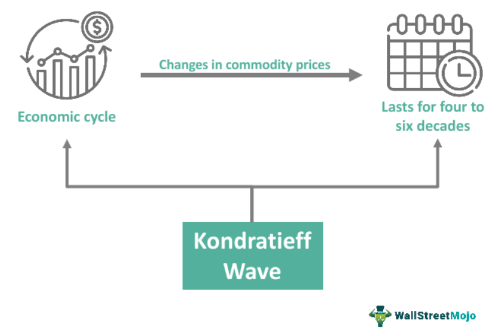

Economic systems worldwide display distinct cyclical patterns characterized by phases of growth and contraction. Understanding these cycles is essential for navigating the complexities of global markets, and one influential framework that aids in this understanding is the Kondratieff Wave theory. Named after the Russian economist Nikolai Kondratiev, this theory proposes that economic cycles span periods of 40 to 60 years. These long-term waves trace their origins to pivotal technological innovations that bring substantial changes to the structure of economies.

Nikolai Kondratiev postulated that each wave consists of alternating periods of prosperity and stagnation, influenced heavily by technological developments that lead to significant shifts in industries and societies. Throughout history, the existence of Kondratieff Waves has been marked by five distinct cycles, each associated with key technological and industrial advancements, such as the introduction of the steam engine or the rise of information technology. Presently, it is believed that the ongoing wave is shaped by developments in biotechnology and healthcare, areas that are crucial determinants of global economic trends.



This article seeks to explore the implications of Kondratieff Waves, particularly how they affect economic cycles and influence the field of algorithmic trading. By providing a comprehensive understanding of these extensive cycles, the article aims to shed light on their significance in strategic decision-making for investors and policymakers. Such knowledge is particularly relevant in today’s rapidly evolving economic landscape, where harnessing insights from historical patterns can offer a strategic advantage.

## Table of Contents

## Understanding Kondratieff Waves

Kondratieff Waves, also known as long waves, are extended economic cycles that last between 40 to 60 years and oscillate between periods of prosperity and stagnation. These prolonged cycles were first identified by the Russian economist Nikolai Kondratiev in the early 20th century. Central to Kondratieff Waves is the relationship between technological innovation and significant socioeconomic transformations, which drive the alternation between economic growth and stagnation.

Historically, economists have recognized five distinct Kondratieff Waves, each associated with remarkable technological advancements that sparked profound impacts on global economic structures. The first wave (late 18th to mid-19th century) was powered by the Industrial Revolution, characterized by the mechanization of textile production and the establishment of factories. The second wave (mid-19th to late 19th century) saw the expansion of the railway networks and steel industries. The third wave (early to mid-20th century) was defined by the proliferation of electricity and automobile production. The fourth wave (mid-to-late 20th century) was dominated by petrochemicals and electronics, vastly improving overall productivity and efficiency. The fifth wave, beginning in the late 20th century and extending into the 21st century, is typified by the information technology revolution, greatly influenced by the developments in computing and communication technologies.

Currently, economists postulate that we are entering or experiencing a sixth Kondratieff Wave, heavily influenced by advances in biotechnology and healthcare. This anticipated wave is marked by developments in genetic research, biotechnology, and significant growth in healthcare sectors. These innovations have the potential to reshape industries, enhance quality of life, and drive the global economy towards a new state of prosperity, simultaneously influencing socio-economic structures worldwide.

The technological innovation and socio-economic changes integral to Kondratieff Waves provide insights into the broader context of economic development, offering a long-term perspective that can inform businesses and policymakers on possible future transformations in the global economy. Understanding these cycles is vital, not only for economic analysis but also for strategic planning and policy formulation.

## Phases of Kondratieff Cycles

Kondratieff Cycles are composed of four distinct phases, each reflecting varying patterns of economic activity. These phases—Expansion (Spring), Stagnation (Summer), Recession (Autumn), and Recovery (Winter)—characterize the dynamic nature of long-term economic development.

During the Expansion phase, economies experience substantial growth primarily driven by technological advancements and innovation. This period, often referred to as Spring, is marked by increased industrial production, rising productivity, and enhanced consumer confidence. New industries emerge, creating employment opportunities and spurring investment. The proliferation of new technologies fosters an environment where economic output climbs, leading to prosperity.

As the cycle transitions to the Stagnation phase, labeled Summer, the initial fervor of growth begins to wane. Economic expansion faces headwinds as markets reach saturation points. The pace of technological adoption slows, and the market becomes increasingly crowded, reducing profit margins and leading to a deceleration in economic activity. While the economy remains stable, growth rates diminish, and the enthusiasm of the previous phase starts to dissipate.

The subsequent Recession phase, or Autumn, is characterized by economic downturns. This phase witnesses contractions in economic output, rising unemployment rates, and decreased consumer spending. Businesses face declining demand, leading to adjustments such as cost-cutting measures and restructuring efforts. Financial markets often experience [volatility](/wiki/volatility-trading-strategies), with asset prices falling and investor confidence being tested. Policymakers might intervene to stabilize the economy, but recovery is typically gradual.

Finally, the Recovery phase, known as Winter, signals the beginning of gradual economic revival. During this period, excesses from the previous phases are corrected, and the economy begins to stabilize and recover. Innovations and technological improvements from earlier phases start bearing fruit, providing a foundation for renewed growth. Investment in infrastructure and technology paves the way for the next cycle of expansion, and consumer confidence slowly rebounds.

Understanding these phases enables businesses and policymakers to better anticipate economic shifts and make informed decisions to mitigate risks and capitalize on potential opportunities. The cyclical nature of these phases underscores the importance of strategic planning that aligns with the evolving economic landscape.

## Kondratieff Waves and Economic Cycles

Kondratieff Waves provide valuable insights into the behavior and timing of economic cycles, which are characterized by alternating periods of growth and contraction over extended durations of 40 to 60 years. By examining the historical pattern of these waves, businesses and policymakers can better anticipate and respond to changes in economic conditions.

The periodic nature of Kondratieff Waves underscores the importance of understanding economic cycles. Each cycle represents a period where technological advancements drive economic transformations, leading to phases of expansion and, eventually, contraction. By recognizing which phase the economy is in, businesses can tailor their strategies to align with anticipated economic conditions. For instance, during the Expansion phase, characterized by robust economic growth, companies might focus on capitalizing on booming markets and increased consumer spending. Conversely, in the Recession phase, prudent financial management and risk mitigation become critical as economic activity contracts.

Policymakers also benefit from insights provided by Kondratieff Waves. By understanding the cyclical nature of economies and the phases that comprise these cycles, governments can implement policies that stabilize economic fluctuations. During periods of Expansion, caution may be exercised to prevent overheating of the economy. In contrast, during economic contractions, countercyclical fiscal and monetary policies can help to smooth the downturn and promote recovery.

Strategic planning based on Kondratieff Cycles can lead to optimized economic outcomes. Aligning business operations and policy initiatives with the phases of the Cycle allows for more informed decision-making that can enhance economic resilience. A comprehensive understanding of these long-term cycles can assist in forecasting structural changes and preparing for transitions between phases, thereby reducing the uncertainty associated with economic volatility.

By incorporating Kondratieff Wave insights, decision-makers can anticipate market saturation and mitigate risks associated with economic downturns. This foresight facilitates making strategic investments during times of technological innovation and conservatively managing resources during economic contractions. Thus, Kondratieff Waves serve as an important tool for navigating the complex dynamics of global economic cycles.

## Applications in Algorithmic Trading

Algorithmic trading, a method where traders use algorithms and pre-programmed strategies to execute trading orders, relies heavily on historical data analysis to anticipate market fluctuations and capitalize on long-term trends. Understanding Kondratieff Waves can significantly enhance the accuracy and efficiency of these predictive models.

Kondratieff Waves, with their cycles of economic expansion and contraction, provide valuable insights into the timing and nature of market swings. By incorporating the principles of these waves, trading algorithms can be programmed to recognize patterns associated with different phases of the economic cycle, such as expansion, stagnation, recession, and recovery. This understanding enables algorithms to adjust trading strategies dynamically, minimizing potential risks during downturns and maximizing returns during periods of growth.

For instance, during the Expansion phase, when economic growth is robust, algorithms may adopt an aggressive trading strategy, increasing the frequency and [volume](/wiki/volume-trading-strategy) of trades to exploit rising asset prices. Conversely, during a Recession phase, algorithms might take a conservative approach, focusing on risk management and capital preservation by shifting towards more stable asset classes or increasing cash reserves.

The integration of Kondratieff Waves into [algorithmic trading](/wiki/algorithmic-trading) systems is also facilitated by [machine learning](/wiki/machine-learning) techniques. These techniques can analyze vast amounts of historical economic data to identify subtle patterns and correlations that might not be apparent through traditional analysis. For example, a Python-based algorithm might be trained using libraries such as scikit-learn or TensorFlow to apply regression models or neural networks for predicting market trends based on Kondratieff Cycle insights.

Here is a simple example of how Python can be used to identify patterns within economic data, potentially influenced by Kondratieff Waves:

```python
import pandas as pd
from sklearn.ensemble import RandomForestClassifier
from sklearn.model_selection import train_test_split

# Load historical economic data
data = pd.read_csv('economic_data.csv')
features = data[['GDP_growth', 'unemployment_rate', 'tech_innovation']]  # Features indicative of Kondratieff phases
labels = data['market_phase']  # Target variable to predict market phase

# Split data into training and test sets
X_train, X_test, y_train, y_test = train_test_split(features, labels, test_size=0.2, random_state=42)

# Train a Random Forest Classifier to predict economic phases
classifier = RandomForestClassifier(n_estimators=100, random_state=42)
classifier.fit(X_train, y_train)

# Predict market phase on test data
predictions = classifier.predict(X_test)

# Output predictions
print(predictions)
```

In this example, the prediction model relies on economic indicators that are often linked to phases of the Kondratieff Cycle. By predicting the current economic phase, algorithmic trading strategies can be tailored accordingly, aligning investment choices with anticipated market conditions that are informed by Kondratieff Wave analysis.

## Criticisms and Controversies

Kondratieff Cycle Theory, while influential, encounters considerable scrutiny due to a lack of empirical validation, which is a cornerstone of academic robustness. Empirical validation involves systematically observing and measuring phenomena to establish the reliability of a theory. Critics of the Kondratieff Cycle Theory point out that the theory's proponents have yet to provide consistent empirical evidence across different centuries and economies. The predictive capacity of the Kondratieff Waves remains tenuous due to this empirical shortfall.

A significant point of contention is the deterministic nature of the theory. This emphasis on determinism implies that economic cycles routinely follow a predictable [course](/wiki/best-algorithmic-trading-courses) shaped primarily by technological innovation. Critics argue that this perspective inadequately accounts for various extrinsic factors, such as government policies, ideological shifts, and geopolitical events, which can significantly influence economic trajectories. For instance, fiscal policies or international conflicts can significantly disrupt expected cyclical patterns, thereby challenging the theory's core assertion of consistent, deterministic cycles.

Furthermore, the complexity of the modern global economy further complicates the universal application of the Kondratieff Waves. The global economy today is marked by intricate interdependencies, rapid technological changes, and complex regulatory environments. These factors introduce unprecedented levels of uncertainty and complexity, meaning that the cycles theorized by Kondratieff may not uniformly apply across different regions or sectors. The accelerating pace of technological change and globalization introduces variables that the original framework might not adequately encapsulate.

The theory's application is further challenged by these dynamic factors, making it difficult to establish comprehensive or uniform predictions. Such challenges underscore the need for an interdisciplinary approach that incorporates macroeconomic indicators and geopolitical considerations to enhance the explanatory and predictive power of economic cycle theories. While Kondratieff Cycle Theory remains a valuable conceptual tool, its limitations necessitate a critical and flexible analytical approach, ensuring it is used in conjunction with other economic theories and models that consider a broader range of influencing factors.

## Conclusion

Kondratieff Waves provide a useful framework for comprehending long-term economic trends and aiding strategic decision-making. These waves, which span several decades, are intrinsically linked to technological advancements and significant socio-economic transformations. Understanding them can offer crucial insights for investors and policymakers alike. By recognizing the cyclical nature of economies, stakeholders can better anticipate potential shifts and strategically navigate the complex economic landscape.

For investors, integrating the Kondratieff Wave theory into investment strategies can improve timing and asset allocation decisions, potentially enhancing returns over the long term. By aligning investment portfolios with the current phase of the Kondratieff Cycle, investors can better exploit periods of expansion, mitigate risks during downturns, and position themselves for recovery phases.

Policymakers can also benefit from these insights. By accounting for long-term economic cycles, they can design policies that bolster economic stability and facilitate smooth transitions between different phases. This strategic foresight enables the development of economic policies that not only address immediate challenges but also pave the way for sustainable growth.

The application of the Kondratieff theory in algorithmic trading highlights the fusion of traditional economic theory with modern technological advancements. Algorithmic trading systems, which rely on data analysis and machine learning, can incorporate Kondratieff Waves to refine predictive models. By adjusting trading algorithms to account for cyclical economic patterns, these systems can optimize trading strategies to minimize risks and maximize opportunities.

Overall, the insights provided by Kondratieff Waves offer valuable tools for long-term economic planning and strategy, accommodating both conventional economic approaches and innovative technological applications in today's dynamic global economy.

## References & Further Reading

[1]: Kondratieff, N. D. (1935). ["The Long Waves in Economic Life."](https://www.cannonfinancial.com/uploads/main/Long-Waves-in-Economic-Life.pdf) The Review of Economics and Statistics, 17(6), 105-115.

[2]: Freeman, C., & Louçã, F. (2001). ["As Time Goes By: From the Industrial Revolutions to the Information Revolution."](https://academic.oup.com/book/41022) Oxford University Press.

[3]: Schumpeter, J. A. (1939). ["Business Cycles: A Theoretical, Historical, and Statistical Analysis of the Capitalist Process."](https://archive.org/details/businesscycles0001unse) McGraw-Hill Book Company.

[4]: Korotayev, A., & Tsirel, S. (2010). ["A Spectral Analysis of World GDP Dynamics."](https://escholarship.org/uc/item/9jv108xp) In Structure and Dynamics, 4(1).

[5]: ["The Fourth Industrial Revolution"](https://en.wikipedia.org/wiki/Fourth_Industrial_Revolution) by Klaus Schwab

[6]: Forrester, V. (2018). ["Kondratieff Waves and Technological Evolution – A New Perspective"](https://www.sociostudies.org/almanac/articles/n-_d-_kondratieff-s_legacy_and_the_role_of_his_views_in_analyzing_modern_economic_problems_and_trend/) Springer International Publishing.