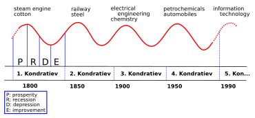

## Table of Contents

## What is the Kondratiev Wave?

The Kondratiev Wave, also known as the K-Wave or long wave, is a theory about economic cycles that last about 50 to 60 years. It was named after Nikolai Kondratiev, a Russian economist who first proposed the idea in the 1920s. According to this theory, economies go through long periods of growth followed by long periods of decline. These cycles are influenced by major technological innovations, like the steam engine or the internet, which drive economic expansion until they reach a saturation point and the economy starts to decline.

Kondratiev believed that these long waves could help predict future economic trends and help policymakers prepare for downturns. For example, after a period of growth driven by a new technology, there might be a time of economic stagnation or depression as the market adjusts. Critics of the theory argue that it's hard to predict these cycles accurately and that other factors, like government policies and global events, can disrupt the pattern. Despite this, the Kondratiev Wave remains an interesting way to look at long-term economic patterns and the impact of technology on our lives.

## Who developed the theory of the Kondratiev Wave?

The theory of the Kondratiev Wave was developed by a Russian economist named Nikolai Kondratiev. He came up with the idea in the 1920s. Kondratiev noticed that economies seemed to go through long periods of growth and then long periods of decline. He thought these cycles lasted about 50 to 60 years. He believed these long waves were driven by big technological changes, like the steam engine or the internet.

Kondratiev thought that understanding these cycles could help people predict future economic trends. This could help governments and businesses prepare for tough times. But not everyone agrees with his theory. Some people think it's too hard to predict these long waves accurately. They say other things, like government policies and big world events, can mess up the pattern. Still, the Kondratiev Wave is an interesting way to think about how technology and the economy are connected over long periods of time.

## What is the typical duration of a Kondratiev Wave cycle?

A Kondratiev Wave cycle usually lasts about 50 to 60 years. This long cycle is made up of times when the economy grows a lot and times when it doesn't grow as much or even shrinks. These cycles are thought to be driven by big new technologies that change how people work and live.

For example, the steam engine or the internet are kinds of technologies that start a new Kondratiev Wave. When a new technology comes out, it helps the economy grow for a while. But after a time, the technology becomes normal and doesn't help the economy grow as much. Then, the economy might go into a period of slower growth or even a downturn until the next big technology comes along to start a new cycle.

## How many phases does a Kondratiev Wave have, and what are they?

A Kondratiev Wave has four phases. These phases show how the economy changes over time because of big new technologies.

The first phase is called expansion. This is when a new technology, like the steam engine or the internet, starts to be used a lot. It helps the economy grow a lot. The second phase is called stagnation. This is when the new technology is used everywhere, and it doesn't help the economy grow as much anymore. The third phase is called recession. This is when the economy starts to shrink because the technology isn't helping as much. The last phase is called depression. This is when the economy is at its lowest point, but it's also when people start to look for the next big technology that will start a new cycle of growth.

## What are some historical examples of Kondratiev Waves?

One example of a Kondratiev Wave started in the late 1700s with the Industrial Revolution. The steam engine was a big new technology that helped the economy grow a lot. Factories started using steam engines to make things faster and cheaper. This was the expansion phase. But after a while, the steam engine became normal and didn't help the economy grow as much. This was the stagnation phase. Then, the economy went into a recession and depression in the early 1800s, until the next big technology, like the railroad, came along to start a new cycle.

Another example started in the late 1800s with the Second Industrial Revolution. This time, electricity and the internal combustion engine were the big new technologies. They helped the economy grow a lot during the expansion phase. But by the early 1900s, these technologies were used everywhere and didn't help the economy grow as much. This was the stagnation phase. Then, the economy went into a recession and depression in the 1930s, until the next big technology, like computers, came along to start a new cycle.

The most recent example started in the late 1900s with the Information Age. The internet and personal computers were the big new technologies that helped the economy grow a lot during the expansion phase. But by the early 2000s, these technologies were used everywhere and didn't help the economy grow as much. This was the stagnation phase. Then, the economy went into a recession and depression around 2008, and now people are looking for the next big technology, like [artificial intelligence](/wiki/ai-artificial-intelligence) or renewable energy, to start a new cycle.

## What economic indicators are used to identify Kondratiev Waves?

To identify Kondratiev Waves, economists look at several economic indicators. One key indicator is the price level, which can show periods of inflation and deflation over long periods. During the expansion phase, prices tend to rise as new technologies boost economic growth. In the stagnation and recession phases, prices might stay the same or even fall as the economy slows down. Another important indicator is the level of economic output, often measured by Gross Domestic Product (GDP). During the expansion phase, GDP grows quickly because of the new technology. But in the stagnation and recession phases, GDP growth slows down or even turns negative.

Other indicators include employment rates and investment levels. During the expansion phase, more people have jobs and businesses invest a lot in new projects because they expect to make money from the new technology. But in the stagnation and recession phases, fewer people have jobs and businesses invest less because they are not as confident about the future. By looking at these indicators over long periods, economists can try to spot the different phases of a Kondratiev Wave and predict when the next big technology might start a new cycle of growth.

## How do technological innovations influence Kondratiev Waves?

Technological innovations are the main drivers of Kondratiev Waves. When a new technology, like the steam engine or the internet, comes out, it helps the economy grow a lot. This is because the new technology makes it easier and cheaper to make things or do things. People start using the new technology everywhere, which creates new jobs and businesses. This is the expansion phase of a Kondratiev Wave. The economy grows quickly because everyone is excited about the new technology and what it can do.

But after a while, the new technology becomes normal. It's used everywhere, and it doesn't help the economy grow as much anymore. This is the stagnation phase. Then, the economy might start to slow down or even shrink because the technology isn't helping as much. This is the recession and depression phase. During this time, people start looking for the next big technology that will start a new cycle of growth. So, technological innovations are really important for Kondratiev Waves because they start each new cycle of growth and change.

## What criticisms have been made about the Kondratiev Wave theory?

Some people don't agree with the Kondratiev Wave theory. They think it's hard to predict these long cycles accurately. The economy is affected by many things, like government policies and big world events. These things can mess up the pattern of the Kondratiev Waves. For example, a war or a new law can change how the economy grows or shrinks, making it hard to see the long waves clearly.

Another criticism is that the theory is too simple. It says that big new technologies drive the economy in long cycles, but the economy is more complicated than that. Other things, like how much people spend, how much businesses invest, and how much the government spends, also affect the economy. Some people think that focusing only on technology misses these other important factors. So, while the Kondratiev Wave theory is interesting, it might not be the best way to understand how the economy works over long periods.

## How do Kondratiev Waves relate to other economic cycles like the business cycle?

Kondratiev Waves are long economic cycles that last about 50 to 60 years. They are different from shorter cycles like the business cycle, which usually lasts a few years. The business cycle has ups and downs, with times of growth called booms and times of shrinking called recessions. Kondratiev Waves, on the other hand, are driven by big new technologies that change how people work and live. These long waves include times of growth when a new technology is used a lot, followed by times of slower growth or even decline when the technology becomes normal.

Even though they are different, Kondratiev Waves and business cycles can work together. A Kondratiev Wave's long period of growth can include several shorter business cycles. During the expansion phase of a Kondratiev Wave, there might be a few business cycle booms. But when the Kondratiev Wave goes into its stagnation or recession phase, the business cycles might have more recessions. So, understanding both types of cycles can help people see how the economy changes over both short and long periods.

## What are the implications of Kondratiev Waves for economic policy?

Kondratiev Waves can help people who make economic policies plan for the future. If they know that the economy goes through long periods of growth and then long periods of decline, they can prepare for these changes. During the growth phase, when a new technology is helping the economy a lot, policymakers might want to invest in education and training so people can use the new technology well. They might also want to make sure that everyone can benefit from the new technology, not just a few people.

But when the economy goes into the decline phase, policymakers need to be ready to help people who lose their jobs or businesses that struggle. They might need to spend more money on social programs to help people get through tough times. Understanding Kondratiev Waves can help policymakers see the big picture and make better decisions to keep the economy stable over long periods.

## How can investors use Kondratiev Wave theory to make investment decisions?

Investors can use Kondratiev Wave theory to plan their investments over long periods. When a new technology starts a Kondratiev Wave's growth phase, like the internet or electricity did in the past, investors might want to put their money into companies that use this new technology. These companies could grow a lot as the economy expands. For example, during the internet boom, investing in tech companies could have made a lot of money. By understanding where the economy is in a Kondratiev Wave, investors can try to pick the right time to buy and sell stocks.

But when the Kondratiev Wave goes into its decline phase, investors need to be careful. This is when the economy might slow down or even shrink. During this time, it might be smarter to invest in safer things, like bonds or companies that are less affected by the economy's ups and downs. By knowing about Kondratiev Waves, investors can try to protect their money during tough times and make the most of it during good times.

## What are the current debates among economists regarding the validity and application of Kondratiev Waves?

Economists are still debating whether Kondratiev Waves really exist and how useful they are for understanding the economy. Some economists think that these long cycles are too hard to predict accurately. They say that other things, like government policies and big world events, can mess up the pattern of the Kondratiev Waves. For example, a war or a new law can change how the economy grows or shrinks, making it hard to see the long waves clearly. These critics argue that focusing only on technology misses other important factors that affect the economy, like how much people spend or how much businesses invest.

On the other hand, some economists believe that Kondratiev Waves are a useful way to look at how the economy changes over long periods. They think that understanding these cycles can help people predict future economic trends and prepare for downturns. For example, if policymakers and investors know that the economy is in the growth phase of a Kondratiev Wave, they might make different decisions than if they think it's in a decline phase. Even though it's hard to predict these long cycles exactly, these economists believe that Kondratiev Waves can still give us a big-picture view of how technology and the economy are connected.

## References & Further Reading

[1]: Kondratieff, N. D. (1935). ["The Long Waves in Economic Life."](https://www.jstor.org/stable/40240816) Review of Economics and Statistics, 17(6), 105-115.

[2]: Freeman, C., & Louçã, F. (2001). ["As Time Goes By: From the Industrial Revolutions to the Information Revolution."](https://academic.oup.com/book/41022) Oxford University Press.

[3]: Korotayev, A., & Tsirel, S. (2010). ["A Spectral Analysis of World GDP Dynamics: Kondratieff Waves, Kuznets Swings, Juglar and Kitchin Cycles in Global Economic Development, and the 2008–2009 Economic Crisis."](https://escholarship.org/uc/item/9jv108xp) Structure and Dynamics: eJournal of Anthropological and Related Sciences.

[4]: Schumpeter, J. A. (1939). ["Business Cycles: A Theoretical, Historical, and Statistical Analysis of the Capitalist Process."](https://archive.org/details/businesscycles0001unse) McGraw-Hill Book Company.

[5]: Stevenson, B. W., & Wolfers, J. (2010). ["Subjects in Search of an Author: Economics and the Revolutions of Kondratieff."](https://www.nber.org/papers/w16441) Journal of Economic Perspectives, 24(2), 67-88.