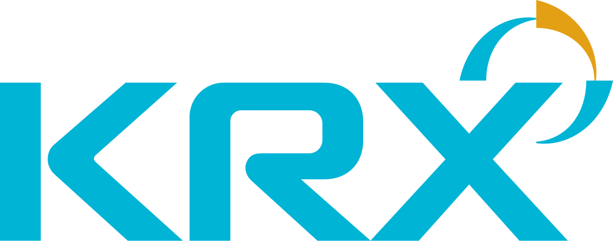

## Table of Contents

## What is the Korea Exchange?

The Korea Exchange, often called KRX, is the main stock market in South Korea. It is where people and companies can buy and sell shares of Korean companies. The KRX started in 2005 when three different exchanges in South Korea joined together. This made it easier for people to trade stocks, bonds, and other financial products all in one place.

The KRX is important for the Korean economy because it helps businesses get money to grow by selling shares to the public. It also helps investors make money by buying and selling these shares. The KRX has rules to make sure trading is fair and safe for everyone involved. People from all over the world can trade on the KRX, making it a big part of the global financial market.

## Where is the Korea Exchange located?

The Korea Exchange is located in Busan, which is a big city in South Korea. Busan is on the southeast coast of the country. The main building of the Korea Exchange is called the KRX Center, and it's in the Haeundae district of Busan.

The KRX Center is not just a building; it's a place where a lot of important trading happens. People come here to buy and sell stocks and other financial products. Even though the main office is in Busan, the Korea Exchange also has offices in Seoul, which is the capital city of South Korea.

## What types of financial instruments are traded on the Korea Exchange?

The Korea Exchange, or KRX, is where many different types of financial instruments are traded. These include stocks, which are shares in companies that people can buy and sell. When you buy a stock, you own a little piece of that company. The KRX also trades bonds, which are like loans that people give to the government or companies. In return, they get their money back with interest over time.

Another type of financial instrument on the KRX is exchange-traded funds, or ETFs. These are like baskets of different stocks or other assets that you can buy and sell like a single stock. The KRX also has futures and options, which are agreements to buy or sell something at a future date. These can be used to manage risk or to try to make money from changes in prices.

Overall, the KRX offers a wide range of financial products that help both companies and investors. Companies can raise money by selling stocks or bonds, while investors can choose from many different ways to invest their money. This variety makes the KRX an important part of the financial world in South Korea and beyond.

## How does one start trading on the Korea Exchange?

To start trading on the Korea Exchange, or KRX, you first need to open an account with a brokerage firm. A brokerage firm is a company that helps you buy and sell stocks and other financial products. You can choose a brokerage firm that is right for you by looking at things like fees, services, and how easy it is to use their platform. Once you pick a brokerage firm, you'll need to fill out some forms and give them some information about yourself, like your name, address, and maybe even your job. This is to make sure they know who you are and can help you trade safely.

After you have your brokerage account set up, you can start trading on the KRX. You'll need to put some money into your account, which is called depositing funds. Once your money is in your account, you can use the brokerage firm's website or app to look at different stocks, bonds, ETFs, and other financial products that are traded on the KRX. When you find something you want to buy, you can place an order through the platform. The brokerage firm will then buy it for you, and it will show up in your account. You can keep track of how your investments are doing and decide when to sell them if you want to.

## What are the operating hours of the Korea Exchange?

The Korea Exchange, or KRX, is open for trading from Monday to Friday. The main trading hours are from 9:00 AM to 3:00 PM, local time in South Korea. This is when most of the buying and selling happens.

There are also times before and after the main trading hours when you can place orders. These are called pre-market and after-hours trading. Pre-market trading starts at 7:30 AM and goes until the regular session begins at 9:00 AM. After-hours trading happens from 3:00 PM to 6:00 PM. These times give people more chances to trade, but not as many people are trading then, so it can be different from the main hours.

## What is the history of the Korea Exchange?

The Korea Exchange, known as KRX, started in 2005. Before that, there were three different exchanges in South Korea: the Korea Stock Exchange, the KOSDAQ, and the Korea Futures Exchange. These three groups joined together to make trading easier and more efficient. By combining, they could offer more types of financial products and help more people and companies buy and sell stocks, bonds, and other things.

Since it started, the KRX has grown a lot. It has become an important part of the financial world, not just in South Korea but around the globe. The KRX helps companies raise money by selling shares to the public, and it helps people invest their money in different ways. The main office of the KRX is in Busan, but it also has offices in Seoul, the capital city. This makes it easy for people all over South Korea to trade and invest.

## How does the Korea Exchange contribute to the South Korean economy?

The Korea Exchange, or KRX, plays a big role in helping the South Korean economy grow. It does this by letting companies sell shares to the public. When a company sells shares, it gets money that it can use to build new factories, hire more people, or make new products. This helps the company grow and also creates jobs for people in South Korea. The KRX makes it easy for these companies to find investors who want to buy their shares, which is good for the whole economy.

The KRX also helps people in South Korea invest their money. When people buy stocks or other financial products on the KRX, they can make money if the value of those products goes up. This gives people a way to save and grow their money over time. When more people are investing, it can make the economy stronger because it means more money is moving around and being used to help businesses grow. So, the KRX is important for both companies and people in South Korea, helping to keep the economy healthy and growing.

## What are the major indices managed by the Korea Exchange?

The Korea Exchange, or KRX, manages several important stock market indices. The most well-known is the KOSPI, which stands for Korea Composite Stock Price Index. The KOSPI shows how well the big companies in South Korea are doing. It includes stocks from many different industries, like technology, cars, and chemicals. People watch the KOSPI to see if the South Korean stock market is going up or down.

Another important index is the KOSDAQ. The KOSDAQ is like the KOSPI, but it focuses more on smaller companies and new businesses, especially in technology. It's a good place for new companies to raise money and grow. The KOSDAQ helps these smaller companies get noticed and gives investors more choices. Both the KOSPI and KOSDAQ are key parts of the KRX and help show how the South Korean economy is doing.

## What regulatory bodies oversee the Korea Exchange?

The Korea Exchange, or KRX, is watched over by a few important groups to make sure it runs fairly and safely. The main group is the Financial Supervisory Service (FSS). The FSS is like a big boss that looks after all the banks, insurance companies, and stock markets in South Korea. They make rules and check to see if everyone is following them. This helps keep the KRX honest and trustworthy.

Another group that helps watch the KRX is the Financial Services Commission (FSC). The FSC is in charge of making the big plans and rules for the whole financial world in South Korea. They work with the FSS to make sure the rules are good and that they help the economy grow safely. Together, the FSS and FSC make sure that trading on the KRX is fair and that investors are protected.

## How does the Korea Exchange handle market surveillance and investor protection?

The Korea Exchange, or KRX, works hard to keep the market safe and fair for everyone. They use special tools and computer systems to watch the market all the time. If they see anything strange or unfair, like someone trying to cheat, they can stop it right away. This is called market surveillance. The KRX also makes rules that everyone has to follow when they trade. If someone breaks these rules, they can get in trouble. This helps make sure that trading is done the right way and that no one can trick others.

The KRX also cares a lot about protecting investors. They give out information about the companies on the stock market so that people can make smart choices about what to buy and sell. If someone has a problem or a question, they can talk to the KRX and get help. The KRX also works with the government to make sure that investors' money is safe. By doing all these things, the KRX helps people feel confident that they can trade without worrying about being cheated.

## What are the technological advancements implemented by the Korea Exchange?

The Korea Exchange, or KRX, has made a lot of new technology to make trading easier and safer. One big change is that they use computers to watch the market all the time. These computers can find strange things happening very quickly and stop them before they cause problems. The KRX also made a new system for trading that lets people buy and sell things very fast. This helps the market work smoothly and makes sure everyone can trade fairly.

Another important technology the KRX uses is for keeping information safe. They have strong computer security to protect people's information and money. This makes sure that when people trade on the KRX, their private details are safe. The KRX also made it easier for people to trade from anywhere by making apps and websites that work well on phones and computers. This means more people can join in and trade, which helps the market grow.

## How does the Korea Exchange compare to other major stock exchanges globally?

The Korea Exchange, or KRX, is one of the biggest stock exchanges in the world, but it's different from others in some ways. For example, the KRX is the only stock exchange in South Korea, while places like the United States have many, like the New York Stock Exchange (NYSE) and the NASDAQ. The KRX is known for its strong technology sector, with many companies listed that focus on electronics and other high-tech industries. This makes it similar to the NASDAQ, which also has a lot of tech companies. However, the KRX is smaller than the NYSE and NASDAQ in terms of total market value and the number of companies listed.

When it comes to how the KRX works, it has some special features. It uses advanced computer systems to watch the market and keep it fair, which is something many other exchanges do too. But the KRX also has a unique way of letting people trade before and after the main trading hours, which gives more chances for people to buy and sell. Compared to other exchanges, the KRX is very safe and has strong rules to protect investors. This makes it a trusted place for people to trade, even if it's not as big as some other global exchanges like the London Stock Exchange or the Tokyo Stock Exchange.

## What is the Korea Composite Stock Price Index (KOSPI)?

The Korea Composite Stock Price Index (KOSPI) is a critical financial indicator representing South Korea's stock market performance. Established in 1983, KOSPI is a market capitalization-weighted index, which means it is calculated based on the total market value of its constituent companies. The index reflects the collective price value of companies listed on the Korea Exchange (KRX) and serves as a vital barometer of the overall economic health of South Korea.

KOSPI includes multiple companies spanning various industries, offering a comprehensive overview of the nation's economic landscape. The formula for KOSPI is expressed as:

$$
\text{KOSPI Index} = \left( \frac{\sum \left( \text{Current Market Capitalization of All Stocks} \right)}{\sum \left( \text{Base Market Capitalization of All Stocks} \right)} \right) \times 100
$$

This index helps investors gauge the market sentiment and economy by tracking fluctuations in share prices of significant South Korean companies. 

To ensure a more focused representation of the largest and most liquid stocks, the KOSPI 200 subset index was introduced. It encompasses the 200 largest companies by market capitalization within the broader KOSPI, accounting for about 70% of the market value of all listed companies. The KOSPI 200 serves as a primary benchmark for evaluating market performance and is extensively used in derivative products such as futures and options. Its [liquidity](/wiki/liquidity-risk-premium) and wide representation make the KOSPI 200 a favorable tool for foreign and domestic investors alike, further promoting market efficiency and deepening South Korea's financial market.

By providing insights into market trends and investor confidence, KOSPI plays an influential role in shaping investment strategies and economic forecasts within and beyond South Korea.

## References & Further Reading

Kim, T. K. (2005). *The Historical Development of the Korean Stock Market: Past Composition and Performance*. This study provides an in-depth analysis of the evolution of the Korean stock market, focusing on its structure and performance over time. It outlines the stages of growth in South Korea's financial markets and highlights key milestones, offering valuable insights into the historical context of the Korea Exchange (KRX).

Jeon, B. N., & Kim, Y. S. (2008). *Impact of the KOSPI 200 Futures on the Volatility of the Korean Stock Market*. The paper examines how the introduction and trading of KOSPI 200 futures have influenced the [volatility](/wiki/volatility-trading-strategies) of the Korean stock market. By employing econometric models, the authors analyze the relationship between derivatives trading and market stability, providing crucial information on how futures impact market dynamics.

Lee, K., & Kim, S. (2009). *Regulating Algorithmic Trading in Korea: Policy and Implementation*. This research addresses the regulatory challenges posed by the rise of [algorithmic trading](/wiki/algorithmic-trading) in the Korean market. It discusses policies implemented to mitigate risk and enhance market stability, offering guidance on regulatory frameworks necessary to manage the complexities introduced by advanced trading technologies.

Yoon, J. H. (2016). *Algorithmic Trading and Market Efficiency: Evidence from Korea*. This study investigates the role of algorithmic trading in enhancing market efficiency in Korea. By analyzing trading data and market trends, the research assesses the impact of algorithmic trading strategies on liquidity, price discovery, and overall market performance.

