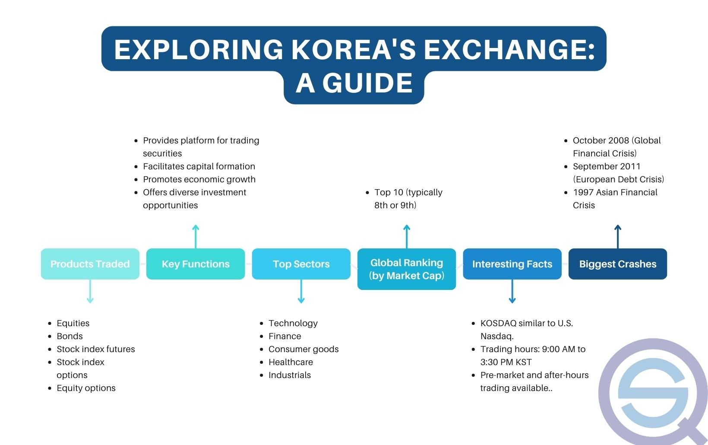

The Korea Exchange (KRX) holds a crucial position in South Korea's financial sector as the exclusive platform facilitating the trading of diverse financial instruments such as stocks, bonds, and derivatives. Established in 2005 through the consolidation of several smaller exchanges, KRX plays a vital role in enhancing the operational efficiency and competitiveness of South Korea's financial markets. This merger not only streamlined operations but also significantly improved the accessibility and appeal of the South Korean market to both domestic and international investors. 

One of the noteworthy advancements in recent years is the proliferation of algorithmic trading on the KRX. This trading approach leverages sophisticated algorithms to execute trades at speeds that far exceed human capability, thus optimizing the efficiency of market transactions. Algorithmic trading has transformed the landscape by enabling financial institutions to manage risks and seize market opportunities swiftly and effectively.

This article offers a comprehensive overview of KRX, covering its historical evolution, organizational structure, and the integration of technological advancements like algorithmic trading. Furthermore, it examines the impact of these developments on investors both within South Korea and beyond its borders, highlighting the significance of KRX in the global financial context.

## Table of Contents

## History of the Korea Stock Exchange

The Korea Stock Exchange (KSE) was officially established in 1956, marking a significant milestone in the development of structured securities trading in South Korea. This establishment was part of a broader effort to formalize and regulate the financial markets in the post-Korean War era, thereby fostering economic growth and development.

The KSE underwent significant changes in 2005 when it merged with the Korea Futures Exchange and KOSDAQ to form a consolidated entity known as the Korea Exchange (KRX). This merger was orchestrated to improve operational efficiency and enhance the competitiveness of the South Korean financial markets. By bringing together stock, futures, and electronic markets under one umbrella, the KRX was able to streamline operations and provide a more comprehensive trading platform for investors.

One of the key developments preceding the formation of the KRX was the introduction of the Korean Securities Dealers Automated Quotations (KOSDAQ) in 1996. Modeled after the United States' NASDAQ, KOSDAQ was designed to support small and medium-sized enterprises (SMEs) by providing them with a platform to access capital markets. This initiative was aimed at nurturing innovation and entrepreneurship in South Korea by facilitating easier access to funding for emerging companies.

The consolidation into KRX in 2005 allowed for greater market integration and provided the infrastructure necessary for the advancement of trading technologies, including [algorithmic trading](/wiki/algorithmic-trading). This evolution not only improved market [liquidity](/wiki/liquidity-risk-premium) but also attracted both domestic and international investors, thereby strengthening South Korea's position in the global financial landscape.

Overall, the historical progression from the establishment of the KSE in 1956 to the formation of the KRX in 2005 has played a crucial role in shaping the vibrant and competitive nature of South Korea's securities market.

## Structure and Functionality of KRX

The Korea Exchange (KRX) is structured to optimize trading activities across its two main operational hubs: Busan and Seoul. The division of focus between these cities allows KRX to effectively manage a broad range of financial products. The Busan branch predominantly deals with derivatives, while Seoul is the center for equity trading. This geographical allocation not only enhances operational efficiency but also strengthens South Korea's financial infrastructure by distributing economic concentrations.

KRX's product offerings are extensive, featuring a diverse array of financial instruments. Traders and investors can engage with equities, bonds, futures, options, and exchange-traded funds (ETFs). This diversity is designed to cater to various risk appetites and investment strategies, providing stakeholders with comprehensive exposure to financial markets.

A notable feature of the KRX is its streamlined initial public offering (IPO) process. The streamlined procedure facilitates quicker access for companies to raise capital through public markets. This is achieved through a set of regulations and guidelines that simplify the listing requirements while maintaining regulatory oversight, making it an attractive proposition for companies seeking public investment.

In addition to its rich portfolio and efficient processes, the KRX is at the forefront of embracing advanced technological infrastructure. This includes systems that support algorithmic and high-frequency trading, which rely on cutting-edge technology to execute trades at ultra-fast speeds. Such technologies enhance liquidity and market efficiency, benefiting both traders and the broader financial ecosystem.

Moreover, KRX continues to invest in upgrading its technological capabilities to manage large volumes of transactions seamlessly and ensure market stability. The emphasis on technological advancement underscores KRX's commitment to maintaining its competitive edge and supporting the increasingly sophisticated demands of market participants.

## Algorithmic Trading on KRX

Algorithmic trading on the Korea Exchange (KRX) utilizes sophisticated algorithms to automate and optimize the execution of trades, facilitating enhanced efficiency and precision in financial transactions. This approach enables traders and financial institutions to swiftly analyze large volumes of market data and execute orders at speeds unattainable through manual processes. By leveraging algorithmic strategies, institutions operating on the KRX can effectively manage risks and capitalize on fleeting market opportunities, thereby improving their competitiveness in a dynamic market environment.

The primary advantage of algorithmic trading lies in its ability to minimize the market impact of large orders, reduce transaction costs, and eliminate human errors. Algorithms can quickly evaluate numerous market conditions and adjust trading strategies in real-time, making them indispensable for high-frequency trading ([HFT](/wiki/high-frequency-trading-strategies)) practices. This is particularly pertinent on the KRX, where the rapid pace of trading demands efficient execution and robust risk management mechanisms.

However, the prevalence of algorithmic trading on the KRX also introduces a set of challenges and risks. One of the primary concerns is increased market [volatility](/wiki/volatility-trading-strategies), as the rapid execution of numerous trades can amplify price fluctuations. Additionally, the reliance on algorithms can lead to systemic issues, such as the notorious "flash crashes," where automated trading programs trigger a series of selling or buying orders, causing abrupt and significant market movements.

To mitigate these risks, regulatory oversight is crucial. In South Korea, the Financial Services Commission (FSC) is tasked with establishing and enforcing regulations that ensure market stability and integrity. Regulations typically focus on ensuring fair trading practices, maintaining transparency in algorithmic strategies, and implementing safeguards against market manipulation and systemic disruptions.

The FSC has implemented various measures to oversee algorithmic trading activities on the KRX, including circuit breakers that halt trading during severe market declines and mandatory reporting of algorithmic trading strategies by financial institutions. These initiatives aim to balance the benefits of algorithmic trading with the need to safeguard the interests of investors and the stability of the financial system.

## Korea Composite Stock Price Index (KOSPI)

The Korea Composite Stock Price Index (KOSPI) is a critical financial indicator representing South Korea's stock market performance. Established in 1983, KOSPI is a market capitalization-weighted index, which means it is calculated based on the total market value of its constituent companies. The index reflects the collective price value of companies listed on the Korea Exchange (KRX) and serves as a vital barometer of the overall economic health of South Korea.

KOSPI includes multiple companies spanning various industries, offering a comprehensive overview of the nation's economic landscape. The formula for KOSPI is expressed as:

$$
\text{KOSPI Index} = \left( \frac{\sum \left( \text{Current Market Capitalization of All Stocks} \right)}{\sum \left( \text{Base Market Capitalization of All Stocks} \right)} \right) \times 100
$$

This index helps investors gauge the market sentiment and economy by tracking fluctuations in share prices of significant South Korean companies. 

To ensure a more focused representation of the largest and most liquid stocks, the KOSPI 200 subset index was introduced. It encompasses the 200 largest companies by market capitalization within the broader KOSPI, accounting for about 70% of the market value of all listed companies. The KOSPI 200 serves as a primary benchmark for evaluating market performance and is extensively used in derivative products such as futures and options. Its liquidity and wide representation make the KOSPI 200 a favorable tool for foreign and domestic investors alike, further promoting market efficiency and deepening South Korea's financial market.

By providing insights into market trends and investor confidence, KOSPI plays an influential role in shaping investment strategies and economic forecasts within and beyond South Korea.

## Advantages of Investing in the Korean Market

South Korea's financial landscape presents an attractive proposition for investors, bolstered by a stable economy and a dynamic industrial base. As a key player in this landscape, the Korea Exchange (KRX) facilitates investment opportunities that capitalize on these strengths. 

One of the primary benefits of investing in the Korean market through KRX is the accessibility it offers via exchange-traded funds (ETFs). These funds provide a route for investors to gain exposure to a wide range of sectors, from technology and industrials to consumer goods and healthcare. Each [ETF](/wiki/etf-trading-strategies) is designed to track the performance of specific indexes or sectors, allowing investors to strategically allocate their funds across the financial spectrum of the South Korean economy. ETFs enhance liquidity by enabling shares to be bought and sold throughout trading hours at market-determined prices. This liquidity is crucial for allowing investors to quickly enter or [exit](/wiki/exit-strategy) positions, ensuring that they can respond promptly to market changes.

Moreover, diversification is another critical advantage offered by investing in securities listed on the KRX. By spreading investments across various sectors, investors can mitigate the risks associated with market volatility. The high-growth segments in South Korea, such as technology and renewable energy, provide opportunities to offset potential downturns in other sectors. This diversified approach not only spreads risk but also offers growth potential as different sectors may perform differently under varying economic conditions.

The robust industrial base of South Korea also significantly contributes to the market’s appeal. Renowned for companies like Samsung, Hyundai, and LG, which are major players in global markets, the Korean industrial sector is characterized by innovation and competitiveness. This industrial strength provides a sturdy backbone for the national economy, making the KRX a particularly attractive prospect for long-term investors seeking stability and growth.

In summary, the advantages of investing in the Korean market via the KRX are manifold. The accessibility through ETFs coupled with the diversification potential across high-growth sectors, and the backdrop of a stable and innovative industrial base, all contribute to creating a conducive investment environment. As such, global investors are increasingly drawn to South Korea as a destination for capturing both stability and growth in their portfolios.

## Challenges and Risks of Investing in KRX

Geopolitical tensions with North Korea present significant risks to the stability of the Korea Exchange (KRX). These ongoing tensions can lead to sudden fluctuations in investor confidence, driving volatility in stock prices. The potential for military confrontations or diplomatic breakdowns with North Korea can create uncertainties that ripple through the financial markets, affecting both domestic and international investors.

The Korea Exchange's significant reliance on exports is another critical [factor](/wiki/factor-investing) influencing its susceptibility to global economic cycles. South Korea is heavily dependent on its export-driven economy, with key sectors like technology, automobiles, and shipbuilding representing substantial portions of the market. When global demand weakens, perhaps due to economic slowdowns or trade tensions involving major economies like the United States or China, Korean companies might experience diminished corporate earnings. This sensitivity to external economic conditions can lead to erratic performance in the stock market, affecting the dividends and returns expected by investors.

Sector-specific volatility further compounds the challenges faced by investors on the KRX. Given that certain industries in South Korea, such as semiconductors and electronics, are highly cyclical, their performance can vary significantly based on innovations, consumer preferences, and global competition. For example, increased competition from other countries producing similar goods can depress local market shares and profitability, leading to instability in stock prices. Investors might find this environment challenging when seeking consistent returns, particularly if portfolio diversification is insufficient to mitigate risks associated with highly volatile sectors. 

Ultimately, while the KRX offers substantial growth opportunities, these geopolitical, economic, and sector-specific challenges necessitate rigorous risk assessment and management strategies by investors. These factors underscore the importance of staying informed about geopolitical developments, global economic trends, and industry-specific dynamics to navigate the complexities of investing in South Korea's financial markets effectively.

## The Future of KRX and Algorithmic Trading

Technological advancements such as high-frequency trading (HFT) and blockchain are transforming the Korea Exchange (KRX), offering new dimensions of efficiency and security. High-frequency trading, characterized by executing massive orders at ultra-fast speeds, optimizes trade execution and enhances liquidity. The KRX’s investment in state-of-the-art technological infrastructure supports these high-frequency activities, facilitating an environment where trades are processed within nanoseconds.

Blockchain technology offers another potential breakthrough by providing secure, transparent, and immutable transaction records. Its capability to reduce transaction costs and increase settlement efficiency is particularly appealing to financial institutions. In the context of the KRX, blockchain could streamline back-office processes, reduce settlement times, and enhance the overall security of trading operations.

Regulatory frameworks concerning algorithmic trading are undergoing substantial evolution to address associated risks. The Financial Services Commission (FSC) of South Korea is actively refining regulatory measures to mitigate risks like market manipulation, systemic failures, and excessive volatility introduced by algorithmic practices. Such regulations are crucial in maintaining market integrity and investor confidence.

The KRX is well-positioned to benefit from increased foreign investment driven by South Korea's commitment to corporate governance improvements and environmental, social, and governance ([ESG](/wiki/esg-investing)) trends. Adopting ESG principles aligns the KRX with global sustainability trends, making it attractive to institutional investors prioritizing responsible investing. This shift towards ESG integration is pivotal in strengthening the KRX's global market presence and boosting its appeal to foreign capital inflows.

In conclusion, while algorithmic trading presents certain complexities, the strategic adoption of technologies such as HFT and blockchain, coupled with proactive regulatory approaches, equips the KRX to harness these innovations effectively, securing its position as a leading financial hub in Asia.

## Conclusion

The Korea Exchange (KRX) occupies a pivotal position in South Korea's financial infrastructure, presenting investors with diverse trading opportunities in both equities and derivatives. As the sole securities exchange operator in the country, KRX facilitates substantial market liquidity and acts as a conduit for capital flow into various sectors of the burgeoning South Korean economy.

Algorithmic trading has become an integral part of KRX's operations, significantly improving trading efficiency and execution accuracy. It allows for rapid trade execution that far surpasses human capabilities, optimizing market dynamics. However, this advancement is accompanied by new challenges, particularly in regulatory oversight. As algorithmic trading can amplify market volatility and potentially lead to systemic risks, entities like the Financial Services Commission (FSC) are increasingly focused on developing robust regulatory frameworks to mitigate these risks and ensure market stability.

Despite these challenges, KRX holds considerable potential for growth, capturing the interest of global investors. Its strategic emphasis on innovation and diversification, coupled with South Korea's stable economic foundation, positions KRX as an attractive destination for capital investment. By offering a range of financial instruments and maintaining rigorous regulatory standards, KRX plays a crucial role in sustaining investor confidence and driving economic development.

In summary, while the integration of sophisticated trading technologies necessitates vigilant oversight, the Korea Exchange's contributions to the financial sector and its ability to attract international capital underscore its significance as a cornerstone of South Korea's financial system. This bodes well for its continued success and expansion in the global investment arena.

## References & Further Reading

Kim, T. K. (2005). *The Historical Development of the Korean Stock Market: Past Composition and Performance*. This study provides an in-depth analysis of the evolution of the Korean stock market, focusing on its structure and performance over time. It outlines the stages of growth in South Korea's financial markets and highlights key milestones, offering valuable insights into the historical context of the Korea Exchange (KRX).

Jeon, B. N., & Kim, Y. S. (2008). *Impact of the KOSPI 200 Futures on the Volatility of the Korean Stock Market*. The paper examines how the introduction and trading of KOSPI 200 futures have influenced the volatility of the Korean stock market. By employing econometric models, the authors analyze the relationship between derivatives trading and market stability, providing crucial information on how futures impact market dynamics.

Lee, K., & Kim, S. (2009). *Regulating Algorithmic Trading in Korea: Policy and Implementation*. This research addresses the regulatory challenges posed by the rise of algorithmic trading in the Korean market. It discusses policies implemented to mitigate risk and enhance market stability, offering guidance on regulatory frameworks necessary to manage the complexities introduced by advanced trading technologies.

Yoon, J. H. (2016). *Algorithmic Trading and Market Efficiency: Evidence from Korea*. This study investigates the role of algorithmic trading in enhancing market efficiency in Korea. By analyzing trading data and market trends, the research assesses the impact of algorithmic trading strategies on liquidity, price discovery, and overall market performance.

