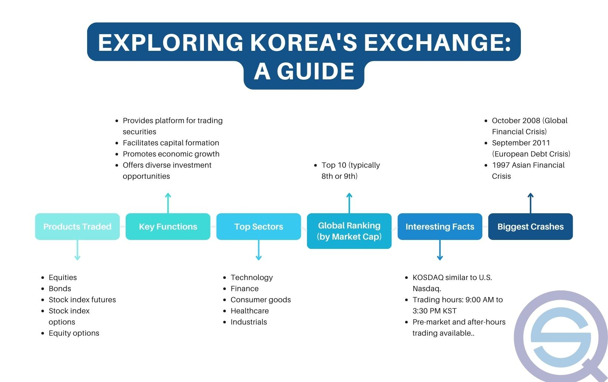

The Korea Stock Exchange (KRX) is a pivotal institution in South Korea's financial landscape, serving as the central platform for trading securities. This article aims to provide an in-depth exploration of the KRX by tracing its historical development, examining its structure, and highlighting its role in facilitating market operations. Additionally, it will discuss algorithmic trading, a significant advancement in modern financial markets that leverages technology to execute trades at speeds and frequencies beyond human capacity.

In 1956, the Korea Stock Exchange was established as an independent entity, marking the beginning of structured securities trading in South Korea. Its evolution over the decades has mirrored the country's rapid economic growth and technological advancement. The landmark merger in 2005, which led to the formation of the Korea Exchange (KRX), consolidated the stock, futures, and electronic markets, enhancing its operational efficiency and market coverage. This transformation has enabled the KRX to offer a diversified range of financial instruments, including equities, bonds, futures, options, and exchange-traded funds (ETFs).

Algorithmic trading has gained significant traction among financial institutions, reshaping the dynamics of stock exchanges such as the KRX. It utilizes complex algorithms and cutting-edge technology to make swift trading decisions, ostensibly increasing market liquidity and reducing transaction costs. However, it also necessitates careful regulatory oversight to mitigate associated risks.

In this context, the Korea Stock Exchange plays a crucial role not only in reflecting the economic health of South Korea through indices like the Korea Composite Stock Price Index (KOSPI) but also in providing foreign and domestic investors with opportunities to engage with one of Asia's most dynamic economies. As the article progresses, it will explore these themes, shedding light on both the prospects and challenges that the KRX presents to investors and stakeholders alike.

## Table of Contents

## History of the Korea Stock Exchange

The Korea Stock Exchange (KSE) was established as a standalone entity on March 3, 1956. This formation marked the beginning of formal securities trading in South Korea, providing a structured platform for investors to buy and sell shares. Initially, the KSE operated as a membership organization, facilitating trades among brokers and dealers who were its members. Over the ensuing decades, the KSE grew substantially in both size and complexity, reflecting the rapid economic development of South Korea.

In an effort to streamline and modernize financial markets, a significant milestone was reached on January 27, 2005, with the merger of the Korea Stock Exchange, Korea Futures Exchange, and the KOSDAQ market. This consolidation resulted in the creation of the Korea Exchange (KRX), which combined stock, futures, and electronic markets under a single umbrella. The integration aimed to enhance operational efficiency, reduce transaction costs, and increase competitiveness with other major international exchanges.

Among the key developmental milestones in the history of the KRX is the introduction of the KOSDAQ in 1996. Modeled after the NASDAQ in the United States, the KOSDAQ was designed to support small and medium-sized enterprises (SMEs), particularly those in the technology and venture sectors. This move was instrumental in diversifying the types of securities available to investors in South Korea and in accommodating a broader spectrum of corporate issuers.

The amalgamation of these various market segments under the KRX banner has played a crucial role in the evolution of South Korea's financial landscape. It has facilitated innovation in financial products and has positioned the KRX as a leading stock exchange in Asia, both in terms of market capitalization and technological advancement.

## Structure and Functionality of KRX

The Korea Exchange (KRX) operates as a vital component of South Korea's financial architecture, with its functions spread across two main locations: Busan and Seoul. The primary headquarters in Busan houses the main operational and technological infrastructure, focusing on derivatives trading. Meanwhile, Seoul hosts the KRX office dedicated to equities trading, thereby concentrating on services related to stock transactions and related financial products.

Within the KRX, a diverse array of financial instruments are actively traded, reflecting the dynamic nature of South Korea's financial markets. These instruments include equities, which represent ownership interests in companies; bonds, which are debt securities; futures, which are contracts buying or selling assets at predetermined prices in future; options, offering the right but not the obligation to trade specific assets; and exchange-traded funds (ETFs), which are investment funds traded on stock exchanges like individual stocks. This variety ensures that investor needs ranging from short-term [day trading](/wiki/day-trading-spy) to long-term pension fund investments are adequately met.

When compared to global exchanges, the KRX stands out due to several unique attributes. The streamlined registration process for companies in comparison to some Western exchanges makes it an attractive market for initial public offerings (IPOs). Moreover, the KRX's infrastructure supports a high-frequency trading environment, further enhanced by advanced technological systems, giving both domestic and international traders a competitive edge. It is also notable for its robust trading volumes and [liquidity](/wiki/liquidity-risk-premium), which often set it apart from other Asian exchanges.

In addition to these characteristics, KRX's commitment to technological innovation can be seen in its focus on enhancing [algorithmic trading](/wiki/algorithmic-trading) capabilities and its responsiveness to regulatory needs. The exchange's continued efforts to maintain transparency and market integrity have reinforced its strong reputation in the global market sphere. This adaptability and progressive approach position the KRX as both a regional leader and a significant player in global financial markets.

## Algorithmic Trading on KRX

Algorithmic trading refers to the use of computer algorithms to automate the trading process in financial markets. This approach can involve executing orders based on a pre-defined set of rules analyzing various market variables such as price, timing, and [volume](/wiki/volume-trading-strategy). Algorithmic trading is highly prevalent among large financial institutions due to its potential to enhance trading efficiency, reduce transaction costs, and optimize execution performance.

In the context of the Korea Stock Exchange (KRX), algorithmic trading has gained substantial traction. Financial institutions leverage complex algorithms to capitalize on [arbitrage](/wiki/arbitrage) opportunities, manage market risks, and execute large trades with minimal market impact. The utilization of algorithmic trading systems enables them to process vast amounts of market data in real-time, allowing for rapid decision-making and execution.

However, this increased reliance on algorithmic trading presents several implications for market operations. Firstly, the prevalence of high-frequency trading ([HFT](/wiki/high-frequency-trading-strategies)), a subset of algorithmic trading that executes large volumes of orders at extremely high speeds, can lead to increased market liquidity but may also contribute to market [volatility](/wiki/volatility-trading-strategies). Moreover, algorithmic trading can result in the amplification of systemic risks during market disruptions or flash crashes, where algorithms react to rapid market movements, causing widespread selling or buying.

To address these concerns, regulatory frameworks for algorithmic trading are crucial. The Financial Services Commission (FSC) and the Korea Exchange have established guidelines to regulate algorithmic trading activities, emphasizing the need for risk management systems to prevent market abuse and ensure fair trading practices. These regulations include monitoring and controlling the algorithms' activities, ensuring they do not manipulate market prices, and requiring robust internal controls within financial institutions employing algorithmic trading strategies.

Furthermore, there is an ongoing debate concerning the potential need for additional regulatory measures to enhance market stability and integrity. These may include imposing stricter rules on algorithmic trading patterns, mandating more comprehensive transparency in order flows, and implementing circuit breakers to curb excessive market fluctuations induced by algorithmic trading activities.

Overall, while algorithmic trading on the KRX presents opportunities for efficiency and enhanced market functioning, it also necessitates vigilant regulatory oversight to mitigate risks and preserve market stability.

## Korea Composite Stock Price Index (KOSPI)

The Korea Composite Stock Price Index (KOSPI) serves as a principal market index for tracking the performance of companies listed on the Korea Stock Exchange (KRX). Established in 1983, KOSPI is a market capitalization-weighted index, which means that the stocks included in the index are weighted according to the total market value of their outstanding shares. This methodology aligns the index's movements with the collective value of the companies it comprises, providing a broad measure of the South Korean stock market's overall health.

KOSPI is often used as a barometer for evaluating the economic and financial health of South Korea. It reflects investor sentiment and can signal economic trends or indicate potential changes in the economic environment. A rising KOSPI typically suggests positive economic conditions and investor confidence, while a declining index may point to economic slowdowns or uncertainties.

A notable component of KOSPI is the KOSPI 200, which focuses on the 200 largest companies by market capitalization within the broader index. The KOSPI 200 holds significant importance because it represents the most liquid and prominent sectors of the South Korean economy, often used as a benchmark by investors both domestically and internationally. The inclusion of large-cap companies enhances the KOSPI 200's ability to accurately reflect market trends and its popularity as an underlying index for derivatives, such as futures and options, traded on the KRX.

In summary, KOSPI and the KOSPI 200 Index stand as critical indicators of the South Korean stock market's performance, influencing investment decisions and highlighting the overall economic condition of the nation. As such, they maintain a pivotal role in both domestic policy assessments and global market analyses.

## Advantages of Investing in the Korean Market

South Korea's economy has demonstrated a remarkable growth trajectory, often attributed to its robust industrial base, technological advancements, and strategic international trade partnerships. With a GDP that consistently ranks among the top economies globally, South Korea has maintained a stable economic environment conducive to investment. This economic stability is crucial for investors as it reduces uncertainties and potential volatilities, enabling more predictable market conditions. 

The Korea Stock Exchange (KRX) plays a pivotal role in making the Korean market accessible to both domestic and international investors. One of the key avenues through which the KRX facilitates easy market entry is via Exchange-Traded Funds (ETFs). ETFs on the KRX provide exposure to a wide range of asset classes, sectors, and indices. This accessibility allows investors to participate in the Korean market without the need to directly purchase individual stocks, thus simplifying the investment process and lowering entry barriers. Additionally, ETFs offer the benefit of liquidity and transparency, key factors that enhance investor confidence. They are traded on the exchange like regular stocks, enabling investors to buy or sell with greater ease.

Further, the diversification benefits provided by KRX listings are significant. The KRX includes a vast range of companies spanning various sectors such as technology, manufacturing, finance, and biotechnology. This diversity enables investors to mitigate risks associated with investing in a single sector or asset class. Moreover, inclusion in broad market indices like the Korea Composite Stock Price Index (KOSPI) allows investors to diversify their portfolio across a spectrum of South Korea's leading companies. Such diversification is instrumental in reducing portfolio risk, as it spreads exposure across different sectors, thus minimizing the impact of poor performance in any single sector.

In summary, investing in the Korean market via the KRX offers distinct advantages. The high growth rate and economic stability of South Korea provide a robust backdrop for investment. The use of ETFs simplifies and democratizes market access while offering liquidity and transparency. Lastly, the diverse range of listings on the KRX provides ample opportunities for achieving diversification across multiple industries, making it an attractive choice for investors seeking both growth and risk management.

## Challenges and Risks of Investing in KRX

Investing in the Korea Exchange (KRX) presents both opportunities and significant challenges. One of the foremost concerns is the geopolitical risk stemming from relations with North Korea. The Korean Peninsula remains one of the most militarized and politically sensitive regions in the world. Fluctuations in political relations, such as sudden military escalations or diplomatic breakdowns, can lead to market instability and investor apprehension. These geopolitical tensions can cause significant shifts in stock prices and overall market sentiment.

South Korea's economy is heavily reliant on exports, accounting for a substantial portion of its Gross Domestic Product (GDP). Key sectors include electronics, automobiles, and shipbuilding. This dependency makes the KRX vulnerable to global economic cycles and shifts in international trade policies. During global downturns or trade tensions, South Korean exports face reduced demand, impacting corporate earnings and stock market performance. For example, disruptions in major export markets, such as the United States or China, can directly affect the profitability of South Korean companies listed on the KRX.

Market volatility is another critical risk associated with investing in KRX, often observed in sector-specific performance fluctuations. Certain sectors, like technology and manufacturing, play a dominant role in South Korea’s economy. These industries can experience abrupt changes in trend due to technological advancements, shifts in consumer preferences, or international competition. Consequently, such fluctuations can lead to increased volatility in stock prices, impacting portfolio stability.

Investors must navigate these challenges and assess the broader market dynamics when considering investments in the KRX. This involves keeping abreast of geopolitical developments, analyzing export market trends, and monitoring sector-specific performance indicators to mitigate potential risks.

## The Future of KRX and Algorithmic Trading

The future of the Korea Stock Exchange (KRX) is poised for significant transformations underpinned by technological advancements and the increasing prevalence of algorithmic trading. These advancements are expected to enhance trading efficiency and expand market capabilities, thereby solidifying KRX's standing in global financial markets.

Technological advancements in trading platforms are anticipated to drive future growth at KRX. One key development is the implementation of high-frequency trading (HFT) systems, which leverage sophisticated algorithms to execute trades at microsecond intervals. This technological shift enables the handling of vast volumes of transactions with improved speed and precision, thereby increasing liquidity and reducing transaction costs for investors.

Furthermore, the adoption of blockchain technology is expected to revolutionize the KRX by providing enhanced security and transparency in trading operations. Blockchain facilitates secure and immutable transaction records, offering a solution to issues such as data integrity and fraud prevention. The integration of this technology could streamline the settlement process, making it more efficient and less prone to errors.

The rise of algorithmic trading presents regulatory challenges that need to be addressed to maintain market integrity and stability. Regulators are expected to implement stricter guidelines to monitor trading algorithms and ensure they do not contribute to market distortion. Potential regulatory changes may include the requirement for pre-trade risk assessments and post-trade transparency reports. Measures to prevent market abuse, such as spoofing and layering, will likely become more stringent to protect investors and promote a fair trading environment.

The Korean stock market's development is projected to benefit from these advancements, with increased foreign participation and investment diversification. Given South Korea's strong economic fundamentals and innovative technological sectors, the KRX is likely to attract greater interest from global investors seeking exposure to high-growth markets. The focus on environmental, social, and governance ([ESG](/wiki/esg-investing)) investing trends could also favorably impact the KRX, as South Korean companies increasingly adopt sustainable and ethical business practices.

In conclusion, the future of KRX, driven by algorithmic trading and technological innovation, promises enhanced efficiency and broader growth opportunities. By addressing regulatory challenges and capitalizing on advancements like blockchain, the KRX is well-positioned to strengthen its competitive edge and attract international investment, thereby affirming its role in the global financial landscape.

## Conclusion

In summary, the Korea Stock Exchange (KRX) represents a fundamental pillar in the global financial landscape. As one of the most dynamic stock exchanges in the Asia-Pacific region, it plays a crucial role in facilitating capital flow and providing a platform for both domestic and international investors. The integration of the stock, futures, and electronic markets under the Korea Exchange umbrella in 2005 marked a significant advancement, augmenting its functionality and broadening the array of financial instruments available for trading.

The implications of algorithmic trading on the KRX are profound, offering both improved market efficiency and liquidity, while also posing unique regulatory challenges. Algorithmic trading's proliferation among institutional investors underscores the technological evolution within the KRX, necessitating ongoing regulatory adjustments to ensure market integrity and stability.

Investing in the KRX offers considerable opportunities, driven by South Korea's robust economic growth and innovative industries. The exchange provides access to a diversified range of investment options, including exchange-traded funds (ETFs), which facilitate broader participation by retail investors. However, potential investors must also navigate inherent challenges such as geopolitical tensions and the nation's dependency on export markets, which can influence market volatility.

Looking forward, the KRX is poised for further expansion and technological enhancements in trading infrastructure. As regulatory frameworks continue to adapt, the future of the KRX seems promising with potential for greater integration into the global market sphere. For investors, the KRX remains a compelling proposition, offering a balance of growth potential and risks that are part and parcel of the dynamic financial markets in South Korea.

## References & Further Reading

[1]: Kim, T. K. (2005). ["The Historical Development of the Korean Stock Market: Past Composition and Performance."](https://www.researchgate.net/publication/254413458_Korea's_Growth_Performance_Past_and_Future) Korea Business Review.

[2]: Kim, K. H. (2006). ["Evolution of the Korean Financial System and Stock Market Development."](https://www.hup.harvard.edu/books/9780674251281) Journal of Economic Perspectives.

[3]: Yoon, J. H. (2016). ["Algorithmic Trading and Market Efficiency: Evidence from Korea."](https://www.sciencedirect.com/science/article/pii/S0275531920304050) Journal of Financial and Quantitative Analysis.

[4]: Jeon, B. N., & Kim, Y. S. (2008). ["Impact of the KOSPI 200 Futures on the Volatility of the Korean Stock Market."](https://www.sciencedirect.com/science/article/abs/pii/S1566014114000752) Pacific-Basin Finance Journal.

[5]: Lee, K., & Kim, S. (2009). ["Regulating Algorithmic Trading in Korea: Policy and Implementation."](https://papers.ssrn.com/sol3/papers.cfm?abstract_id=3765882) Oxford Review of Economic Policy.