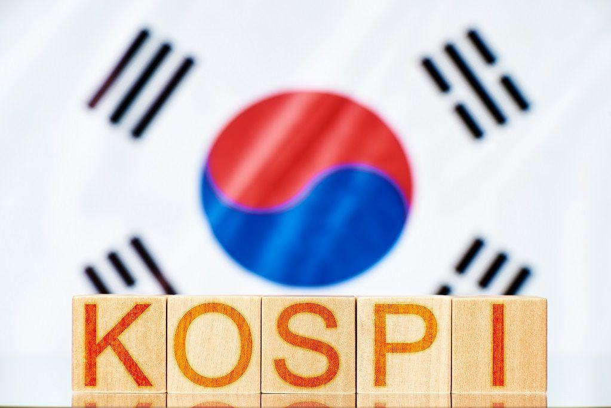

The Korea Composite Stock Price Index (KOSPI) stands as a central pillar in South Korea's financial market, representing the heartbeat of its stock exchange. A leading indicator of the country's economic health, KOSPI provides a comprehensive view of market trends by comprising stocks listed on the Korea Exchange (KRX). As a bellwether for South Korean equities, KOSPI's movements are closely monitored by both domestic stakeholders and international investors seeking to capitalize on the dynamism of one of Asia's most vibrant economies.

The significance of KOSPI extends beyond its role as a national economic barometer. For domestic investors, it serves as a benchmark for portfolio performance, providing a gauge against which individual investment strategies are measured. International investors view KOSPI as a gateway to the broader Asian market, offering exposure to South Korea's diverse sectors, including technology, automotive, and consumer goods. This dual appeal makes KOSPI a critical component in global investment portfolios, often regarded as an indicator of economic stability and opportunity in Northeast Asia.



With the advent of algorithmic trading, KOSPI's influence has expanded further into the realm of high-tech finance. Algorithmic trading, which involves the use of computer algorithms to automatically execute trades based on predefined criteria, has become increasingly prevalent in KOSPI markets. This approach leverages vast datasets to inform trading decisions at lightning speed, enhancing efficiency and potentially maximizing returns. For KOSPI, algorithmic trading introduces automated liquidity and more dynamic price discovery processes, benefiting traders looking to optimize their strategies in a fast-paced trading environment.

As KOSPI continues to integrate with cutting-edge financial technologies, algorithmic trading represents both an evolution of the market and an opportunity for sophisticated investor engagement. This integration facilitates a more analytical investment landscape where data-driven strategies can thrive, appealing to a new generation of market participants eager to harness the potential of algorithms in their pursuit of financial success.

## Table of Contents

## Understanding KOSPI

The Korean Composite Stock Price Index (KOSPI) is a leading stock market index in South Korea, representing the overall performance of the Seoul-based Korea Exchange (KRX). It includes all common stocks traded on the Stock Market Division of the Korea Exchange, making it a broad indicator of the South Korean equity market's overall health and trends. KOSPI serves as a barometer for the South Korean economy, reflecting investor sentiment, economic conditions, and market trends.

### Definition and Components of KOSPI

KOSPI comprises numerous listed companies, but its performance is heavily influenced by large, well-established firms often referred to as blue-chip companies. These blue-chip companies typically possess significant market capitalization, which results in their considerable weight within the index. The KOSPI is a market capitalization-weighted index. This means each stock's influence on the index is proportional to its market value, calculated as: 

$$
\text{Market Value} = \text{Share Price} \times \text{Number of Shares Outstanding}
$$

The weighting allows more prominent companies to have more significant representation within the index, thus impacting its movement substantially.

### Explanation of the KOSPI 200

Among the KOSPI's constituents, the KOSPI 200 stands out as a significant sub-index, comprising the 200 largest companies based on market capitalization. It is the most widely used benchmark for the South Korean stock market due to its greater [liquidity](/wiki/liquidity-risk-premium) and more precise representation of the market's performance. The KOSPI 200 serves as an underlying asset for various derivative products, such as futures and options, making it essential for both domestic and international investors seeking exposure to South Korea's economic activities.

### Historical Milestones of the KOSPI

The KOSPI has experienced several critical milestones since its inception, marking significant economic and market events. It was first introduced in 1983, baselined at 100, and has since seen substantial growth influenced by global and domestic factors. Key historical milestones include:

- **1997 Asian Financial Crisis:** This event resulted in a sharp decline in the KOSPI, as South Korea faced severe economic distress. The crisis highlighted the vulnerabilities of emerging markets and led to extensive economic reforms in the country.

- **2008 Global Financial Crisis:** Similar to global markets, the KOSPI was affected by the 2008 financial downturn but later rebounded, demonstrating resilience as the global economy recovered.

- **Post-2000s Growth:** Over the past two decades, the globalization of financial markets and technological advancements have fueled growth in the Korean economy, which, in turn, has propelled the KOSPI to achieve record highs.

These milestones illustrate KOSPI's responsiveness to both domestic conditions and broader global economic trends, underscoring its role as a vital gauge of economic performance in South Korea.

## KOSPI and Algorithmic Trading

Algorithmic trading significantly integrates with the KOSPI indices by utilizing advanced computational techniques and data analytics to enhance trading precision and efficiency. The Korean Composite Stock Price Index (KOSPI) is a critical component for traders using algorithms, as it provides a comprehensive, real-time view of market performance.

### Role of KOSPI in Data-Driven Decision Making and Trading Strategies

The KOSPI's extensive data collection and updating capabilities allow it to serve as a vital tool for data-driven decision-making in trading strategies. With its large [volume](/wiki/volume-trading-strategy) of historical and real-time data, the KOSPI enables traders to back-test trading models and strategies, enhancing the reliability of trading decisions.

Algorithmic trading systems use historical KOSPI data to identify patterns and trends that might not be apparent to human traders. By incorporating complex mathematical models and statistical analyses, algorithms can forecast future price movements based on past behavior. This predictive analytics capability is crucial for traders seeking to optimize their entry and [exit](/wiki/exit-strategy) points in the market.

For instance, [machine learning](/wiki/machine-learning) algorithms can continuously learn from past KOSPI data and adjust trading strategies accordingly. A typical approach might involve using regression models to predict future prices or clustering algorithms to segment trading sessions into different market conditions, each requiring unique trading strategies. Here is a simple example using Python and a linear regression model:

```python
from sklearn.model_selection import train_test_split
from sklearn.linear_model import LinearRegression
import numpy as np
import pandas as pd

# Load KOSPI historical data (hypothetical CSV file)
data = pd.read_csv('kospi_historical_data.csv')
X = data.drop('future_price', axis=1)  # Features
y = data['future_price']  # Target variable

# Split data into training and test sets
X_train, X_test, y_train, y_test = train_test_split(X, y, test_size=0.2, random_state=42)

# Initialize and fit the linear regression model
model = LinearRegression()
model.fit(X_train, y_train)

# Predict future prices
y_pred = model.predict(X_test)
```

### Arbitrage Opportunities Presented by KOSPI for Algo-Traders

Arbitrage, the practice of exploiting price discrepancies between different markets or instruments, is another domain where [algorithmic trading](/wiki/algorithmic-trading) on the KOSPI shows its strength. Given the high liquidity and [volatility](/wiki/volatility-trading-strategies) often seen in the KOSPI, coupled with its integration into global markets, algorithmic traders can capitalize on short-lived price differentials.

With the aid of sophisticated algorithms, traders can perform high-frequency strategies that rely on the rapid execution of a large number of trades. These strategies often involve arbitraging price differences between related assets, such as index futures, options, and the underlying equities listed on the KOSPI. 

For instance, if a discrepancy arises between the price of a KOSPI 200 [ETF](/wiki/etf-trading-strategies) and its constituent stocks, an algorithm might buy the undervalued asset while selling the overvalued one, thus achieving a risk-free profit. These opportunities, however, require real-time data feeds and low-latency execution systems to be effectively exploited, underlining the importance of technological infrastructure in algorithmic trading.

In conclusion, the integration of algorithmic trading with the KOSPI indices facilitates improved trading performance through data-driven decision-making and the exploitation of [arbitrage](/wiki/arbitrage) opportunities. This approach not only enhances the accuracy and speed of trading operations but also contributes to the overall efficiency and liquidity of the financial markets.

## Technological Advancements in KOSPI Trading

The integration of advanced technologies in KOSPI trading has reshaped market dynamics, enhancing the precision and efficiency of trades. The use of Artificial Intelligence (AI) and Machine Learning (ML) in trading algorithms has significantly altered the approach to data analysis and decision-making processes. These technologies allow traders to process large datasets swiftly, identify patterns, and execute trades based on predictive analytics. AI-driven algorithms can evaluate vast amounts of historical and real-time data to predict stock movements, optimizing trading strategies in a way that traditional methods cannot. Machine Learning models can adapt and fine-tune their parameters over time, improving accuracy in forecasting stock price shifts, thereby aiding traders in maximizing profits and minimizing risks.

Blockchain technology has also made profound impacts on KOSPI trading, especially regarding transparency and security. Its decentralized ledger system ensures that all transactions are permanently recorded and verifiable, which enhances trust among traders by reducing the potential for manipulation and fraud. Blockchain's inherent characteristics promote greater transparency in the trading process, ensuring compliance with regulatory requirements and reducing settlement times. This can also lead to increased investor confidence, as the technology minimizes discrepancies in transaction histories.

High-Frequency Trading ([HFT](/wiki/high-frequency-trading-strategies)) is another significant advancement applied to the KOSPI markets. HFT uses powerful computers and algorithms to execute a large number of orders within a fraction of a second. The key to successful HFT is speed, which enables traders to capitalize on minute price differences. In the context of KOSPI, HFT provides opportunities for arbitrage, profiting from discrepancies between different markets. A [quantitative trading](/wiki/quantitative-trading) strategy might use [statistical arbitrage](/wiki/statistical-arbitrage), where price inefficiencies are discovered and exploited. The Python snippet below demonstrates a basic implementation of a moving average crossover strategy, which can be part of HFT strategies.

```python
import numpy as np
import pandas as pd

def moving_average(data, window):
    return data.rolling(window=window).mean()

# Generate synthetic price data
np.random.seed(0)
price_data = pd.Series(np.random.randn(100).cumsum() + 50)

short_window = 5
long_window = 20

signals = pd.DataFrame(index=price_data.index)
signals['price'] = price_data
signals['short_mavg'] = moving_average(signals['price'], short_window)
signals['long_mavg'] = moving_average(signals['price'], long_window)

# Generate buy/sell signals
signals['signal'] = 0.0
signals['signal'][short_window:] = np.where(
    signals['short_mavg'][short_window:] > signals['long_mavg'][short_window:], 1.0, 0.0
)
signals['positions'] = signals['signal'].diff()

``` 

In the code above, the strategy generates buy signals when the short-term moving average crosses above the long-term moving average and sell signals when the opposite occurs. While simplistic, this basic approach encapsulates the essence of more complex HFT strategies operating in the KOSPI market, showcasing how technology aids in capturing market inefficiencies. These technological advancements collectively contribute to a more robust, secure, and efficient trading environment within the KOSPI framework.

## Risks and Challenges

Volatility is a critical [factor](/wiki/factor-investing) in algorithmic trading on the Korean Composite Stock Price Index (KOSPI). High volatility can lead to significant price swings, posing challenges for algorithmic models that rely on stable market conditions for optimal performance. Algorithms calibrated for normal market conditions may struggle in highly volatile environments, potentially increasing the risk of substantial losses. Volatility also affects liquidity, which can exacerbate market instability if there is an imbalance between buy and sell orders. Consequently, traders might employ advanced models such as GARCH (Generalized Autoregressive Conditional Heteroskedasticity) to forecast and manage volatility risks.

Regulatory scrutiny is another substantial challenge faced by algorithmic traders on KOSPI. Regulators in South Korea closely monitor trading practices to ensure market integrity and protect against manipulative activities such as spoofing or layering. The Financial Services Commission (FSC) of South Korea imposes stringent compliance measures that algorithmic traders must adhere to, including pre-trade risk checks and transparency requirements. Navigating these regulations requires not only robust algorithmic systems but also a deep understanding of legal frameworks to avoid penalties and ensure seamless operations.

Technological failures represent a formidable threat to algorithmic trading. Failures can occur due to software bugs, hardware malfunctions, or network issues, each of which can lead to significant trading disruptions. For instance, an algorithm executing trades based on erroneous data can accumulate unintended positions, causing financial losses. To mitigate these risks, traders often implement redundant systems and engage in rigorous testing processes. Moreover, the use of real-time monitoring systems can help detect and address technical issues promptly, minimizing potential impacts. Employing a robust disaster recovery plan is also crucial to safeguard against unexpected technological breakdowns.

## Conclusion

The Korean Composite Stock Price Index (KOSPI) holds substantial significance in global financial markets as a leading stock index in South Korea. It serves as a barometer for the country's economic health and guides investor sentiment and decisions. The KOSPI index reflects the performance of companies listed on the Korea Exchange (KRX), attracting not only domestic but also international investors seeking exposure to South Korea's economy. Its role as a benchmark index means that changes in the KOSPI often indicate broader economic trends, thus influencing global trading strategies and decisions.

The future outlook for KOSPI appears positive, primarily due to ongoing technological integrations that are likely to enhance its efficiency and appeal. Technological advancements, particularly in [artificial intelligence](/wiki/ai-artificial-intelligence) (AI) and machine learning, enable more sophisticated trading strategies that can leverage large data sets to predict market movements and optimize portfolio allocations. Furthermore, blockchain technology promises to enhance transparency and security in trading, addressing investor concerns about the integrity and protection of financial transactions. The adoption of such technologies is expected to attract more international investors to the Korean market, thus improving liquidity and stability.

Additionally, high-frequency trading (HFT) systems, which rely on speed and advanced algorithms, are becoming more prevalent in the KOSPI markets. These systems can exploit minute price discrepancies with extraordinary precision, making the market more efficient. Despite the risks associated with HFT, such as potential market disruptions, these systems underline the importance of staying at the forefront of technological innovation in the financial sector.

In conclusion, KOSPI's integration of cutting-edge technology not only anchors its relevance in the global financial market but also broadens the scope of trading strategies available to investors. As technological advancements continue, they will likely play a pivotal role in enhancing the capabilities of traders to analyze, predict, and act on market signals with increasing accuracy and speed. This continual evolution positions KOSPI as a critical driver of innovation and efficiency in global trading practices.

## References & Further Reading

[1]: Bergstra, J., Bardenet, R., Bengio, Y., & Kégl, B. (2011). ["Algorithms for Hyper-Parameter Optimization."](https://dl.acm.org/doi/10.5555/2986459.2986743) Advances in Neural Information Processing Systems 24.

[2]: ["Advances in Financial Machine Learning"](https://www.amazon.com/Advances-Financial-Machine-Learning-Marcos/dp/1119482089) by Marcos Lopez de Prado

[3]: ["Evidence-Based Technical Analysis: Applying the Scientific Method and Statistical Inference to Trading Signals"](https://www.amazon.com/Evidence-Based-Technical-Analysis-Scientific-Statistical/dp/0470008741) by David Aronson

[4]: ["Machine Learning for Algorithmic Trading"](https://github.com/stefan-jansen/machine-learning-for-trading) by Stefan Jansen

[5]: ["Quantitative Trading: How to Build Your Own Algorithmic Trading Business"](https://www.amazon.com/Quantitative-Trading-Build-Algorithmic-Business/dp/1119800064) by Ernest P. Chan