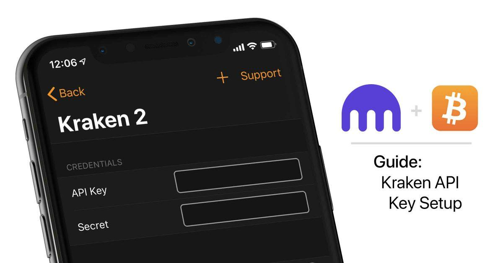

## Table of Contents

## What is the Kraken API and what can it be used for?

The Kraken API is a tool provided by Kraken, which is a company that lets people buy and sell digital money like Bitcoin. The API is like a special language that allows computer programs to talk to Kraken's system. This means that if you know how to use the API, you can make your own programs to do things on Kraken automatically, without having to click buttons on their website.

People use the Kraken API for many things. For example, they might want to check the prices of different digital money and make trades based on those prices without having to do it by hand. Or, they might want to keep track of how much money they have on Kraken and move it around automatically. The API makes it easier to do these things quickly and without mistakes, which can be really helpful for people who trade a lot.

## How do I sign up for a Kraken account to use the API?

To sign up for a Kraken account and use their API, you need to visit the Kraken website first. Look for a button that says "Sign Up" or "Create Account" and click on it. You'll need to enter some information like your name, email address, and a password. Make sure you choose a strong password to keep your account safe. After you fill out the form, you'll get an email to confirm your email address. Click the link in the email to finish signing up.

Once your account is set up, you need to go through a process called verification. This means you'll have to provide some documents like a photo ID to prove who you are. This step is important for security and to follow the rules about buying and selling digital money. After you're verified, you can go to the API section on Kraken's website. There, you can create an API key, which is like a special password that lets your programs talk to Kraken's system. Keep your API key secret and safe, just like your regular password.

## What are the basic steps to get started with the Kraken API?

To get started with the Kraken API, first make sure you have a Kraken account and are fully verified. Go to the Kraken website and log in to your account. Once you're in, look for the section called "API" or "Developer" in the settings or account area. Click on it to go to the API management page. Here, you can create a new API key by following the instructions. You'll need to give your API key a name and set permissions for what it can do, like trading or checking your balance. After you create the key, you'll get an API Key and a Private Key. Keep these safe and don't share them with anyone.

With your API key ready, you can start using the Kraken API. You'll need to use a programming language like Python or JavaScript to write code that talks to the Kraken system. You can find examples and documentation on the Kraken website to help you write this code. Start with simple tasks like checking the current prices of digital money or looking at your account balance. As you get more comfortable, you can try more complex things like making trades automatically. Remember to test your code carefully and keep your API keys secure to avoid any problems.

## How do I generate and manage API keys on Kraken?

To generate API keys on Kraken, first log into your Kraken account. Go to the "Settings" or "Account" section and look for the "API" or "Developer" tab. Click on it to get to the API management page. Here, you can create a new API key by clicking on a button that says "Generate New Key" or something similar. You'll need to give your key a name so you can remember what it's for. You also need to set permissions for your key, like if it can trade, check your balance, or do other things. After you set it up, you'll get two pieces of information: an API Key and a Private Key. Make sure to save these in a safe place and don't share them with anyone.

Managing your API keys on Kraken is important to keep your account secure. You can see all your API keys on the API management page. If you need to, you can change the permissions of a key or delete it if you don't need it anymore. It's a good idea to regularly check your keys and make sure they still have the right permissions. If you think a key might be compromised, delete it right away and create a new one. Always keep your keys secret and safe, just like your regular password, to protect your account from being used without your permission.

## What are the different types of API endpoints available on Kraken?

Kraken has different API endpoints that let you do different things with your account. There are endpoints for checking the current prices of digital money, like Bitcoin or Ethereum. There are also endpoints for looking at your account balance, seeing your trade history, and making new trades. Some endpoints are for getting information about the market, like the highest and lowest prices in the last 24 hours, or how much digital money is being traded.

Other types of endpoints are for managing your account. You can use them to change your settings, like adding or removing API keys, or updating your personal information. There are also endpoints for things like withdrawing money from your account or depositing money into it. Each endpoint has a specific job, and you can use them in your programs to make your trading and account management easier and more automatic.

## How do I make a simple API request to Kraken?

To make a simple API request to Kraken, you need to use a programming language like Python or JavaScript. First, you need to choose which API endpoint you want to use. For example, if you want to check the current price of Bitcoin, you would use the "Ticker" endpoint. You can find the list of all the endpoints and how to use them on Kraken's website in their API documentation. Once you know which endpoint you want to use, you need to include your API key in the request so Kraken knows it's coming from you. You can do this by adding your API key to the headers or the parameters of your request, depending on the programming language you're using.

After you set up your request with the right endpoint and your API key, you can send it to Kraken. If everything is correct, Kraken will send back some information, like the current price of Bitcoin if you used the "Ticker" endpoint. You can then use this information in your program to do whatever you need, like showing it on a website or making a decision about trading. Remember to always handle the response carefully, because sometimes things can go wrong, like if the internet connection fails or if you made a mistake in your request. Checking for errors and dealing with them is an important part of working with APIs.

## What are some common errors I might encounter when using the Kraken API and how do I resolve them?

When using the Kraken API, you might run into some common errors. One error you might see is an "Invalid API Key" error. This happens if you use the wrong API key or if your key has been deleted or changed. To fix this, make sure you're using the right API key and that it hasn't expired or been changed. Another common error is a "Rate Limit Exceeded" error. This happens if you're sending too many requests to Kraken in a short time. To solve this, you can slow down your requests or add a delay between them.

Another error you might encounter is a "Permission Denied" error. This means your API key doesn't have the right permissions to do what you're asking. You can fix this by going to the API management page on Kraken's website and changing the permissions for your key. Lastly, you might see a "Connection Error" if there's a problem with your internet connection or if Kraken's servers are down. To resolve this, check your internet connection and try again later if Kraken's servers are having issues. Always make sure to handle these errors in your code so your program can keep working even if something goes wrong.

## How can I use the Kraken API to automate trading strategies?

To automate trading strategies with the Kraken API, you first need to understand what kind of trading you want to do. For example, you might want to buy Bitcoin when its price drops to a certain level and sell it when it goes up. You can write a program that checks the current price of Bitcoin using the Kraken API's "Ticker" endpoint. If the price is right, your program can then use the "Add Order" endpoint to place a buy or sell order automatically. You'll need to set up your API key with the right permissions to let your program make trades.

Once you have your trading strategy programmed, you can run your program to watch the market and make trades without you having to do anything. It's important to test your program carefully before using real money, maybe by using a small amount first to see if it works as expected. Also, remember to handle errors well, like if the internet connection fails or if you reach Kraken's rate limit. By automating your trading with the Kraken API, you can make decisions and trades faster and more accurately than you could by hand.

## What advanced features does the Kraken API offer for experienced traders?

The Kraken API has some cool features for people who know a lot about trading. One of these is the ability to use "conditional orders." This means you can set up orders that only happen if certain things are true, like if the price of Bitcoin goes above a certain number. This can help you make smart trades without having to watch the market all the time. Another feature is the "WebSocket API," which lets your program get information from Kraken really fast. This is great for traders who need to know what's happening in the market right away so they can make quick decisions.

Also, the Kraken API lets you use "margin trading," which means you can borrow money to trade with. This can make your trades bigger, but it's also riskier, so you need to be careful. The API also has tools for "batch orders," where you can send a bunch of orders at once. This can save time and help you manage your trades better. With these advanced features, experienced traders can do more complex things and maybe make more money, but they need to understand the risks and use these tools wisely.

## How can I integrate the Kraken API with other tools and platforms?

To integrate the Kraken API with other tools and platforms, you need to think about what you want to do. For example, if you want to use Kraken's data in a spreadsheet, you can write a program that gets the data from Kraken and puts it into the spreadsheet. Or, if you want to use Kraken with a trading platform like MetaTrader, you can write code that sends orders from MetaTrader to Kraken using the API. The key is to use the API to get information from Kraken or send orders to it, and then use that information or those orders in your other tools.

It's also important to make sure your other tools can talk to the Kraken API. Some platforms have their own ways to connect to APIs, so you might need to learn how to use those. For example, if you're using a programming language like Python, you can use libraries like `requests` to send API requests to Kraken. If you're using a tool like Zapier, you can set up "Zaps" that automatically do things when certain events happen, like when a price changes on Kraken. By connecting the Kraken API with other tools, you can make your trading and data analysis easier and more powerful.

## What are the best practices for securing my Kraken API interactions?

Keeping your Kraken API interactions safe is really important. One of the best things you can do is to keep your API keys secret. Don't share them with anyone and store them in a safe place, like a secure file or a special program that keeps secrets. Also, only give your API keys the permissions they need. If a key only needs to check prices, don't let it make trades too. This helps stop bad people from using your key to do things they shouldn't.

Another good practice is to use strong security when you send requests to Kraken. Use something called HTTPS, which keeps your information safe as it travels over the internet. Also, check the answers you get back from Kraken to make sure they're real and not from someone pretending to be Kraken. If you're using a program to trade automatically, set up limits on how much it can trade or how often it can send requests. This can help stop big mistakes if something goes wrong. By following these simple steps, you can keep your Kraken API interactions safe and secure.

## How can I optimize my use of the Kraken API for performance and efficiency?

To make your use of the Kraken API faster and more efficient, you should think about how often you're sending requests. If you're checking prices a lot, try to do it less often if you can. Instead of asking for the price every second, maybe ask every minute. This can help you stay under Kraken's limits on how many requests you can make. Also, when you send requests, try to get as much information as you need in one go instead of making lots of small requests. For example, if you need to know the prices of many different types of digital money, ask for them all at once.

Another way to make things run smoother is by using the WebSocket API if you need real-time information. This lets you get updates from Kraken as soon as they happen, without having to keep asking. It's faster and can save you from hitting the request limits. Also, make sure your code is smart about handling errors and waiting a bit if you get told you're asking too much. By doing these things, you can make your program work better and use the Kraken API more efficiently.

## References & Further Reading

[1]: Bergstra, J., Bardenet, R., Bengio, Y., & Kégl, B. (2011). ["Algorithms for Hyper-Parameter Optimization."](https://papers.nips.cc/paper/4443-algorithms-for-hyper-parameter-optimization) Advances in Neural Information Processing Systems 24.

[2]: ["Advances in Financial Machine Learning"](https://www.amazon.com/Advances-Financial-Machine-Learning-Marcos/dp/1119482089) by Marcos Lopez de Prado

[3]: ["Evidence-Based Technical Analysis: Applying the Scientific Method and Statistical Inference to Trading Signals"](https://www.amazon.com/Evidence-Based-Technical-Analysis-Scientific-Statistical/dp/0470008741) by David Aronson

[4]: ["Machine Learning for Algorithmic Trading"](https://github.com/PacktPublishing/Machine-Learning-for-Algorithmic-Trading-Second-Edition) by Stefan Jansen

[5]: ["Quantitative Trading: How to Build Your Own Algorithmic Trading Business"](https://books.google.com/books/about/Quantitative_Trading.html?id=j70yEAAAQBAJ) by Ernest P. Chan