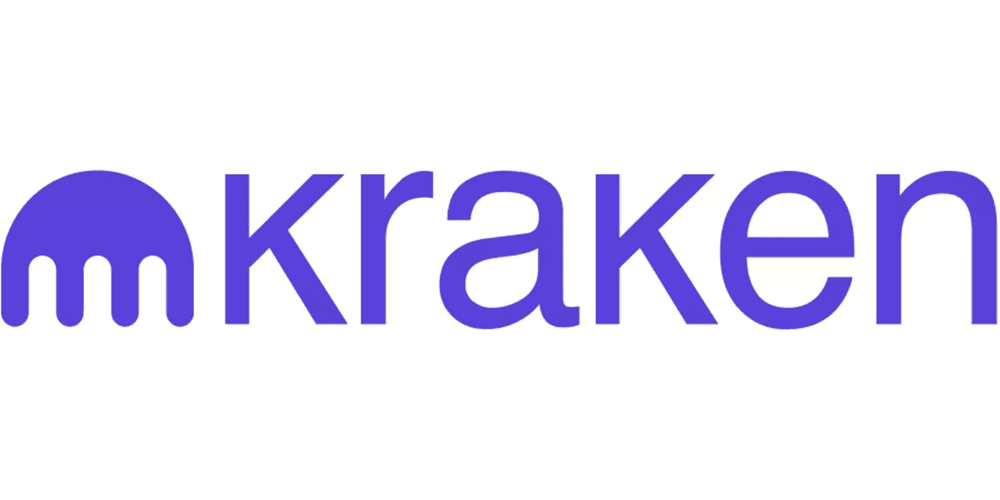

The world of cryptocurrency is in constant flux, characterized by rapid technological advancements and the emergence of new platforms. These innovations are shaping the future of digital finance, offering unprecedented opportunities for both novice and seasoned investors. Among the leading entities in this environment is Kraken, a premier cryptocurrency exchange that provides a secure and comprehensive trading platform. Established in 2011, Kraken has garnered a reputation for its extensive range of digital assets and commitment to maintaining a robust trading environment.

At the heart of the cryptocurrency ecosystem lies blockchain technology, a decentralized ledger system that ensures security, transparency, and decentralization. Blockchain is pivotal in authenticating transactions across a network of distributed nodes, eliminating the need for intermediaries and thereby enhancing transaction speed and reducing costs. The transparency afforded by blockchain technology has not only revolutionized the financial sector but has also had a significant impact on various other industries, including supply chain management and healthcare.



In tandem with these technological advancements, algorithmic trading—commonly known as algo trading—has emerged as an integral component for traders aiming to optimize efficiency and profitability in dynamic markets. By utilizing sophisticated algorithms and computational power, traders can execute orders with a degree of speed and precision unattainable by traditional means. This has paved the way for innovative trading strategies, minimizing human error and emotional biases that can adversely affect trading outcomes.

This article will examine the convergence of blockchain, Kraken, and algorithmic trading. It will address the opportunities presented by integrating these technologies, as well as the challenges that must be navigated to fully harness their potential within the cryptocurrency industry.

## Table of Contents

## Understanding Blockchain Technology

Blockchain is the foundational technology behind cryptocurrencies, offering a decentralized ledger system. At its core, blockchain is a distributed database that maintains a continuously growing list of records, known as blocks, which are linked and secured using cryptographic techniques. The decentralized nature of blockchain ensures that no single entity has control over the entire network, promoting transparency and security across various applications.

One of the primary benefits of blockchain technology is its enhanced security. Each transaction recorded on a blockchain is encrypted and linked to the previous transaction, creating a chain that is exceptionally difficult to alter without detection. This cryptographic linkage, combined with consensus mechanisms such as proof of work (PoW) or proof of stake (PoS), ensures that transactions are validated by multiple nodes in the network, reducing the probability of fraud or tampering.

Transparency is another inherent advantage of blockchain systems. Since all transactions are recorded on a public ledger, anyone with access to the blockchain can view the transaction history. This openness helps eliminate the need for intermediaries, as transactions can be verified independently, reducing costs and increasing efficiency. The immutability of the blockchain further reinforces this transparency, as any changes would require the consensus of a significant portion of the network.

Beyond finance, blockchain technology has found applications across various sectors. In supply chain management, blockchain enables the tracking of products from origin to destination, enhancing traceability and reducing the likelihood of counterfeit goods entering the market. For example, companies like IBM and Walmart have implemented blockchain solutions to improve the transparency and efficiency of their supply chains. In healthcare, blockchain can securely store and share patient records, ensuring data integrity and privacy while allowing authorized access to medical professionals.

The infrastructure of [cryptocurrency](/wiki/cryptocurrency) exchanges, such as Kraken, heavily relies on blockchain technology. Blockchain provides the backbone for these exchanges, enabling the secure transfer and storage of digital assets. Cryptocurrency exchanges use blockchain to facilitate peer-to-peer transactions without intermediaries, offering users greater control over their funds. The decentralized nature of blockchain also ensures that exchanges like Kraken can offer high levels of security and resilience against cyber-attacks.

Overall, blockchain technology continues to evolve and expand beyond its initial use case as the foundation for digital currencies. Its ability to provide secure, transparent, and efficient solutions makes it an integral part of many industries, driving innovation and offering new possibilities for the future of digital finance and beyond.

## Introducing Kraken Cryptocurrency Exchange

Kraken is a prominent cryptocurrency exchange, recognized for its foundation in 2011 and its expansive range of digital assets catering to both new and seasoned traders. Known for its commitment to security, Kraken implements robust measures to safeguard user assets and data, employing two-[factor](/wiki/factor-investing) authentication and advanced encryption techniques. Its emphasis on [liquidity](/wiki/liquidity-risk-premium), achieved through a vast array of tradeable pairs and efficient order execution, ensures a competitive and seamless trading experience. The exchange offers advanced trading features such as margin trading, futures contracts, and stop-loss orders, enabling traders to employ complex strategies effectively.

Kraken's user interface is designed with the needs of a diverse user base in mind. For beginners, the platform provides a straightforward and intuitive trading experience, with educational resources and 24/7 customer support to aid their journey into cryptocurrency. For professional traders, Kraken Pro offers advanced charting tools, real-time order [books](/wiki/algo-trading-books), and analytics, facilitating informed trading decisions.

A key pillar of Kraken's operations is its adherence to regulatory compliance. Operating in over 190 countries, Kraken is committed to maintaining global regulatory standards. It is registered with various financial authorities, ensuring transparency and trustworthiness within the crypto community. This compliance underscores Kraken's dedication to fostering a secure and legally sound environment for cryptocurrency trading.

Testimonials from users often highlight Kraken's reliability and comprehensive service offerings as reasons for its continued popularity. Traders appreciate the platform's robust infrastructure, which successfully delivers a seamless user experience and high liquidity. Additionally, the platform's commitment to security and compliance resonates with users, contributing significantly to its reputation as a top choice for crypto enthusiasts worldwide.

## Algorithmic Trading in Cryptocurrency

Algorithmic trading, commonly referred to as algo trading, involves using computer algorithms to automate the process of trading cryptocurrencies. This approach leverages advanced mathematical models and takes advantage of the computational power of computers to make trading decisions and execute orders at optimal speed and precision. Unlike manual trading, which relies heavily on human intuition and decision-making, algo trading systematically analyzes market data and executes trades based on predefined criteria with minimal human intervention.

One of the primary benefits of [algorithmic trading](/wiki/algorithmic-trading) is the reduction of emotional bias. Human traders are prone to emotional decisions, often swayed by fear, greed, or overconfidence, which can lead to poor trading outcomes. Algorithmic systems mitigate this risk by adhering strictly to their programming, thus ensuring consistency in trading.

Efficiency and scalability are also significant advantages of algo trading. These systems can process and analyze vast amounts of data in real-time, identify trading opportunities across multiple markets, and execute orders faster than any human trader. This ability to manage large volumes of transactions simultaneously makes algorithmic trading particularly beneficial in the fast-paced cryptocurrency markets.

Algorithmic traders utilize various strategies to optimize their trading performance. Market-making is a common strategy, where the algorithm simultaneously places buy and sell orders to profit from the bid-ask spread. Arbitrage takes advantage of price discrepancies between different markets or exchanges, buying low on one platform and selling high on another. Trend-following strategies involve identifying and capitalizing on the [momentum](/wiki/momentum) of asset prices, making trades that follow established market trends.

However, algo trading is not without its challenges. Market [volatility](/wiki/volatility-trading-strategies) in the cryptocurrency space can be particularly extreme, with prices experiencing rapid and unpredictable changes. This volatility necessitates robust algorithm development and constant testing to ensure that trading models adapt to changing market conditions. Algorithmic traders must carefully backtest their algorithms using historical data to gauge performance and refine their strategies accordingly, accounting for potential risks and anomalies.

In summary, algorithmic trading has become a vital tool in the cryptocurrency market, offering significant advantages in terms of speed, efficiency, and decision-making. Nevertheless, the unpredictability and complexity of cryptocurrency trading require continuous refinement of algorithms and vigilant monitoring to maintain competitiveness and profitability.

## Integrating Algo Trading on Kraken's Platform

Kraken, as a leading cryptocurrency exchange, offers robust support for algorithmic trading through its advanced APIs and sophisticated trading tools. These tools empower traders to implement a wide array of algorithms tailored to various market conditions, thereby enhancing their trading strategies and optimizing performance.

Kraken provides a comprehensive suite of tools enabling traders to implement diverse algorithmic strategies, from simple moving averages to complex statistical [arbitrage](/wiki/arbitrage). The platform supports various algorithmic styles, including [market making](/wiki/market-making), where traders provide liquidity to the market by placing both buy and sell orders, and arbitrage, where price discrepancies across different markets or exchanges are exploited for profit. Furthermore, trend-following strategies can be effectively executed, where algorithms detect and capitalize on market momentum. Below is an example in Python of a simple moving average crossover strategy that could be used as a basis for more complex algorithmic development:

```python
import pandas as pd

def moving_average_crossover(data, short_window=40, long_window=100):
    data['Short_MA'] = data['Close'].rolling(window=short_window, min_periods=1).mean()
    data['Long_MA'] = data['Close'].rolling(window=long_window, min_periods=1).mean()
    data['Signal'] = 0
    data['Signal'][short_window:] = \
        np.where(data['Short_MA'][short_window:] > data['Long_MA'][short_window:], 1.0, 0.0)
    data['Position'] = data['Signal'].diff()
    return data

# Assuming `data` is a DataFrame containing 'Close' prices and timestamps
backtested_data = moving_average_crossover(data)
```

Backtesting these strategies using historical data is crucial before live implementation. Kraken’s platform provides extensive historical market data, allowing traders to backtest and tweak their strategies under historical conditions before deploying them in real-time markets. This process is integral to refining algorithmic strategies, as it helps traders gauge the potential effectiveness and risk profiles of their algorithms.

Safety and security are paramount in algorithmic trading. Kraken implements multiple layers of security to ensure that both traders' algorithms and their funds remain protected. These include stringent authentication protocols, robust data encryption, and continuous monitoring for unusual activity patterns. Additionally, Kraken's API comes with built-in rate limits and other safety features to prevent abuse and enhance overall security.

Success stories from the platform exemplify the effective deployment of algorithmic trading strategies on Kraken. Numerous traders have shared accounts where they successfully leveraged Kraken’s APIs to execute high-frequency trades, achieving significant returns. For instance, some traders have utilized momentum-based strategies to capitalize on rapid price movements during high volatility periods, while others have developed complex arbitrage models that exploit cross-exchange price variances with substantial positive outcomes. These cases demonstrate the practical benefits and profitability that can be achieved through well-crafted and diligently tested algorithmic trading strategies on Kraken's platform.

## The Future of Blockchain, Algo Trading, and Cryptocurrency Exchanges

Blockchain technology, since its inception, has demonstrated significant potential in reshaping the cryptocurrency market. Continued innovations are expected to enhance security protocols, scalability, and interoperability across different platforms, which are fundamental for increasing the acceptance of digital currencies in mainstream finance. The development of second-layer solutions such as the Lightning Network and advancements in smart contract functionalities point to a future where blockchain technology supports more complex and varied transaction types beyond simple transfers, which could drive increased adoption and new use cases [1].

Cryptocurrency exchanges like Kraken play a crucial role in this evolving landscape. By providing a platform for trading various digital assets, exchanges facilitate liquidity and foster market stability. As more individuals and institutions enter the crypto space, exchanges must adapt to cater to sophisticated needs, including offering a broader range of assets, implementing robust security measures, and ensuring compliance with regulatory frameworks. Kraken's emphasis on security and regulatory compliance sets the standard for future exchange operations, encouraging trust in the market and facilitating broader adoption of digital currencies.

Algorithmic trading is set to see significant advancements with the continuous evolution of [artificial intelligence](/wiki/ai-artificial-intelligence) and [machine learning](/wiki/machine-learning) technologies. These advancements may result in more sophisticated trading algorithms that can better analyze market trends and execute trades at optimized efficiencies. For instance, machine learning models can predict price movements with greater accuracy by analyzing historical data and current market conditions, thereby providing users with a competitive edge. Python code [2] for a basic predictive model might look like this:

```python
import numpy as np
from sklearn.model_selection import train_test_split
from sklearn.ensemble import RandomForestRegressor

# Assume 'data' is a DataFrame containing historical price data.
X = data[['feature1', 'feature2', 'feature3']]  # Example features
y = data['price']

X_train, X_test, y_train, y_test = train_test_split(X, y, test_size=0.2, random_state=42)

model = RandomForestRegressor(n_estimators=100, random_state=42)
model.fit(X_train, y_train)

predictions = model.predict(X_test)
```

Regulatory changes present both challenges and opportunities for the cryptocurrency industry. As governments and financial authorities worldwide continue to formulate policies surrounding digital currencies, exchanges and traders must adjust to comply with new regulations, which may entail stricter KYC (Know Your Customer) and AML (Anti-Money Laundering) procedures. These measures, while potentially burdensome, can enhance legitimacy and sustainability within the industry, attracting more investors and users who might have previously been wary of the crypto market's volatility and risks [3].

In conclusion, the integration of blockchain technology, algorithmic trading, and cryptocurrency exchanges like Kraken is instrumental in shaping the future of finance. Each element plays a unique role in advancing the adoption and utility of digital currencies, driving innovation and expanding the possibilities within digital finance. Stakeholders across the financial spectrum should remain aware of the rapid technological changes and evolving regulatory landscape to harness these tools effectively and responsibly.

**References**:
1. Narayanan, A., Bonneau, J., Felten, E., Miller, A., & Goldfeder, S. Bitcoin and Cryptocurrency Technologies: A Comprehensive Introduction. Princeton University Press, 2016.
2. Géron, A. Hands-On Machine Learning with Scikit-Learn, Keras, and TensorFlow. O'Reilly Media, 2019.
3. European Union’s General Data Protection Regulation (GDPR) and its impact on cryptocurrency exchanges.

## Conclusion

In conclusion, the intersection of blockchain technology, Kraken, and algorithmic trading signifies a formidable confluence that is progressively reshaping the landscape of modern finance and trading. Blockchain technology stands as the backbone, enhancing security, transparency, and decentralization in financial transactions. This innovative technology forms the foundation upon which cryptocurrency exchanges like Kraken operate, providing a secure and efficient ecosystem for trading digital assets.

Kraken, with its robust infrastructure and user-centric approach, acts as an ideal platform for traders, ranging from novices to seasoned professionals, to harness the power of algorithmic trading. Algorithmic trading brings unparalleled efficiency to the trading process, mitigating human errors and emotional biases, while enabling rapid execution and scalability. By offering advanced APIs and trading tools, Kraken facilitates the seamless integration of algorithmic strategies, empowering traders to navigate the volatile crypto market with precision and agility.

These technologies collectively promote a transformative impact on finance, enhancing accessibility and efficiency in trading while reducing reliance on traditional financial systems. As the cryptocurrency market continues to evolve, it is pivotal for traders and investors to explore and adopt these technologies, leveraging the synergy between blockchain and algorithmic trading to optimize their strategies. Using Kraken as a platform, traders are well-positioned to capitalize on these innovations, adapting to market changes with informed and strategic approaches.

To remain at the forefront of this rapidly advancing industry, a continuous commitment to learning and adaptation is essential. Engaging with the evolving cryptocurrency market, staying informed of technological and regulatory shifts, and refining trading strategies are crucial for success. Embracing this dynamic environment holds the promise of significant opportunities, as the fusion of blockchain technology, Kraken, and algorithmic trading ventures into uncharted territories, heralding a new financial paradigm.

## References & Further Reading

[1]: Narayanan, A., Bonneau, J., Felten, E., Miller, A., & Goldfeder, S. (2016). ["Bitcoin and Cryptocurrency Technologies: A Comprehensive Introduction."](https://press.princeton.edu/books/hardcover/9780691171692/bitcoin-and-cryptocurrency-technologies) Princeton University Press.

[2]: Géron, A. (2019). ["Hands-On Machine Learning with Scikit-Learn, Keras, and TensorFlow."](https://books.google.com/books/about/Hands_On_Machine_Learning_with_Scikit_Le.html?id=HHetDwAAQBAJ) O'Reilly Media.

[3]: Ross, S. A., Westerfield, R., & Jaffe, J. (2016). ["Corporate Finance, 11th Edition."](https://www.mheducation.com/highered/product/corporate-finance-ross-westerfield/M9781260772388.html) McGraw Hill.

[4]: Nagurney, A. (2006). ["Supply Chain Network Economics: Dynamics of Prices, Flows and Profits."](https://www.semanticscholar.org/paper/Supply-Chain-Network-Economics%3A-Dynamics-of-Prices%2C-Nagurney/a1b042892e4744b057434e360d566e125b42cd41) Edward Elgar Publishing.

[5]: Antonopoulos, A. M. (2017). ["Mastering Bitcoin: Unlocking Digital Cryptocurrencies, 2nd Edition."](https://books.google.com/books/about/Mastering_Bitcoin.html?id=IXmrBQAAQBAJ) O'Reilly Media.