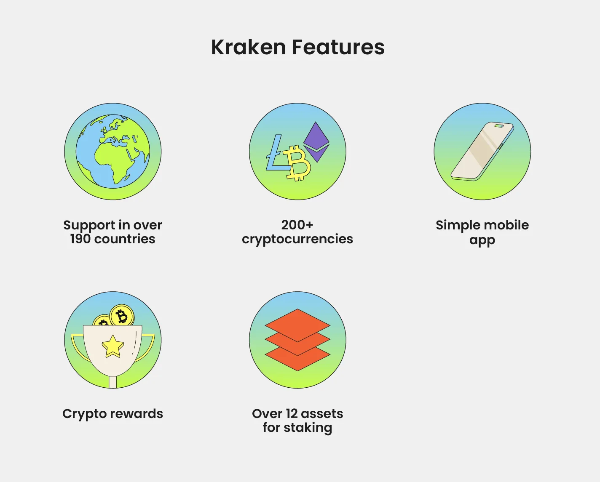

## Table of Contents

## What is Kraken and what is its primary purpose?

Kraken is a company that helps people and businesses buy, sell, and store cryptocurrencies. Cryptocurrencies are like digital money that you can use online. Kraken makes it easy for people to trade different types of cryptocurrencies, like Bitcoin and Ethereum, with other people around the world.

The main purpose of Kraken is to provide a safe and easy way for people to use cryptocurrencies. They want to make sure that when people trade or store their digital money, it is secure and they can trust the platform. Kraken also helps people learn about cryptocurrencies and how to use them, so more people can start using this new type of money.

## How does Kraken function as a cryptocurrency exchange?

Kraken works as a place where people can trade different cryptocurrencies with each other. When someone wants to buy or sell a cryptocurrency like Bitcoin, they go to Kraken's website or app. They can see how much other people are willing to pay or accept for different cryptocurrencies. If they agree with the price, they can make a trade. Kraken takes a small fee for helping with the trade, and then the cryptocurrencies move from one person's account to another.

Kraken also keeps the cryptocurrencies safe for people. When someone buys a [cryptocurrency](/wiki/cryptocurrency) on Kraken, they can choose to leave it in their Kraken account or move it to another place. Kraken uses strong security measures to make sure that the cryptocurrencies are safe while they are stored on their platform. This way, people can feel confident that their digital money is protected when they use Kraken.

## What are the key features that distinguish Kraken from other exchanges?

Kraken stands out from other exchanges because it focuses a lot on keeping your money safe. They use strong security to protect your cryptocurrencies. They also let you trade many different types of cryptocurrencies, not just the popular ones like Bitcoin and Ethereum. This means you can find and trade more options on Kraken than on some other exchanges. Another special thing about Kraken is that they have a tool called "Margin Trading." This lets you borrow money to trade, which can help you make more money, but it's also riskier.

Another way Kraken is different is that they care a lot about following the rules. They work hard to make sure they are doing everything the right way, which helps people trust them more. Kraken also has a good reputation for being clear about their fees. They tell you exactly how much you will have to pay for each trade, so there are no surprises. Plus, Kraken has a feature called "staking," where you can earn more cryptocurrency by holding onto certain types of coins. This can be a nice way to grow your money over time.

## How can a beginner start trading on Kraken?

To start trading on Kraken, a beginner should first sign up for an account on the Kraken website or app. You'll need to provide some basic information like your name, email, and a strong password. After signing up, you'll need to verify your identity. This usually involves sending a photo of your ID, like a driver's license or passport, and sometimes a selfie. Kraken does this to make sure it's really you and to keep the platform safe. Once your identity is verified, you can add money to your account. You can do this by sending money from your bank or using a credit/debit card.

Once your account is set up and funded, you can start trading. Go to the trading section on Kraken, where you'll see different cryptocurrencies listed. Choose the one you want to buy or sell. You'll see the current prices and can decide if you want to buy at the current price or set a different price. When you're ready, enter how much you want to trade and confirm the order. Kraken will then match you with someone who wants to make the opposite trade. Remember, trading cryptocurrencies can be risky, so it's a good idea to start small and learn as you go.

## What types of cryptocurrencies can be traded on Kraken?

Kraken lets you trade many different types of cryptocurrencies. Some of the most popular ones you can find on Kraken are Bitcoin, Ethereum, and Litecoin. But Kraken doesn't stop there. They also have less common cryptocurrencies like Cardano, Polkadot, and Solana. This means you have a lot of choices when you want to trade on Kraken.

Besides these, Kraken also offers trading for stablecoins like Tether and USD Coin. Stablecoins are special because they are designed to keep a steady value, usually tied to the US dollar. This can be helpful if you want to move your money around without worrying about big price changes. With all these options, Kraken makes it easy for you to find and trade the cryptocurrencies that interest you.

## What are the fee structures for trading on Kraken?

Kraken charges different fees depending on what you're doing on their platform. For buying and selling cryptocurrencies, they have something called a maker-taker fee model. If you add [liquidity](/wiki/liquidity-risk-premium) to the market, like setting a price others can accept, you're a maker, and you usually pay less. If you take liquidity away, like buying at the current price, you're a taker, and you pay a bit more. The exact fee depends on how much you trade in a month. The more you trade, the less you pay per trade. Fees can start at around 0.16% for makers and 0.26% for takers, but they can go down to as low as 0% for makers and 0.10% for takers if you trade a lot.

For depositing and withdrawing money, the fees can vary a lot. If you're adding money to your account using a bank transfer, it's usually free. But if you use a credit or debit card, there might be a fee of around 3.75% plus a small fixed fee. When you want to take your money out, fees depend on which cryptocurrency you're using. For example, withdrawing Bitcoin might cost a small amount in Bitcoin, while withdrawing Ethereum could cost a bit more in Ethereum. It's a good idea to check Kraken's website for the exact fees because they can change and depend on how busy the network is.

## How does Kraken ensure the security of user funds and data?

Kraken works hard to keep your money and information safe. They use strong security measures to protect your cryptocurrencies. One way they do this is by keeping most of the cryptocurrencies in "cold storage." This means the money is kept offline, away from hackers. Kraken also uses two-[factor](/wiki/factor-investing) authentication (2FA), which means you need more than just a password to get into your account. This makes it much harder for someone else to get in, even if they know your password. They also have a team that watches for anything suspicious all the time, so they can stop problems before they get big.

Another way Kraken keeps things safe is by following strict rules and getting checked by outside experts. They have to follow laws about keeping money safe and making sure they are doing everything the right way. This helps people trust Kraken more. They also do regular checks to make sure their security is working well. If there's ever a problem, Kraken has insurance to help cover any losses. This means that even if something bad happens, they have a plan to help make things right.

## What advanced trading options does Kraken offer to experienced users?

Kraken has some special tools for people who know a lot about trading. One of these is called "Margin Trading." This lets you borrow money to trade more than you have. It can help you make more money, but it's also riskier because you could lose more if things don't go your way. Another tool is "Futures Trading," where you can bet on what the price of a cryptocurrency will be in the future. This can be a good way to make money if you think you know where the price is going, but it's also very tricky and not for everyone.

Kraken also has something called "Over-the-Counter (OTC) Trading." This is for big trades that are done privately, not on the public market. It's good for people who want to trade a lot of money without affecting the market price. Another feature is "Staking," where you can earn more cryptocurrency by holding onto certain types of coins. This is a way to make your money grow over time without having to trade it. All these tools give experienced users more ways to make money, but they need to be careful because they can be complicated and risky.

## How does Kraken comply with regulatory requirements across different countries?

Kraken works hard to follow the rules in different countries where it operates. They know that laws about cryptocurrencies can be different everywhere, so they make sure to understand and follow each country's rules. For example, in the United States, Kraken is registered with the Financial Crimes Enforcement Network (FinCEN) as a Money Services Business. This means they have to follow strict rules about reporting and keeping records to stop money laundering and fraud. In other places like Canada and Australia, Kraken also follows local laws and gets the right licenses to operate legally.

To make sure they are always following the rules, Kraken has a team of people who keep track of changes in laws around the world. They work with government agencies and other experts to stay up-to-date. If there's a new rule or a change in an existing one, Kraken quickly adjusts how they do things to stay compliant. This helps them keep their users' trust and make sure they can keep offering their services in different countries.

## What tools does Kraken provide for market analysis and trading strategy development?

Kraken has some helpful tools for people who want to understand the market better and make smart trading plans. One of these tools is called the "Trading Terminal." It shows you lots of information about different cryptocurrencies, like their prices and how much they are being traded. You can see charts and graphs that help you see trends and patterns. This can help you decide when to buy or sell a cryptocurrency. Kraken also has a feature called "Price Alerts," which lets you know when a cryptocurrency reaches a certain price. This way, you don't have to watch the market all the time; Kraken will tell you when it's time to act.

Another tool Kraken offers is called "TradingView Charts." These charts are very detailed and let you look at the market in many different ways. You can add lines and shapes to the charts to help you see where the price might go next. This is really useful for making a trading plan. Kraken also has something called "Order Book Depth," which shows you how many people want to buy or sell a cryptocurrency at different prices. This can help you understand if the price might go up or down soon. With all these tools, Kraken helps you make better choices when you trade.

## How has Kraken evolved its services and features over time?

Kraken started out as a simple place where people could buy and sell Bitcoin. Over time, they added more cryptocurrencies, like Ethereum and Litecoin, so people had more choices. They also made it easier for people to use their platform by adding more ways to put money in and take it out, like using credit cards and bank transfers. Kraken wanted to make sure their platform was safe, so they added strong security measures like keeping most of the money offline and using two-factor authentication. They also started to offer trading in more countries, following the rules in each place to make sure they could keep helping people everywhere.

As Kraken grew, they added more advanced tools for people who knew a lot about trading. They introduced things like margin trading, where you can borrow money to trade more, and futures trading, where you can bet on what the price of a cryptocurrency will be in the future. They also added a feature called staking, where you can earn more cryptocurrency just by holding onto certain types of coins. Kraken kept making their platform better by adding more detailed charts and tools for analyzing the market, so people could make smarter trading plans. They also started offering big private trades through something called OTC trading, which is good for people who want to trade a lot of money without affecting the market price.

## What are the future plans or upcoming features for Kraken?

Kraken is always looking for new ways to make their platform better. They want to add more cryptocurrencies so people have even more choices to trade. They are also working on making it easier and faster to move money in and out of Kraken. They know that people want quick and easy ways to use their money, so they are focusing on improving this. Kraken is also thinking about adding more tools to help people understand the market better, like more advanced charts and analysis tools. This will help both new and experienced traders make better decisions.

Another big plan for Kraken is to keep growing in more countries. They want to make sure they can help people all over the world, so they are working on following the rules in new places. This way, more people can use Kraken to trade cryptocurrencies safely. Kraken also wants to keep their platform safe and secure, so they are always looking for new ways to protect people's money and information. They are thinking about adding more features like better ways to manage risks when trading, which can help people feel more confident when they use Kraken.

## References & Further Reading

[1]: Narayanan, A., Bonneau, J., Felten, E., Miller, A., & Goldfeder, S. (2016). ["Bitcoin and Cryptocurrency Technologies: A Comprehensive Introduction."](https://press.princeton.edu/books/hardcover/9780691171692/bitcoin-and-cryptocurrency-technologies) Princeton University Press.

[2]: Géron, A. (2019). ["Hands-On Machine Learning with Scikit-Learn, Keras, and TensorFlow."](https://books.google.com/books/about/Hands_On_Machine_Learning_with_Scikit_Le.html?id=HHetDwAAQBAJ) O'Reilly Media.

[3]: Ross, S. A., Westerfield, R., & Jaffe, J. (2016). ["Corporate Finance, 11th Edition."](https://www.mheducation.com/highered/product/corporate-finance-ross-westerfield/M9781260772388.html) McGraw Hill.

[4]: Nagurney, A. (2006). ["Supply Chain Network Economics: Dynamics of Prices, Flows and Profits."](https://www.semanticscholar.org/paper/Supply-Chain-Network-Economics%3A-Dynamics-of-Prices%2C-Nagurney/a1b042892e4744b057434e360d566e125b42cd41) Edward Elgar Publishing.

[5]: Antonopoulos, A. M. (2017). ["Mastering Bitcoin: Unlocking Digital Cryptocurrencies, 2nd Edition."](https://books.google.com/books/about/Mastering_Bitcoin.html?id=IXmrBQAAQBAJ) O'Reilly Media.