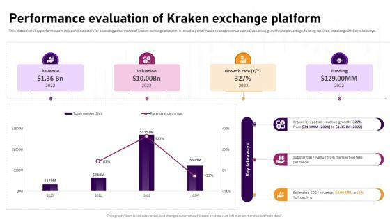

## Table of Contents

## What is the Kraken platform?

Kraken is a platform where people can buy, sell, and trade different types of digital money, like Bitcoin and Ethereum. It's like a big online market where you can exchange your regular money for digital money or trade one type of digital money for another. People use Kraken because it's safe, easy to use, and has a lot of different digital money options.

Kraken also offers other services to help people with their digital money. For example, they have something called staking, where you can earn more digital money by holding onto certain types of it. They also have a feature called margin trading, which lets you borrow money to trade with, but it can be riskier. Overall, Kraken is a popular choice for people who want to get into the world of digital money.

## How do I sign up for a Kraken account?

To sign up for a Kraken account, go to their website and click on the "Create Account" button. You'll need to enter your email address and choose a strong password. After that, you'll get an email from Kraken to confirm your email address. Click on the link in the email to finish setting up your account.

Once your email is confirmed, you'll need to fill out some personal information like your name, date of birth, and address. This is to make sure you're who you say you are and to follow the rules. After you submit your information, Kraken will check it, and if everything is okay, you'll be able to start using your account to buy, sell, and trade digital money.

## What are the basic features of Kraken for beginners?

Kraken is a friendly place for people new to digital money. When you start, you can easily buy and sell popular types of digital money like Bitcoin and Ethereum. You just need to put some regular money into your Kraken account, and then you can trade it for digital money. Kraken has a simple way to show you how much digital money you can get for your regular money, so you know what you're getting.

Another cool thing for beginners is that Kraken lets you practice trading without using real money. They call this a demo mode, and it's a safe way to learn how trading works. Plus, Kraken has a lot of help available, like guides and a support team, so if you're confused about anything, you can easily get help. This makes it easier for new people to feel comfortable and learn as they go.

## How does Kraken ensure the security of user funds and data?

Kraken takes security very seriously to keep your money and information safe. They use strong encryption to protect your data when you're using their website. This means your information is turned into a secret code that's hard for bad people to crack. Kraken also keeps most of the digital money in special secure places called "cold storage," which are not connected to the internet. This makes it much harder for hackers to steal your digital money.

They also have something called two-[factor](/wiki/factor-investing) authentication, or 2FA. This means that when you want to log into your account, you need to enter a special code that you get on your phone. This adds an extra layer of protection because even if someone knows your password, they can't get into your account without your phone. Kraken is always watching for anything strange happening on their platform, and they have a team that works to stop any problems before they can hurt users.

## What are the fees associated with trading on Kraken?

When you trade on Kraken, you'll need to pay some fees. There are two main types of fees: the maker fee and the taker fee. The maker fee is what you pay when you add a new trade to the market, and it's usually lower. The taker fee is what you pay when you take an existing trade off the market, and it's a bit higher. The exact amount you pay depends on how much you've traded in the last 30 days. If you trade more, you'll pay less in fees.

There are also fees for taking your digital money out of Kraken. These fees can change depending on which type of digital money you're using and how you're taking it out. For example, if you want to take out Bitcoin, the fee might be different than if you want to take out Ethereum. It's a good idea to check Kraken's website for the latest fee information because these fees can change over time.

## How can I deposit and withdraw funds on Kraken?

To deposit funds on Kraken, you first need to go to the "Funding" section on their website. You can choose to deposit regular money like dollars or euros, or you can deposit digital money like Bitcoin or Ethereum. For regular money, you'll need to link your bank account or use a service like SWIFT or SEPA. Once you've chosen your method, follow the steps to send your money to Kraken. It might take a few days for the money to show up in your account. For digital money, you'll get a special address to send your digital money to. It's quick, and you should see your digital money in your Kraken account soon after you send it.

To withdraw funds from Kraken, go to the same "Funding" section. You can withdraw regular money back to your bank account or withdraw digital money to a digital wallet. For regular money, choose your bank and the amount you want to take out, then follow the steps. It might take a few days for the money to reach your bank. For digital money, you'll need to enter the address of the wallet where you want to send your digital money. Make sure you enter the right address because you can't get the digital money back if you make a mistake. The digital money should arrive in your wallet soon after you start the withdrawal.

## What advanced trading options does Kraken offer?

Kraken offers some advanced trading options for people who want to do more than just buy and sell digital money. One of these is margin trading, which lets you borrow money to trade with. This can help you make more money if things go well, but it's riskier because you could lose more than you started with. Another option is futures trading, where you can bet on what the price of digital money will be in the future. This can be tricky but can also be a way to make money if you guess right.

Kraken also has a feature called staking, where you can earn more digital money just by holding onto certain types of it. This can be a good way to grow your digital money without having to trade. For people who like to trade a lot, Kraken has an advanced order types feature. This lets you set up special orders, like stop-loss orders that automatically sell your digital money if the price goes down too much, or take-profit orders that sell when the price goes up to a certain point. These tools can help you manage your trades better and make smarter decisions.

## How does Kraken's liquidity compare to other exchanges?

Kraken is known for having good [liquidity](/wiki/liquidity-risk-premium), which means it's easy to buy and sell digital money on their platform without big changes in price. They have a lot of people using their service, which helps keep the market active. When there are more people trading, it's easier to find someone to trade with, and the prices stay more stable. This makes Kraken a good choice for people who want to trade without worrying too much about sudden price swings.

Compared to other exchanges, Kraken often has better liquidity for some types of digital money. Big exchanges like Binance and Coinbase also have high liquidity, but Kraken can be better for certain digital money that's not as popular. This means if you're trading a less common type of digital money, you might find it easier to do on Kraken. Overall, Kraken's liquidity is strong and can be a big plus for traders looking for a reliable place to trade.

## What tools does Kraken provide for market analysis and trading?

Kraken gives you some cool tools to help you understand the market and make smart trading choices. They have charts that show you how the price of digital money is changing over time. You can look at these charts to see if the price is going up or down and make guesses about what might happen next. Kraken also has something called a "depth chart" that shows you how many people want to buy or sell at different prices. This can help you decide when to trade. Plus, they have a tool called "[order book](/wiki/order-book-trading-strategies)" that shows you all the current buy and sell orders, so you can see what other people are doing.

Another helpful tool is the trading terminal, where you can see all your trades in one place and make new trades quickly. Kraken also lets you set up alerts, so you get a message if the price of digital money hits a certain point. This can be really useful if you want to buy or sell at a specific price. They also have a feature called "trading pairs," which lets you see how different types of digital money are doing compared to each other. All these tools together make it easier for you to keep an eye on the market and make good trading decisions.

## How does Kraken comply with regulatory requirements in different countries?

Kraken works hard to follow the rules in different countries where they do business. They know that each country has its own laws about digital money, so they make sure to understand and follow these rules. For example, in the United States, Kraken follows rules set by the Financial Crimes Enforcement Network (FinCEN) and gets special licenses in states like New York where they need them. They also follow the rules from the European Union, like the Fifth Anti-Money Laundering Directive, to stop bad things like money laundering and fraud.

To make sure they're doing everything right, Kraken checks the identity of their users to make sure they are who they say they are. This is called Know Your Customer (KYC) and Anti-Money Laundering (AML) checks. They also report any strange activities to the right authorities. By doing all this, Kraken shows that they care about following the law and keeping their users safe, no matter where they are in the world.

## What are the API capabilities of Kraken for developers?

Kraken has an API that lets developers connect their own apps and programs to Kraken's trading platform. This means you can build tools that automatically buy, sell, or trade digital money on Kraken without having to do it by hand. The API gives you access to things like checking your account balance, placing orders, and getting real-time market data. It's useful for people who want to make trading easier or create new ways to use Kraken's services.

The API is designed to be easy to use, with clear instructions and examples to help you get started. It supports different programming languages, so you can use the one you're most comfortable with. Kraken also has a special area for developers on their website where you can find all the information you need, like how to set up the API and what you can do with it. This makes it easier for developers to create new and cool things with Kraken's platform.

## How does Kraken's performance and reliability stack up against competitors in terms of uptime and transaction speed?

Kraken is known for being reliable and fast when it comes to trading digital money. They work hard to keep their platform running smoothly, with very little downtime. This means you can usually use Kraken whenever you want without worrying about the website being down. When it comes to transaction speed, Kraken is pretty quick. They process trades and transfers fast, which is important when you're trying to buy or sell digital money at the right time.

Compared to other exchanges, Kraken does a good job at staying up and running. Big exchanges like Binance and Coinbase also have good uptime, but Kraken is often praised for its reliability. In terms of transaction speed, Kraken is competitive. They might not always be the fastest, but they're usually quick enough that you won't have to wait too long for your trades to go through. Overall, Kraken's performance and reliability are strong points that make it a good choice for trading digital money.

## References & Further Reading

[1]: Bergstra, J., Bardenet, R., Bengio, Y., & Kégl, B. (2011). ["Algorithms for Hyper-Parameter Optimization."](https://papers.nips.cc/paper/4443-algorithms-for-hyper-parameter-optimization) Advances in Neural Information Processing Systems 24.

[2]: ["Advances in Financial Machine Learning"](https://www.amazon.com/Advances-Financial-Machine-Learning-Marcos/dp/1119482089) by Marcos Lopez de Prado

[3]: ["Evidence-Based Technical Analysis: Applying the Scientific Method and Statistical Inference to Trading Signals"](https://www.amazon.com/Evidence-Based-Technical-Analysis-Scientific-Statistical/dp/0470008741) by David Aronson

[4]: ["Machine Learning for Algorithmic Trading"](https://github.com/stefan-jansen/machine-learning-for-trading) by Stefan Jansen

[5]: ["Quantitative Trading: How to Build Your Own Algorithmic Trading Business"](https://www.amazon.com/Quantitative-Trading-Build-Algorithmic-Business/dp/1119800064) by Ernest P. Chan