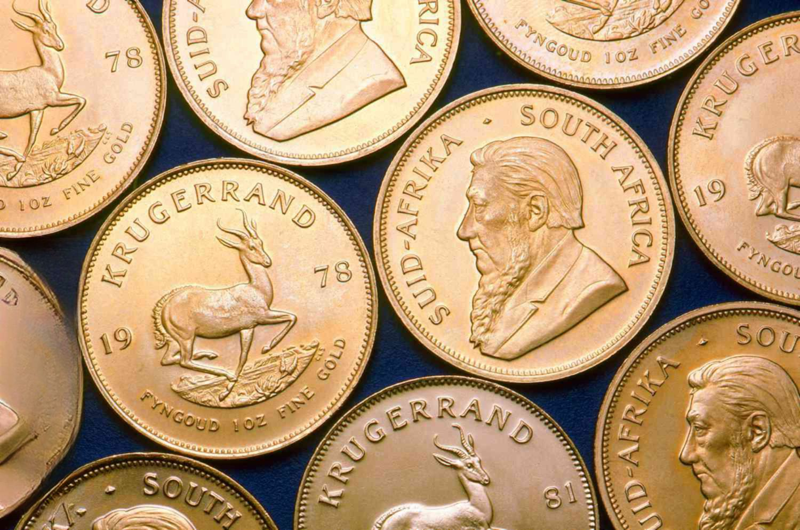

Gold has captivated human civilizations for millennia, valued not just for its intrinsic beauty but for its enduring economic relevance. As an investment asset, gold is often seen as a store of value and a hedge against inflation and currency fluctuations. Investors across the globe turn to gold during times of economic uncertainty, benefiting from its historical stability and liquidity. Its appeal is bolstered by its universal acceptance and the perceived security it offers in protecting wealth.

Among the various forms of gold investment, the Krugerrand holds a special place. Introduced in 1967 by the South African Mint, Krugerrands are iconic gold coins that democratized gold ownership by allowing individuals to hold physical gold in the form of coins that were both recognizable and easy to trade. Named after Paul Kruger, the former President of the South African Republic, and the country's currency, the rand, the Krugerrand combines cultural significance with practical investment benefits. The coin's design features the bust of Paul Kruger on one side and a springbok antelope on the other, symbolizing South Africa's rich heritage.



The landscape of gold investment has evolved remarkably with the advent of technology, particularly algorithmic trading. This modern approach employs complex algorithms to execute trades at speeds and frequencies unimaginable to human traders. By analyzing market data, trends, and patterns, algorithmic trading allows for optimized decision-making processes in the commodities market, including gold.

The convergence of traditional gold investment methods, represented by tangible assets like Krugerrands, with cutting-edge algorithmic trading strategies, exemplifies the dynamic nature of today's financial landscape. Krugerrands serve as a bridge between the time-tested, tangible appeal of gold and the possibilities unleashed by technology-driven trading mechanisms. The role of Krugerrands, combined with algorithmic trading, highlights a unique intersection where time-honored investment meets innovation, providing diversified strategies for a wide range of investors.

In summary, as global financial systems continue to evolve, both Krugerrands and algorithmic trading play significant roles in shaping investment portfolios. Whether for wealth preservation or speculative gain, understanding these elements is crucial for navigating the complexities of modern finance.

## Table of Contents

## Understanding Krugerrands

The Krugerrand, introduced in 1967 by the South African Mint, stands as a cornerstone in the history of gold bullion coins. Designed to promote South African gold and allow investors to purchase gold that could circulate as currency, the Krugerrand quickly gained worldwide popularity. Named after Paul Kruger, a significant figure in South Africa's history, and the rand, the country's currency, the Krugerrand symbolizes a blend of cultural and economic heritage. 

The design of the Krugerrand portrays Paul Kruger's bust on the obverse side, a tribute to his role as the President of the South African Republic in the late 19th to early 20th century. The reverse depicts a springbok antelope, a national symbol of South Africa, designed by Coert Steynberg. Made of 22-karat gold, comprising 91.67% gold and 8.33% copper, this composition enhances its durability while maintaining its gold value. The coin's design not only reflects South African pride and identity but also its commitment to the global gold market.

Krugerrands became the most widely traded gold coin due to a combination of factors. Their introduction coincided with a period when private ownership of gold bullion was restricted in many countries, providing a legal means to own gold. Additionally, South Africa's status as a leading gold producer boosted their availability and global appeal. Marketing strategies positioned the Krugerrand as both an accessible investment and a collector's item, leading to widespread adoption.

The role of Krugerrands in the gold bullion market is substantial. As one of the first modern bullion coins, they paved the way for the launch of other national coins. The Krugerrand set a precedent for gold investment, offering a tangible asset that anyone could own, trade, and liquidate. Its success influenced a global shift toward bullion coin minting, encouraging countries like Canada and the United States to mint their own coins, such as the Canadian Maple Leaf and the American Gold Eagle. Despite increased competition, the Krugerrand remains a gold standard, catering to both gold investors and numismatists.

In summary, the Krugerrand's historical significance, unique design, and pivotal role in the gold market underscore its reputation as a premier gold investment asset. These elements collectively have solidified its place in both cultural history and global finance.

## The Economic Role of Gold Currency

Gold has played a critical role across civilizations as a form of currency. Its intrinsic value, durability, divisibility, and portability have made it a preferred medium of exchange for centuries. The historical significance of gold as currency is evident in its use from ancient times to modern economies. Gold coins were minted as early as 6th century BCE in Lydia and subsequently adopted by various empires and kingdoms due to their reliable store of value and universal acceptance.

During financial downturns, gold has served as a stabilizing force in economies. Unlike fiat currencies, which can be subject to inflation and devaluation, gold inherently retains value over time. This steadfastness is particularly valued during economic crises, where traditional financial assets may lose value. Central banks often hold gold reserves as a hedge against inflation and currency risk, thus underscoring gold's pivotal role in economic stability.

Krugerrands, introduced in 1967 by the South African Mint, are emblematic of gold's enduring relevance in the global currency paradigm. These coins were initially intended to boost the market for South African gold and enable investors to hold tangible gold assets. Their legal tender status and repeated issuance have made them a trusted investment option, marrying both numismatic and bullion appeal.

Krugerrands integrate seamlessly into the larger framework of gold currency. They offer a tangible form of investment in gold, distinct from ETFs or other securities that represent gold ownership. Investors can physically possess Krugerrands, making them a direct link to traditional forms of gold currency, while also providing a recognizable and liquid option in the global bullion market. As a result, Krugerrands continue to play a significant role in diversifying and securing investment portfolios against broader economic uncertainties.

## Investing in Krugerrands

Investing in Krugerrands has long been considered an effective strategy for diversifying portfolios and hedging against economic uncertainties. These coins, minted from 22-karat gold, combine the allure of physical gold with historical prestige. One primary benefit of investing in Krugerrands is their legal tender status in South Africa, which adds confidence for investors. Additionally, they are recognized and traded globally, providing high [liquidity](/wiki/liquidity-risk-premium).

To buy Krugerrands, one must focus on purchasing from reputable dealers to ensure authenticity. These dealers can be found both online and offline, offering transparency regarding coin provenance and pricing based on real-time gold market values. It is advisable to store Krugerrands in secure environments such as safety deposit boxes or professional vaulting services, protecting them from potential theft or environmental damage.

Understanding the market dynamics of Krugerrands involves recognizing their price correlation with the global gold market. The liquidity of Krugerrands is enhanced by their status as the most traded gold coins internationally, ensuring ease of buying or selling even in fluctuating markets. Investors benefit from this liquidity through the flexibility it offers in aligning investment strategies with market conditions.

Tax considerations for Krugerrand investors vary by jurisdiction. In many countries, Krugerrands are treated like bullion, possibly subjecting them to capital gains tax upon sale. It is crucial for investors to consult tax professionals to navigate potential tax obligations efficiently, ensuring compliance and optimizing the after-tax return on their investments.

By understanding these facets, investors can make informed decisions regarding Krugerrands, maximizing the benefits while minimizing risks associated with owning physical gold.

 to Algorithmic Trading

Algorithmic trading, often referred to as algo trading, has fundamentally transformed the landscape of financial markets over the past few decades. At its core, [algorithmic trading](/wiki/algorithmic-trading) involves the use of computer algorithms to automatically execute trades based on predetermined criteria and market conditions. This method offers several advantages over traditional trading, including increased speed, reduced transaction costs, and the ability to process vast amounts of data to identify optimal trading opportunities. 

The evolution of algorithmic trading can be traced back to the late 20th century, when advancements in technology enabled the automation of trading strategies. The proliferation of high-frequency trading ([HFT](/wiki/high-frequency-trading-strategies)) firms, which execute thousands of trades per second, is a testament to the significant impact of algorithmic techniques on today's markets. By 2020, it was estimated that around 60-70% of equity market transactions in the U.S. were driven by algorithmic trading.

In the commodities market, algorithmic trading has played a pivotal role in enhancing liquidity and price discovery. Commodities, including gold, oil, and agricultural products, have seen increased use of algorithmic strategies that leverage technical indicators, historical price patterns, and other data-driven insights to make speculative and hedging trades. For instance, a trader might implement a moving average crossover strategy in Python to automate buying or selling gold futures:

```python
# Example Python code for a moving average crossover strategy
import pandas as pd

# Fetch historical commodity prices (pseudo-data for illustration)
data = pd.read_csv('commodity_data.csv') # Assuming this contains data with a 'Close' column

# Calculate short-term and long-term moving averages
data['MA_short'] = data['Close'].rolling(window=20).mean()
data['MA_long'] = data['Close'].rolling(window=50).mean()

# Generate trading signals
data['Signal'] = 0
data['Signal'][20:] = np.where(data['MA_short'][20:] > data['MA_long'][20:], 1, -1)

# Calculate positions
data['Position'] = data['Signal'].diff()

# Display the data with signals
print(data[['Close', 'MA_short', 'MA_long', 'Signal', 'Position']])
```

Technology has been at the forefront of modern trading strategies, largely due to advancements in computing power, algorithm sophistication, and data availability. Machine learning and [artificial intelligence](/wiki/ai-artificial-intelligence) are increasingly being integrated into trading systems, allowing traders to develop predictive models that adapt to changing market dynamics. Additionally, the accessibility of cloud computing has democratized the development and deployment of sophisticated trading algorithms, enabling even individual traders to harness computational resources that were traditionally available only to large institutions.

In summary, algorithmic trading is an integral component of contemporary financial markets, characterized by high-speed transactions, data-driven decision making, and a continuous evolution influenced by technological progress. Its application in the commodities market underscores its versatility and effectiveness in optimizing trades across diverse asset classes.

## Algorithmic Trading with Gold and Krugerrands

Algorithmic trading has revolutionized the way gold investors can approach the market, offering significant benefits over traditional trading methods. Primarily, it allows for the rapid execution of trades based on complex algorithms that analyze multiple market parameters in real-time. These algorithms are programmed to identify patterns and trends that are often invisible to the human eye, leading to more informed and timely decision-making.

### How Algorithmic Trading Benefits Gold Investors

Gold, as a commodity, experiences fluctuations in price due to various factors such as geopolitical events, currency movements, and changes in supply and demand. Algorithmic trading systems can swiftly adapt to these fluctuations, executing trades at optimal times to maximize returns or minimize losses. For instance, [arbitrage](/wiki/arbitrage) strategies exploit price discrepancies in different markets or instruments, an edge that is impossible to leverage effectively without algorithmic trading due to the rapid pace at which these opportunities appear and disappear.

Additionally, algorithms can be designed to implement mean-reversion strategies for gold investments, where the price tends to return to an average level over time. By identifying deviations from this average, such algorithms can automate buying or selling actions to capitalize on predicted movements back towards the mean.

### Implementing Algorithmic Trading Strategies for Krugerrand Investments

Krugerrand investments can greatly benefit from algorithmic trading by integrating specific strategies tailored to the coin's unique market behavior. One approach is [momentum](/wiki/momentum)-based trading, which focuses on market trends and the strength of price movements to decide the buying and selling of Krugerrands. The algorithm could, for example, utilize moving averages to assess the right time for trade execution.

Moreover, [machine learning](/wiki/machine-learning) algorithms can be employed to predict future price movements based on historical data of Krugerrands. These systems improve over time, learning from past trades and becoming increasingly adept at predicting price trends, thereby offering a competitive advantage in the market.

For implementation, Python is a popular choice due to its robust libraries and frameworks:

```python
import pandas as pd
import numpy as np
import talib as ta

# Simulated historical price data for Krugerrands
prices = pd.Series([1500, 1520, 1510, 1530, 1550, 1570, 1580, 1560])

# Calculate moving average
short_window = 3
long_window = 5
short_mavg = ta.SMA(prices, timeperiod=short_window)
long_mavg = ta.SMA(prices, timeperiod=long_window)

# Generate trading signal
signal = np.where(short_mavg > long_mavg, 1, 0)  # 1 for buy, 0 for sell/hold
```

### Challenges and Opportunities in Algorithmic Trading of Gold

Despite its advantages, algorithmic trading in gold presents notable challenges. One of the primary issues is market [volatility](/wiki/volatility-trading-strategies), which can cause algorithms to react prematurely to short-term price spikes or drops, leading to financial losses. Moreover, developing and maintaining effective algorithms requires substantial knowledge and expertise in both finance and programming.

Another challenge lies in data reliability and integrity, as inaccurate or outdated data can lead to poor trading decisions. Over-reliance on algorithms can also be risky, as unexpected economic events may undermine even the most sophisticated models.

However, the opportunities are considerable. Algorithmic trading allows access to diverse strategies such as [statistical arbitrage](/wiki/statistical-arbitrage), pairs trading, and even sentiment analysis using natural language processing on news data. For gold and Krugerrands, these strategies can enhance liquidity and provide more precise risk management.

In conclusion, algorithmic trading offers substantial benefits and opportunities for gold and Krugerrand investors, including efficiency, precision, and the ability to leverage market data in real-time. While challenges exist, informed and adaptive strategies can enable investors to effectively exploit market conditions, further solidifying gold's status as a resilient investment asset.

## The Risks and Considerations of Trading Krugerrands

When trading Krugerrands, one must consider several risks associated with both physical gold and gold securities. Trading physical gold, such as Krugerrands, involves concerns around storage, security, and liquidity. Storing physical gold securely is essential to safeguard the investment, often requiring insurance and reputable storage facilities, which can lead to additional costs. Furthermore, selling physical gold can sometimes be less liquid than securities, potentially limiting rapid asset liquidation.

Gold securities, which include gold ETFs or futures, eliminate the need for physical storage but introduce other risks. These financial products track gold prices but are still susceptible to market dynamics and broader economic factors. They may impose management fees, affect tracking performance, and be subject to counterparty risk, especially in futures contracts.

Market volatility significantly impacts both physical gold and gold securities, including Krugerrands. Economic uncertainties, geopolitical tensions, and inflationary pressures are key drivers of gold market volatility. For Krugerrand investors, fluctuations in gold prices directly affect the coin's value, making timing and pricing critical in trading decisions.

The following best practices can mitigate risks in gold and Krugerrand trading:

1. **Diversification**: Diversifying an investment portfolio diminishes reliance on a single asset class, reducing overall risk. Investors could balance their holdings of physical gold with securities to spread their exposure.

2. **Hedging Strategies**: Implementing hedging strategies using options or futures can protect against unfavorable price movements. For example, purchasing put options on a gold ETF could limit downside risk in case of a market downturn.

3. **Monitoring Economic Indicators**: Keeping abreast of inflation rates, interest rates, and geopolitical events can help traders anticipate market movements and strategize accordingly.

4. **Liquidity Management**: Ensure a proportion of the portfolio is in liquid assets. This facilitates quick responses to market changes without incurring significant losses or transaction costs.

5. **Leveraging Technology**: Sophisticated trading platforms and algorithmic strategies can optimize entry and exit points for Krugerrand trades, improving timing precision and minimizing human error.

By understanding these risks and employing strategic management techniques, investors can enhance their Krugerrand investments' resilience against market volatility and unforeseen economic events.

## Case Studies and Real-world Applications

### Case Studies and Real-world Applications

#### Successful Strategies Using Krugerrands in Algo Trading

The integration of algorithmic trading with Krugerrands has demonstrated a range of successful strategies, enriching both traditional investors and modern traders. Algorithmic trading, which involves using pre-programmed trading instructions based on variables like time, price, and [volume](/wiki/volume-trading-strategy), has proven advantageous for trading gold, including Krugerrands, due to its ability to swiftly analyze vast datasets and execute trades at optimal prices.

One effective strategy involves momentum-based algorithms, which capitalize on short-term trends in Krugerrand prices. These algorithms identify ongoing trends and automatically execute buy or sell orders. Given gold's sensitivity to geopolitical and economic events, this strategy allows investors to profit from rapid price changes.

Another strategy is the use of arbitrage opportunities. Algorithmic systems can quickly identify and exploit price discrepancies between Krugerrands and other gold-related instruments across different markets. By acting faster than human traders, algorithmic systems secure small but cumulative profits that are otherwise missed in manual trading.

#### Case Studies of Investors Combining Traditional and Modern Trading Methods

Investors have increasingly sought to blend traditional investment approaches with algorithmic trading to maximize returns on Krugerrands. 

A prominent example involves a trading firm that used historical data analysis combined with real-time market information to make Krugerrand transactions. By setting parameters based on past market movements and economic indicators, they automated their traditional investment strategies. The result was enhanced decision-making speed and accuracy, protecting their portfolios during volatile market phases.

Individual investors also contribute to this trend by employing robo-advisors — automated platforms powered by algorithms that manage investments. These investors leverage robo-advisors to maintain diversified portfolios, including Krugerrands, benefiting from both the stability of traditional gold investment and the dynamic nature of algorithmic trading.

#### Impact of Economic Events on Krugerrand Pricing and Trading

Economic events have a pronounced impact on the pricing and trading of Krugerrands, often serving as catalysts for price movements that algorithms can track and exploit. 

For instance, during the global financial crisis of 2008, gold prices surged as investors sought safe-haven assets. Algorithmic systems that were configured to detect such shifts benefited by swiftly reallocating assets into Krugerrands, capturing profits from the rising prices.

Additionally, the COVID-19 pandemic exhibited similar dynamics, where economic uncertainty fueled an increase in gold prices. Algorithmic trading systems were again able to capitalize by adjusting investment models to prioritize gold and Krugerrands, proving advantageous over manual, less nimble strategies.

These examples underscore the complex interplay between economic events and Krugerrand trading, highlighting the value of algorithmic systems in navigating these changes efficiently. Integrating these systems with traditional approaches allows investors to respond promptly to market fluctuations, optimizing their investment outcomes.

## Conclusion

Krugerrands, as a key component in the portfolio of gold investments, continue to assert their significance due to their historical prestige and tangible nature. As a widely recognized gold coin, the Krugerrand serves as a reliable store of value and hedge against economic instability. Its prominence in the gold bullion market underpins its role not only as a collector's item but also as a practical investment tool, offering both liquidity and the potential for capital appreciation. 

Looking ahead, the integration of Krugerrands within algorithmic trading frameworks presents intriguing possibilities. Advanced algorithms can analyze vast datasets to optimize trading strategies for Krugerrands, facilitating rapid response to market fluctuations and enhancing investment outcomes. As algorithmic trading evolves, it is expected to increase accessibility and efficiency in the trading of physical gold assets, including Krugerrands, thereby broadening their appeal to a wider range of investors.

Diversifying investment portfolios with gold, particularly through Krugerrands, offers a prudent approach to risk management. Gold's inverse correlation with stock markets provides a buffer during periods of market volatility and inflation, ensuring portfolio stability. By incorporating Krugerrands, investors can benefit from physical gold's intrinsic value while leveraging technological advancements in trading to maximize returns.

Investors are encouraged to pursue informed strategies when considering Krugerrands, blending traditional insights with innovative methodologies. The careful analysis of market conditions, coupled with the precision of algorithmic trading, equips investors to make strategic decisions. As both historical and modern tools become intertwined in trading practices, Krugerrands are well-positioned to remain a cornerstone of diversified and resilient investment portfolios.

## References & Further Reading

[1]: [South African Mint. "Krugerrands."](https://en.wikipedia.org/wiki/Krugerrand)

[2]: ["Advances in Financial Machine Learning"](https://www.amazon.com/Advances-Financial-Machine-Learning-Marcos/dp/1119482089) by Marcos Lopez de Prado

[3]: Culp, C. L., & Heaton, J. S. (2018). ["The Transformation of the South African Gold Market: From Gold Standard to Gold Coin."](https://papers.ssrn.com/sol3/papers.cfm?abstract_id=982898) SSRN Electronic Journal.

[4]: ["Machine Learning for Algorithmic Trading"](https://github.com/stefan-jansen/machine-learning-for-trading) by Stefan Jansen

[5]: ["The Gold Standard in Theory and History"](https://www.taylorfrancis.com/books/edit/10.4324/9780203978870/gold-standard-theory-history-barry-eichengreen-marc-flandreau) edited by Barry Eichengreen and Marc Flandreau