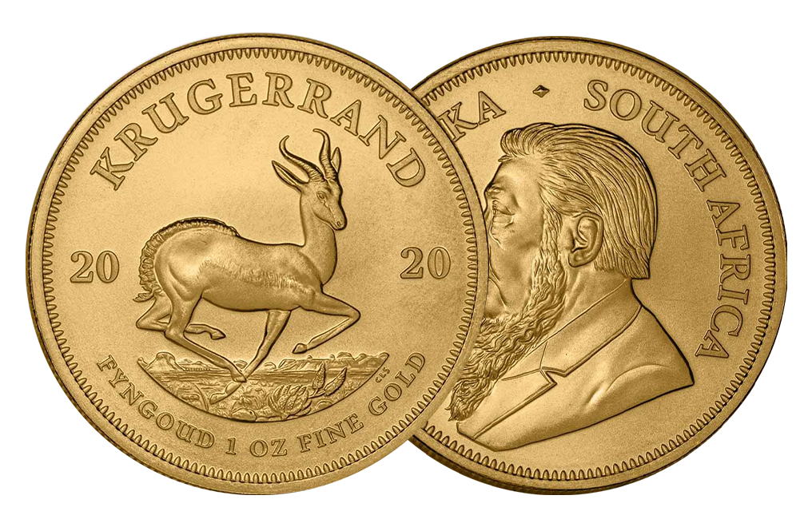

## Table of Contents

## What is a Krugerrand gold coin?

A Krugerrand gold coin is a type of coin made from gold that comes from South Africa. It was first made in 1967 and is named after Paul Kruger, who was a president in South Africa, and the word "rand," which is the South African currency. The coin is popular because it is easy to buy and sell all over the world. People often buy Krugerrands as a way to invest in gold.

The front of the Krugerrand shows a picture of Paul Kruger's face, and the back has a picture of a springbok, which is a type of antelope found in South Africa. Krugerrands come in different sizes, but the most common one is made of one ounce of gold. The coin is not just a piece of gold; it is also a legal coin in South Africa, which means it can be used as money, although people usually keep them as a way to save money or as a special item to collect.

## When and where was the Krugerrand first minted?

The Krugerrand was first minted in 1967. It was made in South Africa, at a place called the South African Mint, which is in Pretoria.

The idea to make the Krugerrand came from people who wanted a simple way to invest in gold. They chose the name Krugerrand to honor Paul Kruger, a former president, and to show that it was connected to the South African currency, the rand.

## What is the significance of the name 'Krugerrand'?

The name 'Krugerrand' is very important because it tells us about the coin's history and what it stands for. The first part of the name, 'Kruger,' comes from Paul Kruger, who was a president in South Africa a long time ago. By using his name, the coin honors him and connects to South Africa's past.

The second part of the name, 'rand,' is the name of South Africa's money. This part of the name shows that the Krugerrand is a coin that can be used as money in South Africa, even though people usually keep it as a way to save or invest in gold. Together, the name 'Krugerrand' links the coin to South Africa's history and its money system.

## What are the different denominations of Krugerrand coins?

Krugerrand coins come in different sizes, which are called denominations. These sizes are measured by how much gold is in each coin. The most common Krugerrand is the one-ounce coin, which means it has one ounce of gold in it. But there are also smaller sizes like the half-ounce, the quarter-ounce, and the tenth-ounce Krugerrand. Each of these smaller coins has less gold in them than the one-ounce coin.

The one-ounce Krugerrand is the biggest and most popular size. It is made of one ounce of gold, and it also has a little bit of copper mixed in to make it stronger. The half-ounce Krugerrand has half an ounce of gold, the quarter-ounce has a quarter of an ounce, and the tenth-ounce has a tenth of an ounce. These smaller sizes make it easier for people to buy Krugerrands if they don't want to spend as much money as they would on a one-ounce coin.

## What is the purity and weight of gold in a Krugerrand?

A Krugerrand coin is made of gold, but it's not pure gold. It's mixed with a little bit of copper to make it stronger. The gold in a Krugerrand is 91.67% pure, which means that for every 100 parts of the coin, 91.67 parts are gold and the rest is copper. This mix is called 22 karats.

The weight of the gold in a Krugerrand depends on which size you have. The most common size is the one-ounce Krugerrand. Even though it's called a one-ounce coin, it actually weighs a bit more than one ounce because of the copper. But it still has exactly one ounce of pure gold in it. There are also smaller sizes like the half-ounce, quarter-ounce, and tenth-ounce Krugerrands. Each of these smaller coins has exactly half, a quarter, or a tenth of an ounce of pure gold in them, respectively.

## How can you identify a genuine Krugerrand?

To tell if a Krugerrand is real, you need to look closely at it. On the front, you should see Paul Kruger's face. His name should be written as "SUID-AFRIKA" and "SOUTH AFRICA" around the edge. On the back, there should be a springbok, which is an animal that looks like a deer. The words "KRUGERRAND" and the year it was made should be there too. The coin should feel heavy because it's made of gold and copper. If it feels light, it might not be real.

Another way to check is by looking at the edges of the coin. Real Krugerrands have small, straight lines all around the edge, called reeding. If you see any writing or different patterns, it's probably fake. You can also use a magnet. Real gold isn't magnetic, so if a magnet sticks to the coin, it's not a real Krugerrand. If you're still not sure, it's a good idea to take it to a coin expert or a jeweler who can test it with special tools.

## What is the historical performance of Krugerrand as an investment?

The Krugerrand has been a popular choice for people who want to invest in gold since it was first made in 1967. Over the years, the value of Krugerrands has gone up and down, just like the price of gold. During times when people were worried about the economy or inflation, the price of gold often went up, which made Krugerrands more valuable. For example, in the 1970s and 1980s, when there was a lot of inflation, the price of gold and Krugerrands went up a lot. People saw Krugerrands as a safe way to keep their money because gold is something that always has value.

In more recent years, the performance of Krugerrands has followed the general trends of the gold market. From the early 2000s to around 2011, the price of gold and Krugerrands went up a lot, reaching record highs. This was a good time for people who had invested in Krugerrands earlier. After 2011, the price of gold went down for a while, but it has stayed pretty stable since then. Overall, Krugerrands have been a good long-term investment for people who want to protect their money from inflation and economic uncertainty.

## How has the Krugerrand influenced global gold coin markets?

The Krugerrand has had a big impact on the global gold coin market. When it was first made in 1967, it was the first gold coin that people could easily buy and sell all over the world. Before the Krugerrand, gold coins were mostly used as money in their own countries. But the Krugerrand changed that because it was made to be an easy way for people to invest in gold. This idea caught on, and soon other countries started making their own gold coins for investors, like the Canadian Maple Leaf and the American Eagle.

Because the Krugerrand was so popular, it helped make the market for gold coins much bigger. People all around the world started buying gold coins as a way to save money and protect their savings from inflation. The success of the Krugerrand showed other countries that there was a big demand for gold coins that were easy to buy and sell. This led to more competition and more choices for people who wanted to invest in gold. Overall, the Krugerrand played a big role in making gold coins a common way for people to invest in gold.

## What are the legal considerations for buying and selling Krugerrands in different countries?

Buying and selling Krugerrands can be different in each country because of the laws there. In South Africa, where Krugerrands come from, they are legal money. But in other places, there might be rules about buying and selling gold coins. For example, in the United States, you can buy and sell Krugerrands, but you need to report it if you buy or sell a lot of them because of laws about money laundering. In some countries, like India, you might have to pay taxes when you buy gold coins, and there could be limits on how much gold you can bring into the country.

In Europe, the rules can be different from one country to another. In the United Kingdom, you can buy and sell Krugerrands without many problems, but you might need to pay a tax called Value Added Tax (VAT) if you buy them as an investment. In some countries, like Switzerland, buying and selling gold coins is easy and there are not many rules. It's important to check the laws in your country before you buy or sell Krugerrands because the rules can change and you don't want to get into trouble.

## How do Krugerrands compare to other gold bullion coins in terms of liquidity and premium?

Krugerrands are very popular and easy to buy and sell all over the world. This means they have good [liquidity](/wiki/liquidity-risk-premium), which is how easy it is to turn them into cash. Because so many people know about and want Krugerrands, you can usually sell them quickly without having to wait long. Compared to other gold bullion coins, like the American Eagle or the Canadian Maple Leaf, Krugerrands are often more liquid. This is because they were the first gold coin made for investors and have been around for a long time, so people trust them.

When it comes to the premium, which is the extra cost you pay over the value of the gold itself, Krugerrands usually have a lower premium than some other gold coins. This is good for people who want to buy gold without spending too much extra money. Coins like the American Eagle might have a higher premium because they are made of purer gold and have more detailed designs. But Krugerrands, with their mix of gold and copper, are often cheaper to buy. So, if you want a gold coin that's easy to sell and doesn't cost too much extra, a Krugerrand might be a good choice.

## What are the best practices for storing and insuring Krugerrand coins?

When you store Krugerrand coins, it's important to keep them safe and secure. You should use a safe or a secure box that locks to protect them from being stolen or damaged. It's also a good idea to keep them in a cool, dry place so they don't get hurt by heat or water. If you have a lot of Krugerrands, you might want to use special coin holders or tubes to keep them organized and safe. Don't touch the coins too much with your hands because the oils from your skin can make them dirty or even damage them over time.

For insurance, it's smart to get a policy that covers your Krugerrands. You can talk to an insurance company about getting coverage for your coins. They can help you figure out how much it will cost and what kind of protection you need. Make sure to keep a list of your Krugerrands with details like the year they were made and how many you have. This can help if you need to make a claim. It's also a good idea to have your Krugerrands appraised by a professional so you know their value and can make sure your insurance covers that amount.

## What advanced techniques are used to assess the condition and value of rare or collectible Krugerrands?

To assess the condition and value of rare or collectible Krugerrands, experts use special tools and methods. They look closely at the coin with a magnifying glass or a microscope to check for any small scratches, dents, or wear. They also use a scale to weigh the coin and make sure it has the right amount of gold. Sometimes, they use a special machine called a spectrometer to test the gold's purity. By looking at all these things, experts can tell if a Krugerrand is in good condition and how much it might be worth.

Another important part of assessing Krugerrands is looking at their rarity and history. Some Krugerrands are worth more because they are old or were made in small numbers. Experts check the year the coin was made and any special marks or errors that might make it more valuable. They also look at what similar coins have sold for recently to help figure out the value. By combining all this information, they can give a good estimate of how much a rare or collectible Krugerrand is worth.

## References & Further Reading

[1]: [South African Mint. "Krugerrands."](https://en.wikipedia.org/wiki/Krugerrand)

[2]: ["Advances in Financial Machine Learning"](https://www.amazon.com/Advances-Financial-Machine-Learning-Marcos/dp/1119482089) by Marcos Lopez de Prado

[3]: Culp, C. L., & Heaton, J. S. (2018). ["The Transformation of the South African Gold Market: From Gold Standard to Gold Coin."](https://papers.ssrn.com/sol3/papers.cfm?abstract_id=982898) SSRN Electronic Journal.

[4]: ["Machine Learning for Algorithmic Trading"](https://github.com/stefan-jansen/machine-learning-for-trading) by Stefan Jansen

[5]: ["The Gold Standard in Theory and History"](https://www.taylorfrancis.com/books/edit/10.4324/9780203978870/gold-standard-theory-history-barry-eichengreen-marc-flandreau) edited by Barry Eichengreen and Marc Flandreau