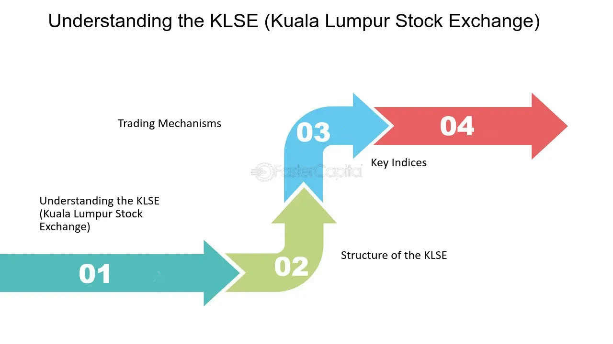

## Table of Contents

## What is the Kuala Lumpur Stock Exchange (KLSE)?

The Kuala Lumpur Stock Exchange (KLSE) is a stock exchange based in Kuala Lumpur, Malaysia. It is where people and companies can buy and sell shares of different companies. The KLSE is important because it helps companies get money to grow their business and it lets people invest their money to possibly make more money.

The KLSE started a long time ago, in 1964. It has changed a lot since then and now it is called Bursa Malaysia. Even though the name changed, people still sometimes call it KLSE. The exchange has many different types of companies listed on it, from big banks to small technology firms. This variety helps investors find different opportunities to invest their money.

## How was the KLSE established and what is its history?

The Kuala Lumpur Stock Exchange (KLSE) was established on March 1, 1964. Before that, trading happened in Singapore because Malaysia and Singapore were part of the same country. When Malaysia and Singapore became separate countries in 1965, Malaysia needed its own stock exchange. So, the Malaysian government decided to create the KLSE in Kuala Lumpur, the capital city of Malaysia.

Over the years, the KLSE grew a lot. In 1973, it moved to a new building called the Kuala Lumpur Stock Exchange Building. The exchange kept getting bigger and more important. In 2004, the KLSE changed its name to Bursa Malaysia. This new name showed that the exchange was not just about stocks anymore but also about other kinds of trading like futures and options. Even though the name changed, people still sometimes call it KLSE because it is so well-known.

Today, Bursa Malaysia is a big part of Malaysia's economy. It helps companies get money to grow and it gives people a place to invest their money. The exchange has many different types of companies listed on it, from big banks to small technology firms. This variety helps investors find different opportunities to invest their money.

## What are the main functions of the KLSE?

The main job of the Kuala Lumpur Stock Exchange (KLSE), now known as Bursa Malaysia, is to help companies raise money. When a company wants to grow, it can sell pieces of itself called shares on the KLSE. People buy these shares, giving the company money to use for things like building new factories or hiring more workers. This process is called going public or an Initial Public Offering (IPO). The KLSE makes sure that this process is fair and that everyone knows the right information about the company.

Another important function of the KLSE is to help people invest their money. When people buy shares on the KLSE, they hope that the value of those shares will go up over time. If the company does well, the price of its shares can increase, and the people who own the shares can make money. The KLSE provides a safe place for people to buy and sell these shares. It also makes rules to protect investors and keep the market fair. This helps people feel confident about putting their money into the market.

## How does the KLSE facilitate trading of securities?

The Kuala Lumpur Stock Exchange (KLSE), now known as Bursa Malaysia, helps people buy and sell shares of companies. It does this by providing a place where buyers and sellers can come together. When someone wants to buy shares, they can place an order on the KLSE's trading system. At the same time, someone who wants to sell shares can also place an order. The KLSE's system matches these orders, so if the price is right, the trade happens quickly and easily.

The KLSE also makes sure that trading is fair and safe. It has rules that everyone must follow, like making sure companies tell the truth about their business. This helps people trust the market. The KLSE also keeps an eye on trading to stop any cheating or bad behavior. By doing all these things, the KLSE helps people feel confident about buying and selling shares, which makes the market work smoothly.

## What types of securities are traded on the KLSE?

The Kuala Lumpur Stock Exchange (KLSE), now known as Bursa Malaysia, trades many different types of securities. The main type is stocks, which are pieces of a company that people can buy and sell. When you buy a stock, you own a small part of that company. The KLSE also trades bonds, which are like loans that people give to companies or the government. When you buy a bond, the company or government promises to pay you back with interest over time.

Besides stocks and bonds, the KLSE also trades other types of securities. One type is called derivatives, which are special contracts that get their value from something else, like the price of a stock or a commodity. There are also exchange-traded funds (ETFs), which are like baskets of different investments that you can buy and sell like a single stock. All these different types of securities help people and companies find different ways to invest and raise money.

## Who can invest in the KLSE and how can they start?

Anyone can invest in the Kuala Lumpur Stock Exchange (KLSE), now known as Bursa Malaysia, as long as they have some money to invest. You don't need to be rich or live in Malaysia to invest there. You just need to open an account with a brokerage firm that can trade on the KLSE. A brokerage firm is a company that helps people buy and sell stocks. You can find these firms online or by asking someone who knows about investing.

To start investing, you first need to choose a brokerage firm and open an account with them. This usually involves filling out some forms and giving them some personal information. Once your account is set up, you can put money into it. Then, you can use the firm's trading platform, which is like a website or app, to buy and sell stocks on the KLSE. It's a good idea to learn about the companies you want to invest in and maybe talk to someone who knows about investing before you start.

## What are the key indices of the KLSE and what do they represent?

The Kuala Lumpur Stock Exchange (KLSE), now known as Bursa Malaysia, has several key indices that help people understand how the market is doing. The main index is called the FTSE Bursa Malaysia KLCI (FBM KLCI). This index shows the performance of the 30 biggest and most important companies listed on the KLSE. When people talk about how the Malaysian stock market is doing, they often look at the FBM KLCI because it gives a good picture of the overall market.

Besides the FBM KLCI, there are other indices that focus on different parts of the market. The FTSE Bursa Malaysia Mid 70 Index tracks the performance of the next 70 largest companies after the top 30. This helps investors see how medium-sized companies are doing. There is also the FTSE Bursa Malaysia Small Cap Index, which looks at smaller companies. These different indices help investors understand various parts of the market and make better investment decisions.

## How does the KLSE contribute to the Malaysian economy?

The Kuala Lumpur Stock Exchange (KLSE), now called Bursa Malaysia, plays a big role in helping the Malaysian economy grow. It does this by letting companies raise money. When a company wants to build a new factory or hire more workers, it can sell pieces of itself called shares on the KLSE. People buy these shares, giving the company money to use for its plans. This helps companies grow bigger and create more jobs, which is good for the economy.

The KLSE also helps people invest their money. When people buy shares on the KLSE, they hope to make more money if the company does well. This means people can save and invest for the future, which helps the economy stay strong. By providing a safe place for buying and selling shares, the KLSE helps keep the market fair and builds trust. This trust makes more people want to invest, which brings more money into the economy and helps it grow even more.

## What are the regulatory bodies overseeing the KLSE and their roles?

The Kuala Lumpur Stock Exchange (KLSE), now known as Bursa Malaysia, is watched over by two main groups: the Securities Commission Malaysia (SC) and Bursa Malaysia itself. The Securities Commission Malaysia is like a big boss that makes sure everyone follows the rules. It looks after the whole financial market in Malaysia, not just the KLSE. The SC makes rules to stop cheating and to keep the market fair. It also checks new companies that want to sell shares on the KLSE to make sure they are honest and safe for people to invest in.

Bursa Malaysia also has its own rules and people who make sure trading happens the right way. They watch the trading every day to stop any bad behavior and make sure everyone plays by the rules. If someone breaks the rules, Bursa Malaysia can punish them. This helps keep the KLSE a safe place for people to buy and sell shares. Both the Securities Commission Malaysia and Bursa Malaysia work together to make sure the KLSE helps the economy grow in a fair and safe way.

## What are the major risks associated with investing in the KLSE?

Investing in the Kuala Lumpur Stock Exchange (KLSE) can be risky because the value of stocks can go up and down a lot. This means you might lose money if the price of the stocks you buy goes down. Sometimes, the whole market can go down because of things like a bad economy or problems in the world. Also, some companies might not do as well as expected, which can make their stock prices drop. It's important to know that even if you pick good companies, there's always a chance that things won't go as planned.

Another risk is that you might not know enough about the companies you're investing in. If you don't do your homework, you might buy stocks in a company that's not doing well or that's hiding problems. There's also the risk of fraud or cheating, where people might lie about a company to make its stock price go up. The KLSE has rules to stop this, but it can still happen. So, it's a good idea to learn about the companies you're thinking about investing in and maybe talk to someone who knows about investing before you start.

## How has technology impacted trading on the KLSE?

Technology has changed how people trade on the Kuala Lumpur Stock Exchange (KLSE), now called Bursa Malaysia, in big ways. Now, instead of having to go to a physical place to trade, people can buy and sell stocks from their computers or even their phones. This makes trading much easier and faster. The KLSE has a special computer system that matches buyers and sellers quickly, so trades happen almost right away. This system also helps keep trading fair by watching for any strange behavior that might be cheating.

Another way technology helps is by giving people a lot more information. There are websites and apps that show stock prices, news about companies, and even what other people think about the stocks. This makes it easier for people to decide which stocks to buy or sell. Technology also lets people use special programs called algorithms to trade. These programs can make trades based on rules that people set up, which can be faster and sometimes smarter than doing it by hand. Overall, technology has made trading on the KLSE easier, quicker, and more open to everyone.

## What are the future trends and developments expected for the KLSE?

The Kuala Lumpur Stock Exchange (KLSE), now known as Bursa Malaysia, is expected to keep growing and changing in the future. One big trend is that more and more trading will happen using technology. This means more people will use computers and smartphones to buy and sell stocks. The KLSE might also start using new kinds of technology, like [artificial intelligence](/wiki/ai-artificial-intelligence), to help make trading even faster and smarter. This could make the market more efficient and attract more investors from around the world.

Another trend is that the KLSE might see more companies from different industries wanting to list their stocks there. This could include more tech companies and green energy firms, as these industries are growing fast. As more companies join the KLSE, it could become even more important for the Malaysian economy. The KLSE might also work on making its rules even better to protect investors and make sure the market stays fair and safe.

## References & Further Reading

[1]: Bergstra, J., Bardenet, R., Bengio, Y., & Kégl, B. (2011). ["Algorithms for Hyper-Parameter Optimization."](https://dl.acm.org/doi/10.5555/2986459.2986743) Advances in Neural Information Processing Systems 24.

[2]: ["Advances in Financial Machine Learning"](https://www.amazon.com/Advances-Financial-Machine-Learning-Marcos/dp/1119482089) by Marcos Lopez de Prado

[3]: ["Evidence-Based Technical Analysis: Applying the Scientific Method and Statistical Inference to Trading Signals"](https://www.amazon.com/Evidence-Based-Technical-Analysis-Scientific-Statistical/dp/0470008741) by David Aronson

[4]: ["Machine Learning for Algorithmic Trading"](https://github.com/stefan-jansen/machine-learning-for-trading) by Stefan Jansen

[5]: ["Quantitative Trading: How to Build Your Own Algorithmic Trading Business"](https://www.amazon.com/Quantitative-Trading-Build-Algorithmic-Business/dp/1119800064) by Ernest P. Chan