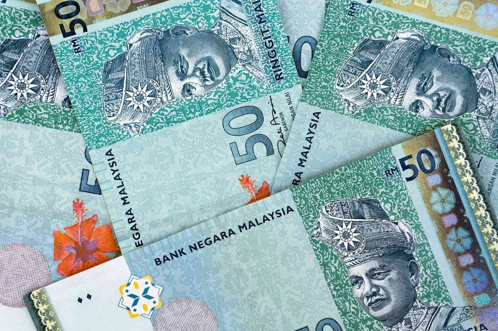

The Kuala Lumpur Stock Exchange (KLSE), rebranded as Bursa Malaysia, serves as a pivotal financial platform in Malaysia, facilitating the trade of a wide array of financial instruments, including equities, derivatives, and exchange-traded funds. This exchange has evolved into a key component of Malaysia's financial infrastructure, playing a crucial role in the economy's capital and financial markets.

Algorithmic trading, commonly known as algo trading, has become an essential element in contemporary financial markets. It leverages advanced computer algorithms to automate trading processes, enabling trades to be executed at speeds and frequencies that surpass human capabilities. These algorithms are designed to follow specific rules for executing trades, including timing, price, quantity, and strategies such as market making, arbitrage, or trend following. This automation not only enhances trading speed and efficiency but also minimizes human errors and biases.



This article examines the integration and influence of algorithmic trading within KLSE, now Bursa Malaysia, exploring how it has reshaped market dynamics. By analyzing the benefits and challenges associated with this technology, the article aims to illuminate its role in enhancing market efficiency and liquidity, while highlighting the regulatory considerations necessary to ensure market stability and integrity. The future trajectory of algo trading at the KLSE, alongside potential advancements in financial technologies, is also considered, providing a comprehensive view of its impact on the financial landscape in Malaysia.

## Table of Contents

## The Evolution of the Kuala Lumpur Stock Exchange

The Kuala Lumpur Stock Exchange (KLSE), now known as Bursa Malaysia, has experienced substantial transformations since its inception in 1930. Initially established under the name Singapore Stockbrokers’ Association, it played a pivotal role in facilitating financial transactions and supporting economic growth in the region. The formation of the Malayan Stock Exchange marked an important milestone as it addressed the burgeoning need for a centralized trading platform in the pre-independence era of Malaysia. This transformation was part of a broader economic strategy to support burgeoning domestic markets and enhance regional cooperation within Southeast Asia.

In 1973, further developments ensued with the establishment of the Kuala Lumpur Stock Exchange Berhad, which functioned as a company limited by guarantee. This transition was a crucial step towards professionalizing and modernizing the operations of the stock exchange. By 1976, KLSE was corporatized, indicating the growing maturity of Malaysia's financial markets. The restructuring allowed for improved governance, transparency, and operational efficiency, which were vital for attracting both local and international investors.

In response to globalization and the increasing interconnectedness of financial markets, KLSE underwent rebranding in 2004, becoming Bursa Malaysia. This change was not merely cosmetic but represented a strategic shift towards becoming a more competitive and comprehensive exchange within the Asian region. Bursa Malaysia expanded its offerings to include equities, derivatives, and other investment instruments, aligning with global standards and expectations.

The evolution of KLSE into Bursa Malaysia underscores its commitment to fostering a robust financial ecosystem capable of supporting Malaysia's economic ambitions. By continually adapting to changing economic landscapes and technological advancements, Bursa Malaysia has positioned itself as a critical platform for capital formation and investment in Southeast Asia.

## Understanding Algorithmic Trading

Algorithmic trading is a modern method of executing trading orders using pre-programmed instructions to account for variables such as time, price, and [volume](/wiki/volume-trading-strategy). By leveraging automated systems, this approach allows for rapid execution of trades, often within milliseconds, thus minimizing the possibility of human error and enhancing overall trading accuracy and efficiency.

Automation in trading is largely facilitated through algorithms, which are sets of defined rules or instructions given to a computer to perform specific tasks. In the context of trading, these algorithms are designed to analyze market conditions and execute trades that align with predefined strategies. This automation allows traders to capitalize on lucrative market opportunities and manage large volumes of trades effectively.

Several common strategies are employed in [algorithmic trading](/wiki/algorithmic-trading). Market making involves placing both buy and sell orders for a particular security to capture the spread as profit. This strategy requires the capacity to handle numerous orders and execute them rapidly, making it well-suited to algorithmic execution. Arbitrage, another frequently utilized strategy, exploits price discrepancies of the same asset across different markets. By swiftly buying low in one market and selling high in another, algorithmic systems can lock in profit margins that exist only momentarily. Trend following strategies analyze past market data to detect patterns and execute trades in the direction of those trends. For instance, if a significant upward trend is identified, the algorithm may place buy orders to benefit from continuing upward movement.

Algorithmic trading is typically implemented using computer programming languages such as Python. The language's expansive libraries and community support in finance-related modules like NumPy, Pandas, and scikit-learn enable traders to develop sophisticated models with relative ease. Below is an example snippet of Python code demonstrating a basic setup for an algorithmic trading system.

```python
import pandas as pd

# Load historical market data
data = pd.read_csv('market_data.csv')

# Simple moving average (SMA) strategy
def trading_strategy(data, short_window=40, long_window=100):
    signals = pd.DataFrame(index=data.index)
    signals['price'] = data['Close']

    # Compute the short and long moving averages
    signals['short_mavg'] = signals['price'].rolling(window=short_window, min_periods=1).mean()
    signals['long_mavg'] = signals['price'].rolling(window=long_window, min_periods=1).mean()

    # Generate signals
    signals['signal'] = 0.0
    signals['signal'][short_window:] = np.where(
        signals['short_mavg'][short_window:] > signals['long_mavg'][short_window:], 1.0, 0.0
    )

    # Generate trading orders
    signals['positions'] = signals['signal'].diff()

    return signals

signals = trading_strategy(data)
print(signals.head())
```

This script illustrates the implementation of a simple moving average crossover strategy where buy signals are generated when a short-term moving average crosses above a long-term moving average, and sell signals are generated when the opposite occurs. While simplistic, it highlights the core principle behind more sophisticated algorithmic trading strategies.

Algorithmic trading continues to evolve with emerging technologies, and the ability to process more extensive data sets in real-time will likely bring further enhancements to trading accuracy and efficiency.

## Bursa Malaysia and Algorithmic Trading

Bursa Malaysia has made significant strides in embracing algorithmic trading, primarily supported by its advanced trading systems such as Bursa Trade Securities 2 (BTS2). This system is designed to handle the high-speed and high-volume requirements of algorithmic trading, enhancing the efficiency and responsiveness of the exchange. Bursa Malaysia offers a comprehensive platform catering to various financial instruments, including equities, derivatives, and exchange-traded funds (ETFs), thereby providing investors with diverse trading opportunities.

The adoption of algorithmic trading is on the rise in Malaysia, driven by both local and international investors. The architecture of BTS2 facilitates the implementation of various algorithmic strategies, supporting the complex needs of traders seeking to capitalize on market trends and execute precise trades. This system not only increases the accessibility of global trading practices but also strengthens Bursa Malaysia's position as a competitive player in Asian financial markets.

Algorithmic trading at Bursa Malaysia is characterized by the deployment of sophisticated algorithms capable of analyzing substantial amounts of market data in real-time. These algorithms can execute trades based on predefined criteria, such as pricing, timing, and volume, often outperforming human traders in terms of speed and accuracy. This capability allows investors to react swiftly to market changes, optimize trade execution, and reduce transaction costs.

Moreover, the growth of algo trading is indicative of Malaysia's broader engagement with financial technology (fintech), as the country continues to develop and integrate innovative trading solutions. By facilitating algorithmic trading, Bursa Malaysia is not only enhancing its operational capabilities but also providing a more dynamic and competitive marketplace for investors worldwide.

In summary, Bursa Malaysia's investment in technology and its openness to algorithmic trading reflect its commitment to maintaining a cutting-edge financial market infrastructure. This approach not only bolsters the exchange's attractiveness to investors but also promotes a more efficient and effective trading environment.

## Advantages and Challenges of Algo Trading on KLSE

Algorithmic trading on the Kuala Lumpur Stock Exchange (KLSE), now known as Bursa Malaysia, offers several advantages and poses certain challenges. One of the primary benefits of algorithmic trading is the significant increase in trading speed. Through the use of computer algorithms, trades can be executed almost instantaneously, allowing traders to capitalize on even the smallest market movements. This speed is unattainable in human-only trading scenarios and is crucial in today’s fast-paced financial markets.

Precision is another key advantage of algorithmic trading. Algorithms operate based on pre-defined instructions and criteria, ensuring that trades are executed exactly as planned, thereby minimizing the impact of human error. This level of accuracy is essential for strategies that require precise execution, such as [arbitrage](/wiki/arbitrage) or [market making](/wiki/market-making). Additionally, algorithmic trading allows traders to manage large volumes of orders efficiently. This scalability permits traders to handle vast portfolios and execute multiple trades simultaneously across various markets.

Despite these advantages, algorithmic trading on Bursa Malaysia is not without challenges. One major challenge is the technical complexity involved in designing and managing trading algorithms. Developing an effective algorithm requires a deep understanding of market dynamics, quantitative methods, and programming skills. Moreover, maintaining these algorithms necessitates robust technological infrastructure to ensure reliability and security, which can be resource-intensive.

The impact of algorithmic trading on market dynamics also raises concerns. Large-scale algorithmic trades can contribute to market [volatility](/wiki/volatility-trading-strategies), as they may amplify price movements when large orders are executed. This volatility can affect market stability and is a topic of concern for regulators. Additionally, the potential for algorithms to malfunction—or "run amok"—could lead to unintended consequences, such as flash crashes, where prices plummet briefly before recovering.

In addressing these challenges, regulatory frameworks are crucial. Bursa Malaysia operates under the oversight of the Securities Commission Malaysia, which imposes regulations to maintain market integrity and protect investors. These regulations are continually updated to address the evolving nature of algorithmic trading and its impact on market dynamics, aiming for a balance between innovation and risk management. 

Overall, while algorithmic trading presents significant opportunities for enhancing trading efficiency on the KLSE, it also necessitates careful consideration of the technical, infrastructural, and regulatory challenges to ensure a stable and fair trading environment.

## Regulatory and Market Dynamics

Bursa Malaysia operates within a rigorous regulatory framework established by the Securities Commission Malaysia (SC), ensuring that the market upholds integrity, transparency, and investor protection. These regulatory standards are crucial for fostering trust and confidence among market participants, especially as algorithmic trading becomes increasingly prevalent.

**Market Integrity and Transparency**

Maintaining market integrity involves preventing manipulation and ensuring that all participants have fair access to market information. To achieve this, Bursa Malaysia and the SC enforce a series of stringent rules and monitoring systems that detect and deter fraudulent activities. The emphasis on transparency means that all trades and price movements in the stock market must be visible and understandable to all stakeholders, thus preventing any form of insider trading or market manipulation.

**Investor Protection**

Investor protection is a cornerstone of regulatory efforts. The SC implements measures to safeguard retail and institutional investors from potential abuses that could arise from complex trading strategies, including those executed by algorithms. This includes regular audits, compliance checks, and stringent penalties for any breaches of conduct.

**Adapting to Innovations**

As trading strategies become more sophisticated, particularly with the advent of algorithmic trading, regulatory bodies must adapt existing rules to address new risks and challenges. Continuous updates are made to the regulatory framework to accommodate such innovations, where rules may involve enhanced disclosure requirements, real-time monitoring of trading activities, and the implementation of circuit breakers to manage extreme volatility.

These updates ensure that while the market benefits from the efficiency and speed of algorithmic trading, it does not compromise on fairness or stability. The dynamic nature of algo trading requires proactive governance to mitigate systemic risks such as flash crashes, which can be triggered by the rapid buying or selling of large volumes of securities.

**Technological Integration**

The integration of technology in regulatory practices is pivotal. RegTech, or regulatory technology, leverages tools like big data analytics and [machine learning](/wiki/machine-learning) to improve real-time monitoring and regulatory compliance. This allows for the parsing of vast amounts of trading data to identify patterns or anomalies that could indicate non-compliance or market abuse.

In summary, the regulatory and market dynamics surrounding Bursa Malaysia and algorithmic trading are complex, requiring continuous evolution and adaptation of rules to protect market integrity and participants. These measures ensure that the market remains robust, transparent, and fair, allowing for the sustainable growth of algorithmic trading within Malaysia's financial ecosystem.

## The Future of Algorithmic Trading at KLSE

Growing interest in fintech and automated systems suggests a bright future for algorithmic trading at the Kuala Lumpur Stock Exchange (KLSE), known as Bursa Malaysia. The landscape of algorithmic trading is shaped by several factors, including enhanced market access, international collaborations, and the adoption of advanced technologies such as [deep learning](/wiki/deep-learning) and [artificial intelligence](/wiki/ai-artificial-intelligence) (AI).

Firstly, enhanced market access stands as a crucial driver for growth in algorithmic trading at KLSE. As Bursa Malaysia continues to modernize its infrastructure, it allows both local and international investors to engage more efficiently with the Malaysian market. The exchange's development initiatives aim to provide a seamless trading experience, thereby attracting a larger pool of algorithmic traders. This broad participation is expected to improve [liquidity](/wiki/liquidity-risk-premium) and foster a vibrant trading environment.

Additionally, international partnerships are poised to expand opportunities for investors on the KLSE. Collaborative efforts with global exchanges and financial institutions can facilitate knowledge exchange, innovative product offerings, and infrastructure upgrades. These partnerships can lead to the introduction of new financial instruments and cross-border trading capabilities, further establishing Bursa Malaysia as a significant regional hub for algorithmic trading.

The integration of deep learning and AI represents another transformative force in the future of algorithmic trading at KLSE. Deep learning algorithms can analyze vast amounts of market data to identify intricate patterns and make predictive decisions with high accuracy. This capability can enhance traditional trading strategies, such as market making, arbitrage, and [trend following](/wiki/trend-following), by capturing subtle market nuances and adapting in real-time to changing market conditions.

Moreover, AI-driven trading systems can optimize execution strategies through machine learning techniques, allowing for more efficient trade execution and reduced transaction costs. Python, a popular programming language in the field of data science and finance, is often employed to develop these advanced systems. Below is a simple illustration of how a basic algorithm might be implemented in Python to analyze and act on market conditions:

```python
import numpy as np
import pandas as pd

def moving_average_strategy(data, short_window=40, long_window=100):
    signals = pd.DataFrame(index=data.index)
    signals['signal'] = 0.0

    # Create short simple moving average
    signals['short_mavg'] = data['price'].rolling(window=short_window, min_periods=1).mean()

    # Create long simple moving average
    signals['long_mavg'] = data['price'].rolling(window=long_window, min_periods=1).mean()

    # Create signals
    signals['signal'][short_window:] = np.where(signals['short_mavg'][short_window:] > signals['long_mavg'][short_window:], 1.0, 0.0)   

    # Generate trading orders
    signals['positions'] = signals['signal'].diff()

    return signals

# Sample usage
market_data = pd.DataFrame({'price': [110, 112, 111, 115, 113, 118, 117, 119]})
signals = moving_average_strategy(market_data)
print(signals)
```

As the KLSE continues to embrace these technological advancements, it will be important for regulatory frameworks to evolve in parallel. This ensures that innovations in algorithmic trading do not compromise market integrity, transparency, and investor protection. Together, investors, regulators, and technology providers must collaborate to navigate the complexities of this dynamic landscape, fostering an environment where algorithmic trading can thrive.

## Conclusion

Algorithmic trading presents both significant opportunities and notable challenges for Bursa Malaysia. On the one hand, its adoption has the potential to substantially enhance market efficiency. Automated systems can process vast amounts of data quickly, identify trading signals, and execute trades with accuracy and speed, which manual processes cannot match. This can lead to better price discovery, tighter bid-ask spreads, and increased liquidity in the market, all of which are beneficial for investors.

However, the adoption of algorithmic trading also introduces a set of complexities that must be effectively managed. The technical sophistication required for deploying and maintaining algorithmic systems can be daunting, necessitating advanced infrastructure and specialized skills. Additionally, the rapid execution speeds characteristic of algorithmic trading can exacerbate market volatility, posing challenges for market stability and investor confidence.

Given these dynamics, it is crucial for investors and regulators to work collaboratively. Regulatory bodies, such as the Securities Commission Malaysia, play a vital role in ensuring that the rules governing the market are continually updated to reflect technological advancements. This includes implementing measures to mitigate the risks posed by algorithmic trading, such as setting limits on trading speeds and volumes and monitoring for unusual trading activities.

Investors, on their part, must remain abreast of technological advancements and regulatory changes. By aligning their strategies with evolving market conditions and regulatory frameworks, investors can better navigate the algorithmic trading landscape. Together, the concerted efforts of both parties can harness the benefits of algorithmic trading while minimizing associated risks, paving the way for a dynamic and resilient financial market ecosystem in Malaysia.

## References & Further Reading

[1]: Bergstra, J., Bardenet, R., Bengio, Y., & Kégl, B. (2011). ["Algorithms for Hyper-Parameter Optimization."](https://dl.acm.org/doi/10.5555/2986459.2986743) Advances in Neural Information Processing Systems 24.

[2]: ["Advances in Financial Machine Learning"](https://www.amazon.com/Advances-Financial-Machine-Learning-Marcos/dp/1119482089) by Marcos Lopez de Prado

[3]: ["Evidence-Based Technical Analysis: Applying the Scientific Method and Statistical Inference to Trading Signals"](https://www.amazon.com/Evidence-Based-Technical-Analysis-Scientific-Statistical/dp/0470008741) by David Aronson

[4]: ["Machine Learning for Algorithmic Trading"](https://github.com/stefan-jansen/machine-learning-for-trading) by Stefan Jansen

[5]: ["Quantitative Trading: How to Build Your Own Algorithmic Trading Business"](https://www.amazon.com/Quantitative-Trading-Build-Algorithmic-Business/dp/1119800064) by Ernest P. Chan