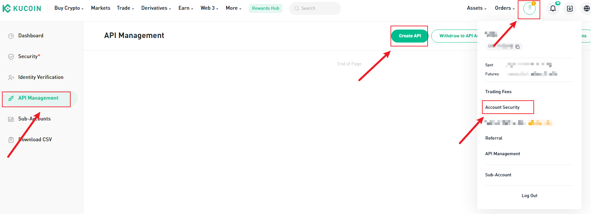

## Table of Contents

## What is the KuCoin API and why is it useful?

The KuCoin API is a tool that lets you connect and interact with the KuCoin cryptocurrency exchange from your own computer or software. It's like a set of instructions that allows your programs to buy, sell, and check on your cryptocurrency without having to go through the KuCoin website manually. This API is useful because it lets you automate trading, which means you can set up your computer to trade for you based on certain rules you create.

Using the KuCoin API can save you a lot of time and help you make better trading decisions. For example, you can write a program that automatically buys a cryptocurrency when its price drops to a certain level, or sells it when the price goes up to another level. This can be especially helpful if you want to trade at times when you're not able to watch the market yourself, like during the night or when you're at work. Overall, the KuCoin API makes trading easier and more efficient for people who know how to use it.

## How do I register for a KuCoin API key?

To register for a KuCoin API key, first you need to have an account on the KuCoin website. If you don't have one, sign up for free. Once you're logged in, go to the main page and look for the "API Management" section. You can usually find this in the settings or account menu. Click on it to go to the API management page.

On the API management page, you'll see an option to create a new API key. Click on that button. KuCoin will ask you to enter a name for your API key, which helps you remember what it's for. After naming it, you'll need to pass a security check, like entering a code sent to your phone or email. Once you pass the security check, KuCoin will show you your new API key and a secret key. Make sure to copy and save these keys in a safe place because you'll need them to use the API. Remember, keep your secret key private and don't share it with anyone.

## What are the different types of API keys available on KuCoin?

On KuCoin, there are two main types of API keys you can create: a read-only key and a read-write key. A read-only key lets you see information on KuCoin, like checking your balance or looking at market prices, but you can't use it to make trades or move money. It's like having a window to look through but not being able to touch anything.

A read-write key, on the other hand, gives you full control. With this key, you can not only see information but also make trades, deposit, and withdraw money. It's like having the keys to the house where you can both look around and change things. Because of this, it's really important to keep your read-write key safe and not share it with anyone.

## How do I set up my development environment to use the KuCoin API?

To set up your development environment for using the KuCoin API, you'll first need to choose a programming language. Python is a popular choice because it's easy to learn and has good support for working with APIs. Once you've picked your language, you'll need to install the KuCoin API library. For Python, you can use a tool called pip to install the kucoin-python package. After installing the library, you'll need to set up your API keys. Remember the API key and secret key you got from KuCoin? You'll use these to connect your program to KuCoin.

Once your environment is set up, you can start writing code to interact with the KuCoin API. You'll use the library to send requests to KuCoin, like asking for your account balance or placing a trade. Make sure to keep your API keys safe and never share them. It's also a good idea to test your code in a safe way first, maybe by using a small amount of money or by using a test account, to make sure everything works right before you start trading for real.

## What are the basic endpoints for account management on the KuCoin API?

The KuCoin API has some basic endpoints for managing your account. These endpoints are like doors you can knock on to ask for specific things from KuCoin. For example, there's an endpoint called "/api/v1/accounts" that lets you check all your account balances. Another one is "/api/v1/account/{accountId}" which you can use to see the details of a specific account. If you want to transfer money between your accounts, you can use the "/api/v1/accounts/inner-transfer" endpoint.

There are also endpoints for managing your API keys. You can use "/api/v1/api-key" to see all your API keys or create new ones. If you want to delete an API key, you can use "/api/v1/api-key/{apiKeyId}". These endpoints help you keep your account safe and organized. Remember to use them carefully and always keep your keys secret.

## How can I use the KuCoin API to trade cryptocurrencies?

To trade cryptocurrencies using the KuCoin API, you first need to set up your API keys and connect to the KuCoin platform. Once you're connected, you can use the API to place orders. For example, if you want to buy Bitcoin with USDT, you can use the "/api/v1/orders" endpoint to send a request to KuCoin. In your request, you'll need to specify what you want to buy, how much you want to buy, and at what price. KuCoin will then try to match your order with someone who wants to sell at that price.

After placing an order, you can use the API to check if your order was filled. You can do this by using the "/api/v1/orders" endpoint again, but this time to get the status of your order. If your order was filled, you'll see that you now own the [cryptocurrency](/wiki/cryptocurrency) you wanted to buy. If it wasn't filled, you might need to adjust your price or wait for the market to change. The API also lets you cancel orders if you change your mind, using the "/api/v1/orders/{orderId}/cancel" endpoint. This way, you can manage your trades without having to go to the KuCoin website every time.

## What are the rate limits for the KuCoin API and how can I manage them?

The KuCoin API has rules about how often you can ask it for things. These rules are called rate limits. For most of the API, you can ask up to 30 times in a second. But for some special parts, like trading, you can only ask 10 times in a second. If you ask too many times, KuCoin will make you wait before you can ask again. This is to make sure everyone gets a fair chance to use the API.

To manage these rate limits, you need to be careful about how often you send requests. One way to do this is by adding small pauses in your program. For example, if you're checking prices a lot, you can make your program wait a little bit between each check. Another way is to keep track of how many times you've asked and slow down if you're getting close to the limit. By doing this, you can keep using the API without having to wait too long.

## How do I handle errors and exceptions when using the KuCoin API?

When you're using the KuCoin API, you might run into errors or exceptions. These can happen if you ask for something that doesn't exist, if you're asking too fast and hit the rate limit, or if there's a problem with your API keys. When an error happens, the API will send you a message telling you what went wrong. It's important to read these messages because they help you figure out how to fix the problem.

To handle these errors, you can write your program to catch them and do something smart when they happen. For example, if you get a rate limit error, your program can wait a bit and then try again. If you get an error because your API key is wrong, your program can stop and tell you to check your keys. By planning for these errors, you can make your program work better and keep trading smoothly.

## What advanced features does the KuCoin API offer for market data analysis?

The KuCoin API has some cool tools that help you look at market data in a smart way. One of these tools is the ability to get real-time data about prices and trades. This means you can see what's happening in the market right now, which is really helpful if you want to make quick decisions about buying or selling. You can use the "/api/v1/market/allTickers" endpoint to get a list of all the current prices, and the "/api/v1/market/orderbook/level2_20" endpoint to see the buy and sell orders for a specific cryptocurrency.

Another advanced feature is the ability to get historical data. This lets you look back at what happened in the past, which can help you spot patterns and make better guesses about what might happen next. You can use the "/api/v1/market/candles" endpoint to get candle data, which shows you how prices changed over time. By combining real-time and historical data, you can create smart programs that help you understand the market better and make smarter trading choices.

## How can I implement WebSocket connections for real-time data from KuCoin?

To use WebSocket connections for getting real-time data from KuCoin, you need to set up a WebSocket client in your program. A WebSocket is like a special kind of connection that lets you get information from KuCoin as soon as it happens, without having to ask for it all the time. First, you connect to KuCoin's WebSocket server using the address "wss://ws-api.kucoin.com/endpoint". Once you're connected, you can subscribe to different types of data, like price updates or trade information, by sending a message to the server. For example, if you want to see real-time price changes for Bitcoin, you can send a message to subscribe to the Bitcoin ticker.

After you subscribe, KuCoin will start sending you updates as soon as they happen. This means you can see the latest prices or trades without having to check all the time. It's like getting a live feed of what's going on in the market. To handle these updates, your program needs to listen to the WebSocket connection and do something with the new data when it comes in. This could be updating a chart, making a trade, or just saving the information for later. By using WebSockets, you can make your trading program faster and more responsive to what's happening in the market.

## What security measures should I take when using the KuCoin API?

When using the KuCoin API, it's really important to keep your API keys safe. Your API key and secret key are like special passwords that let your program talk to KuCoin. If someone else gets these keys, they could use them to take your money or make trades without your permission. So, always keep your keys in a safe place, like a secure file on your computer or a password manager. Never share your keys with anyone, and be careful not to accidentally post them online or in your code where others can see them.

Another good idea is to use the right kind of API key for what you're doing. KuCoin lets you make read-only keys that can only look at information, and read-write keys that can also make trades and move money. If you only need to check prices or balances, use a read-only key. This way, even if someone gets your key, they can't do anything harmful with it. Also, think about setting up two-[factor](/wiki/factor-investing) authentication (2FA) on your KuCoin account. This adds an extra step to keep your account safe, so even if someone knows your password, they still can't get in without the 2FA code.

## How can I optimize my use of the KuCoin API for high-frequency trading?

To optimize your use of the KuCoin API for high-frequency trading, you need to make your program work fast and smart. One way to do this is by using WebSocket connections instead of asking for data all the time. With WebSockets, you get real-time updates as soon as they happen, which means you can make quick trades without waiting. Another important thing is to manage the rate limits carefully. KuCoin has rules about how often you can ask for things, so you need to add small pauses in your program to avoid hitting these limits. This way, your program can keep trading without getting slowed down.

It's also a good idea to use the right kind of API key for high-frequency trading. A read-write key lets you make trades, but you need to keep it super safe. Make sure you store it in a secure place and never share it with anyone. Also, think about breaking your trading logic into smaller parts. Instead of doing everything at once, you can have different parts of your program that focus on different tasks, like checking prices, making trades, and managing your balance. This can help your program run smoother and handle more trades faster.

## References & Further Reading

[1]: Bergstra, J., Bardenet, R., Bengio, Y., & Kégl, B. (2011). ["Algorithms for Hyper-Parameter Optimization."](https://proceedings.neurips.cc/paper/2011/file/86e8f7ab32cfd12577bc2619bc635690-Paper.pdf) Advances in Neural Information Processing Systems 24.

[2]: ["Advances in Financial Machine Learning"](https://www.amazon.com/Advances-Financial-Machine-Learning-Marcos/dp/1119482089) by Marcos Lopez de Prado

[3]: ["Evidence-Based Technical Analysis: Applying the Scientific Method and Statistical Inference to Trading Signals"](https://www.amazon.com/Evidence-Based-Technical-Analysis-Scientific-Statistical/dp/0470008741) by David Aronson

[4]: ["Machine Learning for Algorithmic Trading"](https://github.com/stefan-jansen/machine-learning-for-trading) by Stefan Jansen

[5]: ["Quantitative Trading: How to Build Your Own Algorithmic Trading Business"](https://books.google.com/books/about/Quantitative_Trading.html?id=j70yEAAAQBAJ) by Ernest P. Chan