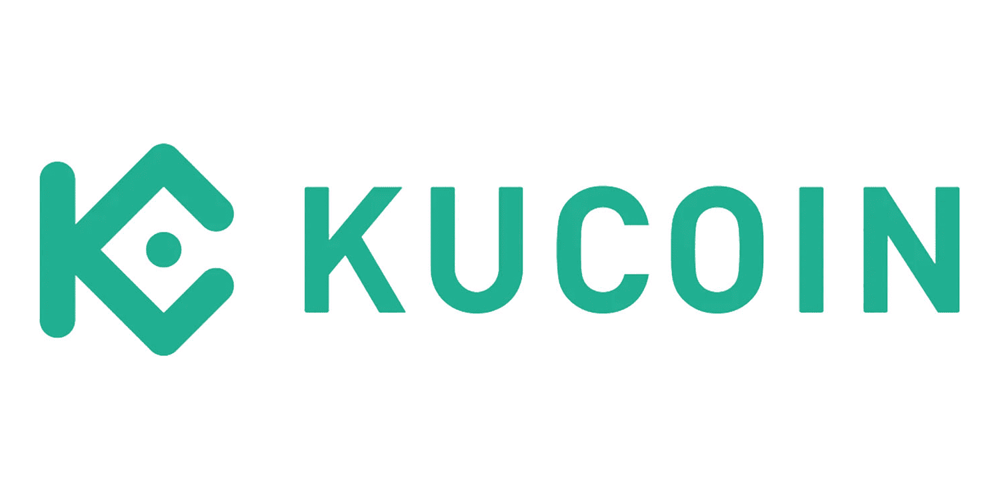

In 2024, the cryptocurrency landscape continues to evolve rapidly, characterized by increased adoption, regulatory developments, and technological advancements. As digital currencies become more mainstream, exchanges play a pivotal role in facilitating trade and investment. KuCoin, launched in 2017, has emerged as a major player in the crypto exchange ecosystem, offering a wide array of digital assets and innovative features to its growing user base.

KuCoin has built a reputation for accessibility and robust security measures, attracting users from around the globe. The exchange is known for supporting a diverse range of cryptocurrencies, making it an attractive option for both novice and seasoned traders. With a focus on user empowerment, KuCoin provides advanced trading features and educational resources, solidifying its position as a leading cryptocurrency exchange by 2024.



This article aims to provide an in-depth review of KuCoin, with a particular focus on algorithmic trading—a method gaining significant traction in the crypto sector. Algorithmic trading involves using automated systems to execute trades based on pre-defined strategies, allowing traders to capitalize on market opportunities more efficiently. The growing importance of this trading method in the cryptocurrency arena stems from its ability to improve trade execution speed, reduce human error, and enhance trading strategies.

Amidst its technological prowess, KuCoin's reputation is further strengthened by its extensive user base, which spans multiple continents. The exchange's commitment to innovation and user satisfaction places it at the forefront of digital asset exchanges looking to leverage automated trading technologies. This article will explore the unique features and advantages of using KuCoin for algorithmic trading, as well as address potential challenges and user experiences, ultimately providing a comprehensive overview of its standing in the crypto trading space.

## Table of Contents

## KuCoin: A Comprehensive Overview

KuCoin, established in September 2017, is a prominent cryptocurrency exchange that has gained substantial recognition within the crypto community over the years. Initially launched to provide a secure and straightforward platform for trading digital assets, KuCoin has evolved significantly, aligning itself with major trends and user demands in the cryptocurrency sector.

Significant milestones have marked KuCoin's journey to maturity by 2024. In its early years, the exchange gained the moniker "The People's Exchange" due to its commitment to offering a wide range of altcoins and fostering a user-friendly experience. In 2018, KuCoin expanded its reach by securing a $20 million funding round from prominent investors such as IDG Capital and Matrix Partners, which bolstered its development and marketing efforts. By 2024, KuCoin has consistently ranked among the top cryptocurrency exchanges worldwide, notable for its [liquidity](/wiki/liquidity-risk-premium), trading volume, and innovative features.

In terms of global exchange rankings, KuCoin has maintained a strong position by continuously adapting to market conditions and user feedback. Its comprehensive listing of cryptocurrencies, user-centric services, and commitment to security have ensured its competitive standing against industry giants like Binance and Coinbase.

KuCoin sets itself apart from competitors through distinctive features. One of its standout features is its wide array of supported cryptocurrencies, including many emerging projects not easily found on other platforms. Additionally, KuCoin's user interface is intuitive, catering to both novice and experienced traders. The platform provides a suite of products such as spot trading, futures trading, lending, and staking. Moreover, KuCoin has embraced technological advancements by incorporating features like KuCoin Spotlight for token launches and KuCoin Labs to support blockchain projects and innovation.

The exchange has a diverse user base and vast geographical reach. With millions of registered users from over 200 countries, KuCoin has become a truly global player in the crypto exchange space. The platform's multilingual support and accessibility have made it popular among users from Asia, Europe, and beyond. This wide reach has been crucial in fostering a multicultural community, thus broadening its demographic appeal.

In essence, KuCoin's evolution from a nascent exchange to a pivotal player in the global [cryptocurrency](/wiki/cryptocurrency) market by 2024 underscores its adaptability and commitment to innovation. Its milestones, global standing, distinctive features, and extensive user demographics illustrate KuCoin's integral role in the cryptocurrency ecosystem.

## Algorithmic Trading on KuCoin

Algorithmic trading, often referred to as algo trading, involves using computer programs to execute trades based on predefined criteria. Its importance in the cryptocurrency market lies in the ability to make swift, data-driven decisions, minimizing human error and reacting promptly to market fluctuations. With the rapid pace of the crypto market, [algorithmic trading](/wiki/algorithmic-trading) provides a significant advantage, allowing traders to capitalize on fleeting opportunities.

KuCoin supports algorithmic trading by offering a suite of features tailored for automation. Key among these features is the platform's robust API, which allows developers to integrate and create custom trading strategies. The API supports various programming languages and enables access to real-time market data, order management, and account monitoring.

Additionally, KuCoin provides various built-in trading bots, such as grid trading and DCA (Dollar-Cost Averaging) bots. These bots are designed to automate repetitive trading tasks and execute strategies around-the-clock without the need for constant manual oversight. For instance, the grid trading bot helps users profit from market fluctuations by setting a series of buy and sell orders at predefined intervals, while the DCA bot allows for the automatic investment of a fixed amount of capital at regular intervals, helping to mitigate market [volatility](/wiki/volatility-trading-strategies).

Algorithmic trading enhances user trading strategies by allowing for [backtesting](/wiki/backtesting), where traders can assess their strategies against historical market data to gauge potential success. This ability aids in refining strategies before deploying them in the live market, reducing risk and enhancing overall performance.

Consider a case where a trader uses a moving average crossover strategy on KuCoin. The trader develops a Python script utilizing KuCoin's API, which triggers a buy signal when the short-term moving average crosses above the long-term average, and a sell signal when the opposite occurs. This algorithm, once tested and refined against historical data, operates continuously, ensuring trades are executed precisely as conditions are met without delay. 

For illustration, the following Python snippet demonstrates a simple moving average crossover strategy using fictitious data:

```python
import pandas as pd

# Sample price data
data = {
    "price": [100, 102, 104, 103, 102, 105, 107, 110, 108, 107]
}
df = pd.DataFrame(data)

# Calculate moving averages
df['short_ma'] = df['price'].rolling(window=2).mean()
df['long_ma'] = df['price'].rolling(window=4).mean()

# Define trading signals
df['signal'] = 0
df['signal'][df['short_ma'] > df['long_ma']] = 1
df['signal'][df['short_ma'] < df['long_ma']] = -1

print(df)
```

These features and tools make KuCoin a viable platform for algo traders, providing a conducive environment to implement and manage automated trading strategies effectively. As algorithmic trading continues to evolve, KuCoin's capabilities are likely to expand, offering more sophisticated tools for traders seeking to maximize their potential in the cryptocurrency market.

## Advantages of Using KuCoin for Algo Trading

KuCoin offers several advantages for algorithmic traders that make it a preferred platform for executing high-frequency trades. This section examines these benefits, focusing on transaction fees, cryptocurrency variety, security protocols, user interface, and support for algo trading.

### Low Transaction Fees and Their Impact on High-Frequency Trading

A key advantage of using KuCoin for algorithmic trading is its low transaction fees, which are critical for high-frequency trading ([HFT](/wiki/high-frequency-trading-strategies)) strategies, where the [volume](/wiki/volume-trading-strategy) of trades can be substantial. KuCoin implements a tiered fee structure, often offering some of the most competitive rates among cryptocurrency exchanges. As transaction costs can significantly erode profits in HFT, lower fees directly translate to increased profitability for traders employing algorithms that capitalize on minute price fluctuations. 

### Access to a Wide Range of Cryptocurrencies

KuCoin provides users with access to a diverse range of cryptocurrencies, including major coins like Bitcoin and Ethereum, as well as numerous altcoins and tokens. This extensive selection allows algorithmic traders to design varied strategies and exploit [arbitrage](/wiki/arbitrage) opportunities across different markets. Access to a broad spectrum of assets enables strategies that are diversified and resilient against market volatility.

### Security Measures Ensuring Safe Algorithmic Transactions

Security is paramount in cryptocurrency trading, and KuCoin employs multi-tiered security measures to protect users' assets. These include offline storage solutions, multi-signature wallets, and advanced encryption protocols. Such robust security infrastructure ensures that algorithmic trading can be conducted safely, reducing the potential for unauthorized access or cyber threats that could compromise trading algorithms and user funds.

### User Experience and Interface Conducive to Algo Trading

KuCoin’s platform is designed with a focus on a seamless user experience, essential for traders employing complex algorithmic strategies. The exchange offers a user-friendly interface with highly customizable trading terminals, facilitating the easy deployment and monitoring of bots and algorithmic strategies. Additionally, the availability of real-time data feeds and advanced charting tools equips traders with the necessary information to fine-tune their strategies effectively.

### Support and Resources for Algorithmic Traders on KuCoin

KuCoin supports algorithmic traders by providing various resources, including comprehensive documentation and API access, which facilitate the integration and automation of trading strategies. The exchange offers a dedicated API that enables developers to implement, backtest, and optimize their algorithms. Moreover, KuCoin maintains an active community and customer support system to address technical queries and share insights, fostering a collaborative environment for both novice and experienced algo traders.

In summary, KuCoin's low transaction fees, access to a broad range of cryptocurrencies, stringent security measures, intuitive user interface, and robust support system collectively enhance its attractiveness for algorithmic trading. These features enable traders to efficiently implement and execute sophisticated trading strategies, potentially increasing their success and profitability in the fast-paced cryptocurrency market.

## Challenges and Considerations

### Challenges and Considerations

KuCoin, like other cryptocurrency exchanges, navigates a complex legal and regulatory environment. As of 2024, regulatory bodies in various jurisdictions continuously evolve their policies to address the rapid growth of digital currencies, impacting platforms like KuCoin. These regulations can affect the exchange's operations, particularly when it comes to algorithmic trading, as compliance with legal requirements may limit certain functionalities or impose additional restrictions. KuCoin must ensure it adheres to the anti-money laundering (AML) and know-your-customer (KYC) regulations, which can vary significantly between countries.

**Risks associated with algo trading on KuCoin**

Algorithmic trading, while advantageous due to its speed and efficiency, comes with inherent risks. On KuCoin, these include the potential for significant financial loss exacerbated by market volatility and operational failures. High-frequency trading bots may execute trades based on erroneous data, leading to automatic selling or buying at unfavorable prices. Additionally, the complexity of algorithms can result in unexpected behaviors, especially during market anomalies. Thus, users must implement robust testing and monitoring systems to mitigate these risks.

**Technical challenges and how users can overcome them**

Traders on KuCoin may experience technical challenges such as latency issues, which can affect the performance of trading bots. To minimize latency, traders should consider using co-location services that allow their algorithms to be physically close to KuCoin's servers. Besides, network disruptions or outages can hinder algorithm performance, emphasizing the need for robust failover mechanisms. Users can enhance their strategies by incorporating [machine learning](/wiki/machine-learning) models to predict market movements more accurately. A basic example using Python and machine learning might include the use of a library like `scikit-learn` to create a predictive model:

```python
from sklearn.ensemble import RandomForestClassifier
from sklearn.model_selection import train_test_split
from sklearn.metrics import accuracy_score

# Sample data processing
X, y = load_market_data()  # Hypothetical function to load market data
X_train, X_test, y_train, y_test = train_test_split(X, y, test_size=0.2, random_state=42)

# Model training
model = RandomForestClassifier(n_estimators=100, random_state=42)
model.fit(X_train, y_train)

# Model evaluation
predictions = model.predict(X_test)
accuracy = accuracy_score(y_test, predictions)
print(f"Model accuracy: {accuracy * 100:.2f}%")
```

**Review of user feedback and common issues**

User feedback on KuCoin often highlights both favorable and critical aspects. Common issues that arise include the complexity of the interface for new users, occasional system downtimes, and delays in customer service responses. Nonetheless, many algorithmic traders appreciate KuCoin's extensive API for its flexibility and robustness. The platform is working to enhance user experience by simplifying interfaces and improving technical support.

**Comparison with other exchanges in terms of algo trading**

When compared to other exchanges, KuCoin offers competitive features for algorithmic trading, such as a broad selection of cryptocurrencies and a user-friendly API. However, platforms like Binance and Coinbase could be perceived as offering more extensive institutional support and advanced trading tools. Despite these comparisons, KuCoin excels in its focus on community-driven innovations and competitive fee structures, making it an attractive option for both individual algo traders and larger entities.

## User Reviews and Satisfaction

Overall user sentiment towards KuCoin is generally positive, with many users appreciating the platform for its wide range of available cryptocurrencies and competitive trading fees. Users often commend KuCoin for its user-friendly interface, which caters to both novice and experienced traders. Additionally, KuCoin's reputation for security remains strong, and this lends confidence to users who engage in high-frequency and algorithmic trading on the platform.

Customer service and support experiences vary across different user experiences. While some users report prompt and helpful responses from KuCoin’s support team, others express concerns about delayed response times, especially during periods of high market activity. KuCoin continually works to improve its customer service operations, including expanding support channels and providing more extensive FAQs and guides for self-service solutions.

When it comes to algorithmic trading, reviews are favorable, highlighting the range of automation tools available on KuCoin that facilitate efficient trading strategies. Users appreciate the integration of trading bots and APIs, which enable advanced trading strategies and customization. However, some users note challenges in the initial setup and optimization of these tools, suggesting the need for more comprehensive tutorials or webinars from KuCoin to aid traders in maximizing these features.

KuCoin is actively addressing community feedback through regular updates and enhancements to its platform. This includes refining the user interface for easier navigation, increasing the efficiency of customer support, and introducing new features that cater specifically to the needs of algo traders. KuCoin also hosts community forums and discussion groups, where users can share experiences and provide feedback directly to the development team.

Real-life testimonials from algo traders on KuCoin emphasize the platform's reliability and the effectiveness of its automation tools. Traders report increased profitability through the use of KuCoin’s features, and many have shared their enthusiasm for future developments that could further enhance algo trading capabilities. A common sentiment among users is the anticipation for more AI-driven tools that could potentially optimize trading performance further.

In conclusion, while KuCoin continues to grow and adapt to the needs of its user base, it maintains a strong position as a favorable option for algorithmic trading, supported by user feedback and a commitment to continual improvement.

## The Future of Algo Trading on KuCoin

Algorithmic trading, which involves using computer algorithms to automate trading decisions, is expected to continue gaining [momentum](/wiki/momentum) in 2024 and beyond. As the cryptocurrency landscape evolves, KuCoin is well-positioned to leverage these trends, thanks to its proactive approach to incorporating advanced technologies into its platform.

### Predicted Trends in Algorithmic Trading in 2024 and Beyond

By 2024, algorithmic trading is anticipated to become more sophisticated, driven by advancements in technology and increased accessibility. The integration of [artificial intelligence](/wiki/ai-artificial-intelligence) (AI) and machine learning (ML) is likely to play a crucial role in enhancing algorithmic strategies. Algorithms will increasingly utilize complex data analytics to identify patterns and predict market movements, potentially increasing trading efficiency and reducing risks.

KuCoin is expected to integrate more AI-driven tools, which can process vast datasets to provide real-time trading insights. These tools can refine strategies by learning from past data, adapting to new information, and optimizing trades for better results.

### Potential Developments in KuCoin's Platform and Features

KuCoin is likely to innovate its platform by expanding its algorithmic trading offerings. Potential developments may include enhanced trading bots with customizable parameters, enabling traders to fine-tune their strategies. Additionally, the introduction of a comprehensive library of pre-built algorithms could facilitate easy entry for novice traders wanting to explore automation.

The platform might also enhance its APIs to support more complex trading strategies, providing greater flexibility and control over trades. Improved integration between KuCoin's interface and external algo trading platforms can further streamline the trading process.

### Innovations in Crypto Trading Algorithms

The future of crypto trading algorithms on KuCoin will likely feature innovations aimed at improving speed and accuracy. Developments in high-frequency trading (HFT) will be particularly significant as traders strive to capitalize on minute price changes rapidly. Algorithmic models that incorporate sentiment analysis, using social media and news data to predict market trends, could also become a key focus area.

Moreover, algorithms that adapt to different market conditions, such as bull or bear markets, will offer traders significant advantages. These adaptive algorithms can shift strategies dynamically based on real-time market analysis.

### The Role of AI and Machine Learning in the Future of Trading

AI and machine learning will play pivotal roles in the future of algorithmic trading on KuCoin. AI systems can automatically generate strategies based on historical data and continually refine these strategies as new data becomes available. Machine learning, with techniques such as [reinforcement learning](/wiki/reinforcement-learning), can optimize trade execution by learning from market interactions.

For example, a reinforcement learning algorithm could simulate various market scenarios, learning the best strategies for maximizing returns over time. Here is a simple Python code snippet illustrating how reinforcement learning might be used in a trading context:

```python
import numpy as np

class TradingEnv:
    def __init__(self):
        self.state = self._get_state()

    def _get_state(self):
        return np.random.rand(10)  # Dummy market data

    def step(self, action):
        reward = np.random.rand()  # Simulate reward
        self.state = self._get_state()
        return self.state, reward

env = TradingEnv()
state = env.state
action = np.random.randint(0, 2)  # Buy or sell
next_state, reward = env.step(action)
```

### Summary of KuCoin's Potential as an Algo Trading Hub

As KuCoin continues to enhance its platform with cutting-edge technologies, it stands to become a major hub for algorithmic trading in the crypto market. Its focus on integrating AI and machine learning, coupled with enhanced algorithmic trading tools and resources, positions KuCoin to attract a growing number of traders interested in leveraging automation. The platform's commitment to innovation, along with its robust security measures and user-friendly interface, underscores its potential to lead the algo trading sector into a new era of technological sophistication.

## Conclusion

KuCoin has established itself as a significant participant in the cryptocurrency exchange industry, known for its extensive range of digital assets and innovative trading features. By 2024, it remains a competitive choice for traders around the globe, offering robust functionalities that cater to both novice and experienced users. Its commitment to maintaining a secure and user-friendly platform has cemented its reputation as a reliable exchange.

The platform's suitability for algorithmic trading is enhanced by its low transaction fees and a comprehensive suite of automation tools. KuCoin provides a fertile ground for traders seeking to leverage algorithmic strategies, thanks to the ease of access to diverse cryptocurrencies and advanced security measures. These features combine to create an environment conducive to both high-frequency and strategic trading, making KuCoin a noteworthy option for algo traders.

For potential users, KuCoin presents an appealing choice due to its combination of variety, security, and cost-effectiveness. However, it is crucial for users to conduct thorough research and ongoing due diligence to fully understand the intricacies of algorithmic trading on the platform and stay updated with the evolving regulatory landscape. Employing back-testing strategies and remaining informed about market developments can significantly enhance trading outcomes.

Engagement with the wider trading community and feedback mechanisms can further enrich user experience on KuCoin. Users are encouraged to contribute their insights and experiences, fostering a collaborative environment that helps refine and advance the platform's offerings. Your feedback not only aids in personal development but also assists KuCoin in enhancing its services, ensuring it remains at the forefront of cryptocurrency trading innovation.

## References & Further Reading

[1]: Lazarow, S. et al. (2020). ["Advancements in Cryptocurrency Ecosystems Using Algorithmic Trading."](https://www.spiedigitallibrary.org/journals/biophotonics-discovery/volume-1/issue-03/035002/Optical-coherence-tomography-to-identify-upper-airway-obstruction-sites-in/10.1117/1.BIOS.1.3.035002.full) Springer, ICT Systems Security and Privacy Protection.

[2]: Jansen, Stefan. ["Machine Learning for Algorithmic Trading"](https://github.com/stefan-jansen/machine-learning-for-trading). Packt Publishing.

[3]: Lopez de Prado, Marcos. ["Advances in Financial Machine Learning"](https://www.amazon.com/Advances-Financial-Machine-Learning-Marcos/dp/1119482089). John Wiley & Sons.

[4]: Aronson, David R. ["Evidence-Based Technical Analysis: Applying the Scientific Method and Statistical Inference to Trading Signals"](https://www.amazon.com/Evidence-Based-Technical-Analysis-Scientific-Statistical/dp/0470008741). John Wiley & Sons.

[5]: Chan, Ernest P. ["Quantitative Trading: How to Build Your Own Algorithmic Trading Business"](https://github.com/ftvision/quant_trading_echan_book). Wiley Trading.