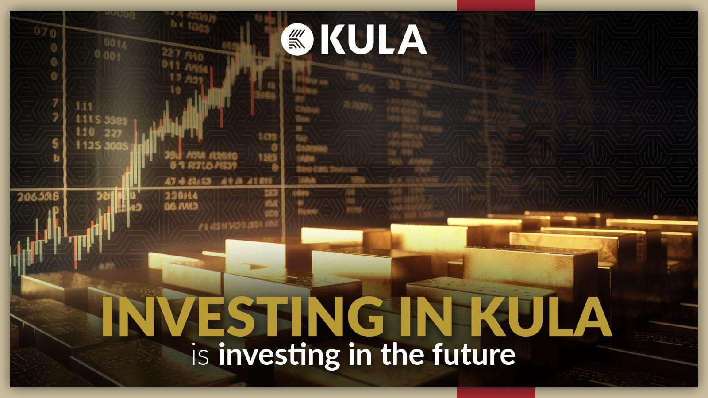

Understanding the basics of algorithmic trading is essential in the contemporary financial ecosystem, characterized by rapid technological advancements and competitive markets. Kula Investments, a prominent player in this space, has positioned itself at the forefront of algorithmic trading technology. Algorithmic trading, or algo trading, refers to the use of complex algorithms and mathematical models to make high-speed trading decisions that would be infeasible for a human trader to execute manually. These algorithms are capable of analyzing massive data sets, identifying patterns, and executing trades based on predefined criteria, all within fractions of a second.

Kula Investments leverages this technology to maximize returns while minimizing risks, ensuring it remains competitive and effective in dynamic market conditions. The firm employs a variety of strategies tailored to exploit specific market inefficiencies, such as high-frequency trading, statistical arbitrage, and market-making. These strategies are continuously refined through rigorous backtesting and performance analysis, ensuring their robustness and reliability.



Moreover, algorithmic trading offers substantial benefits within the financial market. It allows for the execution of trades with unprecedented speed and accuracy, reducing the likelihood of human error and emotional biases influencing trading decisions. By analyzing real-time market data, these algorithms provide comprehensive insights, facilitating informed trading strategies. Additionally, the scalability of algorithmic trading enables Kula Investments to manage large volumes of trades simultaneously, optimizing their trading operations and maintaining consistent performance.

This article will explore how Kula Investments employs these advanced trading strategies to maintain its edge over competitors, dissecting the methods and innovations that underpin its success. By understanding how Kula effectively integrates technology into its trading processes, investors and enthusiasts can gain valuable insights into optimizing their own engagement with the financial markets.

## Table of Contents

## What is Algorithmic Trading?

Algorithmic trading, often referred to as algo trading, utilizes computer algorithms to automate trading decisions and processes. These algorithms are engineered to execute trades at times and speeds that surpass human capabilities, often measured in milliseconds or microseconds. This level of precision allows traders to capitalize on small price discrepancies that may last only for a blink of an eye in the market.

At the core of algorithmic trading are mathematical models and quantitative analysis. These elements enable traders to process vast amounts of market data, recognizing patterns and predicting price movements with significant accuracy. Algorithms can be as simple as executing a trade when a certain price threshold is met, or as complex as employing machine learning models to analyze and react to real-time data.

The integration of [artificial intelligence](/wiki/ai-artificial-intelligence) (AI) and [machine learning](/wiki/machine-learning) further amplifies the potential of algos. For instance, supervised learning models can be trained using historical market data to predict future trends, while unsupervised models can identify hidden patterns without prior labeling of data points. An example in Python might involve using libraries like `pandas` for data manipulation and `scikit-learn` for machine learning, enabling algorithms to evolve based on historical and live data feeds:

```python
import pandas as pd
from sklearn.ensemble import RandomForestRegressor

# Load your trading data
data = pd.read_csv("market_data.csv")

# Define features and target
X = data.drop('target_price', axis=1)
y = data['target_price']

# Train a Random Forest model
model = RandomForestRegressor()
model.fit(X, y)

# Use the model to predict and make trading decisions
predictions = model.predict(new_market_data)
```

The significant advantage of understanding and leveraging [algorithmic trading](/wiki/algorithmic-trading) lies in its capacity to provide traders with a competitive edge in today's fast-paced financial markets. By eliminating emotional bias and enhancing the capability to process large datasets, algorithmic trading ensures decisions are data-driven and timing is impeccable.

Moreover, the efficiency of algorithmic trading allows for scalability, enabling the simultaneous management of multiple trading portfolios with precision and reduced risk of human error. As financial markets continue to advance, embracing algorithmic strategies is key to optimizing trading performance and maintaining a competitive stance.

## Overview of Kula Investments

Kula Investments, a frontrunner in algorithmic trading and investment management, was established with the mission to transform conventional trading techniques using state-of-the-art technology. The founding ethos of the company centers on transparency, innovation, and excellence, which are integral to its trading strategies. This dedication has cemented Kula's reputation as a trusted name in the financial sector.

The firm's team comprises skilled professionals, including data scientists, mathematicians, and financial experts who collaborate to develop and refine trading algorithms. These specialized roles are crucial in creating models that can analyze substantial data sets and execute trades with precision. The data scientists focus on extracting insights from market data and developing predictive models. Mathematicians work on quantitative models that underpin the trading algorithms, ensuring they are mathematically sound. Financial experts provide context and ensure that the algorithms align with market realities and investment goals.

One of the distinguishing features of Kula Investments is its robust trading infrastructure. This infrastructure is designed to offer reliability and efficiency, supporting the execution of trades across global markets. The infrastructure comprises advanced computing systems capable of processing large volumes of data in real-time, fostering a high-frequency trading environment. This capability ensures that Kula Investments can react swiftly to market changes, capitalizing on fleeting opportunities that can make a significant difference in investment outcomes.

Kula Investments uses cutting-edge technologies to maintain its competitive edge. The firm's infrastructure includes low-latency networks and high-performance computing environments, which are essential for executing high-frequency trading strategies effectively. Additionally, the integration of AI and machine learning into their systems amplifies the precision and accuracy of their trading algorithms.

Overall, Kula Investments is at the forefront of algorithmic trading, driven by a commitment to leveraging technology for superior market performance. The company's dedication to innovation and efficiency ensures its continued success and leadership in the dynamic world of financial trading.

## Kula Investments' Algo Trading Strategies

Kula Investments employs a suite of algorithmic trading strategies designed to navigate and capitalize on varying market conditions. These strategies are primarily focused on three distinct approaches: high-frequency trading ([HFT](/wiki/high-frequency-trading-strategies)), statistical [arbitrage](/wiki/arbitrage) (stat-arb), and market-making. Each strategy is carefully crafted to align with specific trading objectives, leveraging the firm's technical prowess and market insights.

High-frequency trading is a cornerstone of Kula Investments' approach, where advanced algorithms are used to execute large numbers of orders at extremely rapid speeds. This strategy capitalizes on minor price fluctuations and requires robust technological infrastructure to minimize latency and maximize execution efficiency. The speed and precision of HFT allow Kula Investments to identify and exploit fleeting opportunities in the market that are not visible to slower, manual traders.

Stat-arb, or [statistical arbitrage](/wiki/statistical-arbitrage), involves taking advantage of price differentials between correlated securities. By employing sophisticated statistical models and machine learning techniques, Kula Investments can predict and profit from these price movements. The firm constantly refines its models through rigorous [backtesting](/wiki/backtesting) and validation processes, ensuring the algorithms are well-calibrated to current market conditions.

Market-making, another key strategy used by Kula Investments, involves providing [liquidity](/wiki/liquidity-risk-premium) to the market by continuously quoting buy and sell prices for specific securities. This approach not only helps stabilize market conditions but also generates profits from the bid-ask spread. Kula Investments enhances its market-making capabilities with algorithms that dynamically adjust quotes based on real-time market data, optimizing the balance between risk and reward.

Risk management is an integral part of Kula Investments' strategy. The firm utilizes advanced risk assessment algorithms to monitor market exposure and mitigate potential risks. These algorithms evaluate scenarios and stress-test portfolios against various market conditions, ensuring that risk remains within acceptable levels.

Continuous backtesting and algorithm refinement are critical to maintaining Kula's competitive advantage. The firm invests heavily in research and development to enhance the performance and accuracy of its trading models. By simulating historical market conditions, Kula Investments can evaluate the effectiveness of its strategies and make necessary adjustments to optimize future outcomes.

The collaboration between technology and investment teams forms the backbone of Kula Investments' innovation strategy. By fostering a collaborative environment, the firm encourages the exchange of ideas and expertise, facilitating the development of cutting-edge trading solutions that are responsive to market evolutions. This partnership ensures that technological advancements are seamlessly integrated into trading operations, supporting Kula Investments' commitment to delivering superior trading performance.

## Benefits of Algorithmic Trading with Kula Investments

One of the primary benefits of Kula Investments' algorithmic trading approach is the significant reduction in human error and emotional biases. Human traders are often subject to emotions and psychological factors that can lead to inconsistent decision-making and errors in trading. By employing advanced algorithms, Kula Investments ensures that trading decisions are driven by data and predefined criteria, eliminating emotional interference and improving decision consistency.

Algorithmic trading also enhances the speed and accuracy of trade execution. The algorithms developed by Kula Investments are programmed to execute trades at precise times, taking advantage of market conditions in fractions of a second. This capability not only allows Kula to capture fleeting market opportunities that might be missed by human traders but also ensures that trades are carried out with a high degree of precision, minimizing slippage and maximizing potential returns.

Furthermore, the use of algorithms enables Kula Investments to analyze vast amounts of data in real-time. This capability is crucial in today's market environment, where the influx of financial data is constant and rapid. By leveraging powerful data analytics and processing capabilities, Kula is able to extract actionable insights from large datasets, providing a comprehensive view of the market dynamics and enhancing the accuracy of their trading strategies.

Scalability is another notable benefit of algorithmic trading employed by Kula Investments. With automation, the firm can efficiently manage and execute a larger [volume](/wiki/volume-trading-strategy) of trades simultaneously. This scalability ensures that the firm can handle increased trading activity without degrading performance or reliability, allowing for better risk distribution and portfolio diversification.

Kula Investments designs its algorithmic solutions with adaptability in mind, ensuring they perform consistently under various market conditions. By continuously refining and optimizing these algorithms through backtesting and live testing, the firm maintains a competitive edge. This adaptability ensures that Kula Investments' strategies remain applicable and effective, even as market conditions and financial landscapes shift.

In summary, Kula Investments leverages algorithmic trading to eliminate human error and biases, improve execution speed and accuracy, analyze large datasets in real-time, and manage trades at scale. These benefits position Kula Investments as a leader in providing robust, innovative trading solutions that are adaptable to a wide range of market conditions.

## Challenges and Future of Algo Trading

Algorithmic trading, while providing numerous advantages, also presents certain challenges that need vigilant management. One of the primary concerns is technological failures. These failures can result from software bugs, server downtime, or internet connectivity issues, which could lead to significant financial losses if trades are not executed as planned. To mitigate these risks, Kula Investments places a strong emphasis on enhancing the robustness of its systems. They employ rigorous testing protocols and redundancies to ensure continuous operation and minimize downtime.

Regulatory compliance is another critical aspect of algorithmic trading. The financial industry is heavily regulated to prevent market manipulation and ensure fair trading practices. Algorithmic trading firms, such as Kula Investments, must navigate a complex landscape of regulatory requirements which can vary widely across different jurisdictions. To address this, Kula Investments maintains a dedicated compliance team that works closely with regulatory bodies to ensure all trading activities meet legal standards.

Looking ahead, the future of algorithmic trading appears promising, largely due to advancements in artificial intelligence (AI) and machine learning. These technologies enable the development of more sophisticated algorithms capable of processing vast amounts of data and identifying complex trading patterns. For instance, machine learning models can continuously learn from historical and real-time data to optimize trading strategies. Python, a widely used language in the field, offers powerful libraries such as TensorFlow and scikit-learn that support the development and deployment of these models.

```python
import numpy as np
import pandas as pd
from sklearn.ensemble import RandomForestRegressor

# Example: Using RandomForest for predicting stock prices
data = pd.read_csv('historical_stock_prices.csv')
features = data[['feature1', 'feature2', 'feature3']]
target = data['stock_price']

# Splitting the data
from sklearn.model_selection import train_test_split
X_train, X_test, y_train, y_test = train_test_split(features, target, test_size=0.2)

# Create a RandomForest Regressor
model = RandomForestRegressor()
model.fit(X_train, y_train)

# Predict stock prices
predictions = model.predict(X_test)
```

Kula Investments is also exploring the potential of blockchain technology in trading operations. Blockchain's decentralized nature can significantly enhance transparency and security, providing a tamper-proof record of all transactions. This could address issues of trust and verification in financial markets, helping to build investor confidence.

As global markets continue to evolve, Kula Investments remains committed to maintaining its leadership in algorithmic trading. This involves not only embracing new technologies but also continually refining and adapting its existing strategies to meet the demands of an ever-changing financial landscape. By investing in innovation and regulatory compliance, Kula is well-positioned to navigate the future challenges and opportunities of algorithmic trading.

## Conclusion

Kula Investments has emerged as a prominent force in the algorithmic trading sector by consistently offering innovative and effective trading solutions. The firm's dedication to excellence and its adaptive strategies ensure it remains at the forefront of the industry. By harnessing the potential of algorithmic trading, Kula Investments has consistently delivered growth and stability, making it an attractive option for investors aiming to leverage advanced technologies.

One of the key aspects of Kula Investments' success is its ability to integrate cutting-edge technologies into its trading frameworks. This integration allows the firm to stay ahead of rapidly evolving market dynamics and maintain the effectiveness of its trading algorithms. As technology continues to advance, Kula is well-poised to navigate future changes in financial markets, offering clients robust and reliable trading solutions.

Moreover, Kula Investments' continuous commitment to refining their strategies through technological advancements, such as artificial intelligence and machine learning, enhances its capability to process large datasets and execute trades with precision and speed. This adaptability ensures that Kula Investments can effectively manage risk and capitalize on opportunities across various market conditions.

For investors looking to capitalize on algorithmic trading potential, Kula Investments provides a compelling opportunity by offering tailored and forward-thinking strategies. The firm’s emphasis on transparency, technological innovation, and strategic excellence makes it a formidable entity in the financial trading landscape, ensuring its relevance and impact in the ever-evolving world of finance.


## References & Further Reading

[1]: ["Advances in Financial Machine Learning"](https://www.amazon.com/Advances-Financial-Machine-Learning-Marcos/dp/1119482089) by Marcos Lopez de Prado

[2]: ["Machine Learning for Algorithmic Trading"](https://github.com/stefan-jansen/machine-learning-for-trading) by Stefan Jansen

[3]: ["Algorithmic Trading: Winning Strategies and Their Rationale"](https://www.amazon.com/Algorithmic-Trading-Winning-Strategies-Rationale-ebook/dp/B00CY5HC0U) by Ernest P. Chan

[4]: Cartea, Á., Jaimungal, S., & Penalva, J. (2015). ["Algorithmic and High-Frequency Trading."](https://assets.cambridge.org/97811070/91146/frontmatter/9781107091146_frontmatter.pdf) Cambridge University Press.

[5]: Aldridge, I. (2013). ["High-Frequency Trading: A Practical Guide to Algorithmic Strategies and Trading Systems."](https://www.amazon.com/High-Frequency-Trading-Practical-Algorithmic-Strategies/dp/1118343506) Wiley Trading.