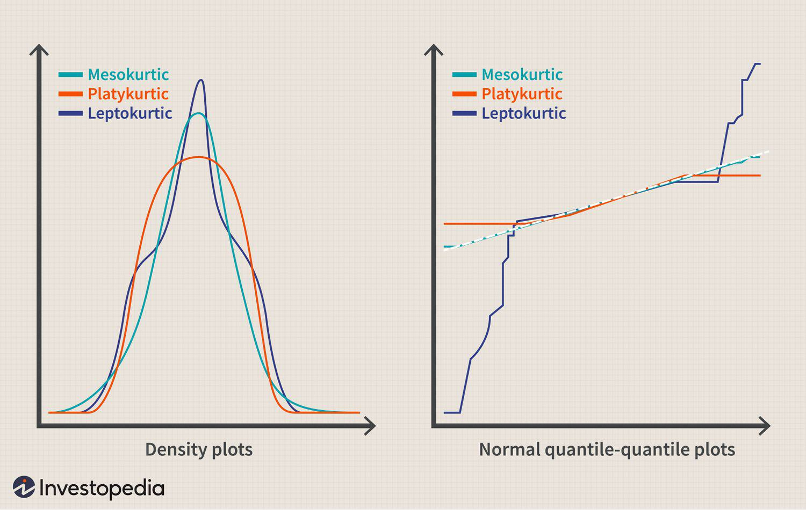

## Table of Contents

## What is kurtosis in statistics?

Kurtosis is a measure in statistics that tells us about the shape of a distribution, specifically how the data is spread out around the mean. It helps us understand if the data has heavy tails or is more peaked than a normal distribution. When we talk about kurtosis, we often compare it to the normal distribution, which has a kurtosis value of 3. If the kurtosis of a dataset is higher than 3, it means the data has heavier tails and a sharper peak, which is called leptokurtic. If it's lower than 3, the data has lighter tails and a flatter peak, known as platykurtic.

In simpler terms, kurtosis gives us an idea about the extremes in our data. High kurtosis means there are more extreme values, or outliers, in the dataset. This can be important in fields like finance, where understanding the likelihood of extreme events, like stock market crashes, is crucial. On the other hand, low kurtosis suggests that extreme values are less common, and the data is more spread out around the mean. By looking at kurtosis, analysts can better understand the risk and behavior of their data, helping them make more informed decisions.

## How is kurtosis calculated?

Kurtosis is calculated using a formula that looks at how spread out the data is compared to a normal distribution. The most common way to calculate kurtosis is by using the fourth moment of the data, which means we look at how far each data point is from the mean, raise that distance to the fourth power, and then average it across all the data points. This average is then adjusted by subtracting 3, which is the kurtosis of a normal distribution. The formula is: Kurtosis = (1/N) * Σ((x_i - mean)^4 / standard deviation^4) - 3, where N is the number of data points, x_i is each data point, mean is the average of the data, and standard deviation is how spread out the data is.

There's another way to calculate kurtosis called excess kurtosis, which is just the kurtosis value without subtracting 3. This tells us how much the kurtosis of our data differs from a normal distribution. If the excess kurtosis is positive, it means the data is more peaked and has heavier tails than a normal distribution. If it's negative, the data is less peaked and has lighter tails. Both methods help us understand the shape of our data and how it compares to a normal distribution, which is useful for analyzing and interpreting data in many fields.

## What does a high kurtosis value indicate?

A high kurtosis value means that the data has a lot of extreme values, or outliers. These are numbers that are very different from the average. When the kurtosis is high, it shows that the data is more spread out at the edges, with more values far away from the middle. This is called having "heavy tails." It's like if you were looking at a graph of the data, you'd see more points stretched out to the sides, away from the center.

This kind of data is important in areas like finance, where big changes can happen suddenly. For example, in the stock market, a high kurtosis might mean there's a bigger chance of big jumps or drops in stock prices. It helps people understand the risk of these big changes happening. So, a high kurtosis value warns us that we might see more extreme events than we would with data that follows a normal distribution.

## What does a low kurtosis value indicate?

A low kurtosis value means that the data doesn't have many extreme values or outliers. It's like the data is more spread out around the middle, without much stretching to the sides. When the kurtosis is low, the data has what we call "light tails." This means if you were to look at a graph of the data, you'd see most of the points bunched up closer to the center, with fewer points way out on the edges.

This kind of data is important because it tells us that big surprises are less likely. For example, in a situation where you're looking at test scores, a low kurtosis might mean that most students scored around the average, with very few students getting extremely high or low scores. So, a low kurtosis value suggests that the data is more predictable and less likely to have those big jumps or drops that can happen with data that has high kurtosis.

## What is the difference between kurtosis and skewness?

Kurtosis and skewness are both ways to describe the shape of data, but they focus on different things. Kurtosis tells us about the spread of the data around the middle, especially how much of it is far away from the average. It helps us understand if the data has a lot of extreme values, or outliers. A high kurtosis means more of these extreme values, making the data look more stretched out at the edges, while a low kurtosis means fewer extremes, with the data more bunched up around the middle.

Skewness, on the other hand, tells us about the balance of the data. It looks at whether the data is leaning more to one side or the other. If the data is skewed to the right, it means there are more values on the higher end, making the tail on that side longer. If it's skewed to the left, there are more values on the lower end, stretching out the tail on that side. So, while kurtosis is about how spread out the data is at the extremes, skewness is about which direction the data is leaning.

## What are the different types of kurtosis?

Kurtosis helps us understand how data is spread out. There are three main types of kurtosis: mesokurtic, leptokurtic, and platykurtic. Mesokurtic is when the data looks like a normal bell-shaped curve, with a kurtosis value of 3. This means the data has a medium amount of extreme values, just like you'd expect in a normal distribution. It's the middle ground, where the data is neither too stretched out nor too bunched up around the middle.

Leptokurtic is when the data has a lot of extreme values, making the kurtosis value higher than 3. This means the data has a sharper peak and heavier tails, looking more stretched out at the edges. It's like if you were looking at a graph, you'd see more points far away from the middle. This type of kurtosis is important in fields like finance because it shows there's a bigger chance of big changes happening suddenly.

Platykurtic is the opposite, with a kurtosis value lower than 3. This means the data has fewer extreme values, making the peak flatter and the tails lighter. If you look at a graph, you'd see most of the data points bunched up around the middle, with fewer points way out on the edges. This tells us that big surprises are less likely, and the data is more predictable.

## Can you explain mesokurtic, leptokurtic, and platykurtic distributions?

A mesokurtic distribution is what you get when the data looks like a normal bell-shaped curve. It has a kurtosis value of 3, which means it has a medium amount of extreme values. Think of it as the middle ground where the data is neither too stretched out at the edges nor too bunched up around the middle. It's what you'd expect in a normal distribution, where most of the data is close to the average, but there are still some values that are further away.

A leptokurtic distribution happens when the data has a lot of extreme values, making the kurtosis value higher than 3. This type of distribution has a sharper peak and heavier tails, which means the data looks more stretched out at the edges. If you were to look at a graph, you'd see more points far away from the middle. This is important in areas like finance because it shows there's a bigger chance of big changes or surprises happening suddenly.

A platykurtic distribution is the opposite, with a kurtosis value lower than 3. This means the data has fewer extreme values, so the peak is flatter and the tails are lighter. On a graph, most of the data points would be bunched up around the middle, with fewer points way out on the edges. This tells us that big surprises are less likely, and the data is more predictable, making it easier to work with in many situations.

## Why is kurtosis important in data analysis?

Kurtosis is important in data analysis because it helps us understand how spread out the data is, especially at the extremes. When we look at kurtosis, we can see if there are a lot of unusual or extreme values in our data. This is useful because it tells us how likely it is to see big changes or surprises. For example, in finance, knowing if stock prices might have big jumps or drops can help people make better decisions about buying or selling stocks.

Understanding kurtosis also helps us compare our data to a normal distribution, which is a common reference point in statistics. If the kurtosis is high, it means our data has more extreme values than a normal distribution, and if it's low, it means fewer extreme values. This can affect how we analyze and interpret our data. For instance, in quality control, knowing if a process produces more or fewer defects than expected can help improve the process. So, kurtosis gives us a way to see the shape of our data and understand its behavior better.

## How does kurtosis affect statistical tests and models?

Kurtosis can affect how we use statistical tests and models. When data has high kurtosis, it means there are more extreme values or outliers. This can make some statistical tests less reliable because these tests often assume the data follows a normal distribution. If the data is far from normal because of high kurtosis, the results of these tests might not be accurate. For example, tests like the t-test or ANOVA might give wrong results if the data has a lot of extreme values. So, knowing the kurtosis helps us choose the right tests or adjust them to work better with our data.

On the other hand, low kurtosis means the data has fewer extreme values and is closer to a normal distribution. This can make statistical tests more reliable because the data fits the assumptions of these tests better. When building models, like regression models, knowing the kurtosis can help us understand how well the model will work. If the data has low kurtosis, the model might predict things more accurately. But if the kurtosis is high, we might need to change the model or use special techniques to handle the extreme values. So, kurtosis is important for making sure our statistical tests and models give us good and trustworthy results.

## What are common misconceptions about kurtosis?

One common misconception about kurtosis is that it measures the "peakedness" of a distribution. While it's true that high kurtosis can mean a sharper peak, kurtosis is really more about how spread out the data is at the extremes. It tells us about the tails of the distribution, not just the peak. So, when people think kurtosis is only about how tall the middle of the data looks, they miss the bigger picture of how the data behaves at the edges.

Another misconception is that kurtosis is the same as skewness. Skewness tells us if the data leans more to one side, while kurtosis tells us about the spread of the data, especially how much it has extreme values. They are different things, but sometimes people mix them up. Understanding the difference is important because it helps us see the full shape of the data and make better decisions based on it.

## How can kurtosis be used in financial risk management?

Kurtosis is really helpful in financial risk management because it tells us about the chances of big changes or surprises in the market. In finance, high kurtosis means there might be more extreme events, like big jumps or drops in stock prices. This is important for people who manage money because they need to know how risky their investments are. If the kurtosis is high, they might decide to be more careful with their investments to protect against these big changes.

By understanding kurtosis, financial managers can make better plans to handle risks. If they see that the kurtosis is low, it means big surprises are less likely, and they might feel more comfortable taking bigger risks. But if the kurtosis is high, they'll want to use special strategies to prepare for those big ups and downs. This way, kurtosis helps them make smarter decisions and keep their investments safe.

## What advanced techniques exist for measuring and interpreting kurtosis in complex datasets?

When you're dealing with really complicated data, there are some advanced ways to measure and understand kurtosis that can help a lot. One technique is called "bootstrap resampling," which means you take lots of smaller samples from your big dataset and calculate kurtosis for each one. This helps you see how kurtosis might change and gives you a better idea of how reliable your kurtosis measurement is. Another method is using "robust measures of kurtosis," which are special ways to calculate kurtosis that aren't thrown off by extreme values or outliers as much. These methods make sure you get a good picture of the data's shape, even if it's messy or has a lot of unusual points.

Interpreting kurtosis in complex datasets can also be tricky, but there are tools to help with that too. One way is to use "multivariate kurtosis," which looks at kurtosis across several variables at once. This can show you how different parts of your data are related and how they might affect each other's kurtosis. Another advanced technique is "kurtosis-adjusted risk models," which are used in finance to better predict the chances of big market changes. These models take kurtosis into account to give a more accurate picture of risk, helping people make smarter decisions about their investments. By using these advanced techniques, you can get a deeper understanding of your data and make better choices based on it.

## What is Kurtosis?

Kurtosis is a statistical measure describing the distribution characteristics of data, particularly focusing on the tails or extremities of this distribution. It provides insight into the presence and likelihood of extreme values or outliers within a dataset. Understanding kurtosis helps in identifying how much of the variance in data arises due to infrequent extreme deviations as opposed to frequent modestly sized deviations.

In mathematical terms, kurtosis is derived from the fourth standardized moment of a distribution. The formula for kurtosis ($K$) is given by:

$$
K = \frac{n \sum (x_i - \bar{x})^4}{(\sum (x_i - \bar{x})^2)^2} - 3
$$

where $n$ is the number of data points, $x_i$ represents each data point, and $\bar{x}$ is the mean of these data points. The subtraction of 3 in this formula standardizes the measure by setting the kurtosis of a normal distribution to zero, allowing easier comparison between different distributions.

Kurtosis is divided into three distinct categories based on the shape and tail content of the distribution:

1. **Mesokurtic**: A mesokurtic distribution exhibits kurtosis similar to that of a normal distribution. The tails of a mesokurtic distribution are moderate in size and represent a baseline comparison for other types of kurtosis. This implies that the data are likely to have few extreme values, suggesting moderate risk levels relative to other distributions.

2. **Leptokurtic**: Leptokurtic distributions are characterized by their more pronounced tails, meaning that they are more prone to extreme values or outliers compared to a normal distribution. These distributions have a higher kurtosis value, indicating a greater possibility of observing extreme returns, often seen as higher risk in financial contexts. 

3. **Platykurtic**: Platykurtic distributions have shorter, less pronounced tails than a normal distribution. Such distributions imply a lower probability of extreme outcomes, hence generally considered lower risk. Data points cluster more heavily around the mean with fewer occurrences of outliers.

Understanding and calculating kurtosis is critical in various fields, including finance and trading, where the prediction of extreme market shifts can significantly impact investment decisions and risk management strategies.

## What is the difference between Kurtosis and Skewness in Financial Analysis?

Both kurtosis and skewness are fundamental measures in statistical analysis used to describe the characteristics of a dataset's distribution, particularly in financial markets. While they are closely related, they highlight different aspects of distribution shape, aiding traders in forming a comprehensive understanding of risk and return profiles.

**Skewness** indicates the asymmetry of a distribution. A skewness value can inform traders whether data is skewed to the left (negative skewness) or the right (positive skewness). For instance, a positively skewed distribution has a tail extending towards higher values, suggesting that occasional high returns are possible, whereas a negatively skewed distribution indicates more frequent lower-than-average returns. The skewness (γ₁) is calculated as:

$$
\gamma_1 = \frac{n}{(n-1)(n-2)} \sum \left(\frac{(x_i - \bar{x})}{s}\right)^3
$$

where $n$ is the number of data points, $x_i$ are individual data points, $\bar{x}$ is the mean, and $s$ is the standard deviation of the dataset. This formula accounts for the third moment of the distribution, which stresses asymmetry.

**Kurtosis**, on the other hand, emphasizes the tail weight or the peakedness of a distribution. It helps determine the presence and likelihood of extreme values. In financial analysis, kurtosis is crucial for identifying potential outliers or extreme market events. A higher kurtosis implies more extreme returns (either high or low), adding another layer of risk assessment. The kurtosis ($\beta_2$) is calculated as:

$$
\beta_2 = \frac{n(n+1)}{(n-1)(n-2)(n-3)} \sum \left(\frac{(x_i - \bar{x})}{s}\right)^4 - \frac{3(n-1)^2}{(n-2)(n-3)}
$$

This calculation highlights the fourth moment, giving prominence to tail behavior.

**Using Skewness and Kurtosis Together**: By evaluating both skewness and kurtosis, traders can capture a nuanced view of a distribution’s shape. While skewness addresses the symmetry of returns, kurtosis focuses on the probability and impact of extreme events. Together, these measures allow for a combined assessment of market risk and potential anomalies.

Trading strategies often benefit from identifying both consistent patterns and outlier behaviors. For example, a distribution with moderate skewness but high kurtosis could warn traders of rare, significant price shifts, enabling preemptive risk management decisions. By considering together skewness's skewing information and kurtosis's tail-related insights, traders can enhance their forecasting models, leading to potentially more stable returns and controlled risk exposure in algorithmic trading scenarios.

## References & Further Reading

[1]: ["Advances in Financial Machine Learning"](https://www.amazon.com/Advances-Financial-Machine-Learning-Marcos/dp/1119482089) by Marcos Lopez de Prado

[2]: ["Evidence-Based Technical Analysis: Applying the Scientific Method and Statistical Inference to Trading Signals"](https://www.amazon.com/Evidence-Based-Technical-Analysis-Scientific-Statistical/dp/0470008741) by David Aronson

[3]: ["Machine Learning for Algorithmic Trading"](https://github.com/stefan-jansen/machine-learning-for-trading) by Stefan Jansen

[4]: ["Quantitative Trading: How to Build Your Own Algorithmic Trading Business"](https://www.amazon.com/Quantitative-Trading-Build-Algorithmic-Business/dp/1119800064) by Ernest P. Chan