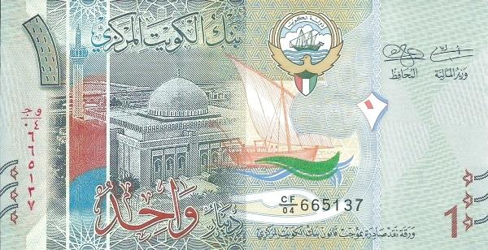

## Table of Contents

## What is the Kuwaiti Dinar?

The Kuwaiti Dinar is the official money used in Kuwait, a country in the Middle East. It is often called KWD or KD for short. The Kuwaiti Dinar is known for being one of the strongest currencies in the world. This means that one Kuwaiti Dinar can be exchanged for a lot of other countries' money.

The Kuwaiti Dinar was first used in 1961, when Kuwait became independent from being a British protectorate. Before that, Kuwait used the Indian Rupee and the Gulf Rupee. The Kuwaiti Dinar is divided into 1000 fils. Coins and banknotes of different values are used every day in Kuwait for buying things and paying for services.

## How is the Kuwaiti Dinar abbreviated?

The Kuwaiti Dinar is shortened to KWD or KD. These abbreviations are used to quickly refer to the currency without writing out the full name.

KWD is used more often in international settings, like in banks or when trading money between countries. KD is more common in everyday use within Kuwait, like on price tags or in shops.

## What is the current exchange rate of the Kuwaiti Dinar to the US Dollar?

The exchange rate between the Kuwaiti Dinar and the US Dollar changes every day. As of the most recent data, 1 Kuwaiti Dinar is worth about 3.26 US Dollars. This rate can go up or down depending on many things like the economy of Kuwait, the economy of the US, and what is happening in the world.

It's a good idea to check the latest exchange rate before you need to change money. You can find the current rate on websites that track money exchange or by asking at a bank. Remember, the rate you see might be a little different from what you get at a bank or money changer because they might charge a fee.

## When was the Kuwaiti Dinar first introduced?

The Kuwaiti Dinar was first introduced in 1961. This was the year when Kuwait became independent from being a British protectorate. Before the Kuwaiti Dinar, people in Kuwait used the Indian Rupee and then the Gulf Rupee.

The introduction of the Kuwaiti Dinar was a big step for Kuwait. It showed that Kuwait was now its own country with its own money. The Kuwaiti Dinar is divided into 1000 fils, and it is known for being one of the strongest currencies in the world.

## What historical events have influenced the value of the Kuwaiti Dinar?

Several historical events have had a big impact on the value of the Kuwaiti Dinar. One major event was the Gulf War in 1990-1991. During this time, Iraq invaded Kuwait, which caused a lot of problems for the country's economy. The Kuwaiti Dinar lost a lot of its value because of the war. After the war ended and Kuwait was freed, the government worked hard to bring the value of the Dinar back up. They did this by fixing things in the country and making the economy strong again.

Another event that affected the Kuwaiti Dinar was the global financial crisis in 2008. This crisis made many countries' economies weaker, including Kuwait's. The value of the Kuwaiti Dinar went down because people were not sure about the economy. But Kuwait's government took steps to protect the Dinar. They used money from oil, which Kuwait has a lot of, to help keep the Dinar strong. Over time, the value of the Kuwaiti Dinar got better as the world's economy started to recover.

Overall, the Kuwaiti Dinar has been influenced by both local and global events. Wars, like the Gulf War, and big economic problems, like the 2008 financial crisis, have made the Dinar's value go up and down. But Kuwait's government has always tried to keep the Dinar strong by using the country's resources and making smart economic choices.

## How has the Kuwaiti Dinar's design changed over time?

The Kuwaiti Dinar has changed its design several times since it was first used in 1961. When it was first made, the banknotes showed pictures of important places in Kuwait and the country's flag. The first coins had the head of the Emir of Kuwait on one side. Over time, the designs got better and more detailed. New banknotes and coins were made to show Kuwait's history, culture, and important people.

In the 1980s, the Kuwaiti Dinar got a big update. The new banknotes had more colors and better security features to stop people from making fake money. They also showed more about Kuwait's culture, like traditional boats called dhows and old buildings. After the Gulf War in the early 1990s, the Dinar was redesigned again to show that Kuwait was free and strong. The new designs were a way to celebrate Kuwait's recovery and to show the world that the country was moving forward.

## What are the different denominations of the Kuwaiti Dinar?

The Kuwaiti Dinar comes in different amounts, called denominations. For banknotes, you can find them in 20 dinars, 10 dinars, 5 dinars, 1 dinar, and half a dinar. These are the paper money that people use every day in Kuwait. The 20 dinar note is the biggest one, and it's worth a lot. The half dinar note is the smallest one, but it's still worth more than many other countries' money.

For coins, the Kuwaiti Dinar has smaller amounts. You can find coins worth 100 fils, 50 fils, 20 fils, and 10 fils. Remember, 1 dinar is made up of 1000 fils, so these coins are worth less than 1 dinar but still useful for buying things that cost less. People in Kuwait use these coins along with the banknotes to pay for things they need every day.

## How does the Kuwaiti Dinar's value compare to other major world currencies?

The Kuwaiti Dinar is known for being one of the strongest currencies in the world. This means that one Kuwaiti Dinar can be exchanged for a lot of other countries' money. For example, as of the latest data, 1 Kuwaiti Dinar is worth about 3.26 US Dollars. This is much more than what you get for one US Dollar if you exchange it for Kuwaiti Dinars. Compared to the Euro, 1 Kuwaiti Dinar is worth around 3.02 Euros. And if you look at the British Pound, 1 Kuwaiti Dinar is worth about 2.57 Pounds. These numbers show that the Kuwaiti Dinar is very strong compared to these major world currencies.

The strength of the Kuwaiti Dinar comes from Kuwait's economy, which is helped a lot by oil. Kuwait has a lot of oil, and selling it brings in a lot of money for the country. This helps keep the Dinar's value high. But the value of the Kuwaiti Dinar can change because of things like what's happening in the world, how much oil costs, and how Kuwait's economy is doing. Even though it's strong, the Kuwaiti Dinar's value can go up and down just like any other currency. But overall, it stays one of the most valuable currencies in the world.

## What economic factors contribute to the strength of the Kuwaiti Dinar?

The strength of the Kuwaiti Dinar comes mostly from Kuwait's big oil business. Kuwait has a lot of oil, and selling it brings in a lot of money for the country. This money helps keep the Dinar's value high. When oil prices are good, Kuwait makes more money, and this makes the Dinar even stronger. The government also saves a lot of this money, which helps keep the economy stable and the Dinar strong.

Another thing that helps the Kuwaiti Dinar stay strong is that Kuwait's economy is not too big or too small. It's just right, and this makes it easier for the government to control things. The government also makes smart choices about how to spend and save money. They use the money from oil to help the country grow and to keep the Dinar's value high. Even though things like wars or big economic problems can make the Dinar's value go up and down, Kuwait's oil and smart money choices help keep it one of the strongest currencies in the world.

## How is the Kuwaiti Dinar managed by the Central Bank of Kuwait?

The Central Bank of Kuwait is in charge of the Kuwaiti Dinar. They make sure the Dinar stays strong and works well for the country. The Central Bank does this by controlling how much money is in the country. If there's too much money, they might take some out. If there's not enough, they might put more in. They also watch the exchange rate, which is how much the Dinar is worth compared to other countries' money. The Central Bank can change the exchange rate to keep the Dinar strong.

The Central Bank also makes rules about how banks in Kuwait work. They check to make sure banks are safe and that people's money is protected. This helps keep the economy stable, which is good for the Dinar. The Central Bank also keeps an eye on how much money is coming in and going out of the country. They do this to make sure Kuwait's economy stays healthy and the Dinar stays strong. By doing all these things, the Central Bank helps keep the Kuwaiti Dinar one of the strongest currencies in the world.

## What are the future projections for the Kuwaiti Dinar's value?

The future value of the Kuwaiti Dinar depends on many things. One big thing is the price of oil. Kuwait makes a lot of money from selling oil, so if oil prices go up, the Dinar could get even stronger. But if oil prices go down, the Dinar might not be as strong. Another thing that can affect the Dinar is what's happening in the world. If there are big problems or wars, it can make the Dinar's value go up and down. The Central Bank of Kuwait will keep trying to control these things to keep the Dinar stable.

The Kuwaiti government also plays a big role in the future of the Dinar. They make plans to grow the economy and use the money from oil wisely. If they do a good job, the Dinar could stay strong. But if they don't, it might not be as strong. Overall, it's hard to say exactly what will happen to the Kuwaiti Dinar in the future. But as long as Kuwait has a lot of oil and the government makes smart choices, the Dinar should stay one of the strongest currencies in the world.

## How does the Kuwaiti Dinar's history reflect broader economic trends in the Middle East?

The Kuwaiti Dinar's history shows us a lot about what has been happening in the Middle East's economy. Kuwait got its own money, the Kuwaiti Dinar, in 1961 when it became its own country. This was a time when many countries in the Middle East were also becoming independent and starting to use their own money. The Dinar's value has always been connected to oil because Kuwait has a lot of it. When oil prices are high, the Dinar gets stronger. This is similar to other countries in the Middle East that also have a lot of oil, like Saudi Arabia and the United Arab Emirates. Their currencies also get stronger when oil prices go up.

The Kuwaiti Dinar has also been affected by big events in the Middle East, like the Gulf War in the early 1990s. During the war, Iraq took over Kuwait, and the Dinar lost a lot of its value. This shows how wars and conflicts can hurt the economy in the Middle East. After the war, Kuwait worked hard to make its economy strong again, and the Dinar got better. This is like what other countries in the Middle East have done after their own conflicts. They try to rebuild and make their economies strong again. So, the Kuwaiti Dinar's history tells us about the ups and downs of the Middle East's economy, showing how oil and big events can change things a lot.

## References & Further Reading

[1]: ["Advances in Financial Machine Learning"](https://www.amazon.com/Advances-Financial-Machine-Learning-Marcos/dp/1119482089) by Marcos Lopez de Prado

[2]: ["Algorithms for Hyper-Parameter Optimization"](https://dl.acm.org/doi/10.5555/2986459.2986743) by Bergstra, J., Bardenet, R., Bengio, Y., & Kégl, B. (2011).

[3]: ["Machine Learning for Algorithmic Trading"](https://github.com/PacktPublishing/Machine-Learning-for-Algorithmic-Trading-Second-Edition) by Stefan Jansen

[4]: ["Quantitative Trading: How to Build Your Own Algorithmic Trading Business"](https://books.google.com/books/about/Quantitative_Trading.html?id=j70yEAAAQBAJ) by Ernest P. Chan

[5]: ["Evidence-Based Technical Analysis: Applying the Scientific Method and Statistical Inference to Trading Signals"](https://www.amazon.com/Evidence-Based-Technical-Analysis-Scientific-Statistical/dp/0470008741) by David Aronson