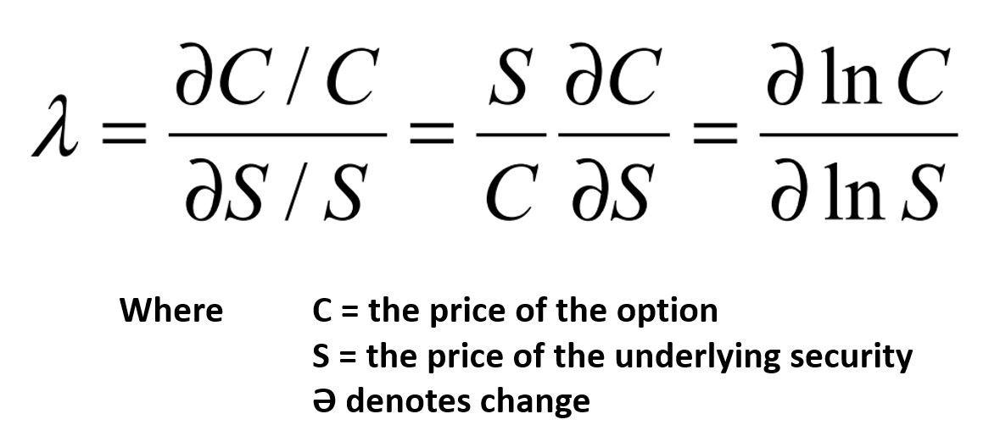

In the fast-evolving world of algorithmic trading, understanding and leveraging unique strategies and models can make a significant difference. As automated systems dominate financial markets, traders and quantitative analysts seek innovative methods to optimize trading decisions and enhance performance. Among these strategies is Kyle's Lambda, a noteworthy model within trading algorithms that addresses market impact. This metric, named after economist Albert S. Kyle, plays a critical role in quantifying the cost of executing large trade orders, helping traders assess the intrinsic impact on market prices.

Kyle's Lambda fundamentally transforms the way traders perceive and manage the nuances of liquidity and price movement. Investors and analysts apply this model to improve their order execution strategies, enabling them to anticipate and mitigate potential market disturbances that may arise from substantial trades. Consequently, understanding Kyle's Lambda not only aids in minimizing transaction costs but also enhances overall trading profitability.



This article explores the theoretical underpinnings of Kyle's Lambda, its practical implementation in algorithmic trading environments, and the remarkable advantages it offers. By investigating how this tool is incorporated into trading systems, readers will gain insights into its potential to optimize trading strategies and secure a competitive advantage in complex and dynamic financial markets.

## Table of Contents

## Understanding Kyle's Lambda

Kyle's Lambda is an important concept in the field of market microstructure, notably introduced by Albert S. Kyle in his 1985 paper "Continuous Auctions and Insider Trading" (Econometrica, Vol. 53, No. 6). The metric quantifies the market impact cost of executing a trade order, making it a powerful tool for understanding price movements resulting from large trades. 

At its core, Kyle's Lambda measures the sensitivity of price changes to order flow. Essentially, it calculates how much the price moves for each unit of trade executed. This is crucial for large trades because, as the size of the order increases, the transaction can significantly influence the market price, potentially reducing profitability.

Kyle's model represents the price change $\Delta P$ in response to an order size $Q$ using the relationship:

$$
\Delta P = \lambda \cdot Q
$$

where $\lambda$ (Lambda) is Kyle's Lambda, representing the price impact coefficient. This linear model helps traders predict how their trades will affect market prices, enabling more accurate execution strategies.

For traders and algorithm developers, understanding the calculation and interpretation of Kyle's Lambda is essential. It involves assessing various market factors such as [liquidity](/wiki/liquidity-risk-premium), order size, and the prevailing market conditions that influence $\lambda$. The concept highlights the deviation of actual execution price from the expected price in a frictionless market, which is particularly pertinent for institutional investors and high-frequency traders dealing with large order volumes. 

Quantitative models incorporating Kyle's Lambda often use historical trade and quote data to estimate $\lambda$, adjusting for market variables that could skew its stability over time. These models frequently apply linear regression techniques to relate price changes to trade sizes, calibrating the Lambda metric to reflect actual trading conditions.

By understanding Kyle's Lambda, traders can better navigate the complexities of market impact, optimizing their strategies to minimize costs and enhance profitability during trade execution.

## The Role of Kyle's Lambda in Algorithmic Trading

In [algorithmic trading](/wiki/algorithmic-trading), the integration of Kyle's Lambda plays a pivotal role in enhancing trading efficiency and minimizing the costs associated with large trade executions. Kyle's Lambda, representing the market impact of trades, allows algorithmic traders to adjust their strategies in real-time, considering the cost implications of executing large orders in volatile markets. This adaptability is crucial, as the cost of market impact can significantly erode trading profitability if not properly managed.

Anticipating market impact through the precise assessment of Kyle's Lambda enables algorithms to modify order execution dynamically, effectively balancing the trade-off between execution speed and cost. For instance, by incorporating Kyle's Lambda into their trading algorithms, traders can decide whether to execute a trade instantaneously at a higher cost due to market impact or to spread the order over time to minimize cost, albeit at the risk of price changes.

Implementing Kyle’s Lambda enhances decision-making in trading. The integration allows algorithms to predict the potential slippage and liquidity constraints of executing large trades. This foresight ensures that trading strategies are not only designed for speed and precision but are also cost-effective. With a solid understanding of market microstructure facilitated by Kyle’s Lambda, traders can refine order execution strategies to be more aligned with their financial goals.

Incorporating Kyle's Lambda into trading models involves the utilization of mathematical and statistical methods to estimate the anticipated impact of trades accurately. This often includes developing sophisticated models that utilize historical trade data to calibrate the Lambda metric, ensuring that the algorithms remain precise in predicting market dynamics. As a result, trading systems equipped with Kyle's Lambda are considerably more adept at navigating complex market environments, leading to improved performance and achievement of trading objectives.

## Implementing Kyle's Lambda in Trading Models

Practical implementation of Kyle's Lambda in trading models involves incorporating the metric into the architecture of algorithmic trading systems. Kyle's Lambda measures the market impact of trade orders, a critical [factor](/wiki/factor-investing) in maintaining profitability, particularly in high-frequency trading environments. To integrate this measure, it is essential to have a thorough understanding of key components such as order sizes, market liquidity, and price movements.

The integration process begins with data acquisition. Traders must collect information on historical trade data, [order book](/wiki/order-book-trading-strategies) depth, and transaction costs. This data is essential for accurately estimating Kyle's Lambda, which is calculated as:

$$
\lambda = \frac{\Delta P}{Q}
$$

where $\Delta P$ represents the price change resulting from executing an order, and $Q$ denotes the order quantity. The price change is often a function of the liquidity available at the time of the trade and the order's size relative to the market's average trading volume.

Once the data is gathered, data preprocessing is necessary to ensure consistency and accuracy. This involves cleaning and normalizing data, removing outliers, and filling in missing values. Accurate preprocessing is vital because any discrepancies can significantly impact the calculations of market impact.

Programming Kyle's Lambda into an algorithmic trading system can be approached using languages such as Python, which is popular for quantitative finance due to its robust libraries and frameworks. A simple Python implementation might look like this:

```python
import numpy as np

def compute_kyles_lambda(price_changes, volumes):
    price_changes = np.array(price_changes)
    volumes = np.array(volumes)

    if len(price_changes) != len(volumes):
        raise ValueError("Price changes and volumes must have the same length")

    lambda_values = np.divide(price_changes, volumes)
    return np.mean(lambda_values)

# Example data
price_changes = [0.05, 0.02, -0.03, 0.04]
volumes = [1000, 950, 1100, 1050]

kyles_lambda = compute_kyles_lambda(price_changes, volumes)
print("Kyle's Lambda:", kyles_lambda)
```

The code above evaluates Kyle's Lambda by taking arrays of price changes and trade volumes, computing their ratio, and averaging the results to offer a measure of market impact. 

Integrating such computation into trading models allows algorithms to adjust their strategies dynamically. For instance, when anticipated market impact (Lambda value) is high, trading models might break down trades into smaller segments, reducing order sizes to mitigate adverse price impacts. This adaptive capability is central to optimizing trade execution and enhancing strategy performance.

However, implementing Kyle's Lambda is not without challenges. Estimations require high-quality data and sophisticated modelling to accurately reflect real-time market conditions. Traders and algorithm developers must also regularly recalibrate models to ensure the Lambda measure accurately captures evolving market dynamics.

In conclusion, embedding Kyle's Lambda into trading algorithms provides substantial benefits by facilitating more informed and effective decision-making. By anticipating market impacts, trading models can refine execution strategies, leading to improved cost efficiencies and investment outcomes.

## Benefits and Challenges

Kyle's Lambda provides several advantages that make it a valuable tool in algorithmic trading. Primarily, it facilitates better cost management by enabling traders to estimate and mitigate the market impact of large trades. This metric aids in determining the optimal trade size that minimizes execution costs, thus enhancing overall trading performance. By quantifying the impact, traders can strategically time and execute orders, potentially reducing slippage—a common issue where the execution price differs from the intended price due to market movements.

However, implementing Kyle's Lambda is not without challenges. One of the foremost difficulties lies in accurately estimating market impact. This requires an in-depth understanding of market conditions, including liquidity and [volatility](/wiki/volatility-trading-strategies), to effectively model and predict how a trade will influence market prices. Market impact is inherently dynamic, varying with factors like trading [volume](/wiki/volume-trading-strategy), market depth, and participant behavior, which complicates precise estimation.

Navigating these challenges involves building a robust analytical framework that can adapt to changing market conditions. Continuous fine-tuning of trading models is essential to account for the evolving nature of financial markets. This process includes employing advanced statistical techniques and [machine learning](/wiki/machine-learning) models to improve the accuracy of impact predictions. Regularly updating the data inputs and recalibrating the model parameters ensures that the trading strategies remain effective under different market scenarios.

For quantitative traders, developing a comprehensive approach to incorporate Kyle's Lambda can significantly enhance decision-making processes. A potential method for implementation could involve using Python for the simulation of trade executions and calculation of estimated impacts:

```python
def kyles_lambda_estimate(volume, market_liquidity):
    # Assume constants based on historical data analysis
    alpha = 0.05  # Estimated sensitivity of price to trade volume
    beta = 1.5    # Adjustment factor for liquidity conditions

    # Calculate expected market impact
    expected_impact = alpha * (volume ** beta / market_liquidity)
    return expected_impact

# Example usage:
trade_volume = 1000  # Number of shares
current_liquidity = 5000  # Available liquidity in market

impact = kyles_lambda_estimate(trade_volume, current_liquidity)
print(f"Estimated Market Impact: {impact}")
```

Incorporating such models into trading algorithms allows traders to anticipate potential market impact more accurately and optimize their execution strategies accordingly. Despite its challenges, the effective use of Kyle's Lambda can lead to significant improvements in trading outcomes, underscoring its value in modern algorithmic trading.

## Conclusion

Kyle’s Lambda serves as a crucial instrument in algorithmic trading, offering valuable insights into market dynamics. By quantifying market impact, this metric enables traders and quantitative analysts to better manage execution costs, ultimately achieving superior trading performance. The ability to anticipate the probable effects of large trades grants these professionals a competitive edge in an environment that increasingly values precision and efficiency.

In a data-driven financial landscape, the relevance of models such as Kyle’s Lambda is ever-increasing. The model not only aids in understanding the intricacies of market behavior but also enhances the decision-making process involved in executing trade orders. This is particularly important as the volume and velocity of trading data grow, necessitating tools that can quickly adapt and respond to changing market conditions.

Ongoing research and technological advancements are likely to continue improving the implementation and efficacy of Kyle’s Lambda in trading systems. Innovations in data processing and algorithm design will further refine its application, potentially introducing more sophisticated measures of market impact and order execution strategies. As a result, traders and analysts who remain at the forefront of these developments stand to benefit significantly, ensuring their methods evolve alongside the market's complexities. This continued evolution underscores the importance of staying informed about the latest trends and methodologies in algorithmic trading.

## References & Further Reading

[1]: Kyle, A. S. (1985). ["Continuous Auctions and Insider Trading."](https://personal.utdallas.edu/~nina.baranchuk/Fin7310/papers/Kyle1985.pdf) Econometrica, 53(6), 1315-1335.

[2]: Almgren, R., & Chriss, N. (2000). ["Optimal Execution of Portfolio Transactions."](https://smallake.kr/wp-content/uploads/2016/03/optliq.pdf) Journal of Risk, 3(2), 5-39.

[3]: Gatheral, J. (2010). ["The Volatility Surface: A Practitioner's Guide."](https://www.wiley.com/en-us/The+Volatility+Surface%3A+A+Practitioner%27s+Guide-p-9780471792512) Wiley Finance.

[4]: Hasbrouck, J. (1991). ["Measuring the Information Content of Stock Trades."](https://www.jstor.org/stable/2328693) The Journal of Finance, 46(1), 179-207.

[5]: Bouchaud, J. P., Farmer, J. D., & Lillo, F. (2009). ["How Markets Slowly Digest Changes in Supply and Demand."](https://arxiv.org/abs/0809.0822) Handbook of Financial Markets: Dynamics and Evolution, North-Holland.