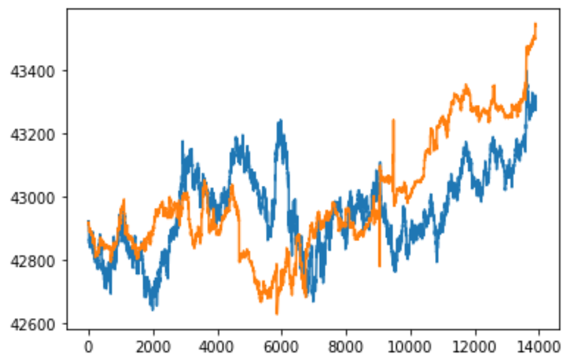

## Table of Contents

## What is Kyle's lambda?

Kyle's lambda is a measure used in finance to understand how much information traders have about a stock. It was created by Albert Kyle, who is a finance professor. The lambda helps to figure out how much the price of a stock will change when someone buys or sells it. If the lambda is high, it means that traders know a lot about the stock, and the price will move a lot with each trade. If the lambda is low, it means traders don't know much, and the price won't change as much.

This measure is important because it helps people understand how easy or hard it is to trade a stock without affecting its price too much. For example, if you're a big investor and you want to buy a lot of a stock, you need to know if your buying will make the price go up a lot. If the lambda is high, you might want to buy slowly so you don't push the price up too much. This way, Kyle's lambda helps investors make smarter decisions about when and how to trade.

## Who is Kyle and why is it called Kyle's lambda?

Kyle is Albert Kyle, a professor who works in the field of finance. He came up with a way to measure how much information traders have about a stock, and this measure is called Kyle's lambda. The reason it's called Kyle's lambda is because he created it, and in math and science, it's common to name things after the person who discovered or invented them.

Kyle's lambda is important because it helps people understand how much the price of a stock will change when someone buys or sells it. If the lambda is high, it means that traders know a lot about the stock, and the price will move a lot with each trade. If the lambda is low, it means traders don't know much, and the price won't change as much. This helps big investors decide how to trade without making the price go up or down too much.

## What programming language is typically used to explain Kyle's lambda?

When people want to explain Kyle's lambda, they often use a programming language called Python. Python is popular because it is easy to understand and can do math well. People use Python to make models that show how Kyle's lambda works. They can write code that shows how the price of a stock changes when someone buys or sells it, and how much information traders have.

In these Python programs, people might use numbers and formulas to show what Kyle's lambda is. They might make charts or graphs to help people see how the price changes. This helps people learn about trading and how to make smart decisions when they buy or sell stocks.

## How does Kyle's lambda differ from traditional lambda functions?

Kyle's lambda and traditional lambda functions are different things. Kyle's lambda is a measure used in finance to understand how much information traders have about a stock. It helps figure out how much the price of a stock will change when someone buys or sells it. If Kyle's lambda is high, it means traders know a lot about the stock, and the price will move a lot with each trade. If it's low, traders don't know much, and the price won't change as much. This helps big investors decide how to trade without making the price go up or down too much.

On the other hand, traditional lambda functions are used in programming and math. They are small, anonymous functions that can be created without a name. These functions are often used in languages like Python, where they help make code shorter and easier to read. For example, you might use a lambda function to sort a list of numbers or to do a quick calculation. Unlike Kyle's lambda, traditional lambda functions have nothing to do with finance or stock trading; they are just a tool for writing code more efficiently.

## Can you provide a simple example of Kyle's lambda in code?

Here's a simple example of how you might show Kyle's lambda in Python. Imagine we have a stock where the price changes when someone buys or sells it. We can use a formula to figure out Kyle's lambda. Let's say the price goes up by $0.10 for every 100 shares bought. We can use this information to calculate Kyle's lambda.

In the code, we'll create a function that takes the number of shares traded and the change in price. Then, we'll use the formula: Kyle's lambda = (change in price) / (number of shares traded). If someone buys 100 shares and the price goes up by $0.10, Kyle's lambda would be 0.10 / 100 = 0.001. This means that for every share traded, the price changes by $0.001. This simple example helps us understand how much information traders have about the stock and how the price might change with each trade.

## What are the practical applications of Kyle's lambda?

Kyle's lambda helps big investors and traders make smart choices when they buy or sell stocks. It tells them how much the price of a stock might change when they trade it. If Kyle's lambda is high, it means that other traders know a lot about the stock, and the price will move a lot with each trade. This helps big investors decide to buy or sell slowly, so they don't make the price go up or down too much. They can use this information to plan their trades better and avoid losing money because of big price changes.

For example, if a big investor wants to buy a lot of a stock, they can use Kyle's lambda to see if their buying will make the price go up a lot. If the lambda is high, they might decide to buy the stock over a longer time, so they don't push the price up too much. This helps them get a better price for the stock. On the other hand, if Kyle's lambda is low, it means traders don't know much about the stock, and the price won't change as much. This can help the investor feel more confident about buying or selling quickly without worrying about big price changes.

## How does Kyle's lambda enhance functional programming?

Kyle's lambda is not directly related to functional programming. It is a measure used in finance to understand how much information traders have about a stock and how the stock's price might change with each trade. This concept helps big investors make smarter decisions about buying or selling stocks, but it doesn't have anything to do with writing code or using programming languages like Python or Java.

Functional programming is a way of writing code where you use functions to do things. In this style of programming, you might use something called a lambda function, which is a small, anonymous function that can be created without a name. These lambda functions are useful for making code shorter and easier to read, but they are different from Kyle's lambda, which is a financial measure and not a part of programming at all.

## What are the performance implications of using Kyle's lambda?

Using Kyle's lambda can help big investors and traders make better decisions about buying or selling stocks. It tells them how much the price of a stock might change when they trade it. If Kyle's lambda is high, it means that other traders know a lot about the stock, and the price will move a lot with each trade. This can help investors decide to buy or sell slowly, so they don't make the price go up or down too much. By using Kyle's lambda, investors can plan their trades better and avoid losing money because of big price changes.

For example, if a big investor wants to buy a lot of a stock, they can use Kyle's lambda to see if their buying will make the price go up a lot. If the lambda is high, they might decide to buy the stock over a longer time, so they don't push the price up too much. This helps them get a better price for the stock. On the other hand, if Kyle's lambda is low, it means traders don't know much about the stock, and the price won't change as much. This can help the investor feel more confident about buying or selling quickly without worrying about big price changes.

## Are there any known limitations or drawbacks to using Kyle's lambda?

Using Kyle's lambda can be helpful, but it has some limitations. One big problem is that it assumes that all traders have the same amount of information about the stock. In real life, some traders might know more than others, and this can make the price change in ways that Kyle's lambda doesn't predict. Also, Kyle's lambda is based on a simple model that might not work well for all stocks. Some stocks might be affected by other things, like news or big events, that the model doesn't take into account.

Another drawback is that Kyle's lambda can be hard to measure accurately. It needs a lot of data about how the stock's price changes with each trade, and this data can be hard to get. If the data is not good, the lambda might not be right, and this can lead to bad decisions. Also, the model assumes that the market is always working well, but sometimes the market can be unpredictable, and this can make Kyle's lambda less useful.

## How can Kyle's lambda be optimized for better efficiency?

To make Kyle's lambda work better, we can use more and better data. If we have more information about how the price of a stock changes with each trade, we can figure out Kyle's lambda more accurately. This means collecting data from more trades and making sure the data is good. We can also use computers to look at the data faster and find patterns that help us understand the stock better. By doing this, we can make better guesses about how the price will change and make smarter decisions when we buy or sell the stock.

Another way to make Kyle's lambda more efficient is to change the model to fit different stocks better. Some stocks might be affected by news or big events, so we can add these things to the model. This can help us see how these other factors might change the price of the stock. Also, we can use computers to try different versions of the model and see which one works best for each stock. By making these changes, we can use Kyle's lambda to make better trading decisions and avoid losing money because of big price changes.

## What advanced techniques can be applied with Kyle's lambda?

To make Kyle's lambda more powerful, we can use [machine learning](/wiki/machine-learning). Machine learning is when computers learn from lots of data to find patterns and make predictions. We can teach a computer to look at past trades and see how the price changed each time. Then, the computer can use this information to guess how the price might change in the future. This can help us find Kyle's lambda more accurately and make better trading decisions. By using machine learning, we can also see how other things, like news or big events, might affect the stock's price and include these in our model.

Another advanced technique is to use real-time data. This means looking at what's happening with the stock right now, instead of just looking at old data. By using real-time data, we can see how the price is changing as people buy and sell the stock. This can help us update Kyle's lambda quickly and make sure it's always as accurate as possible. With real-time data, we can also see how the market is acting right now and make better guesses about how the price might change in the next few minutes or hours. This can help big investors make smarter decisions about when to buy or sell the stock.

## How does Kyle's lambda integrate with other advanced programming concepts?

Kyle's lambda can be used with other advanced programming ideas like machine learning. Machine learning is when computers learn from lots of data to find patterns and make guesses. We can use machine learning to look at past trades and see how the price changed each time. Then, the computer can use this information to guess how the price might change in the future. This helps us find Kyle's lambda more accurately and make better trading decisions. By using machine learning, we can also see how other things, like news or big events, might affect the stock's price and include these in our model.

Another way to use Kyle's lambda with advanced programming is to use real-time data. Real-time data means looking at what's happening with the stock right now, instead of just looking at old data. By using real-time data, we can see how the price is changing as people buy and sell the stock. This helps us update Kyle's lambda quickly and make sure it's always as accurate as possible. With real-time data, we can also see how the market is acting right now and make better guesses about how the price might change in the next few minutes or hours. This helps big investors make smarter decisions about when to buy or sell the stock.

## What is Understanding Kyle's Lambda?

Kyle's Lambda is an important concept in the field of market microstructure, notably introduced by Albert S. Kyle in his 1985 paper "Continuous Auctions and Insider Trading" (Econometrica, Vol. 53, No. 6). The metric quantifies the market impact cost of executing a trade order, making it a powerful tool for understanding price movements resulting from large trades. 

At its core, Kyle's Lambda measures the sensitivity of price changes to order flow. Essentially, it calculates how much the price moves for each unit of trade executed. This is crucial for large trades because, as the size of the order increases, the transaction can significantly influence the market price, potentially reducing profitability.

Kyle's model represents the price change $\Delta P$ in response to an order size $Q$ using the relationship:

$$
\Delta P = \lambda \cdot Q
$$

where $\lambda$ (Lambda) is Kyle's Lambda, representing the price impact coefficient. This linear model helps traders predict how their trades will affect market prices, enabling more accurate execution strategies.

For traders and algorithm developers, understanding the calculation and interpretation of Kyle's Lambda is essential. It involves assessing various market factors such as [liquidity](/wiki/liquidity-risk-premium), order size, and the prevailing market conditions that influence $\lambda$. The concept highlights the deviation of actual execution price from the expected price in a frictionless market, which is particularly pertinent for institutional investors and high-frequency traders dealing with large order volumes. 

Quantitative models incorporating Kyle's Lambda often use historical trade and quote data to estimate $\lambda$, adjusting for market variables that could skew its stability over time. These models frequently apply linear regression techniques to relate price changes to trade sizes, calibrating the Lambda metric to reflect actual trading conditions.

By understanding Kyle's Lambda, traders can better navigate the complexities of market impact, optimizing their strategies to minimize costs and enhance profitability during trade execution.

## How can Kyle's Lambda be implemented in trading models?

Practical implementation of Kyle's Lambda in trading models involves incorporating the metric into the architecture of [algorithmic trading](/wiki/algorithmic-trading) systems. Kyle's Lambda measures the market impact of trade orders, a critical [factor](/wiki/factor-investing) in maintaining profitability, particularly in high-frequency trading environments. To integrate this measure, it is essential to have a thorough understanding of key components such as order sizes, market liquidity, and price movements.

The integration process begins with data acquisition. Traders must collect information on historical trade data, [order book](/wiki/order-book-trading-strategies) depth, and transaction costs. This data is essential for accurately estimating Kyle's Lambda, which is calculated as:

$$
\lambda = \frac{\Delta P}{Q}
$$

where $\Delta P$ represents the price change resulting from executing an order, and $Q$ denotes the order quantity. The price change is often a function of the liquidity available at the time of the trade and the order's size relative to the market's average trading volume.

Once the data is gathered, data preprocessing is necessary to ensure consistency and accuracy. This involves cleaning and normalizing data, removing outliers, and filling in missing values. Accurate preprocessing is vital because any discrepancies can significantly impact the calculations of market impact.

Programming Kyle's Lambda into an algorithmic trading system can be approached using languages such as Python, which is popular for quantitative finance due to its robust libraries and frameworks. A simple Python implementation might look like this:

```python
import numpy as np

def compute_kyles_lambda(price_changes, volumes):
    price_changes = np.array(price_changes)
    volumes = np.array(volumes)

    if len(price_changes) != len(volumes):
        raise ValueError("Price changes and volumes must have the same length")

    lambda_values = np.divide(price_changes, volumes)
    return np.mean(lambda_values)

# Example data
price_changes = [0.05, 0.02, -0.03, 0.04]
volumes = [1000, 950, 1100, 1050]

kyles_lambda = compute_kyles_lambda(price_changes, volumes)
print("Kyle's Lambda:", kyles_lambda)
```

The code above evaluates Kyle's Lambda by taking arrays of price changes and trade volumes, computing their ratio, and averaging the results to offer a measure of market impact. 

Integrating such computation into trading models allows algorithms to adjust their strategies dynamically. For instance, when anticipated market impact (Lambda value) is high, trading models might break down trades into smaller segments, reducing order sizes to mitigate adverse price impacts. This adaptive capability is central to optimizing trade execution and enhancing strategy performance.

However, implementing Kyle's Lambda is not without challenges. Estimations require high-quality data and sophisticated modelling to accurately reflect real-time market conditions. Traders and algorithm developers must also regularly recalibrate models to ensure the Lambda measure accurately captures evolving market dynamics.

In conclusion, embedding Kyle's Lambda into trading algorithms provides substantial benefits by facilitating more informed and effective decision-making. By anticipating market impacts, trading models can refine execution strategies, leading to improved cost efficiencies and investment outcomes.

## References & Further Reading

[1]: Kyle, A. S. (1985). ["Continuous Auctions and Insider Trading."](https://personal.utdallas.edu/~nina.baranchuk/Fin7310/papers/Kyle1985.pdf) Econometrica, 53(6), 1315-1335.

[2]: Almgren, R., & Chriss, N. (2000). ["Optimal Execution of Portfolio Transactions."](https://smallake.kr/wp-content/uploads/2016/03/optliq.pdf) Journal of Risk, 3(2), 5-39.

[3]: Gatheral, J. (2010). ["The Volatility Surface: A Practitioner's Guide."](https://www.wiley.com/en-us/The+Volatility+Surface%3A+A+Practitioner%27s+Guide-p-9780471792512) Wiley Finance.

[4]: Hasbrouck, J. (1991). ["Measuring the Information Content of Stock Trades."](https://www.jstor.org/stable/2328693) The Journal of Finance, 46(1), 179-207.

[5]: Bouchaud, J. P., Farmer, J. D., & Lillo, F. (2009). ["How Markets Slowly Digest Changes in Supply and Demand."](https://arxiv.org/abs/0809.0822) Handbook of Financial Markets: Dynamics and Evolution, North-Holland.